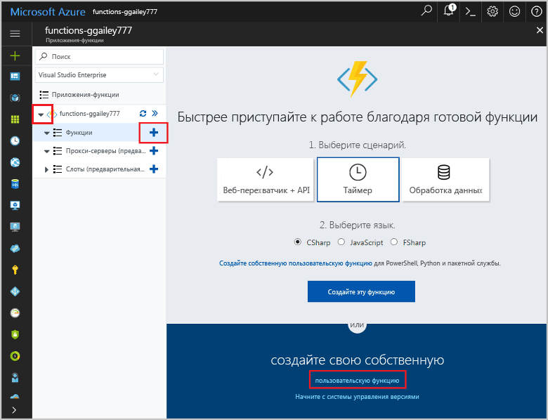

# <a name="create-an-openapi-definition-for-a-function"></a>Создание определения OpenAPI функции
Интерфейсы REST API часто описываются с помощью определения OpenAPI (ранее известное как файл [Swagger](http://swagger.io/)). Это определение содержит сведения о доступных операция в API и о том, как необходимо структурировать данные запросов и ответов для API.

В этом руководстве вы создадите функцию, определяющую экономичность аварийного ремонта ветроэлектрической установки. Затем создадите определение OpenAPI для приложения-функции, чтобы иметь возможность вызвать функцию из приложений и служб.

Из этого руководства вы узнаете, как выполнять такие задачи:

> [!div class="checklist"]
> * создавать функции в Azure;
> * создавать определения OpenAPI с помощью инструментов OpenAPI;
> * изменять определение, чтобы иметь возможность предоставить дополнительные метаданные;
> * проверять определения путем вызова функции.

## <a name="create-a-function-app"></a>Создание приложения-функции

Для выполнения функций вам понадобится приложение-функция, позволяющее группировать функции в логические единицы и упростить развертывание, масштабирование и совместное использование ресурсов, а также управление ими. 

[!INCLUDE [Create function app Azure portal](../../includes/functions-create-function-app-portal.md)]


## <a name="create-the-function"></a>Создание функции

В этом руководстве используется функция, активируемая HTTP, которая принимает два параметра: предполагаемое время ремонта турбин (в часах) и производительность турбин (в киловаттах). Затем функция вычисляет стоимость ремонта и доход от турбины за 24 часа.

1. Разверните приложение-функцию и нажмите кнопку **+** рядом с элементом **Функции**. Если это первая функция в приложении-функции, выберите **Пользовательская функция**. Откроется полный набор шаблонов функций. 

    

2. В поле поиска введите `http` и выберите **C#** для шаблона триггера HTTP. 
 
    

3. Введите `TurbineRepair` для **имени** функции, выберите `Function` в качестве **[уровня аутентификации](functions-bindings-http-webhook.md#http-auth)**, а затем нажмите кнопку **Создать**.  

    

1. Замените содержимое файла run.csx следующим кодом и нажмите кнопку **Сохранить**:

    ```csharp
    using System.Net;

    const double revenuePerkW = 0.12; 
    const double technicianCost = 250; 
    const double turbineCost = 100;

    public static async Task<HttpResponseMessage> Run(HttpRequestMessage req, TraceWriter log)
    {   

        //Get request body
        dynamic data = await req.Content.ReadAsAsync<object>();
        int hours = data.hours;
        int capacity = data.capacity;

        //Formulas to calculate revenue and cost
        double revenueOpportunity = capacity * revenuePerkW * 24;  
        double costToFix = (hours * technicianCost) +  turbineCost;
        string repairTurbine;

        if (revenueOpportunity > costToFix){
            repairTurbine = "Yes";
        }
        else {
            repairTurbine = "No";
        }

        return req.CreateResponse(HttpStatusCode.OK, new{
            message = repairTurbine,
            revenueOpportunity = "$"+ revenueOpportunity,
            costToFix = "$"+ costToFix         
        }); 
    }
    ```
    Этот код функции возвращает сообщение `Yes` или `No`, чтобы указать, является ли аварийный ремонт экономично выгодным, а также возможности получения дохода, которые предоставляет турбина, и стоимость ремонта турбины. 

1. Чтобы проверить функцию, щелкните **Тест** в правой области сверху. После этого откроется вкладка "Тест". В разделе **Текст запроса** введите указанное ниже значение, а затем нажмите кнопку **Запуск**.

    ```json
    {
    "hours": "6",
    "capacity": "2500"
    }
    ```

    

    В тексте ответа возвратится следующее значение.

    ```json
    {"message":"Yes","revenueOpportunity":"$7200","costToFix":"$1600"}
    ```

Теперь у вас есть функция, определяющая экономичность аварийного ремонта. Далее необходимо создать и изменить определение OpenAPI приложения-функции.

## <a name="generate-the-openapi-definition"></a>Создание определения OpenAPI

Теперь можно приступить к созданию определения OpenAPI. Это определение может использоваться другими технологиями Майкрософт, такими как приложения API, [PowerApps](functions-powerapps-scenario.md) и [Microsoft Flow](../azure-functions/app-service-export-api-to-powerapps-and-flow.md), а также инструментами сторонних разработчиков, такими как [Postman](https://www.getpostman.com/docs/importing_swagger) и [другими дополнительными пакетами](http://swagger.io/tools/).

1. Выберите только *команды*, которые поддерживает API (в этом случае POST). Это очищает созданное определение API.

    1. На вкладке **Интегрировать** новой функции триггера HTTP замените значение **Разрешенные методы HTTP** на **Выбранные методы**.

    1. Для параметра **Выбранные методы HTTP** снимите все флажки (кроме **POST**) и щелкните **Сохранить**.

        
        
1. Щелкните имя приложения-функции (например, **function-demo-energy**) > **Функции платформы** > **Определение API**.

    

1. На вкладке **Определение API** выберите **Функция**.

    

    Выполнив это действие, вы включите набор параметров OpenAPI для приложения-функции, в том числе конечную точку для размещения файла OpenAPI из домена приложения-функции, встроенную копию [редактора OpenAPI](http://editor.swagger.io) и генератор шаблонов определения API.

1. Щелкните **Создать шаблон определения API** > **Сохранить**.

    

    Azure проверяет приложение-функцию на наличие функций "Триггер HTTP", а данные, полученные в файле functions.json, используются для создания определения OpenAPI. Ниже приведен пример создаваемого определения.

    ```yaml
    swagger: '2.0'
    info:
    title: function-demo-energy.azurewebsites.net
    version: 1.0.0
    host: function-demo-energy.azurewebsites.net
    basePath: /
    schemes:
    - https
    - http
    paths:
    /api/TurbineRepair:
        post:
        operationId: /api/TurbineRepair/post
        produces: []
        consumes: []
        parameters: []
        description: >-
            Replace with Operation Object
            #http://swagger.io/specification/#operationObject
        responses:
            '200':
            description: Success operation
        security:
            - apikeyQuery: []
    definitions: {}
    securityDefinitions:
    apikeyQuery:
        type: apiKey
        name: code
        in: query
    ```

    Определение описывается как _шаблон_, так как требуются дополнительные метаданные, чтобы превратить его в полное определение OpenAPI. Вы измените его на следующем шаге.

## <a name="modify-the-openapi-definition"></a>Изменение определения OpenAPI
Теперь, когда у вас есть определение шаблона, измените его, чтобы предоставить дополнительные метаданные об операциях API и структурах данных. В области **Определение API** полностью удалите созданное определение из `post`, вставьте содержимое ниже и щелкните **Сохранить**.

```yaml
    post:
      operationId: CalculateCosts
      description: Determines if a technician should be sent for repair
      summary: Calculates costs
      x-ms-summary: Calculates costs
      x-ms-visibility: important
      produces:
        - application/json
      consumes:
        - application/json
      parameters:
        - name: body
          in: body
          description: Hours and capacity used to calculate costs
          x-ms-summary: Hours and capacity
          x-ms-visibility: important
          required: true
          schema:
            type: object
            properties:
              hours:
                description: The amount of effort in hours required to conduct repair
                type: number
                x-ms-summary: Hours
                x-ms-visibility: important
              capacity:
                description: The max output of a turbine in kilowatts
                type: number
                x-ms-summary: Capacity
                x-ms-visibility: important
      responses:
        200:
          description: Message with cost and revenue numbers
          x-ms-summary: Message
          schema:
           type: object
           properties:
            message:
              type: string
              description: Returns Yes or No depending on calculations
              x-ms-summary: Message 
            revenueOpportunity:
              type: string
              description: The revenue opportunity cost
              x-ms-summary: RevenueOpportunity 
            costToFix:
              type: string
              description: The cost in $ to fix the turbine
              x-ms-summary: CostToFix
      security:
        - apikeyQuery: []
definitions: {}
securityDefinitions:
  apikeyQuery:
    type: apiKey
    name: code
    in: query
```

В этом случае можно просто вставить отправленные метаданные, но необходимо знать типы изменений, внесенных в шаблон по умолчанию:

+ API создает и потребляет данные в формате JSON.

+ Указаны необходимые параметры с именами и типами данных.

+ Указаны возвращаемые значения успешного ответа с именами и типами данных.

+ Предоставлены понятные сводки и описания интерфейса API, а также его операций и параметров. Это важно для пользователей функции.

+ Добавлены расширения x-ms-summary и x-ms-visibility, использующиеся в пользовательском интерфейсе Microsoft Flow и Logic Apps. Дополнительные сведения см. в статье [Расширения OpenAPI для настраиваемых соединителей в Microsoft Flow](https://preview.flow.microsoft.com/documentation/customapi-how-to-swagger/).

> [!NOTE]
> Для определения безопасности мы использовали метод проверки подлинности ключа API по умолчанию. Вы можете изменить раздел определения, если использовали разные типы аутентификации.

Дополнительные сведения об определении операций API см. в статье о [спецификации Open API](https://swagger.io/specification/#operationObject).

## <a name="test-the-openapi-definition"></a>Проверка определения OpenAPI
Прежде чем использовать определение API, рекомендуется проверить его в пользовательском интерфейсе Функции Azure.

1. На вкладке **Управление** вашей функции в разделе **Host Keys** (Ключи узла) скопируйте **стандартный** ключ.

    

    > [!NOTE]
    >Этот ключ используется при проверке и вызове API из приложения или службы.

1. Вернитесь к определению API:**function-demo-energy** > **Функции платформы** > **Определение API**.

1. В области справа щелкните **Аутентификация**, введите скопированный ключ API и выберите **Выполнить аутентификацию**.

    

1. Прокрутите вниз и выберите **Try this operation** (Выполнить эту операцию).

    

1. Введите значения параметров **Часы** и **Производительность**.

    

    Обратите внимание на то, как пользовательский интерфейс использует описания определения API.

1. Выберите **Отправить запрос**, а затем перейдите на вкладку **Структурировано**, чтобы просмотреть выходные данные.

    

## <a name="next-steps"></a>Дополнительная информация

Из этого руководства вы узнали, как выполнить следующие задачи:

> [!div class="checklist"]
> * создавать функции в Azure;
> * создавать определения OpenAPI с помощью инструментов OpenAPI;
> * изменять определение, чтобы иметь возможность предоставить дополнительные метаданные;
> * проверять определения путем вызова функции.

Перейти к следующему руководству, чтобы научиться создавать приложение PowerApps, в котором используется созданное вами определение OpenAPI.
> [!div class="nextstepaction"]
> [Вызов функции из PowerApps](functions-powerapps-scenario.md)
