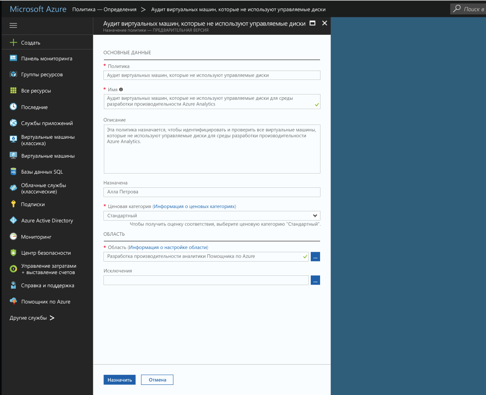

# Создание назначения политики для идентификации ресурсов, не соответствующих требованиям, в среде Azure
Чтобы понять, соответствуют ли ресурсы требованиям в Azure, прежде всего нужно определить их состояние. В этом кратком руководстве описывается поэтапный процесс создания назначения политики для выявления виртуальных машин, которые не используют управляемые диски.

Этот процесс позволит вам определить, какие виртуальные машины не используют управляемые диски. Они *не соответствуют* назначению политики.

Если у вас еще нет подписки Azure, [создайте бесплатную учетную запись Azure](https://azure.microsoft.com/free/?WT.mc_id=A261C142F), прежде чем начинать работу.

## Создание назначения политики

С помощью этого краткого руководства вы создадите назначение политики и назначите определение политики *Audit Virtual Machines without Managed Disks*.

1. Выберите **Назначения** на левой панели страницы Политики Azure.
2. Выберите **Назначить политику** в верхней части панели **Назначения**.

   

3. На странице **Назначить политику** нажмите  рядом с полем **Политика**, чтобы открыть список доступных определений.

   

   Служба "Политика Azure" поставляется с готовыми встроенными определениями политик, которые можно использовать. Вот некоторые примеры встроенных определений политик:

   - принудительно применять тег и его значение;
   - применять тег и его значение;
   - требовать наличия SQL Server версии 12.0.

    Полный список всех доступных встроенных политик см. в разделе [Шаблоны для службы "Политика Azure"](json-samples.md).

4. Найдите определение политики *Audit VMs that do not use managed disks*. Щелкните эту политику, а затем выберите действие **Выбрать**.

   

5. Введите отображаемое **имя** для назначения политики. В этом случае используем *Audit VMs that do not use managed disks*. При желании вы можете добавить необязательное **описание**. Описание содержит сведения о том, как назначение политики определяет все виртуальные машины, которые не используют управляемые диски.
6. Установите ценовую категорию **Стандартный**, чтобы политика применялась и к существующим ресурсам.

   В Политике Azure используются две ценовые категории: *Бесплатный* и *Стандартный*. Бесплатная категория позволяет применять политики только к новым ресурсам, а стандартная распространяет действие политик и на существующие ресурсы, что поможет вам лучше понять состояние соответствия. Подробности о ценах см. на [странице ценообразования для Политики Azure](https://azure.microsoft.com/pricing/details/azure-policy/).

7. Выберите **Область**, к которой вы хотите применить политику.  Она определяет, к каким ресурсам или группе ресурсов принудительно применяется назначение политики. Политика может назначаться разным ресурсам: от подписки до групп ресурсов.
8. Выберите подписку (или группу ресурсов), которую вы ранее зарегистрировали. В этом примере используется подписка **Azure Analytics Capacity Dev**, но у вас могут быть другие варианты. Нажмите кнопку **Выбрать**.

   

9. Оставьте поле **Исключения** пустым и нажмите кнопку **Назначить**.

Теперь все готово к выявлению ресурсов, которые не соответствуют требованиям, что позволит оценить состояние соответствия в среде.

## Выявление несоответствующих ресурсов

Выберите **Соответствие** в области слева и выполните поиск созданного назначения политики.

Существующие ресурсы, которые не соответствуют новому назначению, отображаются в разделе **Non-compliant resources** (Несоответствующие ресурсы).

Если условие применяется к существующим ресурсам и оказывается верным, такие ресурсы помечаются как несовместимые с настроенной политикой. В изображении выше показаны несоответствующие ресурсы. В следующей таблице показано, какие действия выполняются в зависимости от результата оценки условия для определения итогового состояния соответствия. Хотя логика оценки не отображается на портале Azure, результаты состояния соответствия выводятся. Они могут быть такими: "Соответствует" либо "Не соответствует".

| **Состояние ресурса** | **Действие** | **Оценка политики** | **Состояние соответствия** |
| --- | --- | --- | --- |
| Exists | Deny, Audit, Append\*, DeployIfNotExist\*, AuditIfNotExist\* | Истина | Не соответствует |
| Exists | Deny, Audit, Append\*, DeployIfNotExist\*, AuditIfNotExist\* | Ложь | Соответствует |
| Создать | Audit, AuditIfNotExist\* | Истина | Не соответствует |
| Создать | Audit, AuditIfNotExist\* | Ложь | Соответствует |

\* Для действий Append, DeployIfNotExist и AuditIfNotExist требуется, чтобы оператор IF имел значение TRUE, а условие существования должно иметь значение FALSE, чтобы ресурс считался несоответствующим требованиям. Когда установлено значение TRUE, условие IF запускает оценку условия существования для связанных ресурсов.
## Очистка ресурсов

Остальные руководства из этой серии являются продолжением этого документа. Если вы намерены переходить к ним, не удаляйте ресурсы, которые создали при работе с этим руководством. Если вы не планируете продолжать работу, удалите все созданные ресурсы, выполнив на портале Azure следующие действия.
1. Выберите **Назначения** на панели слева.
2. Найдите созданное назначение и щелкните его правой кнопкой мыши.

   

3.  Выберите действие **Удалить назначение**.

## Дополнительная информация

В этом кратком руководстве вы назначили определение политики для области. Определение политики гарантирует, что все ресурсы в области соответствуют требованиям, и определяет, какие из них не соответствуют.

Следующее руководство серии содержит сведения о назначении политик, обеспечивающих соответствие требованиям для **новых ресурсов**:

> [!div class="nextstepaction"]
> [Создание политик и управление ими](./create-manage-policy.md)
