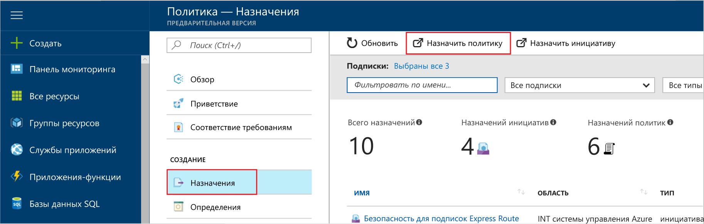
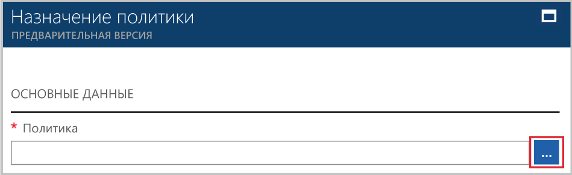

# <a name="create-and-manage-policies-to-enforce-compliance"></a>Создание политик и управление ими для обеспечения соответствия требованиям

Понимание того, как создавать политики и управлять ими в Azure, важно для обеспечения соответствия корпоративным стандартам и соглашениям об уровне обслуживания. В этом руководстве вы научитесь использовать Политику Azure для выполнения некоторых общих задач, связанных с созданием, назначением и управлением политиками в вашей организации, таких как:

> [!div class="checklist"]
> * Назначение политики для применения условий для ресурсов, которые вы создадите в будущем.
> * Создание и назначение определения инициативы для отслеживания соответствия нескольких ресурсов.
> * Обход запрета на создание несоответствующих или отклоненных ресурсов.
> * Внедрение новой политики в организации.

В кратких руководствах вы можете узнать, как назначить политику, чтобы определить текущее состояние соответствия имеющихся ресурсов. Если у вас еще нет подписки Azure, [создайте бесплатную учетную запись Azure](https://azure.microsoft.com/free/?WT.mc_id=A261C142F), прежде чем начинать работу.

## <a name="assign-a-policy"></a>Назначение политики

Первым шагом для обеспечения соответствия Политике Azure является назначение определения политики. Определение политики определяет, при каких условиях применяется политика и какое действие следует предпринять. В этом примере назначается встроенное определение политики, называемое *Require SQL Server Version 12.0* (Требовать наличия SQL Server версии 12.0), чтобы обеспечить соответствие всех баз данных SQL Server версии 12.0.

1. Запустите службу "Политика Azure" на портале Azure, выполнив поиск и выбрав **Политика** в левой области.

   

2. Выберите **Назначения** на левой панели страницы Политики Azure. Назначение — это политика, которая назначена в рамках определенной области.
3. Выберите **Назначить политику** в верхней части панели **Назначения**.

   

4. На странице **Назначить политику** нажмите  рядом с полем **Политика**, чтобы открыть список доступных определений. Вы можете фильтровать определение политики **Тип** по значению *BuiltIn*, чтобы просмотреть все политики и их описания.

   

5. Выберите **Require SQL Server Version 12.0** (Требовать наличия SQL Server версии 12.0). Если не удается найти его прямо сейчас, введите **Require SQL Server Version 12.0** (Требовать наличия SQL Server версии 12.0) в поле поиска и нажмите клавишу ENTER.

   

6. Поле отображаемого **имени** заполняется автоматически, но его можно изменить. Например, используйте *Require SQL Server version 12.0* (Требовать наличия SQL Server версии 12.0). При желании вы можете добавить необязательное **описание**. Описание предоставляет сведения о том, как назначение этой политики проверяет все создаваемые в среде серверы SQL Server на наличие версии 12.0.

7. Установите ценовую категорию **Стандартный**, чтобы политика применялась и к существующим ресурсам.

   В Политике Azure используются две ценовые категории: *Бесплатный* и *Стандартный*. Бесплатная категория позволяет применять политики только к новым ресурсам, а стандартная распространяет действие политик и на существующие ресурсы, что поможет вам лучше понять состояние соответствия. Так как используется служба "Политика Azure" предварительной версии, модель ценообразования еще не готова. Это означает, что вам пока не нужно оплачивать категорию *Стандартный*. Подробности о ценах можно узнать на [странице ценообразования для Политики Azure](https://azure.microsoft.com/pricing/details/azure-policy).

8. Выберите **область** — подписку (или группу ресурсов), которую вы ранее зарегистрировали. Она определяет, к каким ресурсам или группе ресурсов принудительно применяется назначение политики. Политика может назначаться разным ресурсам: от подписки до групп ресурсов.

   В этом примере используется подписка **Azure Analytics Capacity Dev**. Ваша подписка будет отличаться.

10. Выберите **Назначить**.

## <a name="implement-a-new-custom-policy"></a>Реализация новой пользовательской политики

Назначив определение встроенной политики, можно использовать новые возможности работы со службой "Политика Azure". Создайте пользовательскую политику, чтобы снизить расходы. Это гарантирует, что в вашей среде не могут создаваться виртуальные машины серии G. Таким образом, каждый раз, когда пользователь в вашей организации пытается создать виртуальную машину серии G, запрос отклоняется.

1. Выберите **Определение** на вкладке **Разработка** в левой области.

   

2. Выберите **+ Определение политики**.
3. Заполните следующие поля:

   - Имя определения политики: *Require VM SKUs smaller than the G series* (Требовать номер SKU виртуальной машины меньше, чем серия G).
   - Описание того, для чего предназначено определение политики. Это определение политики гарантирует, что все виртуальные машины, созданные в этой области, будут иметь номера SKU меньше, чем серия G, что позволяет сэкономить затраты.
   - Подписка, в которой хранится определение политики. В этом случае определение политики будет находиться в подписке **Advisor Analytics Capacity Dev**. Ваш список подписок будет отличаться.
   - Выберите из имеющихся параметров или создайте категорию для этого определения политики.
   - Скопируйте следующий код JSON и обновите его в соответствии со своими потребностями.
      - параметры политики;
      - правила и условия политики — в данном случае номер SKU виртуальной машины, соответствующий серии G;
      - действие политики — в этом случае **Отменить**.

    Код JSON должен выглядеть следующим образом. Вставьте измененный код на портале Azure.

    ```json
{
    "policyRule": {
      "if": {
        "allOf": [
          {
            "field": "type",
            "equals": "Microsoft.Compute/virtualMachines"
          },
          {
            "field": "Microsoft.Compute/virtualMachines/sku.name",
            "like": "Standard_G*"
          }
        ]
      },
      "then": {
        "effect": "deny"
      }
    }
}
    ```

    Для *свойства поля* в правиле политики необходимо задать одно из следующих значений: "Имя", "Тип", Location (Расположение), Tags (Теги) или Аlias (Псевдоним). Например, `"Microsoft.Compute/VirtualMachines/Size"`.

    Примеры кода JSON см. в статье [Шаблоны для службы "Политика Azure"](json-samples.md).

4. Щелкните **Сохранить**.

## <a name="create-a-policy-definition-with-rest-api"></a>Создание определения политики с использованием REST API

Для создания политики вы можете использовать REST API для определений политик. API REST позволяет создавать и удалять определения политик и получать сведения о существующих определениях.
Чтобы создать определение политики, используйте следующий пример.

```
PUT https://management.azure.com/subscriptions/{subscription-id}/providers/Microsoft.authorization/policydefinitions/{policyDefinitionName}?api-version={api-version}

```
Добавьте текст запроса. Ниже приведен соответствующий пример.

```
{
  "properties": {
    "parameters": {
      "allowedLocations": {
        "type": "array",
        "metadata": {
          "description": "The list of locations that can be specified when deploying resources",
          "strongType": "location",
          "displayName": "Allowed locations"
        }
      }
    },
    "displayName": "Allowed locations",
    "description": "This policy enables you to restrict the locations your organization can specify when deploying resources.",
    "policyRule": {
      "if": {
        "not": {
          "field": "location",
          "in": "[parameters('allowedLocations')]"
        }
      },
      "then": {
        "effect": "deny"
      }
    }
  }
}
```

## <a name="create-a-policy-definition-with-powershell"></a>Создание определения политики с помощью PowerShell

Прежде чем продолжить работу с примером PowerShell, убедитесь, что у вас установлена последняя версия Azure PowerShell. Параметры политики были добавлены в версии 3.6.0. Если установлена более ранняя версия, примеры возвращают ошибку из-за того, что параметр не найден.

Определение политики можно создать с помощью командлета `New-AzureRmPolicyDefinition`.

Чтобы создать определение политики из файла, передайте путь в файл. Для внешнего файла используйте следующий пример.

```
$definition = New-AzureRmPolicyDefinition `
    -Name denyCoolTiering `
    -DisplayName "Deny cool access tiering for storage" `
    -Policy 'https://raw.githubusercontent.com/Azure/azure-policy-samples/master/samples/Storage/storage-account-access-tier/azurepolicy.rules.json'
```

Для применения локального файла используйте следующий пример.

```
$definition = New-AzureRmPolicyDefinition `
    -Name denyCoolTiering `
    -Description "Deny cool access tiering for storage" `
    -Policy "c:\policies\coolAccessTier.json"
```

Для создания определения политики с помощью встроенного правила используйте следующий пример.

```
$definition = New-AzureRmPolicyDefinition -Name denyCoolTiering -Description "Deny cool access tiering for storage" -Policy '{
  "if": {
    "allOf": [
      {
        "field": "type",
        "equals": "Microsoft.Storage/storageAccounts"
      },
      {
        "field": "kind",
        "equals": "BlobStorage"
      },
      {
        "not": {
          "field": "Microsoft.Storage/storageAccounts/accessTier",
          "equals": "cool"
        }
      }
    ]
  },
  "then": {
    "effect": "deny"
  }
}'
```

Выходные данные сохраняются в объекте `$definition`, который используется при назначении политики.
В следующем примере создается определение политики, которое включает параметры:

```
$policy = '{
    "if": {
        "allOf": [
            {
                "field": "type",
                "equals": "Microsoft.Storage/storageAccounts"
            },
            {
                "not": {
                    "field": "location",
                    "in": "[parameters(''allowedLocations'')]"
                }
            }
        ]
    },
    "then": {
        "effect": "Deny"
    }
}'

$parameters = '{
    "allowedLocations": {
        "type": "array",
        "metadata": {
          "description": "The list of locations that can be specified when deploying storage accounts.",
          "strongType": "location",
          "displayName": "Allowed locations"
        }
    }
}'

$definition = New-AzureRmPolicyDefinition -Name storageLocations -Description "Policy to specify locations for storage accounts." -Policy $policy -Parameter $parameters
```

## <a name="view-policy-definitions"></a>Просмотр определений политик

Чтобы просмотреть все определения политик в подписке, используйте приведенную ниже команду.

```
Get-AzureRmPolicyDefinition
```

Она возвращает все доступные определения политик, включая встроенные политики. Каждая политика возвращается в приведенном ниже формате.

```
Name               : e56962a6-4747-49cd-b67b-bf8b01975c4c
ResourceId         : /providers/Microsoft.Authorization/policyDefinitions/e56962a6-4747-49cd-b67b-bf8b01975c4c
ResourceName       : e56962a6-4747-49cd-b67b-bf8b01975c4c
ResourceType       : Microsoft.Authorization/policyDefinitions
Properties         : @{displayName=Allowed locations; policyType=BuiltIn; description=This policy enables you to
                     restrict the locations your organization can specify when deploying resources. Use to enforce
                     your geo-compliance requirements.; parameters=; policyRule=}
PolicyDefinitionId : /providers/Microsoft.Authorization/policyDefinitions/e56962a6-4747-49cd-b67b-bf8b01975c4c
```

## <a name="create-a-policy-definition-with-azure-cli"></a>Создание определения политики с использованием Azure CLI

Определение политики можно создать с помощью Azure CLI, выполнив в нем команду определения политики.
Для создания определения политики с помощью встроенного правила используйте следующий пример.

```
az policy definition create --name denyCoolTiering --description "Deny cool access tiering for storage" --rules '{
  "if": {
    "allOf": [
      {
        "field": "type",
        "equals": "Microsoft.Storage/storageAccounts"
      },
      {
        "field": "kind",
        "equals": "BlobStorage"
      },
      {
        "not": {
          "field": "Microsoft.Storage/storageAccounts/accessTier",
          "equals": "cool"
        }
      }
    ]
  },
  "then": {
    "effect": "deny"
  }
}'
```

## <a name="view-policy-definitions"></a>Просмотр определений политик

Чтобы просмотреть все определения политик в подписке, используйте приведенную ниже команду.

```
az policy definition list
```

Она возвращает все доступные определения политик, включая встроенные политики. Каждая политика возвращается в приведенном ниже формате.

```
{                                                            
  "description": "This policy enables you to restrict the locations your organization can specify when deploying resources. Use to enforce your geo-compliance requirements.",                      
  "displayName": "Allowed locations",
  "id": "/providers/Microsoft.Authorization/policyDefinitions/e56962a6-4747-49cd-b67b-bf8b01975c4c",
  "name": "e56962a6-4747-49cd-b67b-bf8b01975c4c",
  "policyRule": {
    "if": {
      "not": {
        "field": "location",
        "in": "[parameters('listOfAllowedLocations')]"
      }
    },
    "then": {
      "effect": "Deny"
    }
  },
  "policyType": "BuiltIn"
}
```

## <a name="create-and-assign-an-initiative-definition"></a>Создание определения инициативы и его назначение

С помощью определения инициативы вы можете сгруппировать несколько определений политики для достижения одной ключевой цели. Определение инициативы создается, чтобы гарантировать, что ресурсы в рамках определения будут соответствовать определениям политики, которые составляют определение инициативы.  Дополнительные сведения об определениях инициативы см. в статье [Что такое служба "Политика Azure"?](./azure-policy-introduction.md).

### <a name="create-an-initiative-definition"></a>Создание определения инициативы

1. Выберите **Определения** на вкладке **Разработка** в левой области.

   

2. Выберите **Initiative Definition** (Определение инициативы) в верхней части. Отобразится форма **Initiative Definition** (Определение инициативы).
3. Введите имя и описание инициативы.

   В этом примере необходимо, чтобы ресурсы соответствовали определениям политики безопасности. Название инициативы — **Защита**, а описание — **Эта инициатива была создана для обработки всех определений политик, связанных с защитой ресурсов**.

   

4. Просмотрите список **доступных определений** и выберите определения политики, которые вы хотите добавить к этой инициативе. Для инициативы **Защита** **добавьте** следующие встроенные определения политик.
   - Require SQL Server version 12.0;
   - Monitor unprotected web applications in the security center (Отслеживать незащищенные веб-приложения в центре безопасности);
   - Monitor permissive network across in Security Center (Отслеживать разрешенную сеть в центре безопасности);
   - Monitor possible app Whitelisting in Security Center (Отслеживать список разрешенных приложений в центре безопасности);
   - Monitor unencrypted VM Disks in Security Center (Отслеживать незашифрованные диски виртуальных машин в центре безопасности).

   

   Как только вы выберите определения политики в списке, они появятся в разделе **Policies and parameters** (Политики и параметры), как показано на изображении выше.

5. Используйте **Definition location** (Расположение определения), чтобы выбрать подписку для хранения определения. Щелкните **Сохранить**.

### <a name="assign-an-initiative-definition"></a>Назначение определения инициативы

1. Перейдите на вкладку **Определения** в разделе **Разработка**.
2. Найдите созданное определение инициативы **Защита**.
3. Выберите определение инициативы, а затем щелкните **Назначить**.

   

4. Заполните форму **Assignment** (Назначение), указав сведения, приведенные в примере ниже. Вы можете использовать собственные сведения.
   - Имя назначения — "Защита"
   - Описание. "Это назначение инициативы предназначено для принудительного применения группы определений политики в подписке **Azure Advisor Capacity Dev**".
   - Ценовая категория — "Стандартный"
   - Область применения назначения — **Azure Advisor Capacity Dev**. Вы можете выбрать собственную подписку и группу ресурсов.

5. Выберите **Назначить**.

## <a name="exempt-a-non-compliant-or-denied-resource-using-exclusion"></a>Исключение несоответствующих или отклоненных ресурсов

Когда вы назначите определение политики для запроса SQL Server версии 12.0, попытка создать SQL Server другой версии будет отклоняться. В этом разделе вы решите проблему с отклоненной попыткой создать сервер SQL Server. Для этого потребуется запросить исключение для определенных ресурсов. Исключение предотвращает принудительное применение политик. В следующем примере можно использовать любую версию SQL Server. Исключения можно применять к группе ресурсов. Вы также можете сузить область применения исключения отдельными ресурсами.

1. Выберите **Назначения** на панели слева.
2. Просмотрите все назначения политик и откройте назначение *Require SQL Server version 12.0* (Требовать наличия SQL Server версии 12.0).
3. **Выберите** исключение для ресурсов в группах ресурсов, в которых вы пытаетесь создать SQL Server. В этом примере вы исключите Microsoft.Sql/servers/databases: *azuremetrictest/testdb* и *azuremetrictest/testdb2*.

   

   Для решения проблемы с запрещенным ресурсом можно также обратиться к лицам, связанным с политикой, если у вас есть достаточное обоснование необходимости создания SQL Server, и выполнить прямое редактирование политики, если у вас есть доступ.

4. Щелкните **Назначить**.

В этом разделе вы узнали, как решить проблему с отклоненной попыткой создать SQL Server, запросив исключение для ресурсов.

## <a name="clean-up-resources"></a>Очистка ресурсов

Если вы намерены переходить к ним, не удаляйте ресурсы, которые вы создали при работе с этим руководством. Если вы не планируете продолжать работу, следуйте инструкциям ниже, чтобы удалить все созданные назначения и определения.

1. Выберите **Определения** (или **Назначения**, если вы пытаетесь удалить назначение) в области слева.
2. Найдите новую инициативу либо определение политики (или назначение), которые вы только что создали.
3. Щелкните многоточие в конце определения или назначения, а затем выберите **Удалить определение** (или **Удалить назначение**).

## <a name="next-steps"></a>Дополнительная информация

В этом руководстве вы успешно выполнили следующие действия:

> [!div class="checklist"]
> * назначили политику для применения условий для ресурсов, которые будут созданы в будущем;
> * создали и назначили определение инициативы для отслеживания соответствия нескольких ресурсов;
> * обошли запрет на создание несоответствующих или отклоненных ресурсов;
> * внедрили новую политику в организации.

Дополнительные сведения о структурах определения политик см. в статье:

> [!div class="nextstepaction"]
> [Структура определения политики Azure](policy-definition.md)
