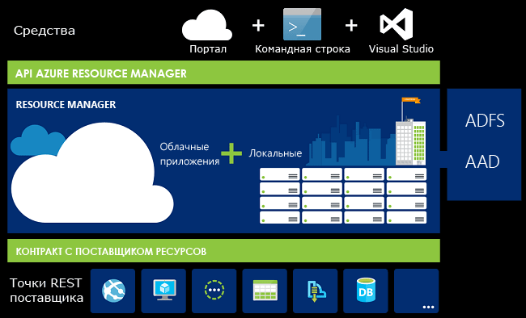
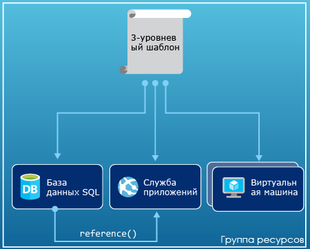
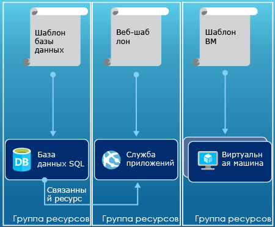

# <a name="azure-resource-manager-overview"></a>Общие сведения о диспетчере ресурсов Azure
Обычно инфраструктура приложения состоит из ряда компонентов, например из виртуальной машины, учетной записи хранения и виртуальной сети или веб-приложения, базы данных, сервера базы данных и служб сторонних поставщиков. Эти компоненты не отображаются как отдельные сущности, вместо этого они воспринимаются как связанные и взаимозависимые части одной сущности. Их нужно развертывать, контролировать и отслеживать в виде группы. Azure Resource Manager позволяет работать с ресурсами решения как с группой. Вы можете развертывать, обновлять или удалять все ресурсы решения в рамках одной скоординированной операции. Развертывание осуществляется на основе шаблона, используемого для разных сред, в том числе для тестовой, промежуточной и рабочей. Диспетчер ресурсов предоставляет функции безопасности, аудита и добавления тегов, помогающие управлять ресурсами после развертывания. 

## <a name="terminology"></a>Терминология
Если у вас еще нет опыта работы с Azure Resource Manager, возможно, некоторые термины окажутся незнакомыми.

* **Ресурс** — управляемый элемент, доступный в Azure. Самые распространенные ресурсы — виртуальная машина, учетная запись хранения, веб-приложение, база данных и виртуальная сеть, но существуют и многие другие.
* **Группа ресурсов** — контейнер, содержащий связанные ресурсы для решения Azure. В группу ресурсов могут входить все ресурсы приложения или только те, которыми необходимо управлять совместно. Кроме того, пользователи могут выбрать оптимальный для своей организации способ распределения ресурсов в группах ресурсов. См. раздел [Группы ресурсов](#resource-groups).
* **Поставщик ресурсов** — это служба, которая предоставляет ресурсы для развертывания и управления с помощью Resource Manager. Каждый поставщик ресурсов предоставляет операции REST API для работы с развернутыми ресурсами. К популярным поставщикам ресурсов относится служба Microsoft.Compute, предоставляющая ресурсы виртуальных машин, служба Microsoft.Storage, предоставляющая ресурсы учетных записей хранения, и служба Microsoft.Web, которая предоставляет ресурсы, связанные с веб-приложениями. См. раздел [Поставщики ресурсов](#resource-providers).
* **Шаблон Resource Manager** — файл в формате JSON (нотация объектов JavaScript), определяющий один или несколько ресурсов для развертывания в группе ресурсов. Он также определяет зависимости между развернутыми ресурсами. Шаблон можно использовать для согласованного и многократного развертывания ресурсов. См. раздел [Развертывание шаблона](#template-deployment).
* **Декларативный синтаксис** — синтаксис, позволяющий указать объект, который вы собираетесь создать. При этом для создания объекта не нужно писать последовательность команд. Шаблон Resource Manager — пример декларативного синтаксиса. В файле можно задать свойства для инфраструктуры, развертываемой в Azure. 

## <a name="the-benefits-of-using-resource-manager"></a>Преимущества использования диспетчера ресурсов
Диспетчер ресурсов предоставляет несколько преимуществ.

* Вы можете развертывать и отслеживать все ресурсы вашего решения как единую группу, а не работать с ними по отдельности.
* Вы можете повторно развертывать решение на протяжении всего цикла разработки и гарантировать, что ресурсы развертываются в согласованном состоянии.
* Инфраструктурой можно управлять с помощью декларативных шаблонов, а не сценариев.
* Вы можете определять зависимости между ресурсами, так чтобы они разворачивались в правильном порядке.
* Вы можете применить контроль доступа ко всем службам, так как контроль доступа на основе ролей (RBAC) изначально интегрирован в платформу управления.
* Для логического упорядочивания всех ресурсов в вашей подписке к ним можно применять теги.
* Чтобы узнать о выставлении счетов для вашей организации, просмотрите затраты на группу ресурсов с одним тегом.  

Диспетчер ресурсов предоставляет новый способ развертывания ваших решений и управления ими. Если вы использовали более раннюю модель развертывания и хотите узнать о произошедших изменениях, см. статью [Развертывание с помощью Azure Resource Manager и классическое развертывание: сведения о моделях развертывания и состоянии ресурсов](resource-manager-deployment-model.md).

## <a name="consistent-management-layer"></a>Уровень согласованного управления
Resource Manager обеспечивает слой согласованного управления для задач, выполняемых с помощью Azure PowerShell, интерфейса командной строки Azure, портала Azure, REST API и средств разработки. Все средства используют общий набор операций. Используйте средства, наиболее подходящие для своей среды. Они могут быть взаимозаменяемыми, что позволяет избежать путаницы. 

На приведенном ниже рисунке показано, как эти средства взаимодействуют с такими же API Azure Resource Manager. API передает запросы в службу Resource Manager, где они проходят проверку подлинности и авторизацию. Потом Resource Manager перенаправляет запросы соответствующим поставщикам ресурсов.



## <a name="guidance"></a>Руководство
Следующие рекомендации помогут использовать все преимущества Resource Manager при работе с решениями.

1. Определите и разверните инфраструктуру с помощью декларативного синтаксиса в шаблонах диспетчера ресурсов, а не с помощью безусловных команд.
2. Определите все шаги развертывания и настройки в шаблоне. При настройке решения вы не должны выполнять какие-либо действия вручную.
3. Используйте безусловные команды для управления ресурсами, например для запуска и остановки приложения или компьютера.
4. Объедините ресурсы с одинаковым жизненным циклом в группу ресурсов. Для упорядочивания всех остальных ресурсов используйте теги.

Инструкции по использованию Resource Manager для эффективного управления подписками в организациях см. в статье [Корпоративный каркас Azure: рекомендуемая система управления подписками](resource-manager-subscription-governance.md).

## <a name="resource-groups"></a>Группы ресурсов
Существуют некоторые важные факторы, которые необходимо учитывать при определении группы ресурсов:

1. Все ресурсы в группе должны совместно использовать один и тот же жизненный цикл. Развертывание, обновление и удаление производится сразу для всех ресурсов. Если один ресурс, например сервер базы данных, должен присутствовать в другом цикле развертывания, его следует поместить в другую группу ресурсов.
2. Каждый ресурс может существовать только в одной группе ресурсов.
3. Ресурс можно добавить в группу ресурсов или удалить из нее в любое время.
4. Ресурс можно перемещать из одной группы ресурсов в другую. Дополнительные сведения см. в статье [Перемещение ресурсов в новую группу ресурсов или подписку](resource-group-move-resources.md).
5. Группа ресурсов может содержать ресурсы, которые находятся в разных регионах.
6. Группу ресурсов можно использовать, чтобы определить область действия управления доступом для административных действий.
7. Ресурс может взаимодействовать с ресурсом в других группах. Это взаимодействие чаще всего происходит, если эти два ресурса связаны, но имеют разные жизненные циклы (например, веб-приложения, подключенные к базе данных).

При создании группы ресурсов необходимо указать ее расположение. У пользователя может возникнуть вопрос, зачем для группы ресурсов нужно расположение. И если ресурсы и группа ресурсов могут находиться в разных расположениях, то какой смысл указывать расположение группы ресурсов? В группе ресурсов хранятся метаданные о ресурсах. Исходя из этого, при указании расположения группы ресурсов вы определяете расположение метаданных. В целях обеспечения соответствия необходимо убедиться, что данные хранятся в определенном регионе.

## <a name="resource-providers"></a>Поставщики ресурсов
Каждый поставщик ресурсов предоставляет набор ресурсов и операций для работы со службой Azure. Например, чтобы хранить ключи и секреты, вам придется работать с поставщиком ресурсов **Microsoft.KeyVault**. Этот поставщик ресурсов предлагает тип ресурса с именем **vaults** для создания хранилища ключей. 

Формат имени типа ресурса: **{поставщик_ресурса}/{тип_ресурса}**. Например, тип хранилища ключей — **Microsoft.KeyVault/vaults**.

Прежде чем начинать развертывание ресурсов, необходимо подробнее узнать о доступных поставщиках ресурсов. Сведения об именах поставщиков ресурсов и самих ресурсов помогут определить, какие ресурсы необходимо развернуть в Azure. Также вы должны знать допустимые расположения и версии API для каждого типа ресурсов. См. дополнительные сведения о [поставщиках и типах ресурсов](resource-manager-supported-services.md).

## <a name="template-deployment"></a>Развертывание шаблона
С помощью Resource Manager можно создать шаблон (в формате JSON), определяющий инфраструктуру и конфигурацию решения Azure. Этот шаблон можно использовать, чтобы повторно развертывать решение на протяжении всего его жизненного цикла и гарантировать, что ресурсы развертываются в согласованном состоянии. Если решение создается на портале, оно автоматически включает в себя шаблон развертывания. Вам не нужно создавать шаблон с нуля, поскольку можно начать с шаблона для своего решения и настроить его в соответствии с конкретными потребностями. Шаблон для имеющейся группы ресурсов можно получить, либо экспортировав текущее состояние группы ресурсов, либо просмотрев шаблон, использованный для конкретного развертывания. Чтобы лучше понять синтаксис шаблона, изучите [экспортированный шаблон](resource-manager-export-template.md).

См. дополнительные сведения о формате и создании [шаблона Azure Resource Manager](resource-manager-create-first-template.md). См. дополнительные сведения о синтаксисе JSON при [определении ресурсов в шаблонах Azure Resource Manager](/azure/templates/).

Resource Manager обрабатывает шаблон, как и любой другой запрос (см. рис [Уровень согласованного управления](#consistent-management-layer)). Он анализирует шаблон и преобразует его синтаксис в операции REST API для соответствующих поставщиков ресурсов. Например, Resource Manager получает шаблон со следующим определением ресурса:

```json
"resources": [
  {
    "apiVersion": "2016-01-01",
    "type": "Microsoft.Storage/storageAccounts",
    "name": "mystorageaccount",
    "location": "westus",
    "sku": {
      "name": "Standard_LRS"
    },
    "kind": "Storage",
    "properties": {
    }
  }
]
```

В таком случае Resource Manager преобразует определение в операцию REST API, которая отправляется поставщику ресурсов Microsoft.Storage:

```HTTP
PUT
https://management.azure.com/subscriptions/{subscriptionId}/resourceGroups/{resourceGroupName}/providers/Microsoft.Storage/storageAccounts/mystorageaccount?api-version=2016-01-01
REQUEST BODY
{
  "location": "westus",
  "properties": {
  }
  "sku": {
    "name": "Standard_LRS"
  },   
  "kind": "Storage"
}
```

Вы выбираете определение шаблонов и групп ресурсов по своему усмотрению в зависимости от того, как нужно управлять решением. Например, трехуровневое приложение можно развернуть из одного шаблона в одной группе ресурсов.



Но определять всю инфраструктуру в одном шаблоне не нужно. Во многих случаях целесообразно разделять требования к развертыванию между несколькими наборами шаблонов, предназначенными для определенных задач. Эти шаблоны можно многократно использовать для различных решений. Чтобы развернуть конкретное решение, создайте главный шаблон, связывающий все необходимые шаблоны. Ниже показано, как развернуть трехуровневое решение из родительского шаблона, в который входят три вложенных шаблона.


Если в вашем случае у уровней отдельные жизненные циклы, эти уровни можно развернуть в отдельные группы ресурсов. Обратите внимание, что ресурсы по-прежнему могут быть связаны с ресурсами в других группах.



Дополнительные сведения см. в статье [Использование связанных шаблонов в Azure Resource Manager](resource-group-linked-templates.md).

Azure Resource Manager анализирует зависимости, чтобы обеспечить создание ресурсов в правильном порядке. Если один ресурс зависит от значения в другом ресурсе (например, виртуальная машина, для которой требуется учетная запись хранения диска), можно задать зависимость. Дополнительные сведения см. в статье [Определение зависимостей в шаблонах диспетчера ресурсов Azure](resource-group-define-dependencies.md).

Кроме того, шаблон можно использовать для внесения обновлений в инфраструктуру. Например, можно добавить новый ресурс в решение и правила конфигурации для уже развернутых ресурсов. Если шаблон указывает создание ресурса, но этот ресурс уже существует, то Azure Resource Manager обновляет его, а не создает новый. Диспетчер ресурсов Azure обновляет существующий актив до того состояния, который бы имел новый ресурс.  

Диспетчер ресурсов предоставляет расширения для сценариев, когда необходимы дополнительные операции, такие как установка определенного программного обеспечения, не включенного в программу установки. Если вы уже используете службу управления конфигурацией, такую как DSC, Chef или Puppet, можете продолжить работу с ней с помощью расширений. Дополнительные сведения о расширениях виртуальных машин см. в статье [Обзор расширений и компонентов виртуальной машины](../virtual-machines/windows/extensions-features.md?toc=%2fazure%2fvirtual-machines%2fwindows%2ftoc.json). 

Наконец, шаблон становится частью исходного кода для вашего приложения. Можно включить его в репозиторий исходного кода и обновлять по мере развития приложения. Шаблон можно изменить в Visual Studio.

После определения шаблона можно приступить к развертыванию ресурсов в Azure. Команды для развертывания ресурсов см. в следующих источниках.

* [Развертывание ресурсов с использованием шаблонов Resource Manager и Azure PowerShell](resource-group-template-deploy.md)
* [Развертывание ресурсов с использованием шаблонов Resource Manager и Azure CLI](resource-group-template-deploy-cli.md)
* [Развертывание ресурсов с использованием шаблонов Resource Manager и портала Azure](resource-group-template-deploy-portal.md)
* [Развертывание ресурсов с использованием шаблонов и REST API Resource Manager](resource-group-template-deploy-rest.md)

## <a name="tags"></a>Теги
Диспетчер ресурсов предоставляет возможность добавления тегов, которая позволяет классифицировать ресурсы в соответствии с вашими требованиями к управлению или выставлению счетов. Используйте теги, если у вас есть сложная коллекция ресурсов и групп ресурсов и требуется визуализировать эти ресурсы самым оптимальным для вас образом. Например, можно снабдить тегами ресурсы, которые выполняют в организации одну и ту же роль или относятся к одному отделу. Без тегов пользователи в организации могут создать несколько ресурсов, которые впоследствии будет трудно идентифицировать. То же касается и управления такими ресурсами. Например, вы хотите удалить все ресурсы для конкретного проекта. Если к этим ресурсам не добавлены проектные теги, ресурсы придется искать вручную. Добавление тегов может позволить сократить затраты при работе с подпиской. 

Один тег могут иметь ресурсы, находящиеся в разных группах ресурсов. Можно создать собственную классификацию тегов, чтобы все пользователи в организации использовали одинаковые теги и никто из них не мог случайно указать немного отличающиеся теги (например, "отдел" вместо "отделения").

В следующем примере показан тег, примененный к виртуальной машине.

```json
"resources": [    
  {
    "type": "Microsoft.Compute/virtualMachines",
    "apiVersion": "2015-06-15",
    "name": "SimpleWindowsVM",
    "location": "[resourceGroup().location]",
    "tags": {
        "costCenter": "Finance"
    },
    ...
  }
]
```

Чтобы получить все ресурсы со значением тега, используйте следующий командлет PowerShell:

```powershell
Find-AzureRmResource -TagName costCenter -TagValue Finance
```

Или выполните следующую команду Azure CLI 2.0:

```azurecli
az resource list --tag costCenter=Finance
```

Ресурсы с тегами можно также просмотреть на портале Azure.

В [отчете об использовании](../billing/billing-understand-your-bill.md) вашей подписки содержатся имена тегов и их значения, которые позволяют разделить затраты по тегам. Дополнительные сведения о тегах см. в статье [Использование тегов для организации ресурсов в Azure](resource-group-using-tags.md).

## <a name="access-control"></a>управление доступом;
Диспетчер ресурсов позволяет управлять доступом к определенным действиям внутри вашей организации. Он по умолчанию интегрирует управление доступом на основе ролей (RBAC) в платформу управления и применяет такое управление доступом ко всем службам в группе ресурсов. 

При использовании управления доступом на основе ролей необходимо разобраться с двумя понятиями:

* Определения ролей — набор разрешений, которые можно использовать для многих назначений.
* Назначения ролей — связывают определение с удостоверением (пользователя или группы) для определенной области (подписки, ресурса или группы ресурсов). Области более низкого уровня наследуют назначение.

Пользователей можно добавить в заранее определенную платформу и относящиеся к конкретному ресурсу роли. Например, предварительно определенная роль "Читатель" позволяет пользователям просматривать ресурсы, но не изменять их. Вы добавляете пользователей организации, которым требуется такой тип доступа, в роль "Читатель" и применяете роль к подписке, группе ресурсов или ресурсу.

Azure предоставляет следующие четыре роли платформы:

1. "Владелец" — может управлять всем, включая доступ.
2. "Участник" — может управлять всем, кроме доступа.
3. "Читатель" — может все просматривать, но не может вносить изменения.
4. "Администратор доступа пользователей" — может управлять доступом пользователей к ресурсам Azure.

Кроме того, Azure предоставляет несколько ролей для конкретных ресурсов. К ним относятся:

1. "Участник виртуальных машин" — может управлять виртуальными машинами, но не может предоставлять к ним доступ, а также не может управлять виртуальными сетями или учетными записями хранения, к которым они подключены.
2. "Участник сетей" — может управлять всеми сетевыми ресурсами, но не может предоставлять к ним доступ.
3. "Участник учетных записей хранения" — может управлять учетными записями хранения, но не может предоставлять к ним доступ.
4. "Участник SQL Server" — может управлять серверами и базами данных SQL, но не их политиками безопасности.
5. "Участник веб-сайтов" — может управлять веб-сайтами, но не веб-планами, к которым они подключены.

Полный список ролей и разрешенных действий см. в статье [RBAC: встроенные роли](../role-based-access-control/built-in-roles.md). Дополнительные сведения об управлении доступом на основе ролей см. в статье [Использование назначений ролей для управления доступом к ресурсам в подписке Azure](../role-based-access-control/role-assignments-portal.md). 

В некоторых случаях требуется выполнить код или скрипт, который получает доступ к ресурсам, не под учетными данными пользователя. Вместо этого нужно создать для приложения удостоверение (субъект-службу) и назначить ему подходящую роль. Resource Manager позволяет создать для приложения учетные данные и проверить его подлинность программными средствами. Дополнительные сведения о создании субъектов-служб см. в следующих статьях:

* [Использование Azure PowerShell для создания субъекта-службы и доступа к ресурсам](resource-group-authenticate-service-principal.md)
* [Использование интерфейса командной строки Azure для создания субъекта-службы и доступа к ресурсам](resource-group-authenticate-service-principal-cli.md)
* [Создание приложения Azure Active Directory и субъекта-службы с доступом к ресурсам с помощью портала](resource-group-create-service-principal-portal.md)

Можно также явно блокировать критически важные ресурсы, чтобы запретить пользователям удалять или изменять их. Дополнительные сведения см. в статье [Блокировка ресурсов с помощью диспетчера ресурсов Azure](resource-group-lock-resources.md).

## <a name="activity-logs"></a>Журналы действий
Resource Manager регистрирует все операции создания, изменения и удаления ресурсов. Журналы действий можно использовать для поиска ошибки при устранении неполадок, а также для наблюдения за тем, как пользователь в вашей организации изменяет ресурс. Чтобы просмотреть журналы, в колонке **Параметры** для группы ресурсов выберите **Журналы действий**. Журналы можно отфильтровать по множеству разных значений, в том числе по пользователю, который инициировал операцию. Дополнительные сведения о работе с журналами действий см. в статье [Операции аудита с помощью диспетчера ресурсов](resource-group-audit.md).

## <a name="customized-policies"></a>Настраиваемые политики
Диспетчер ресурсов позволяет создавать настраиваемые политики для управления ресурсами. Типы создаваемых политик могут охватывать самые разные сценарии, включая применение соглашения об именовании ресурсов, ограничение типов и экземпляров развертываемых ресурсов, а также ограничение регионов, в которых могут размещаться ресурсы. Для ресурсов можно задать значение тега, чтобы реализовать выставление счетов по отделам. Политики создаются для того, чтобы снижать затраты и поддерживать согласованность в подписке. 

Они определяются в файле JSON, а затем применяются к подписке или группе ресурсов. Политики отличаются от управления доступом на основе ролей, так как они применяются к типам ресурсов.

В следующем примере показано политику, которая обеспечивает согласованность тегов. Для этого указывается, что все ресурсы включают в себя тег costCenter.

```json
{
  "if": {
    "not" : {
      "field" : "tags",
      "containsKey" : "costCenter"
    }
  },
  "then" : {
    "effect" : "deny"
  }
}
```

Существует множество типов политик, которые можно создать. Дополнительные сведения см. в статье [Что такое служба "Политика Azure"](../azure-policy/azure-policy-introduction.md).

## <a name="sdks"></a>Пакеты SDK
Пакеты SDK для Azure доступны для нескольких языков и платформ. Каждая из этих языковых реализаций доступна в диспетчере пакетов экосистемы и на сайте GitHub.

Вот наши репозитории пакета SDK Open Source. Присылайте отзывы, сообщения о проблемах и запросы на включение внесенных изменений.

* [Пакет Azure SDK для .NET](https://github.com/Azure/azure-sdk-for-net)
* [Библиотеки управления Azure для Java](https://github.com/Azure/azure-sdk-for-java)
* [Пакет Azure SDK для Node.js](https://github.com/Azure/azure-sdk-for-node)
* [Пакет Azure SDK для PHP](https://github.com/Azure/azure-sdk-for-php)
* [Пакет SDK для Azure для Python](https://github.com/Azure/azure-sdk-for-python)
* [Пакет Azure SDK для Ruby ](https://github.com/Azure/azure-sdk-for-ruby)

Дополнительные сведения об использовании этих языков с вашими ресурсами см. в следующих статьях:

* [Azure for .NET developers](/dotnet/azure/?view=azure-dotnet) (Azure для разработчиков .NET);
* [Azure for Java developers](/java/azure/) (Azure для разработчиков Java);
* [Azure for Node.js developers](/nodejs/azure/) (Azure для разработчиков Node.js);
* [Azure for Python developers](/python/azure/) (Azure для разработчиков Python).

> [!NOTE]
> Если пакет SDK не обеспечивает требуемую функциональность, можно также напрямую вызвать интерфейс [REST API Azure](https://docs.microsoft.com/rest/api/resources/) .
> 
> 

## <a name="next-steps"></a>Дополнительная информация
* Вводные сведения о работе с шаблонами см. в статье [Экспорт шаблона Azure Resource Manager из существующих ресурсов](resource-manager-export-template.md).
* См. дополнительные сведения в [руководстве по созданию шаблона Azure Resource Manager](resource-manager-create-first-template.md).
* Сведения о том, какие функции можно использовать в шаблоне, см. в статье [Работа с шаблонами Azure Resource Manager в Visual Studio Code](resource-group-template-functions.md).
* Сведения об использовании Resource Manager в Visual Studio см. в статье [Создание и развертывание групп ресурсов Azure с помощью Visual Studio](vs-azure-tools-resource-groups-deployment-projects-create-deploy.md).

Краткий обзор диспетчера ресурсов также представлен в этом видео:

>[!VIDEO https://channel9.msdn.com/Blogs/Azure-Documentation-Shorts/Azure-Resource-Manager-Overview/player]


[powershellref]: https://docs.microsoft.com/powershell/resourcemanager/azurerm.resources/v3.2.0/azurerm.resources
