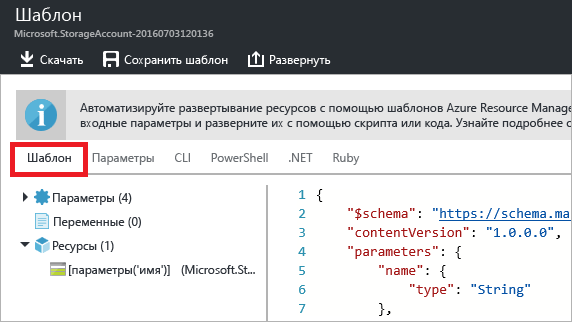
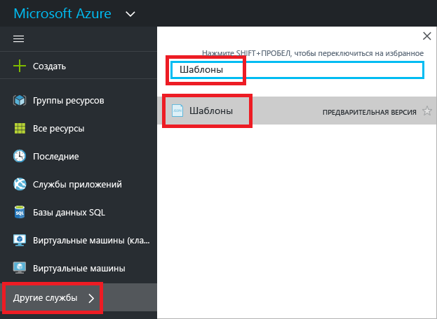
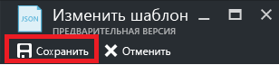

# <a name="export-an-azure-resource-manager-template-from-existing-resources"></a>Экспорт шаблона Azure Resource Manager из существующих ресурсов
В этой статье вы узнаете, как экспортировать шаблон Resource Manager из имеющихся в подписке ресурсов. Вы можете использовать этот готовый шаблон, чтобы лучше понять синтаксис шаблона.

Шаблон можно экспортировать двумя способами:

* Вы можете экспортировать **фактический шаблон, который использовался для развертывания**. Он содержит все параметры и переменные, указанные в исходном шаблоне. Этот подход полезен при развертывании ресурсов через портал и позволяет видеть шаблоны для создания этих ресурсов. Этот шаблон удобно использовать. 
* Вы можете экспортировать **созданный шаблон, который представляет текущее состояние группы ресурсов**. Он не основан на каком-либо шаблоне, который использовался для развертывания. Вместо этого создается шаблон, который является "моментальным снимком" или "резервной копией" группы ресурсов. Экспортированный шаблон содержит много жестко заданных значений и, скорее всего, меньше параметров, чем вы обычно определяете. Этот вариант подходит для повторного развертывания ресурсов в той же группе ресурсов. Чтобы использовать этот шаблон для другой группы ресурсов, возможно, его потребуется значительно изменить.

В этой статье рассматриваются оба способа экспорта с использованием портала.

## <a name="deploy-resources"></a>Развертывание ресурсов
Начнем с развертывания ресурсов в Azure, которые можно использовать для экспорта в качестве шаблона. Если у вас уже есть группа ресурсов в подписке, которую вы хотите экспортировать в шаблон, этот раздел можно пропустить. В оставшейся части этой статьи предполагается, что вы развернули веб-приложение и решение базы данных SQL, приведенные в этом разделе. При использовании другого решения выполняемые действия могут немного отличаться, но действия для экспорта шаблона такие же. 

1. На [портале Azure](https://portal.azure.com) выберите **Создать ресурс**.
   
      
2. Выполните поиск по запросу **Веб-приложение и SQL** и выберите его из списка результатов.
   
      

3. Нажмите кнопку **Создать**.

      

4. Укажите необходимые значения для веб-приложения и базы данных SQL. Нажмите кнопку **Создать**.

      

Развертывание может занять одну минуту. После завершения развертывания в подписке появится решение.

## <a name="view-template-from-deployment-history"></a>Просмотр шаблона из журнала развертываний
1. Перейдите к новой группе ресурсов. Обратите внимание, что на портале показан результат последнего развертывания. Щелкните эту ссылку.
   
      
2. Отобразится журнал развертываний для группы. В вашем случае на портале, скорее всего, будет отображаться только одно развертывание. Выберите его.
   
     
3. На портале отобразится сводка по развертыванию. В сводке содержатся сведения о состоянии развертывания и операциях, а также значения, указанные для параметров. Чтобы увидеть шаблон, который использовался для развертывания, щелкните **Просмотреть шаблон**.
   
     
4. Resource Manager извлекает следующие семь файлов:
   
   1. **Шаблон.** Шаблон, определяющий инфраструктуру решения. При создании учетной записи хранения на портале Resource Manager использовал шаблон, чтобы развернуть ее, и сохранил его для дальнейшего использования.
   2. **Параметры.** Файл параметров, который можно использовать для передачи значений во время развертывания. Он содержит значения, указанные во время первого развертывания. Эти значения можно изменить при повторном развертывании шаблона.
   3. **Интерфейс командной строки.** Файл скрипта интерфейса командной строки Azure, который можно использовать для развертывания шаблона.
   3. **CLI 2.0.** Файл скрипта интерфейса командной строки Azure, который можно использовать для развертывания шаблона.
   4. **PowerShell.** Файл скрипта Azure PowerShell, который можно использовать для развертывания шаблона.
   5. **.NET.** Класс .NET, который можно использовать для развертывания шаблона.
   6. **Ruby.** Класс Ruby, который можно использовать для развертывания шаблона.
      
      По умолчанию шаблон отображается на портале.
      
       
      
Это фактический шаблон, используемый для создания веб-приложения и базы данных SQL. Обратите внимание, что он содержит параметры, которые позволяют предоставлять разные значения во время развертывания. Дополнительные сведения о структуре шаблона см. в статье [Создание шаблонов Azure Resource Manager](resource-group-authoring-templates.md).

## <a name="export-the-template-from-resource-group"></a>Экспорт шаблона из группы ресурсов
Если вы вручную измените или добавите ресурсы в несколько развертываний, шаблон, полученный из журнала развертывания, не отразит текущее состояние группы ресурсов. В этом разделе показано, как экспортировать шаблон, который отражает текущее состояние группы ресурсов. Он будет моментальным снимком группы ресурсов, который можно использовать для повторного развертывания в той же группе ресурсов. Чтобы использовать экспортированный шаблон для других решений, его необходимо значительно изменить.

> [!NOTE]
> Нельзя экспортировать шаблон для группы ресурсов, которая содержит более 200 ресурсов.
> 
> 

1. Чтобы просмотреть шаблон для группы ресурсов, щелкните **Сценарий автоматизации**.
   
      
   
     Resource Manager оценивает ресурсы в группе ресурсов и создает для них шаблон. Функция экспорта шаблона поддерживается не для всех типов ресурсов. Может появиться ошибка и сообщение о том, что имеется проблема с экспортом. Дополнительные сведения об устранении таких ошибок см. в разделе [Устранение проблем при экспорте](#fix-export-issues).
2. Снова появятся шесть файлов, которые можно использовать для повторного развертывания решения. Но в этот раз шаблон выглядит немного иначе. Обратите внимание, что созданный шаблон содержит меньше параметров, чем шаблон в предыдущем разделе. Кроме того, многие из значений (например, расположение и номер SKU) жестко запрограммированы в этом шаблоне и не принимают значения параметра. Перед повторным использованием этого шаблона может потребоваться его изменить, чтобы эффективнее использовать параметры. 
   
3. У вас есть несколько вариантов продолжения работы с этим шаблоном. Вы можете скачать шаблон и работать с ним локально в редакторе JSON или сохранить его в библиотеку и работать с ним на портале.
   
     Если вам удобно работать в редакторе JSON, например [VS Code](https://code.visualstudio.com/) или [Visual Studio](vs-azure-tools-resource-groups-deployment-projects-create-deploy.md), можно скачать шаблон локально и использовать этот редактор. Чтобы работать локально, выберите **Скачать**.
   
      
   
     Если у вас не настроен редактор JSON, можно редактировать шаблон на портале. В оставшейся части этой статьи предполагается, что вы сохранили шаблон в библиотеке на портале. Тем не менее как при работе локально в редакторе JSON, так и при работе на портале вы вносите в шаблон одни и те же изменения синтаксиса. Чтобы работать на портале, выберите **Добавить в библиотеку**.
   
      
   
     Добавляя шаблон в библиотеку, присвойте ему имя и описание. Затем нажмите кнопку **Сохранить**.
   
     
4. Чтобы просмотреть шаблон, сохраненный в библиотеке, выберите **Больше служб**, введите **Шаблоны**, чтобы отфильтровать результаты, и выберите **Шаблоны**.
   
      
5. Выберите шаблон с именем, которое вы указали.
   
      

## <a name="customize-the-template"></a>Настройка шаблона
Экспортированный шаблон подходит, если необходимо создавать одно и то же веб-приложение и базу данных SQL при каждом развертывании. Но Resource Manager обеспечивает более гибкое развертывание. В этом разделе показано, как добавить параметры для имени и пароля администратора базы данных. Этот же подход можно использовать, чтобы сделать более гибкими другие значения в шаблоне.

1. Выберите **Изменить**, чтобы настроить шаблон.
   
     
2. Выберите шаблон.
   
     
3. Чтобы можно было передавать значения, которые можно указать во время развертывания, добавьте два следующих параметра в раздел **parameters** в шаблоне:

   ```json
   "administratorLogin": {
       "type": "String"
   },
   "administratorLoginPassword": {
       "type": "SecureString"
   },
   ```

4. Чтобы использовать новые параметры, замените определение SQL Server в разделе **resources**. Обратите внимание, что **administratorLogin** и **administratorLoginPassword** теперь используют значения параметров.

   ```json
   {
       "comments": "Generalized from resource: '/subscriptions/{subscription-id}/resourceGroups/exportsite/providers/Microsoft.Sql/servers/tfserverexport'.",
       "type": "Microsoft.Sql/servers",
       "kind": "v12.0",
       "name": "[parameters('servers_tfserverexport_name')]",
       "apiVersion": "2014-04-01-preview",
       "location": "South Central US",
       "scale": null,
       "properties": {
           "administratorLogin": "[parameters('administratorLogin')]",
           "administratorLoginPassword": "[parameters('administratorLoginPassword')]",
           "version": "12.0"
       },
       "dependsOn": []
   },
   ```

6. Отредактировав шаблон, нажмите кнопку **ОК**.
7. Чтобы сохранить изменения в шаблоне, щелкните **Сохранить**.
   
     
8. Чтобы повторно развернуть обновленный шаблон, щелкните **Развернуть**.
   
     
9. Укажите значения параметров и выберите группу ресурсов, в которую необходимо развертывать ресурсы.


## <a name="fix-export-issues"></a>Устранение проблем при экспорте
Функция экспорта шаблона поддерживается не для всех типов ресурсов. Эту проблему можно решить, добавив недостающие ресурсы в шаблон вручную. Сообщение об ошибке содержит типы ресурсов, которые невозможно экспортировать. Найдите этот тип ресурса в [справочнике по шаблонам](/azure/templates/). Дополнительные сведения о том, как вручную добавить шлюз виртуальной сети, см.в статье [Microsoft.Network/virtualNetworkGateways template reference](/azure/templates/microsoft.network/virtualnetworkgateways) (Справочник по шаблону Microsoft.Network/virtualNetworkGateways).

> [!NOTE]
> Проблемы при экспорте могут возникать, только если шаблон экспортируется из группы ресурсов, а не из журнала развертываний. Если последнее развертывание представляет точное состояние группы ресурсов, шаблон необходимо экспортировать из журнала развертываний, а не из группы ресурсов. Шаблон следует экспортировать из группы ресурсов, если вы внесли в группу ресурсов изменения, которые не определены в одном шаблоне.
> 
> 

## <a name="next-steps"></a>Дополнительная информация

* Вы можете развернуть шаблон с помощью [PowerShell](resource-group-template-deploy.md), [интерфейса командной строки Azure](resource-group-template-deploy-cli.md) или [REST API](resource-group-template-deploy-rest.md).
* Сведения об экспорте шаблона с помощью PowerShell см. в статье [Экспорт шаблонов Azure Resource Manager с помощью PowerShell](resource-manager-export-template-powershell.md).
* Сведения об экспорте шаблона с помощью Azure CLI см. в статье [Экспорт шаблонов Azure Resource Manager с помощью Azure CLI](resource-manager-export-template-cli.md).

