# <a name="export-an-azure-resource-manager-template-from-existing-resources"></a>Экспорт шаблона Azure Resource Manager из существующих ресурсов
Resource Manager позволяет экспортировать шаблон из существующих ресурсов в подписке. Используя созданный шаблон, можно изучить синтаксис шаблонов или при необходимости автоматизировать повторное развертывание решения.

Важно отметить, что экспортировать шаблон можно двумя разными способами.

* Вы можете экспортировать шаблон, который использовался для развертывания. Он содержит все параметры и переменные, указанные в исходном шаблоне. Этот метод удобно использовать при развертывании ресурсов на портале. Теперь нужно узнать, как построить шаблон для создания этих ресурсов.
* Вы можете экспортировать шаблон, который представляет текущее состояние группы ресурсов. Он не основан на каком-либо шаблоне, который использовался для развертывания. Напротив, создается шаблон, который является моментальным снимком группы ресурсов. Экспортированный шаблон содержит много жестко заданных значений и, скорее всего, меньше параметров, чем вы обычно определяете. Этот метод подходит, если вы изменили группу ресурсов с помощью портала или скриптов и теперь на ее основе необходимо создать шаблон.

В этой статье показаны оба способа.

При работе с этим руководством вы войдете на портал Azure, создадите учетную запись хранения, а затем экспортируете для нее шаблон. Вы также добавите виртуальную сеть, чтобы изменить группу ресурсов. Наконец, вы экспортируете новый шаблон, который представляет текущее состояние группы. Хотя в этой статье рассматривается упрощенная инфраструктура, с помощью описанных действий можно экспортировать шаблоны и для более сложных решений.

## <a name="create-a-storage-account"></a>Создайте учетную запись хранения.
1. На [портале Azure](https://portal.azure.com) выберите **Создать** > **Хранилище** > **Учетная запись хранения**.
   
      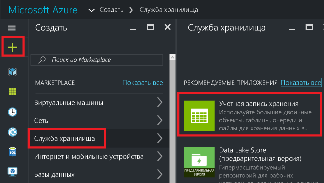
2. Создайте учетную запись хранения с именем **storage**, добавив свои инициалы и дату. Имя учетной записи хранения должно быть уникальным в среде Azure. Если имя уже используется, отобразится соответствующее сообщение об ошибке. Выберите другой вариант. Для группы ресурсов выберите **Создать** и назовите ее **ExportGroup**. Для других свойств можно использовать значения по умолчанию. Нажмите кнопку **Создать**.
   
      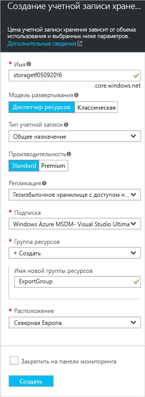

Развертывание может занять одну минуту. После завершения развертывания в подписке появится учетная запись хранения.

## <a name="view-a-template-from-deployment-history"></a>Просмотр шаблона из журнала развертываний
1. Перейдите в колонку новой группы ресурсов. Обратите внимание, что в этой колонке показан результат последнего развертывания. Щелкните эту ссылку.
   
      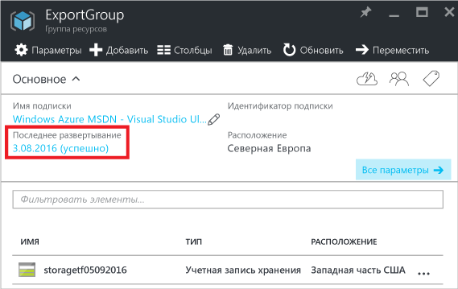
2. Отобразится журнал развертываний для группы. В вашем случае в колонке, скорее всего, будет отображаться только одно развертывание. Выберите его.
   
     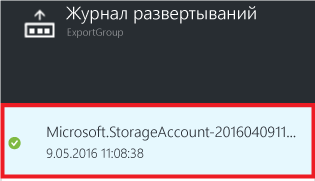
3. В колонке отобразится сводка по развертыванию. В сводке содержатся сведения о состоянии развертывания и операциях, а также значения, указанные для параметров. Чтобы увидеть шаблон, который использовался для развертывания, щелкните **Просмотреть шаблон**.
   
     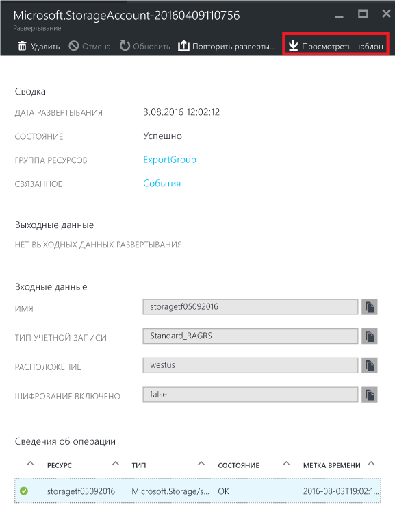
4. Resource Manager извлекает следующие шесть файлов:
   
   1. **Шаблон.** Шаблон, определяющий инфраструктуру решения. При создании учетной записи хранения на портале Resource Manager использовал шаблон, чтобы развернуть ее, и сохранил его для дальнейшего использования.
   2. **Параметры.** Файл параметров, который можно использовать для передачи значений во время развертывания. Он содержит значения, указанные при первом развертывании. Но любое из них можно изменить при повторном развертывании шаблона.
   3. **Интерфейс командной строки.** Файл скрипта интерфейса командной строки Azure, который можно использовать для развертывания шаблона.
   3. **CLI 2.0.** Файл скрипта интерфейса командной строки Azure, который можно использовать для развертывания шаблона.
   4. **PowerShell.** Файл скрипта Azure PowerShell, который можно использовать для развертывания шаблона.
   5. **.NET.** Класс .NET, который можно использовать для развертывания шаблона.
   6. **Ruby.** Класс Ruby, который можно использовать для развертывания шаблона.
      
      К файлам можно получить доступ, используя ссылки в колонке. По умолчанию шаблон отображается в колонке.
      
       
      
      Обратим на него особое внимание. Шаблон должен иметь примерно такой вид:
      
      ```json
      {
        "$schema": "https://schema.management.azure.com/schemas/2015-01-01/deploymentTemplate.json#",
        "contentVersion": "1.0.0.0",
        "parameters": {
          "name": {
            "type": "String"
          },
          "accountType": {
            "type": "String"
          },
          "location": {
            "type": "String"
          },
          "encryptionEnabled": {
            "defaultValue": false,
            "type": "Bool"
          }
        },
        "resources": [
          {
            "type": "Microsoft.Storage/storageAccounts",
            "sku": {
              "name": "[parameters('accountType')]"
            },
            "kind": "Storage",
            "name": "[parameters('name')]",
            "apiVersion": "2016-01-01",
            "location": "[parameters('location')]",
            "properties": {
              "encryption": {
                "services": {
                  "blob": {
                    "enabled": "[parameters('encryptionEnabled')]"
                  }
                },
                "keySource": "Microsoft.Storage"
              }
            }
          }
        ]
      }
      ```

Это фактический шаблон, который используется для создания учетной записи хранения. Обратите внимание, что он содержит параметры, которые позволяют развертывать учетные записи хранения разных типов. Дополнительные сведения о структуре шаблона см. в статье [Создание шаблонов Azure Resource Manager](resource-group-authoring-templates.md). Полный список функций, которые можно использовать в шаблоне, см. в статье [Функции шаблонов Azure Resource Manager](resource-group-template-functions.md).

## <a name="add-a-virtual-network"></a>Добавление виртуальной сети
Шаблон, скачанный в предыдущем разделе, представляет инфраструктуру для исходного развертывания. Но он не отражает изменения, внесенные после развертывания.
Чтобы продемонстрировать это, давайте изменим группу ресурсов, добавив виртуальную сеть на портале.

1. В колонке группы ресурсов щелкните **Добавить**.
   
      
2. Выберите **Виртуальная сеть** в списке доступных ресурсов.
   
      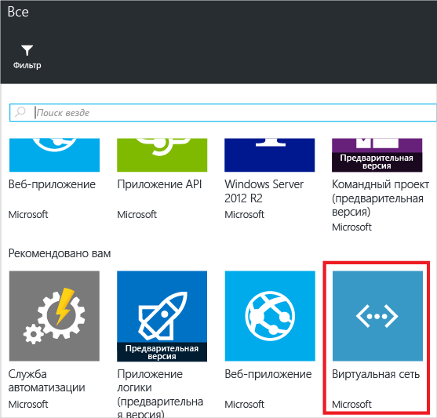
3. Присвойте виртуальной сети имя **VNET**и используйте значения по умолчанию для остальных свойств. Нажмите кнопку **Создать**.
   
      
4. После успешного развертывания виртуальной сети в группе ресурсов проверьте журнал развертывания еще раз. Теперь там два развертывания. Если второе развертывание не отображается, закройте колонку группы ресурсов и откройте ее снова. Выберите последнее развертывание.
   
      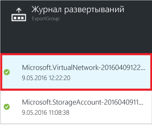
5. Просмотрите шаблон для этого развертывания. Обратите внимание, что он определяет только виртуальную сеть. В него не входит развернутая ранее учетная запись хранения. У вас больше нет шаблона, который представляет все ресурсы в группе ресурсов.

## <a name="export-the-template-from-resource-group"></a>Экспорт шаблона из группы ресурсов
Чтобы получить сведения о текущем состоянии вашей группы ресурсов, экспортируйте шаблон, в котором отображается моментальный снимок группы ресурсов.  

> [!NOTE]
> Нельзя экспортировать шаблон для группы ресурсов, которая содержит более 200 ресурсов.
> 
> 

1. Чтобы просмотреть шаблон для группы ресурсов, щелкните **Сценарий автоматизации**.
   
      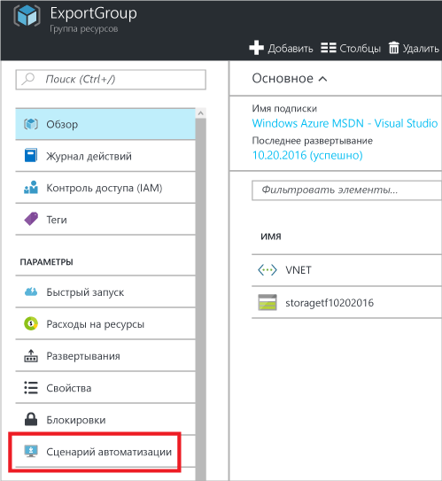
   
     Функция экспорта шаблона поддерживается не для всех типов ресурсов. Если ваша группа ресурсов содержит только учетную запись хранения и виртуальную сеть, как описано в этой статье, при экспорте не возникнут проблемы. Однако если вы создали другие типы ресурсов, может отобразиться сообщение о том, что при экспорте произошла ошибка. Дополнительные сведения об устранении таких ошибок см. в разделе [Устранение проблем при экспорте](#fix-export-issues).
2. Снова появятся шесть файлов, которые можно использовать для повторного развертывания решения. Но в этот раз шаблон выглядит немного иначе. Этот шаблон содержит только два параметра: по одному для имени учетной записи хранения и имени виртуальной сети.

  ```json
  "parameters": {
    "virtualNetworks_VNET_name": {
      "defaultValue": "VNET",
      "type": "String"
    },
    "storageAccounts_storagetf05092016_name": {
      "defaultValue": "storagetf05092016",
      "type": "String"
    }
  },
  ```
   
     Использованные при развертывании шаблоны не извлекались с помощью Resource Manager. Вместо этого был создан новый шаблон на основе текущей конфигурации ресурсов. Например, шаблон задает для расположения и репликации учетной записи хранения следующие значения:

  ```json 
  "location": "northeurope",
  "tags": {},
  "properties": {
    "accountType": "Standard_RAGRS"
  },
  ```
3. У вас есть несколько вариантов продолжения работы с этим шаблоном. Вы можете скачать шаблон и работать с ним локально в редакторе JSON или сохранить его в библиотеку и работать с ним на портале.
   
     Если вам удобно работать в редакторе JSON, например [VS Code](resource-manager-vs-code.md) или [Visual Studio](vs-azure-tools-resource-groups-deployment-projects-create-deploy.md), можно скачать шаблон локально и использовать этот редактор. Если у вас не настроен редактор JSON, можно редактировать шаблон на портале. В оставшейся части этого раздела предполагается, что вы сохранили шаблон в библиотеку на портале. Тем не менее как при работе локально в редакторе JSON, так и при работе на портале вы вносите в шаблон одни и те же изменения синтаксиса.
   
     Чтобы работать локально, выберите **Скачать**.
   
      
   
     Чтобы работать на портале, выберите **Добавить в библиотеку**.
   
      
   
     Добавляя шаблон в библиотеку, присвойте ему имя и описание. Затем нажмите кнопку **Сохранить**.
   
     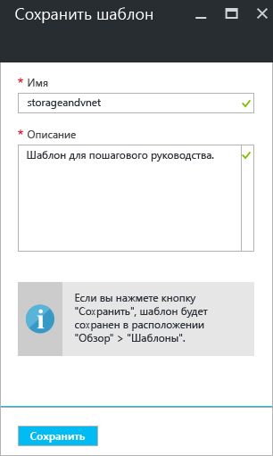
4. Чтобы просмотреть шаблон, сохраненный в библиотеке, выберите **Больше служб**, введите **Шаблоны**, чтобы отфильтровать результаты, и выберите **Шаблоны**.
   
      
5. Выберите шаблон с именем, которое вы указали.
   
      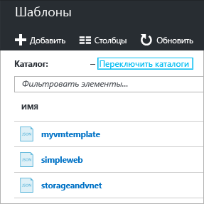

## <a name="customize-the-template"></a>Настройка шаблона
Экспортированный шаблон подходит, если необходимо создавать одну и ту же учетную запись хранения и виртуальную сеть при каждом развертывании. Но Resource Manager обеспечивает более гибкое развертывание. Например, во время развертывания вы можете указывать тип создаваемой учетной записи хранения или значения, используемые в качестве префикса адреса и префикса подсети виртуальной сети.

В этом разделе вы добавите параметры в экспортированный шаблон, чтобы его можно было использовать снова при развертывании тех же ресурсов в других средах. Кроме того, мы добавим в шаблон некоторые функции, чтобы уменьшить вероятность возникновения ошибки при его развертывании. Для учетной записи хранения больше не нужно подбирать уникальное имя. Шаблон сделает это за вас. Вы ограничите значения, которые можно указывать для типа учетной записи хранения, только до допустимых вариантов.

1. Выберите **Изменить**, чтобы настроить шаблон.
   
     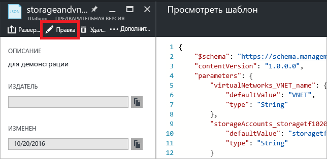
2. Выберите шаблон.
   
     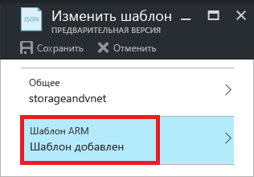
3. Чтобы можно было передавать значения, которые необходимо указывать при развертывании, введите в разделе **parameters** новые определения параметров. Обратите внимание на значения **allowedValues** для переменной **storageAccount_accountType**. Если случайно указать недопустимое значение, ошибка будет распознана до начала развертывания. Кроме того, обратите внимание, что для имени учетной записи указывается только префикс, длина которого ограничена 11 знаками. Такое ограничение префикса гарантирует, что полное имя не превышает максимальное количество знаков для имени учетной записи хранения. Префикс позволяет применять соглашение об именовании к учетным записям хранения. Сведения о создании уникального имени описаны на следующем шаге.

  ```json
  "parameters": {
    "storageAccount_prefix": {
      "type": "string",
      "maxLength": 11
    },
    "storageAccount_accountType": {
      "defaultValue": "Standard_RAGRS",
      "type": "string",
      "allowedValues": [
        "Standard_LRS",
        "Standard_ZRS",
        "Standard_GRS",
        "Standard_RAGRS",
        "Premium_LRS"
      ]
    },
    "virtualNetwork_name": {
      "type": "string"
    },
    "addressPrefix": {
      "defaultValue": "10.0.0.0/16",
      "type": "string"
    },
    "subnetName": {
      "defaultValue": "subnet-1",
      "type": "string"
    },
    "subnetAddressPrefix": {
      "defaultValue": "10.0.0.0/24",
      "type": "string"
    }
  },
  ```

4. Раздел **variables** шаблона сейчас пуст. В разделе **variables** можно создавать значения, чтобы упростить синтаксис остальной части шаблона. Укажите в этом разделе новое определение переменной. Переменная **storageAccount_name** объединяет префикс параметра с уникальной строкой, созданной на основе идентификатора группы ресурсов. При указании значения параметра больше не нужно подбирать уникальное имя.

  ```json
  "variables": {
    "storageAccount_name": "[concat(parameters('storageAccount_prefix'), uniqueString(resourceGroup().id))]"
  },
  ```

5. Чтобы использовать раздел параметров и переменную в определениях ресурсов, укажите в разделе **resources** новые определения ресурсов. Обратите внимание, что кроме значений, назначенных свойствам, в определениях ресурсов мало что изменилось. Эти свойства соответствуют свойствам экспортированного шаблона. Вы просто назначаете свойства значениям параметров, вместо того чтобы жестко задавать значения. С помощью выражения **resourceGroup().location** для расположения ресурсов определено использование того же расположения, что и для группы ресурсов. Ссылка на переменную, созданную для имени учетной записи хранения, указывается с помощью выражения **variables** .

  ```json
  "resources": [
    {
      "type": "Microsoft.Network/virtualNetworks",
      "name": "[parameters('virtualNetwork_name')]",
      "apiVersion": "2015-06-15",
      "location": "[resourceGroup().location]",
      "properties": {
        "addressSpace": {
          "addressPrefixes": [
            "[parameters('addressPrefix')]"
          ]
        },
        "subnets": [
          {
            "name": "[parameters('subnetName')]",
            "properties": {
              "addressPrefix": "[parameters('subnetAddressPrefix')]"
            }
          }
        ]
      },
      "dependsOn": []
    },
    {
      "type": "Microsoft.Storage/storageAccounts",
      "name": "[variables('storageAccount_name')]",
      "apiVersion": "2015-06-15",
      "location": "[resourceGroup().location]",
      "tags": {},
      "properties": {
        "accountType": "[parameters('storageAccount_accountType')]"
      },
      "dependsOn": []
    }
  ]
  ```

6. Отредактировав шаблон, нажмите кнопку **ОК**.
7. Чтобы сохранить изменения в шаблоне, щелкните **Сохранить**.
   
     
8. Чтобы развернуть обновленный шаблон, щелкните **Развернуть**.
   
     
9. Укажите значения параметров и выберите новую группу ресурсов, в которую необходимо развертывать ресурсы.

## <a name="update-the-downloaded-parameters-file"></a>Обновление скачанного файла параметров
Если вы работаете со скачанными файлами (а не в библиотеке портала), необходимо обновить скачанный файл параметров. Его параметры больше не соответствуют параметрам в шаблоне. Использовать файл параметров необязательно, но это упрощает повторное развертывание среды. Вы будете использовать значения по умолчанию, определенные в шаблоне для многих параметров, поэтому из файла параметров нужны только два значения.

Замените содержимое файла parameters.json следующим:

```json
{
  "$schema": "https://schema.management.azure.com/schemas/2015-01-01/deploymentParameters.json#",
  "contentVersion": "1.0.0.0",
  "parameters": {
    "storageAccount_prefix": {
      "value": "storage"
    },
    "virtualNetwork_name": {
      "value": "VNET"
    }
  }
}
```

Обновленный файл параметров определяет значения только для параметров без значений по умолчанию. Также можно указать значения для других параметров, если вы не хотите использовать значения по умолчанию.

## <a name="fix-export-issues"></a>Устранение проблем при экспорте
Функция экспорта шаблона поддерживается не для всех типов ресурсов. Resource Manager специально не экспортирует некоторые ресурсы, чтобы предотвратить доступ к конфиденциальным данным. Например, если в конфигурации сайта используется строка подключения, вы, вероятно, не захотите, чтобы она отображалась в экспортированном шаблоне. Эту проблему можно решить, добавив недостающие ресурсы в шаблон вручную.

> [!NOTE]
> Проблемы при экспорте могут возникать, только если шаблон экспортируется из группы ресурсов, а не из журнала развертываний. Если последнее развертывание представляет точное состояние группы ресурсов, шаблон необходимо экспортировать из журнала развертываний, а не из группы ресурсов. Шаблон следует экспортировать из группы ресурсов, если вы внесли в группу ресурсов изменения, которые не определены в одном шаблоне.
> 
> 

Например, если вы экспортируете шаблон для группы ресурсов, содержащий веб-приложение, базу данных SQL и строку подключения в конфигурации сайта, отобразится следующее сообщение:

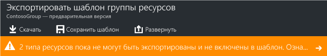

Если выбрать это сообщение, вы увидите список типов ресурсов, которые не были экспортированы. 

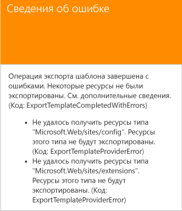

В этом разделе приведены распространенные способы устранения ошибок.

### <a name="connection-string"></a>Строка подключения
В ресурсе веб-сайтов добавьте определение строки подключения к базе данных.

```json
{
  "type": "Microsoft.Web/sites",
  ...
  "resources": [
    {
      "apiVersion": "2015-08-01",
      "type": "config",
      "name": "connectionstrings",
      "dependsOn": [
          "[concat('Microsoft.Web/Sites/', parameters('<site-name>'))]"
      ],
      "properties": {
          "DefaultConnection": {
            "value": "[concat('Data Source=tcp:', reference(concat('Microsoft.Sql/servers/', parameters('<database-server-name>'))).fullyQualifiedDomainName, ',1433;Initial Catalog=', parameters('<database-name>'), ';User Id=', parameters('<admin-login>'), '@', parameters('<database-server-name>'), ';Password=', parameters('<admin-password>'), ';')]",
              "type": "SQLServer"
          }
      }
    }
  ]
}
```    

### <a name="web-site-extension"></a>Расширение веб-сайта
В ресурсе веб-сайта добавьте определение кода для установки.

```json
{
  "type": "Microsoft.Web/sites",
  ...
  "resources": [
    {
      "name": "MSDeploy",
      "type": "extensions",
      "location": "[resourceGroup().location]",
      "apiVersion": "2015-08-01",
      "dependsOn": [
        "[concat('Microsoft.Web/sites/', parameters('<site-name>'))]"
      ],
      "properties": {
        "packageUri": "[concat(parameters('<artifacts-location>'), '/', parameters('<package-folder>'), '/', parameters('<package-file-name>'), parameters('<sas-token>'))]",
        "dbType": "None",
        "connectionString": "",
        "setParameters": {
          "IIS Web Application Name": "[parameters('<site-name>')]"
        }
      }
    }
  ]
}
```

### <a name="virtual-machine-extension"></a>Расширение виртуальной машины
Примеры расширений виртуальных машин см. в статье [Примеры конфигурации расширения виртуальной машины Microsoft Azure](../virtual-machines/virtual-machines-windows-extensions-configuration-samples.md?toc=%2fazure%2fvirtual-machines%2fwindows%2ftoc.json).

### <a name="virtual-network-gateway"></a>Шлюз виртуальной сети
Добавьте тип ресурса шлюза виртуальной сети.

```json
{
  "type": "Microsoft.Network/virtualNetworkGateways",
  "name": "[parameters('<gateway-name>')]",
  "apiVersion": "2015-06-15",
  "location": "[resourceGroup().location]",
  "properties": {
    "gatewayType": "[parameters('<gateway-type>')]",
    "ipConfigurations": [
      {
        "name": "default",
        "properties": {
          "privateIPAllocationMethod": "Dynamic",
          "subnet": {
            "id": "[resourceId('Microsoft.Network/virtualNetworks/subnets', parameters('<vnet-name>'), parameters('<new-subnet-name>'))]"
          },
          "publicIpAddress": {
            "id": "[resourceId('Microsoft.Network/publicIPAddresses', parameters('<new-public-ip-address-Name>'))]"
          }
        }
      }
    ],
    "enableBgp": false,
    "vpnType": "[parameters('<vpn-type>')]"
  },
  "dependsOn": [
    "Microsoft.Network/virtualNetworks/codegroup4/subnets/GatewaySubnet",
    "[concat('Microsoft.Network/publicIPAddresses/', parameters('<new-public-ip-address-Name>'))]"
  ]
},
```

### <a name="local-network-gateway"></a>Шлюз локальной сети
Добавьте тип ресурса шлюза локальной сети.

```json
{
    "type": "Microsoft.Network/localNetworkGateways",
    "name": "[parameters('<local-network-gateway-name>')]",
    "apiVersion": "2015-06-15",
    "location": "[resourceGroup().location]",
    "properties": {
      "localNetworkAddressSpace": {
        "addressPrefixes": "[parameters('<address-prefixes>')]"
      }
    }
}
```

### <a name="connection"></a>Подключение
Добавьте тип ресурса подключения.

```json
{
    "apiVersion": "2015-06-15",
    "name": "[parameters('<connection-name>')]",
    "type": "Microsoft.Network/connections",
    "location": "[resourceGroup().location]",
    "properties": {
        "virtualNetworkGateway1": {
        "id": "[resourceId('Microsoft.Network/virtualNetworkGateways', parameters('<gateway-name>'))]"
      },
      "localNetworkGateway2": {
        "id": "[resourceId('Microsoft.Network/localNetworkGateways', parameters('<local-gateway-name>'))]"
      },
      "connectionType": "IPsec",
      "routingWeight": 10,
      "sharedKey": "[parameters('<shared-key>')]"
    }
},
```


## <a name="next-steps"></a>Дальнейшие действия
Поздравляем! Вы узнали, как экспортировать шаблон из ресурсов, созданных на портале.

* Вы можете развернуть шаблон с помощью [PowerShell](resource-group-template-deploy.md), [интерфейса командной строки Azure](resource-group-template-deploy-cli.md) или [REST API](resource-group-template-deploy-rest.md).
* Сведения об экспорте шаблона с помощью PowerShell см. в статье [Использование Azure PowerShell с Azure Resource Manager](powershell-azure-resource-manager.md).
* Сведения об экспорте шаблона с помощью интерфейса командной строки Azure см. в статье [Управление ресурсами и группами ресурсов Azure с помощью интерфейса командной строки Azure](xplat-cli-azure-resource-manager.md).


