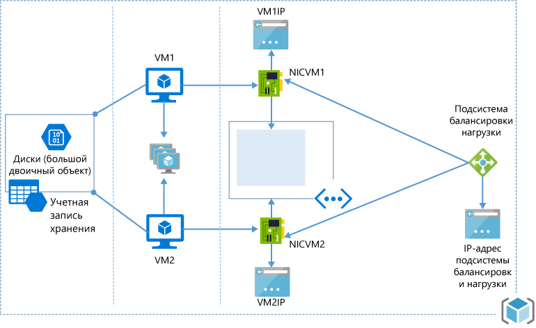

# <a name="resource-manager-template-walkthrough"></a>Пошаговое руководство по созданию шаблона Resource Manager
При создании шаблона сразу возникает вопрос — "Как начать?" В качестве альтернативного варианта можно начать с ознакомления с [коллекцией быстрого запуска](resource-group-authoring-templates.md#template-format). В качестве альтернативного варианта можно сначала ознакомиться с [коллекцией быстрого запуска](https://github.com/Azure/azure-quickstart-templates). Здесь можно найти сценарии, аналогичные тому, который нужно создать. Можно объединить несколько шаблонов или изменить существующий, чтобы он соответствовал вашему конкретному сценарию. 

Рассмотрим общую инфраструктуру:

* Две виртуальные машины, использующие одну и ту же учетную запись хранения, которые находятся в одной группе доступности и одной подсети виртуальной сети.
* Одна сетевая карта и IP-адрес для каждой виртуальной машины.
* Балансировщик нагрузки с правилом балансировки нагрузки на порте 80.



В этой статье рассматриваются действия по созданию шаблона Resource Manager для такой инфраструктуры. За основу окончательного шаблона взят шаблон быстрого запуска с именем [2 ВМ в подсистеме балансировки нагрузки и правила балансировки нагрузки](https://azure.microsoft.com/documentation/templates/201-2-vms-loadbalancer-lbrules/).

Так как создать все сразу тяжело, начнем с того, что создадим и развернем учетную запись хранения. Научившись создавать учетную запись хранения, можно добавить другие ресурсы и повторно развернуть шаблон, чтобы завершить инфраструктуру.

> [!NOTE]
> Для создания шаблона можно использовать любой редактор. В Visual Studio есть средства, которые упрощают разработку шаблонов, но для работы с этим руководством вам не требуется Visual Studio. Руководство по созданию веб-приложений и развертыванию баз данных SQL с помощью Visual Studio см. в статье [Создание и развертывание групп ресурсов Azure с помощью Visual Studio](vs-azure-tools-resource-groups-deployment-projects-create-deploy.md). 
> 
> 

## <a name="create-the-resource-manager-template"></a>Создание шаблона Resource Manager
Шаблон — это JSON-файл, в котором определены все развертываемые ресурсы. В нем также можно определять параметры, задаваемые во время развертывания, переменные, создаваемые из других значений и выражений, а также выходные данные развертывания. 

Начнем с простейшего шаблона.

```json
    {
      "$schema": "http://schema.management.azure.com/schemas/2015-01-01/deploymentTemplate.json#",
      "contentVersion": "1.0.0.0",
      "parameters": {  },
      "variables": {  },
      "resources": [  ],
      "outputs": {  }
    }
 ```

Сохраните этот файл, присвоив ему имя **azuredeploy.json** (шаблон должен представлять собой JSON-файл, которому можно присвоить любое имя).

## <a name="create-a-storage-account"></a>Создайте учетную запись хранения.
В разделе **resources** добавьте объект, который определяет учетную запись хранения, как показано ниже. 

```json
"resources": [
  {
    "type": "Microsoft.Storage/storageAccounts",
    "name": "[parameters('storageAccountName')]",
    "apiVersion": "2015-06-15",
    "location": "[resourceGroup().location]",
    "properties": {
      "accountType": "Standard_LRS"
    }
  }
]
```

Вы, возможно, спросите, откуда взялись эти свойства и значения. Свойства **type**, **name**, **apiVersion** и **location** — это стандартные элементы, доступные для всех типов ресурсов. Сведения об общих элементах см. в разделе [Ресурсы](resource-group-authoring-templates.md#resources). Для свойства **name** устанавливается значение параметра, которое передается во время развертывания, а для свойства **location** — расположение, которое использует группа ресурсов. Способ определения свойств **type** и **apiVersion** будет описан в следующих разделах.

Раздел **properties** содержит все уникальные свойства для определенного типа ресурсов. Значения, задаваемые в этом разделе, точно повторяют операцию PUT в REST API для создания данного типа ресурсов. Во время создания учетной записи хранения необходимо указать **accountType**. Как указано в статье об [использовании REST API для создания учетной записи хранения](https://msdn.microsoft.com/library/azure/mt163564.aspx), раздел свойств операции REST также содержит свойство **accountType**. Его допустимые значения задокументированы. В этом примере тип учетной записи имеет значение **Standard_LRS**. Можно указать другое значение или разрешить пользователям передавать тип учетной записи в качестве параметра.

Вернемся к разделу **parameters**, чтобы узнать, как указать имя учетной записи хранения. Дополнительные сведения об использовании параметров см. в [соответствующем разделе](resource-group-authoring-templates.md#parameters). 

```json
"parameters" : {
    "storageAccountName": {
      "type": "string",
      "metadata": {
        "description": "Storage Account Name"
      }
    }
}
```
Здесь определен параметр строкового типа, который будет содержать имя учетной записи хранения. Значение для этого параметра будет предоставлено во время развертывания шаблона.

## <a name="deploying-the-template"></a>Развертывание шаблона
Для создания новой учетной записи хранения используется полный шаблон. Он был сохранен в файле с именем **azuredeploy.json**:

```json
{
  "$schema": "https://schema.management.azure.com/schemas/2015-01-01/deploymentTemplate.json#",
  "contentVersion": "1.0.0.0",
  "parameters" : {
    "storageAccountName": {
      "type": "string",
      "metadata": {
        "description": "Storage Account Name"
      }
    }
  },  
  "resources": [
    {
      "type": "Microsoft.Storage/storageAccounts",
      "name": "[parameters('storageAccountName')]",
      "apiVersion": "2015-06-15",
      "location": "[resourceGroup().location]",
      "properties": {
        "accountType": "Standard_LRS"
      }
    }
  ]
}
```

Шаблон можно развернуть несколькими способами, приведенными в [статье о развертывании ресурсов](resource-group-template-deploy.md). Чтобы развернуть шаблон с помощью Azure PowerShell, используйте следующее:

```powershell
# create a new resource group
New-AzureRmResourceGroup -Name ExampleResourceGroup -Location "West Europe"

# deploy the template to the resource group
New-AzureRmResourceGroupDeployment -Name ExampleDeployment -ResourceGroupName ExampleResourceGroup `
  -TemplateFile azuredeploy.json
```

Чтобы развернуть шаблон с помощью интерфейса командной строки Azure, используйте следующее:

```azurecli
azure group create -n ExampleResourceGroup -l "West Europe"

azure group deployment create -f azuredeploy.json -g ExampleResourceGroup -n ExampleDeployment
```

Теперь у вас есть учетная запись хранения.

На следующих шагах будут добавлены все ресурсы, которые нужны для развертывания архитектуры, описанной в начале этого руководства. Эти ресурсы будут добавлены в тот же шаблон, с которым мы работали.

## <a name="availability-set"></a>Группа доступности
Определив учетную запись хранения, добавьте группу доступности для виртуальных машин. В этом случае дополнительные свойства не требуются, поэтому определить группу доступности очень просто. Если вы хотите определить значения счетчиков для доменов обновления и сбоя, изучите подробный раздел свойств в статье о [REST API для создания группы доступности](https://msdn.microsoft.com/library/azure/mt163607.aspx) .

```json
{
   "type": "Microsoft.Compute/availabilitySets",
   "name": "[variables('availabilitySetName')]",
   "apiVersion": "2015-06-15",
   "location": "[resourceGroup().location]",
   "properties": {}
}
```

Обратите внимание, что свойству **name** присвоено значение переменной. Для этого шаблона имя группы доступности нужно указать в нескольких местах. Вам будет легче работать с шаблоном, если вы определите это значение один раз и будете использовать его в нескольких местах.

Значение, указываемое для свойства **type** , определяет поставщика ресурсов и их тип. Для групп доступности поставщик ресурсов — это **Microsoft.Compute**, а тип ресурсов — **availabilitySets**. Чтобы получить список доступных поставщиков ресурсов, выполните следующую команду PowerShell:

```powershell
    Get-AzureRmResourceProvider -ListAvailable
```

Если вы используете Azure CLI, выполните следующую команду:

```azurecli
    azure provider list
```
Так как вы создаете учетные записи хранения, виртуальные машины и виртуальные сети, вы будете использовать следующие поставщики ресурсов:

* Microsoft.Storage;
* Microsoft.Compute;
* Microsoft.Network.

Чтобы просмотреть типы ресурсов для конкретного поставщика, выполните следующую команду PowerShell:

```powershell
    (Get-AzureRmResourceProvider -ProviderNamespace Microsoft.Compute).ResourceTypes
```

Если вы используете Azure CLI, приведенная ниже команда возвращает доступные типы в формате JSON и сохраняет результаты в файл.

```azurecli
    azure provider show Microsoft.Compute --json > c:\temp.json
```

Свойство **availabilitySets** должно отображаться как один из типов в **Microsoft.Compute**. Полное имя типа — **Microsoft.Compute/availabilitySets**. Определить имя типа ресурсов можно для всех ресурсов в шаблоне.

## <a name="public-ip"></a>Общедоступный IP-адрес
Определите общедоступный IP-адрес. Сведения о настраиваемых свойствах см. в статье [REST API for public IP addresses](https://msdn.microsoft.com/library/azure/mt163590.aspx) (REST API для общедоступных IP-адресов).

```json
{
  "apiVersion": "2015-06-15",
  "type": "Microsoft.Network/publicIPAddresses",
  "name": "[parameters('publicIPAddressName')]",
  "location": "[resourceGroup().location]",
  "properties": {
    "publicIPAllocationMethod": "Dynamic",
    "dnsSettings": {
      "domainNameLabel": "[parameters('dnsNameforLBIP')]"
    }
  }
}
```

Для метода распределения установлено значение **Dynamic** , но вы можете задать любое другое значение или настроить это свойство так, чтобы оно принимало значение параметра. Вы разрешили пользователям шаблона передавать в него значение метки доменного имени.

Теперь рассмотрим, как определить свойство **apiVersion**. Указываемое значение должно совпадать с версией REST API, которую вы хотите использовать при создании ресурса. Найти нужный тип ресурса можно в документации по REST API. Кроме того, для определенного типа можно выполнить следующую команду PowerShell:

```powershell
    ((Get-AzureRmResourceProvider -ProviderNamespace Microsoft.Network).ResourceTypes | Where-Object ResourceTypeName -eq publicIPAddresses).ApiVersions
```
Она возвратит следующие значения:

    2015-06-15
    2015-05-01-preview
    2014-12-01-preview

Чтобы просмотреть версии API с помощью интерфейса командной строки Azure, выполните приведенную ранее команду **azure provider show** .

При создании нового шаблона выбирайте последнюю версию API.

## <a name="virtual-network-and-subnet"></a>Виртуальная сеть и подсеть
Создайте виртуальную сеть с одной подсетью. Сведения обо всех настраиваемых свойствах см. в статье о [REST API для виртуальных сетей](https://msdn.microsoft.com/library/azure/mt163661.aspx).

```json
{
   "apiVersion": "2015-06-15",
   "type": "Microsoft.Network/virtualNetworks",
   "name": "[parameters('vnetName')]",
   "location": "[resourceGroup().location]",
   "properties": {
     "addressSpace": {
       "addressPrefixes": [
         "10.0.0.0/16"
       ]
     },
     "subnets": [
       {
         "name": "[variables('subnetName')]",
         "properties": {
           "addressPrefix": "10.0.0.0/24"
         }
       }
     ]
   }
}
```

## <a name="load-balancer"></a>Подсистема балансировки нагрузки
Теперь необходимо создать внешний балансировщик нагрузки. Так как балансировщик нагрузки использует общедоступный IP-адрес, в разделе **dependsOn** необходимо объявить зависимость от общедоступного IP-адреса. Это означает, что балансировщик нагрузки не будет развернут, пока не завершится развертывание общедоступного IP-адреса. Если вы не определите эту зависимость, возникнет ошибка, так как Resource Manager попытается развернуть ресурсы одновременно. Он будет пытаться назначить балансировщику нагрузки общедоступный IP-адрес, который еще не существует. 

В этом определении ресурса вам также нужно создать пул адресов серверной части, несколько правил NAT для входящих подключений к виртуальным машинам с помощью протокола удаленного рабочего стола и правило балансировки нагрузки с TCP-зондом на порте 80. Сведения обо всех свойствах см. в статье о [REST API для балансировщика нагрузки](https://msdn.microsoft.com/library/azure/mt163574.aspx).

```json
{
   "apiVersion": "2015-06-15",
   "name": "[parameters('lbName')]",
   "type": "Microsoft.Network/loadBalancers",
   "location": "[resourceGroup().location]",
   "dependsOn": [
     "[concat('Microsoft.Network/publicIPAddresses/', parameters('publicIPAddressName'))]"
   ],
   "properties": {
     "frontendIPConfigurations": [
       {
         "name": "LoadBalancerFrontEnd",
         "properties": {
           "publicIPAddress": {
             "id": "[variables('publicIPAddressID')]"
           }
         }
       }
     ],
     "backendAddressPools": [
       {
         "name": "BackendPool1"
       }
     ],
     "inboundNatRules": [
       {
         "name": "RDP-VM0",
         "properties": {
           "frontendIPConfiguration": {
             "id": "[variables('frontEndIPConfigID')]"
           },
           "protocol": "tcp",
           "frontendPort": 50001,
           "backendPort": 3389,
           "enableFloatingIP": false
         }
       },
       {
         "name": "RDP-VM1",
         "properties": {
           "frontendIPConfiguration": {
             "id": "[variables('frontEndIPConfigID')]"
           },
           "protocol": "tcp",
           "frontendPort": 50002,
           "backendPort": 3389,
           "enableFloatingIP": false
         }
       }
     ],
     "loadBalancingRules": [
       {
         "name": "LBRule",
         "properties": {
           "frontendIPConfiguration": {
             "id": "[variables('frontEndIPConfigID')]"
           },
           "backendAddressPool": {
             "id": "[variables('lbPoolID')]"
           },
           "protocol": "tcp",
           "frontendPort": 80,
           "backendPort": 80,
           "enableFloatingIP": false,
           "idleTimeoutInMinutes": 5,
           "probe": {
             "id": "[variables('lbProbeID')]"
           }
         }
       }
     ],
     "probes": [
       {
         "name": "tcpProbe",
         "properties": {
           "protocol": "tcp",
           "port": 80,
           "intervalInSeconds": 5,
           "numberOfProbes": 2
         }
       }
     ]
   }
}
```

## <a name="network-interface"></a>Сетевой интерфейс
Вам нужно создать два сетевых интерфейса — по одному для каждой виртуальной машины. Вместо того чтобы включать повторяющиеся записи для сетевых интерфейсов, вы можете использовать [функцию copyIndex()](resource-group-create-multiple.md) для итерации цикла копирования (называется nicLoop) и создания количества сетевых интерфейсов, определенного в переменных `numberOfInstances`. Сетевой интерфейс зависит от создания виртуальной сети и балансировщика нагрузки. Он использует подсеть, определенную во время создания виртуальной сети, и идентификатор балансировщика нагрузки для настройки пула адресов балансировщика нагрузки и правил NAT для входящих подключений.
Сведения обо всех свойствах см. в статье о [REST API для сетевых интерфейсов](https://msdn.microsoft.com/library/azure/mt163668.aspx).

```json
{
   "apiVersion": "2015-06-15",
   "type": "Microsoft.Network/networkInterfaces",
   "name": "[concat(parameters('nicNamePrefix'), copyindex())]",
   "location": "[resourceGroup().location]",
   "copy": {
     "name": "nicLoop",
     "count": "[variables('numberOfInstances')]"
   },
   "dependsOn": [
     "[concat('Microsoft.Network/virtualNetworks/', parameters('vnetName'))]",
     "[concat('Microsoft.Network/loadBalancers/', parameters('lbName'))]"
   ],
   "properties": {
     "ipConfigurations": [
       {
         "name": "ipconfig1",
         "properties": {
           "privateIPAllocationMethod": "Dynamic",
           "subnet": {
             "id": "[variables('subnetRef')]"
           },
           "loadBalancerBackendAddressPools": [
             {
               "id": "[concat(variables('lbID'), '/backendAddressPools/BackendPool1')]"
             }
           ],
           "loadBalancerInboundNatRules": [
             {
               "id": "[concat(variables('lbID'),'/inboundNatRules/RDP-VM', copyindex())]"
             }
           ]
         }
       }
     ]
   }
}
```

## <a name="virtual-machine"></a>Виртуальная машина.
С помощью функции copyIndex() будут созданы 2 виртуальные машины (так же как при создании [сетевых интерфейсов](#network-interface)).
Создание виртуальной машины зависит от учетной записи хранения, сетевого интерфейса и группы доступности. Эта виртуальная машина будет создана из образа Marketplace. В свойстве `storageProfile` определено, что `imageReference` используется для определения издателя образа, предложения, SKU и версии. В конце настраивается профиль диагностики для включения диагностирования виртуальной машины. 

Чтобы найти соответствующие свойства для образа Marketplace, следуйте инструкциям в статьях о [выборе образов виртуальных машин Linux](../virtual-machines/virtual-machines-linux-cli-ps-findimage.md?toc=%2fazure%2fvirtual-machines%2flinux%2ftoc.json) или [просмотре и выборе образов виртуальных машин Windows](../virtual-machines/virtual-machines-windows-cli-ps-findimage.md?toc=%2fazure%2fvirtual-machines%2fwindows%2ftoc.json).

```json
{
   "apiVersion": "2015-06-15",
   "type": "Microsoft.Compute/virtualMachines",
   "name": "[concat(parameters('vmNamePrefix'), copyindex())]",
   "copy": {
     "name": "virtualMachineLoop",
     "count": "[variables('numberOfInstances')]"
   },
   "location": "[resourceGroup().location]",
   "dependsOn": [
     "[concat('Microsoft.Storage/storageAccounts/', parameters('storageAccountName'))]",
     "[concat('Microsoft.Network/networkInterfaces/', parameters('nicNamePrefix'), copyindex())]",
     "[concat('Microsoft.Compute/availabilitySets/', variables('availabilitySetName'))]"
   ],
   "properties": {
     "availabilitySet": {
       "id": "[resourceId('Microsoft.Compute/availabilitySets',variables('availabilitySetName'))]"
     },
     "hardwareProfile": {
       "vmSize": "[parameters('vmSize')]"
     },
     "osProfile": {
       "computerName": "[concat(parameters('vmNamePrefix'), copyIndex())]",
       "adminUsername": "[parameters('adminUsername')]",
       "adminPassword": "[parameters('adminPassword')]"
     },
     "storageProfile": {
       "imageReference": {
         "publisher": "[parameters('imagePublisher')]",
         "offer": "[parameters('imageOffer')]",
         "sku": "[parameters('imageSKU')]",
         "version": "latest"
       },
       "osDisk": {
         "name": "osdisk",
         "vhd": {
           "uri": "[concat('http://',parameters('storageAccountName'),'.blob.core.windows.net/vhds/','osdisk', copyindex(), '.vhd')]"
         },
         "caching": "ReadWrite",
         "createOption": "FromImage"
       }
     },
     "networkProfile": {
       "networkInterfaces": [
         {
           "id": "[resourceId('Microsoft.Network/networkInterfaces',concat(parameters('nicNamePrefix'),copyindex()))]"
         }
       ]
     },
     "diagnosticsProfile": {
       "bootDiagnostics": {
          "enabled": "true",
          "storageUri": "[concat('http://',parameters('storageAccountName'),'.blob.core.windows.net')]"
       }
     }
}
```

> [!NOTE]
> Для образов, опубликованных **сторонними поставщиками`plan`, необходимо указать другое свойство с именем **. Пример можно найти в [этом шаблоне](https://github.com/Azure/azure-quickstart-templates/tree/master/checkpoint-single-nic) из коллекции быстрого запуска. 
> 
> 

Ресурсы шаблона теперь определены.

## <a name="parameters"></a>Параметры
В разделе параметров определите значения, которые могут быть указаны во время развертывания шаблона. Определите только те значения, которые, по вашему мнению, должны изменяться во время развертывания. Вы можете указать для параметра значение по умолчанию. Оно будет использоваться в том случае, если во время развертывания значение не указано. Кроме того, можно определить допустимые значения, как показано для параметра **imageSKU**.

```json
"parameters": {
    "storageAccountName": {
      "type": "string",
      "metadata": {
        "description": "Name of storage account"
      }
    },
    "adminUsername": {
      "type": "string",
      "metadata": {
        "description": "Admin username"
      }
    },
    "adminPassword": {
      "type": "securestring",
      "metadata": {
        "description": "Admin password"
      }
    },
    "dnsNameforLBIP": {
      "type": "string",
      "metadata": {
        "description": "DNS for Load Balancer IP"
      }
    },
    "vmNamePrefix": {
      "type": "string",
      "defaultValue": "myVM",
      "metadata": {
        "description": "Prefix to use for VM names"
      }
    },
    "imagePublisher": {
      "type": "string",
      "defaultValue": "MicrosoftWindowsServer",
      "metadata": {
        "description": "Image Publisher"
      }
    },
    "imageOffer": {
      "type": "string",
      "defaultValue": "WindowsServer",
      "metadata": {
        "description": "Image Offer"
      }
    },
    "imageSKU": {
      "type": "string",
      "defaultValue": "2012-R2-Datacenter",
      "allowedValues": [
        "2008-R2-SP1",
        "2012-Datacenter",
        "2012-R2-Datacenter"
      ],
      "metadata": {
        "description": "Image SKU"
      }
    },
    "lbName": {
      "type": "string",
      "defaultValue": "myLB",
      "metadata": {
        "description": "Load Balancer name"
      }
    },
    "nicNamePrefix": {
      "type": "string",
      "defaultValue": "nic",
      "metadata": {
        "description": "Network Interface name prefix"
      }
    },
    "publicIPAddressName": {
      "type": "string",
      "defaultValue": "myPublicIP",
      "metadata": {
        "description": "Public IP Name"
      }
    },
    "vnetName": {
      "type": "string",
      "defaultValue": "myVNET",
      "metadata": {
        "description": "VNET name"
      }
    },
    "vmSize": {
      "type": "string",
      "defaultValue": "Standard_D1",
      "metadata": {
        "description": "Size of the VM"
      }
    }
  }
```

## <a name="variables"></a>Переменные
В разделе переменных можно определить значения, которые используются в нескольких местах в шаблоне или создаются из других выражений или переменных. Переменные часто используются для упрощения синтаксиса в шаблоне.

```json
"variables": {
    "availabilitySetName": "myAvSet",
    "subnetName": "Subnet-1",
    "vnetID": "[resourceId('Microsoft.Network/virtualNetworks',parameters('vnetName'))]",
    "subnetRef": "[concat(variables('vnetID'),'/subnets/',variables ('subnetName'))]",
    "publicIPAddressID": "[resourceId('Microsoft.Network/publicIPAddresses',parameters('publicIPAddressName'))]",
    "numberOfInstances": 2,
    "lbID": "[resourceId('Microsoft.Network/loadBalancers',parameters('lbName'))]",
    "frontEndIPConfigID": "[concat(variables('lbID'),'/frontendIPConfigurations/LoadBalancerFrontEnd')]",
    "lbPoolID": "[concat(variables('lbID'),'/backendAddressPools/BackendPool1')]",
    "lbProbeID": "[concat(variables('lbID'),'/probes/tcpProbe')]"
  }
```

Шаблон готов. Вы можете сравнить этот шаблон с полным, который называется [2 виртуальные машины в балансировщике нагрузки и правила балансировщика нагрузки](https://github.com/Azure/azure-quickstart-templates/tree/master/201-2-vms-loadbalancer-lbrules) из [коллекции быстрого запуска](https://github.com/Azure/azure-quickstart-templates). Они могут немного отличаться из-за использования разных номеров версий. 

Шаблон можно повторно развернуть при помощи тех же команд, что использовались при развертывании учетной записи хранения. Учетную запись хранения не нужно удалять перед повторным развертыванием. Resource Manager не будет повторно создавать ресурсы, которые уже существуют и не были изменены.

## <a name="next-steps"></a>Дальнейшие действия
* [Визуализатор шаблонов Azure Resource Manager](http://armviz.io/#/) — отличный инструмент для визуализации шаблонов Resource Manager. Когда шаблоны становятся слишком большими, трудно разобрать их, просто читая JSON-файл.
* Дополнительные сведения о структуре шаблона см. в статье [Создание шаблонов Azure Resource Manager](resource-group-authoring-templates.md).
* Инструкции по развертыванию шаблона см. в статье [Развертывание ресурсов с использованием шаблонов Azure Resource Manager и Azure PowerShell](resource-group-template-deploy.md).
* Сведения об автоматизации развертывания см. в статье [Automating application deployments to Azure Virtual Machines](../virtual-machines/virtual-machines-windows-dotnet-core-1-landing.md?toc=%2fazure%2fvirtual-machines%2fwindows%2ftoc.json) (Автоматизация развертывания приложений на виртуальных машинах Azure), которая входит в цикл из четырех частей. Этот цикл охватывает такие аспекты, как архитектура приложения, доступ и безопасность, доступность и масштабирование, а также развертывание приложения.


<!--HONumber=Dec16_HO1-->


