# <a name="creating-and-deploying-azure-resource-groups-through-visual-studio"></a>Создание и развертывание групп ресурсов Azure с помощью Visual Studio
С помощью Visual Studio и [пакета Azure SDK](https://azure.microsoft.com/downloads/) можно создать проект для развертывания инфраструктуры и кода в Azure. Например, можно определить веб-узел, веб-сайт и базу данных для приложения, а затем развернуть эту инфраструктуру вместе с кодом. Или можно определить виртуальную машину, виртуальную сеть и учетную запись хранилища, а затем развернуть эту инфраструктуру со сценарием, который выполняется на виртуальной машине. Проект развертывания **группа ресурсов Azure** позволяет развернуть все необходимые ресурсы в ходе одной воспроизводимой операции. Подробнее о развертывании ресурсов и управлении ими см. в разделе [Общие сведения о диспетчере ресурсов Azure](resource-group-overview.md).

Проекты групп ресурсов Azure содержат шаблоны JSON Azure Resource Manager, определяющие ресурсы, которые развертываются в Azure. Сведения об элементах шаблона Resource Manager см. в статье [Создание шаблонов диспетчера ресурсов Azure](resource-group-authoring-templates.md). Visual Studio позволяет изменять эти шаблоны и предоставляет средства, которые упрощают работу с ними.

В этой статье показано, как развернуть веб-приложение и базу данных SQL. Ресурсы любого другого типа развертываются практически так же. С такой же легкостью можно развернуть виртуальную машину и связанные с ней ресурсы. Visual Studio предоставляет разные начальные шаблоны для распространенных сценариев развертывания.

В этой статье используется Visual Studio 2017. Использование Visual Studio 2015 с обновлением 2 и пакета Microsoft Azure SDK для .NET 2.9 или Visual Studio 2013 с Azure SDK 2.9 в основном ничем не отличается. Можно использовать версии пакета Azure SDK 2.6 и выше, но в таком случае описанная в статье работа в пользовательском интерфейсе может отличаться. Настоятельно рекомендуем установить последнюю версию пакета [Azure SDK](https://azure.microsoft.com/downloads/) перед началом работы. 

## <a name="create-azure-resource-group-project"></a>Создание проекта группы ресурсов Azure
В этой процедуре мы создадим проект группы ресурсов Azure с помощью шаблона **Веб-приложение + SQL** .

1. В Visual Studio щелкните **Файл**, **Новый проект**, выберите **C#** или **Visual Basic** (на более поздних стадиях выбранный язык не имеет значения, так как эти проекты содержат только содержимое JSON и PowerShell). Щелкните **Облако** и выберите проект **Группа ресурсов Azure**.
   
    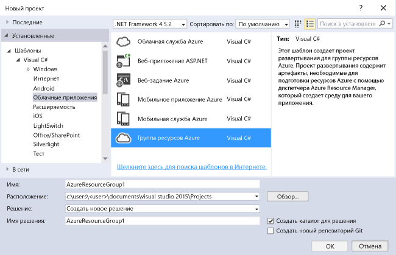
2. Выберите шаблон, который вы намерены развернуть в диспетчере ресурсов Azure. Обратите внимание, что доступны разные варианты, основывающиеся на типе проекта, который вы хотите развернуть. В этом примере следует выбрать шаблон **Веб-приложение+SQL**.
   
    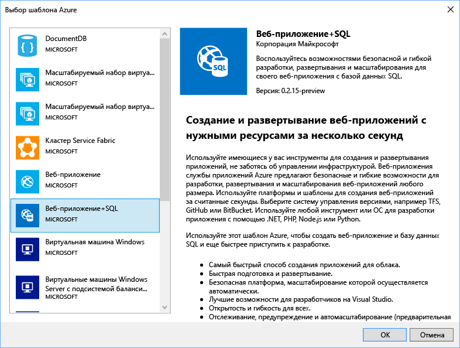
   
    Выбор шаблона — это просто отправная точка. Вы можете добавлять и удалять ресурсы для реализации своего сценария.
   
   > [!NOTE]
   > Visual Studio получает список доступных шаблонов в Интернете. Этот список может изменяться.
   > 
   > 
   
    Visual Studio создает проект развертывания группы ресурсов для веб-приложения и базы данных SQL.
3. Просмотрите узел в проекте развертывания, чтобы увидеть, какие ресурсы созданы.
   
    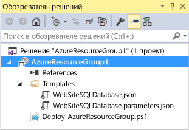
   
    Так как в этом примере мы выбрали шаблон "Веб-приложение + SQL", отобразятся указанные ниже файлы. 
   
   | Имя файла | ОПИСАНИЕ |
   | --- | --- |
   | Deploy-AzureResourceGroup.ps1 |Сценарий PowerShell, вызывающий команды PowerShell для развертывания в диспетчере ресурсов Azure.<br />**Примечание**. Visual Studio использует этот сценарий PowerShell для развертывания шаблона. Любые изменения, внесенные в этот сценарий, влияют на развертывание в Visual Studio, поэтому будьте внимательны. |
   | WebSiteSQLDatabase.json |Шаблон Resource Manager, определяющий инфраструктуру, которую требуется развернуть в Azure, и параметры, которые можно указать во время развертывания. Кроме того, он определяет зависимости между ресурсами, благодаря чему Resource Manager развертывает их в правильном порядке. |
   | WebSiteSQLDatabase.parameters.json |Файл параметров, который содержит значения, необходимые для шаблона. Это значения, передаваемые для настройки каждого развертывания. |
   
    Все проекты развертывания группы ресурсов содержат эти основные файлы. Другие проекты могут содержать дополнительные файлы для поддержки других функциональных возможностей.

## <a name="customize-the-resource-manager-template"></a>Настройка шаблона в диспетчере ресурсов
Вы можете настроить проект развертывания, изменив шаблоны JSON, описывающие ресурсы, которые требуется развернуть. JSON означает JavaScript Object Notation (нотация объектов JavaScript) и представляет собой удобный в использовании формат сериализованных данных. Файлы JSON используют схему, ссылка на которую располагается в верхней части каждого файла. Вы можете скачать эту схему и проанализировать ее для лучшего понимания. В схеме определены допустимые элементы, типы и форматы полей, возможные значения перечисляемых значений и т. д. Сведения об элементах шаблона Resource Manager см. в статье [Создание шаблонов диспетчера ресурсов Azure](resource-group-authoring-templates.md).

Для работы с шаблоном откройте файл **WebSiteSQLDatabase.json**.

Редактор Visual Studio предоставляет средства, которые помогают изменить шаблон Resource Manager. Окно **Структура JSON** упрощает просмотр элементов, определенных в шаблоне.

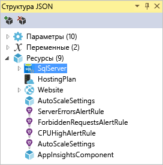

При выборе любого элемента в структуре отображается соответствующая часть шаблона и фрагмента JSON.

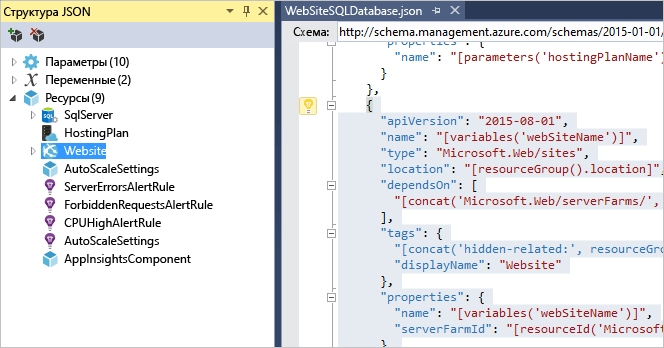

Можно добавить новый ресурс, нажав кнопку **Добавить ресурс** в верхней части окна структуры JSON. Или же можно щелкнуть правой кнопкой мыши элемент **Ресурсы** и выбрать команду **Добавить новый ресурс**.


Для этого примера выберите пункт **Учетная запись хранения** и присвойте этой учетной записи имя. Имя учетной записи хранения должно содержать только цифры и строчные буквы, а длина не должна превышать 11 символов.

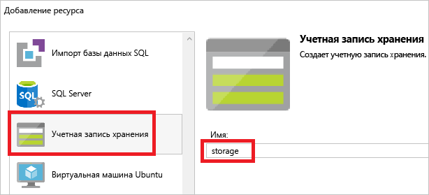

Обратите внимание, что добавляется не только ресурс: для типа учетной записи хранения также будет добавлен параметр, а для ее имени — переменная.

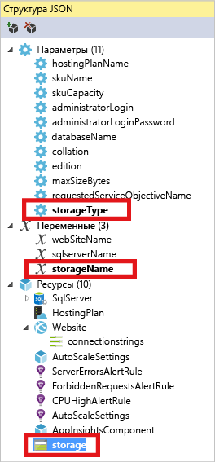

Для параметра **storageType** предварительно определяются допустимые типы и тип по умолчанию. Вы можете использовать эти значения или изменить их для своего сценария. Если требуется ограничить доступ к развертыванию учетной записи хранения **Premium_LRS** с помощью этого шаблона, то удалите его из списка допустимых типов. 

```json
"storageType": {
  "type": "string",
  "defaultValue": "Standard_LRS",
  "allowedValues": [
    "Standard_LRS",
    "Standard_ZRS",
    "Standard_GRS",
    "Standard_RAGRS"
  ]
}
```

Кроме того, Visual Studio предоставляет шаблон IntelliSense, который определяет свойства, доступные при редактировании шаблона. Например, чтобы изменить свойства плана службы приложений, перейдите к ресурсу **HostingPlan** и задайте значение для параметра **properties**. Обратите внимание, что в шаблоне IntelliSense отображаются доступные значения, а также приводится описание каждого значения.


Можно задать для параметра **numberOfWorkers** значение 1.

```json
"properties": {
  "name": "[parameters('hostingPlanName')]",
  "numberOfWorkers": 1
}
```

## <a name="deploy-the-resource-group-project-to-azure"></a>Развертывание проекта группы ресурсов в Azure
Теперь все готово для развертывания проекта. Проект группы ресурсов Azure развертывается в группе ресурсов Azure. Группа ресурсов — это логическое объединение ресурсов с общим жизненным циклом.

1. В контекстном меню узла проекта развертывания последовательно выберите пункты **Развернуть** > **Новое**.
   
    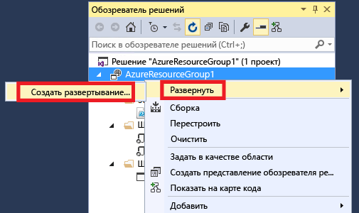
   
    Откроется диалоговое окно **Развертывание в группе ресурсов** .
   
    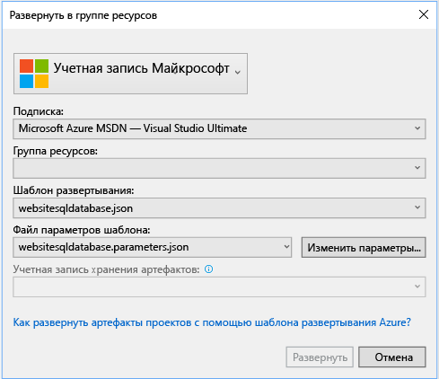
2. В раскрывающемся списке **Группа ресурсов** выберите существующую группу ресурсов или создайте новую. Чтобы создать группу ресурсов, откройте раскрывающийся список **Группа ресурсов** и выберите **Создать**.
   
    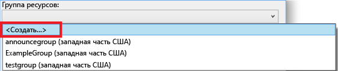
   
    Откроется диалоговое окно **Создание группы ресурсов** . Укажите имя и расположение группы, а затем нажмите кнопку **Создать** .
   
    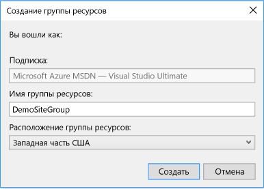
3. Измените параметры развертывания, нажав кнопку **Изменить параметры** .
   
    
4. Укажите значения пустых параметров и нажмите кнопку **Сохранить** . К пустым параметрам относится **hostingPlanName**, **administratorLogin**, **administratorLoginPassword** и **databaseName**.
   
    **hostingPlanName** задает имя [плана службы приложений](../app-service/azure-web-sites-web-hosting-plans-in-depth-overview.md) . 
   
    **administratorLogin** задает имя администратора SQL Server. Не используйте общие имена администраторов, такие как **sa** или **admin**. 
   
    Параметр **administratorLoginPassword** задает пароль администратора SQL Server. Мы не рекомендуем использовать параметр **Сохранить пароли как обычный текст в файле параметров** из соображений безопасности. Так как пароль не сохраняется как обычный текст, его потребуется ввести повторно во время развертывания. 
   
    **databaseName** задает имя создаваемой базы данных. 
   
    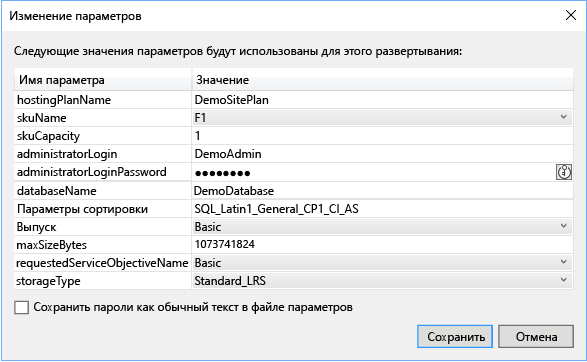
5. Щелкните кнопку **Развернуть** , чтобы развернуть проект в Azure. Консоль PowerShell откроется вне экземпляра Visual Studio. При появлении запроса в консоли PowerShell введите пароль администратора базы данных. **Консоль PowerShell может быть скрыта под другими элементами или свернута на панели задач.** Откройте ее и введите пароль.
   
   > [!NOTE]
   > В Visual Studio может отобразиться запрос на установку командлетов Azure PowerShell. Командлеты Azure PowerShell необходимы для успешного развертывания групп ресурсов. При появлении запроса установите их. Дополнительные сведения см. в статье [Установка и настройка Azure PowerShell](/powershell/azure/install-azurerm-ps).
   > 
   > 
6. Развертывание может занять несколько минут. Состояние развертывания отображается в окне **Выходные данные** . После успешного завершения развертывания появится примерно такое сообщение:
   
        ... 
        18:00:58 - Successfully deployed template 'websitesqldatabase.json' to resource group 'DemoSiteGroup'.
7. Откройте в браузере [портал Azure](https://portal.azure.com/) и войдите в свою учетную запись. Чтобы просмотреть группу ресурсов, щелкните **Группы ресурсов** и укажите группу ресурсов, в которой выполнено развертывание.
   
    
8. Отобразятся все развернутые ресурсы. Обратите внимание, что имя учетной записи хранения не совпадает с именем, указанным во время добавления этого ресурса. Учетная запись хранения должна быть уникальной. Шаблон автоматически добавляет строку символов в имя, указанное как уникальное. 
   
    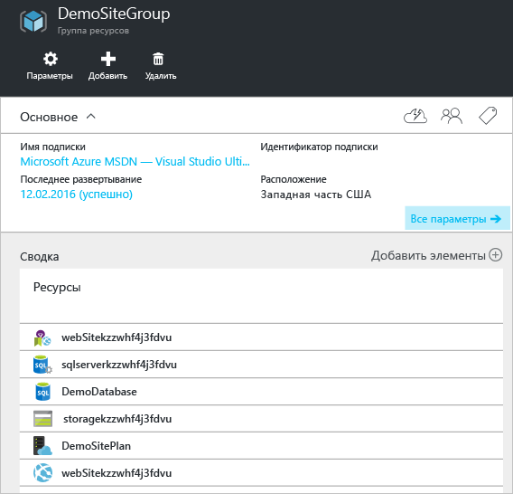
9. Если вы захотите повторно развернуть проект после изменения конфигурации, выберите существующую группу ресурсов в контекстном меню проекта группы ресурсов Azure. В контекстном меню выберите **Развернуть**, а затем выберите развернутую группу ресурсов.
   
    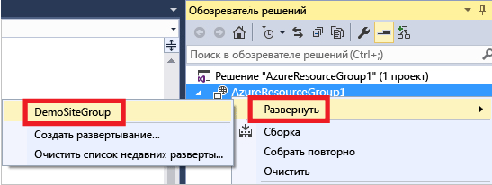

## <a name="deploy-code-with-your-infrastructure"></a>Развертывание кода с определенной инфраструктурой
На этом этапе инфраструктура для приложения уже развернута, а фактический код для проекта — еще нет. В этой статье показано, как развернуть веб-приложение и таблицы базы данных SQL во время развертывания. При развертывании виртуальной машины вместо веб-приложения на компьютере необходимо запустить определенный код. Процесс развертывания кода для веб-приложения практически не отличается от процесса настройки виртуальной машины.

1. Добавьте проект в свое решение Visual Studio. Щелкните правой кнопкой мыши решение и выберите команду **Добавить** > **Новый проект**.
   
    
2. Добавьте **веб-приложение ASP.NET**. 
   
    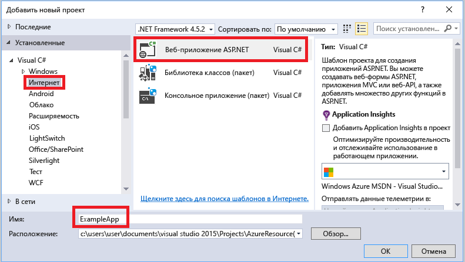
3. Выберите **MVC**.
   
    
4. После создания веб-приложения в Visual Studio оба проекта отобразятся в решении.
   
    
5. Теперь нужно убедиться, что проект группы ресурсов уведомлен о новом проекте. Вернитесь к проекту группы ресурсов (AzureResourceGroup1). Щелкните правой кнопкой мыши **Ссылки** и выберите **Добавить ссылку**.
   
    
6. Выберите созданный проект веб-приложения.
   
    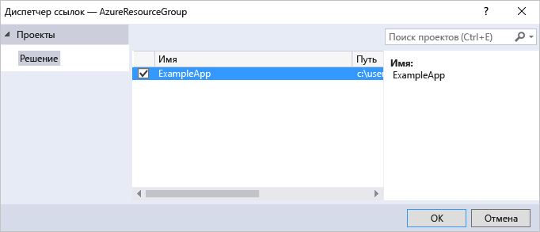
   
    Добавляя ссылку, вы связываете проект веб-приложения с проектом группы ресурсов и автоматически задаете три ключевых свойства. Свойства отображаются в окне **Свойства** для ссылки.
   
      
   
    Существуют следующие свойства.
   
   * Свойство **Дополнительные свойства** содержит данные о промежуточном расположении пакета веб-развертывания, который будет отправлен в службу хранилища Azure. Обратите внимание на папку (ExampleApp) и файл (package.zip). Эти значения необходимо знать, так как их нужно указывать при развертывании приложения. 
   * Свойство **Include File Path** (Включать путь к файлу) содержит путь к расположению, в котором будет создан пакет. Свойство **Include Targets** (Включать целевые объекты) содержит команду, которая будет выполнена при развертывании. 
   * Значение по умолчанию свойства **Build;Package** (Сборка;пакет) отвечает за сборку и создание пакета веб-развертывания (package.zip) при развертывании.  
     
     Профиль публикации не требуется, так как при развертывании необходимые для создания пакета данные будут получены из свойств.
7. Вернитесь к WebSiteSQLDatabase.json и добавьте ресурс в шаблон.
   
    
8. На этот раз выберите **Веб-развертывание для веб-приложений**. 
   
    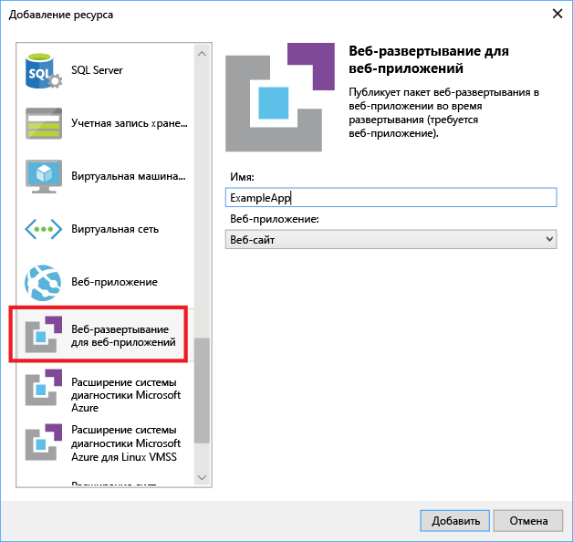
9. Повторно разверните проект группы ресурсов в группе ресурсов. В этом случае будут использоваться некоторые новые параметры. Вам не нужно задавать значения для параметров **_artifactsLocation** или **_artifactsLocationSasToken**. Visual Studio создает эти значения автоматически. Однако в путь к пакету развертывания необходимо добавить имя папки и файла (на следующем рисунке это **ExampleAppPackageFolder** и **ExampleAppPackageFileName**). Введите значения, которые вы ранее видели в свойствах ссылки (**ExampleApp** и **package.zip**).
   
    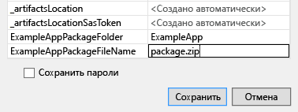
   
    Для параметра **Учетная запись хранения артефактов**выберите учетную запись, развернутую в этой группе ресурсов.
10. После завершения развертывания выберите веб-приложение на портале. Щелкните URL-адрес, чтобы перейти на сайт.
    
     
11. Приложение ASP.NET по умолчанию успешно развернуто.
    
     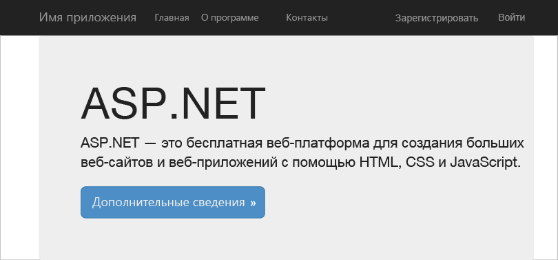

## <a name="add-an-operations-dashboard-to-your-deployment"></a>Добавление панели мониторинга операций к развертыванию
Теперь, когда мы создали решение, осталось привести его в рабочее состояние. Вы можете использовать не только ресурсы, доступные через интерфейс Visual Studio. Мы можем использовать общие панели мониторинга, которые определены в качестве ресурсов в JSON. Это можно сделать, изменив наш шаблон и добавив настраиваемый ресурс. 

1. Откройте файл WebsiteSqlDeploy.json и добавьте следующий блок кода Json после ресурса учетной записи хранилища, но перед закрывающей скобкой ] раздела с ресурсами.

```json
    ,{
      "properties": {
        "lenses": {
          "0": {
            "order": 0,
            "parts": {
              "0": {
                "position": {
                  "x": 0,
                  "y": 0,
                  "colSpan": 4,
                  "rowSpan": 6
                },
                "metadata": {
                  "inputs": [
                    {
                      "name": "resourceGroup",
                      "isOptional": true
                    },
                    {
                      "name": "id",
                      "value": "[resourceGroup().id]",
                      "isOptional": true
                    }
                  ],
                  "type": "Extension/HubsExtension/PartType/ResourceGroupMapPinnedPart"
                }
              },
              "1": {
                "position": {
                  "x": 4,
                  "y": 0,
                  "rowSpan": 3,
                  "colSpan": 4
                },
                "metadata": {
                  "inputs": [],
                  "type": "Extension[azure]/HubsExtension/PartType/MarkdownPart",
                  "settings": {
                    "content": {
                      "settings": {
                        "content": "__Customizations__\n\nUse this dashboard to create and share the operational views of services critical to the application performing. To customize simply pin components to the dashboard and then publish when you're done. Others will see your changes when you publish and share the dashboard.\n\nYou can customize this text too. It supports plain text, __Markdown__, and even limited HTML like images  and <a href='https://azure.microsoft.com' target='_blank'>links</a> that open in a new tab.\n",
                        "title": "Operations",
                        "subtitle": "[resourceGroup().name]"
                      }
                    }
                  }
                }
              }
            }
          }
        },
        "metadata": {
          "model": {
            "timeRange": {
              "value": {
                "relative": {
                  "duration": 24,
                  "timeUnit": 1
                }
              },
              "type": "MsPortalFx.Composition.Configuration.ValueTypes.TimeRange"
            }
          }
        }
      },
      "apiVersion": "2015-08-01-preview",
      "name": "[concat('ARM-',resourceGroup().name)]",
      "type": "Microsoft.Portal/dashboards",
      "location": "[resourceGroup().location]",
      "tags": {
        "hidden-title": "[concat('OPS-',resourceGroup().name)]"
      }
    }
}
```

2. Повторно разверните группу ресурсов. На панели мониторинга на портале Azure вы увидите общую панель мониторинга, добавленную в список вариантов. 

    


   > [!NOTE] 
   > Доступом к панели мониторинга можно управлять с помощью групп RBAC. Настройки можно опубликовать в ресурсе после его развертывания. Обратите внимание. Если вы повторно развернете группу ресурсов, она будет сброшена до значений по умолчанию в шаблоне. Учитывайте это, добавляя в шаблон настройки. См. дополнительные сведения о [создании панелей мониторинга Azure программными средствами](../azure-portal/azure-portal-dashboards-create-programmatically.md).


    
    
    
## <a name="next-steps"></a>Дополнительная информация
* Дополнительные сведения об управлении ресурсами на портале см. в статье [Управление ресурсами Azure через портал](resource-group-portal.md).
* Дополнительные сведения о шаблонах см. в статье [Создание шаблонов Azure Resource Manager](resource-group-authoring-templates.md).

