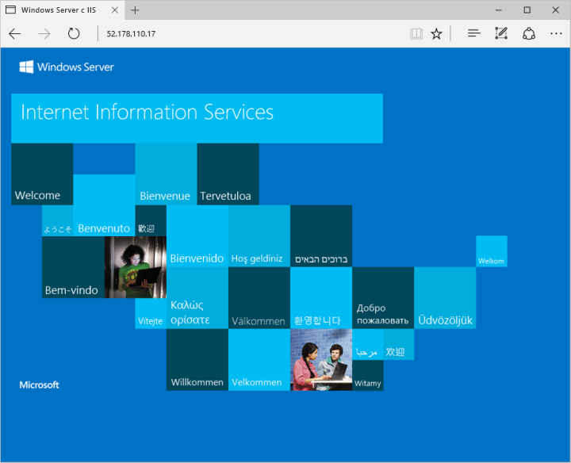

# <a name="quickstart-create-a-windows-server-virtual-machine-by-using-powershell-in-azure-stack"></a>Краткое руководство. Создание виртуальной машины Windows Server с помощью PowerShell в Azure Stack

*Область применения: интегрированные системы Azure Stack и Пакет средств разработки Azure Stack*

Вы можете создать виртуальную машину Windows Server 2016 с помощью PowerShell в Azure Stack. Выполните описанные в этой статье действия, чтобы создать и использовать виртуальную машину. В этой статье описаны действия, которые позволят вам:

* подключиться к виртуальной машине через удаленный клиент;
* установить веб-сервер IIS и открыть его стандартную домашнюю страницу;
* очистить использованные ресурсы.

>[!NOTE]
 Приведенные в этой статье инструкции можно выполнить из Пакета средств разработки Azure Stack или внешнего клиента на базе Windows (при подключении через VPN).

## <a name="prerequisites"></a>предварительным требованиям

* Убедитесь, что оператор Azure Stack добавил образ Windows Server 2016 в Azure Stack Marketplace.

* Для создания ресурсов и управления ими в Azure Stack требуется определенная версия Azure PowerShell. Если вы еще не настроили PowerShell для Azure Stack, выполните действия по [установке](azure-stack-powershell-install.md) и [настройке](azure-stack-powershell-configure-user.md) PowerShell.

## <a name="create-a-resource-group"></a>Создание группы ресурсов

Группа ресурсов — это логический контейнер, в котором выполняется развертывание и администрирование ресурсов Azure Stack. Из пакета средств разработки или интегрированной системы Azure Stack выполните следующий блок кода, чтобы создать группу ресурсов. В этом документе мы присвоили значения всем переменным. Вы можете использовать эти значения или присвоить другие.

```powershell
# Create variables to store the location and resource group names.
$location = "local"
$ResourceGroupName = "myResourceGroup"

New-AzureRmResourceGroup `
  -Name $ResourceGroupName `
  -Location $location
```

## <a name="create-storage-resources"></a>Создание ресурсов хранилища

Создайте учетную запись хранения и контейнер хранилища для хранения образа Windows Server 2016.

```powershell
# Create variables to store the storage account name and the storage account SKU information
$StorageAccountName = "mystorageaccount"
$SkuName = "Standard_LRS"

# Create a new storage account
$StorageAccount = New-AzureRMStorageAccount `
  -Location $location `
  -ResourceGroupName $ResourceGroupName `
  -Type $SkuName `
  -Name $StorageAccountName

Set-AzureRmCurrentStorageAccount `
  -StorageAccountName $storageAccountName `
  -ResourceGroupName $resourceGroupName

# Create a storage container to store the virtual machine image
$containerName = 'osdisks'
$container = New-AzureStorageContainer `
  -Name $containerName `
  -Permission Blob
```

## <a name="create-networking-resources"></a>Создание сетевых ресурсов

Создайте виртуальную сеть, подсеть и общедоступный IP-адрес. С помощью этих ресурсов вы сможете установить сетевое подключение к виртуальной машине.

```powershell
# Create a subnet configuration
$subnetConfig = New-AzureRmVirtualNetworkSubnetConfig `
  -Name mySubnet `
  -AddressPrefix 192.168.1.0/24

# Create a virtual network
$vnet = New-AzureRmVirtualNetwork `
  -ResourceGroupName $ResourceGroupName `
  -Location $location `
  -Name MyVnet `
  -AddressPrefix 192.168.0.0/16 `
  -Subnet $subnetConfig

# Create a public IP address and specify a DNS name
$pip = New-AzureRmPublicIpAddress `
  -ResourceGroupName $ResourceGroupName `
  -Location $location `
  -AllocationMethod Static `
  -IdleTimeoutInMinutes 4 `
  -Name "mypublicdns$(Get-Random)"
```

### <a name="create-a-network-security-group-and-a-network-security-group-rule"></a>Создайте группу безопасности сети и правило группы безопасности сети.

Группа безопасности сети обеспечивает защиту виртуальной машины с помощью правил для входящего и исходящего трафика. Давайте создадим правило входящего трафика для порта 3389, чтобы разрешить входящие подключения к удаленному рабочему столу, и правило входящего трафика для порта 80, чтобы разрешить входящий веб-трафик.

```powershell
# Create an inbound network security group rule for port 3389
$nsgRuleRDP = New-AzureRmNetworkSecurityRuleConfig `
  -Name myNetworkSecurityGroupRuleRDP `
  -Protocol Tcp `
  -Direction Inbound `
  -Priority 1000 `
  -SourceAddressPrefix * `
  -SourcePortRange * `
  -DestinationAddressPrefix * `
  -DestinationPortRange 3389 `
  -Access Allow

# Create an inbound network security group rule for port 80
$nsgRuleWeb = New-AzureRmNetworkSecurityRuleConfig `
  -Name myNetworkSecurityGroupRuleWWW `
  -Protocol Tcp `
  -Direction Inbound `
  -Priority 1001 `
  -SourceAddressPrefix * `
  -SourcePortRange * `
  -DestinationAddressPrefix * `
  -DestinationPortRange 80 `
  -Access Allow

# Create a network security group
$nsg = New-AzureRmNetworkSecurityGroup `
  -ResourceGroupName $ResourceGroupName `
  -Location $location `
  -Name myNetworkSecurityGroup `
  -SecurityRules $nsgRuleRDP,$nsgRuleWeb
```

### <a name="create-a-network-card-for-the-virtual-machine"></a>Создание сетевой карты для виртуальной машины

Сетевая карта подключает виртуальную машину к подсети, группе безопасности сети и общедоступному IP-адресу.

```powershell
# Create a virtual network card and associate it with public IP address and NSG
$nic = New-AzureRmNetworkInterface `
  -Name myNic `
  -ResourceGroupName $ResourceGroupName `
  -Location $location `
  -SubnetId $vnet.Subnets[0].Id `
  -PublicIpAddressId $pip.Id `
  -NetworkSecurityGroupId $nsg.Id
```

## <a name="create-a-virtual-machine"></a>Создание виртуальной машины

Создайте конфигурацию виртуальной машины. Эта конфигурация содержит параметры, которые используются при развертывании виртуальной машины, например образ виртуальной машины, ее размер и учетные данные.

```powershell
# Define a credential object to store the username and password for the virtual machine
$UserName='demouser'
$Password='Password@123'| ConvertTo-SecureString -Force -AsPlainText
$Credential=New-Object PSCredential($UserName,$Password)

# Create the virtual machine configuration object
$VmName = "VirtualMachinelatest"
$VmSize = "Standard_A1"
$VirtualMachine = New-AzureRmVMConfig `
  -VMName $VmName `
  -VMSize $VmSize

$VirtualMachine = Set-AzureRmVMOperatingSystem `
  -VM $VirtualMachine `
  -Windows `
  -ComputerName "MainComputer" `
  -Credential $Credential

$VirtualMachine = Set-AzureRmVMSourceImage `
  -VM $VirtualMachine `
  -PublisherName "MicrosoftWindowsServer" `
  -Offer "WindowsServer" `
  -Skus "2016-Datacenter" `
  -Version "latest"

$osDiskName = "OsDisk"
$osDiskUri = '{0}vhds/{1}-{2}.vhd' -f `
  $StorageAccount.PrimaryEndpoints.Blob.ToString(),`
  $vmName.ToLower(), `
  $osDiskName

# Sets the operating system disk properties on a virtual machine.
$VirtualMachine = Set-AzureRmVMOSDisk `
  -VM $VirtualMachine `
  -Name $osDiskName `
  -VhdUri $OsDiskUri `
  -CreateOption FromImage | `
  Add-AzureRmVMNetworkInterface -Id $nic.Id

# Create the virtual machine.
New-AzureRmVM `
  -ResourceGroupName $ResourceGroupName `
  -Location $location `
  -VM $VirtualMachine
```

## <a name="connect-to-the-virtual-machine"></a>Подключение к виртуальной машине

Для удаленного доступа к виртуальной машине, созданной на предыдущем шаге, потребуется ее общедоступный IP-адрес. Выполните следующую команду, чтобы получить общедоступный IP-адрес виртуальной машины:

```powershell
Get-AzureRmPublicIpAddress `
  -ResourceGroupName $ResourceGroupName | Select IpAddress
```

Используйте следующую команду для создания сеанса удаленного рабочего стола с виртуальной машиной. Замените IP-адрес значением publicIPAddress виртуальной машины. При появлении запроса введите имя пользователя и пароль, которые использовались при создании виртуальной машины.

```powershell
mstsc /v <publicIpAddress>
```

## <a name="install-iis-via-powershell"></a>Установка IIS с помощью PowerShell

После входа на виртуальную машину Azure вы можете установить IIS и включить локальное правило брандмауэра, разрешающее веб-трафик, с помощью одной строки кода PowerShell. Откройте командную строку PowerShell и выполните следующую команду:

```powershell
Install-WindowsFeature -name Web-Server -IncludeManagementTools
```

## <a name="view-the-iis-welcome-page"></a>Просмотр страницы приветствия IIS

Установив IIS и открыв порт 80 на виртуальной машине, вы сможете просмотреть страницу приветствия IIS по умолчанию в любом браузере. Чтобы перейти на страницу по умолчанию, используйте значение *publicIpAddress*, записанное в предыдущем разделе.



## <a name="delete-the-virtual-machine"></a>Удаление виртуальной машины

Если группа ресурсов, содержащая виртуальную машину и связанные с ней ресурсы, больше не нужна, выполните следующую команду для ее удаления:

```powershell
Remove-AzureRmResourceGroup `
  -Name $ResourceGroupName
```

## <a name="next-steps"></a>Дополнительная информация

В этом кратком руководстве вы развернули простую виртуальную машину Windows. Дополнительные сведения о виртуальных машинах Azure Stack см. в [рекомендациях по работе с виртуальными машинами в Azure Stack](azure-stack-vm-considerations.md).
