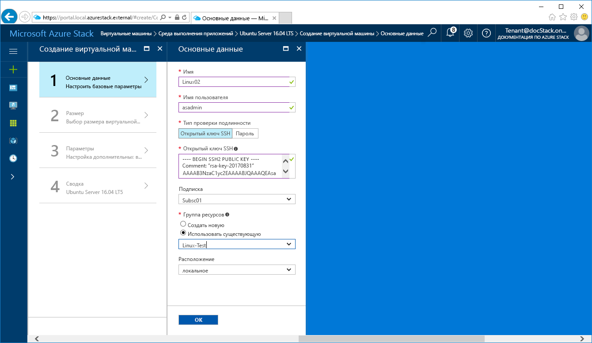
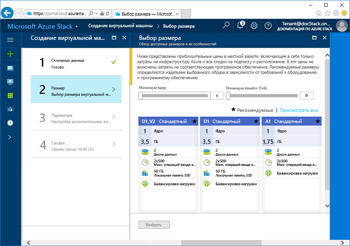
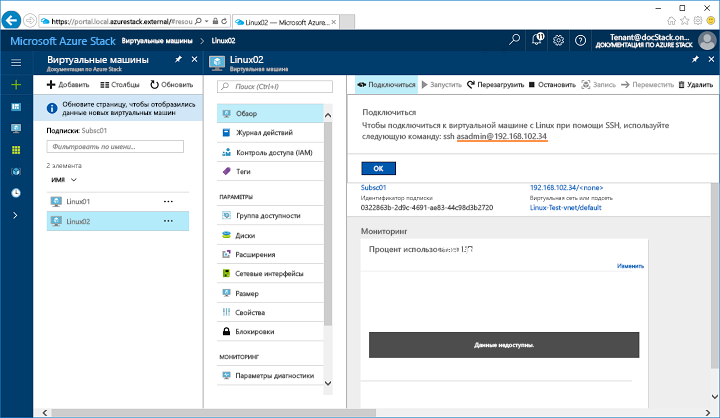

# <a name="quickstart-create-a-linux-server-virtual-machine-with-the-azure-stack-portal"></a>Краткое руководство. Создание виртуальной машины для сервера Linux с помощью портала Azure Stack

*Область применения: интегрированные системы Azure Stack и Пакет средств разработки Azure Stack*

Вы можете создать виртуальную машину Ubuntu Server 16.04 LTS с помощью портала Azure Stack. Чтобы создать и использовать виртуальную машину, выполните описанные в этой статье действия. В этой статье приведены инструкции, которые помогут вам:

* подключиться к виртуальной машине через удаленный клиент;
* установить веб-сервер NGINX;
* очистить использованные ресурсы.

## <a name="prerequisites"></a>предварительным требованиям

* **Образ Linux в Azure Stack Marketplace**.

   По умолчанию Azure Stack Marketplace не содержит образ Linux. Прежде чем создавать виртуальную машину для сервера Linux, убедитесь, что ваш оператор Azure Stack предоставляет нужный образ **Ubuntu Server 16.04 LTS**. Оператор может добавить его, выполнив инструкции из статьи [Download marketplace items from Azure to Azure Stack](../azure-stack-download-azure-marketplace-item.md) (Скачивание элементов Marketplace из Azure в Azure Stack).

* **Доступ к клиенту SSH**.

   Если вы используете Пакет средств разработки Azure Stack, клиент SSH может быть недоступен. Если вам нужен клиент, используйте любой из нескольких пакетов, которые включают клиент SSH. Например, в состав PuTTY входят клиент SSH и генератор ключей SSH (puttygen.exe). Дополнительные сведения о вариантах пакетов см. в статье об [использовании ключей SSH с Windows в Azure](https://docs.microsoft.com/azure/virtual-machines/linux/ssh-from-windows#windows-packages-and-ssh-clients).

   В этом кратком руководстве с помощью PuTTY создаются ключи SSH и устанавливается подключение к виртуальной машине для сервера Linux. Скачайте и установите PuTTY. Для этого перейдите по адресу [http://www.putty.org/](http://www.putty.org).

## <a name="create-an-ssh-key-pair"></a>Создание пары ключей SSH

Чтобы выполнить все инструкции, приведенные в этой статье, вам понадобится пара ключей SSH. Если у вас уже есть пара ключей SSH, вы можете пропустить этот шаг.

1. Перейдите в папку установки PuTTY (по умолчанию это ```C:\Program Files\PuTTY```) и запустите команду ```puttygen.exe```.
2. В окне генератора ключей PuTTY выберите для параметра **Type of key to generate** (Тип создаваемого ключа) значение **RSA**, а для **Number of bits in a generated key** (Количество битов в создаваемом ключе) — значение **2048**. Когда все будет готово, щелкните **Generate** (Создать).

   

3. Чтобы создать ключ, произвольно перемещайте курсор мыши в окне генератора ключей PuTTY.
4. Когда ключ будет создан, щелкните **Save public key** (Сохранить открытый ключ) и **Save private key** (Сохранить закрытый ключ), чтобы сохранить файлы ключей.

   

## <a name="sign-in-to-the-azure-stack-portal"></a>Вход на портал Azure Stack

Войдите на портал Azure Stack. Адрес портала Azure Stack зависит от того, к какому продукту Azure Stack вы подключаетесь:

* Если вам нужен Пакет средств разработки Azure Stack (ASDK), перейдите по адресу https://portal.local.azurestack.external.
* При работе с интегрированной системой Azure Stack используйте URL-адрес, предоставленный оператором Azure Stack.

## <a name="create-the-virtual-machine"></a>Создание виртуальной машины

1. Щелкните **Создать ресурс** в верхнем левом углу окна портала Azure Stack.

2. Выберите **Вычисления**, а затем — **Сервер Ubuntu 16.04 LTS**.
3. Нажмите кнопку **Создать**.

4. Введите сведения о виртуальной машине. Для параметра **Тип проверки подлинности** выберите значение **Открытый ключ SSH**. Вставьте сохраненный ранее открытый ключ SSH и щелкните **ОК**.

   >[!NOTE]
 Обязательно удалите из ключа все начальные и (или) конечные пробелы.

   

5. Выберите размер **D1_V2** для виртуальной машины.

   

6. На странице **параметров** оставьте значения по умолчанию и нажмите кнопку **OK**.

7. На странице **сводки** нажмите кнопку **OК**, чтобы начать развертывание виртуальной машины.

## <a name="connect-to-the-virtual-machine"></a>Подключение к виртуальной машине

1. На странице виртуальной машины щелкните **Подключить**. Откроется строка подключения по протоколу SSH, которая нужна для подключения к виртуальной машине.

   

2. Откройте PuTTY.
3. На экране **PuTTY Configuration** (Конфигурация PuTTY) есть окно **Category** (Категория), в котором можно прокручивать элементы вверх или вниз. Прокрутите вниз до элемента **SSH**, разверните **SSH** и щелкните **Auth** (Аутентификация). Щелкните **Browse** (Обзор) и выберите сохраненный файл закрытого ключа.

   

4. Прокрутите окно **Category** (Категория) вверх и выберите элемент **Session** (Сеанс).
5. В поле **Host Name (or IP address)** (Имя узла или IP-адрес) вставьте строку подключения, предоставленную на портале Azure. В нашем примере строка имеет вид ```asadmin@192.168.102.34```.

   

6. Щелкните **Open** (Открыть), чтобы открыть сеанс подключения к виртуальной машине.

   

## <a name="install-the-nginx-web-server"></a>Установка веб-сервера NGINX

Чтобы обновить на виртуальной машине источники пакетов и установить последнюю версию пакета NGINX, используйте приведенные ниже команды bash.

```bash
#!/bin/bash

# update package source
sudo apt-get -y update

# install NGINX
sudo apt-get -y install nginx
```

Когда установка NGINX завершится, закройте сеанс SSH и откройте страницу обзора виртуальной машины на портале Azure Stack.

## <a name="open-port-80-for-web-traffic"></a>Открытие порта 80 для веб-трафика

Группа безопасности сети (NSG) защищает входящий и исходящий трафик. При создании виртуальной машины на портале Azure создается правило, которое разрешает входящий трафик для SSH-подключений через порт 22. Так как на этой виртуальной машине размещается веб-сервер, нужно еще и правило NSG, которое разрешает поступление веб-трафика в порт 80.

1. На странице **общей информации** о виртуальной машине щелкните имя **группы ресурсов**.
2. Выберите **группу безопасности сети** для виртуальной машины. NSG можно определить с помощью столбца **Тип**.
3. В меню слева в разделе **Параметры** щелкните **Правила безопасности для входящего трафика**.
4. Щелкните **Добавить**.
5. В поле **Имя** введите **http**. Убедитесь, что для параметра **Диапазон портов** задано значение 80, а для параметра **Действие** — значение **Разрешить**.
6. Щелкните **ОК**

## <a name="view-the-nginx-welcome-page"></a>Просмотр страницы приветствия nginx

Теперь на виртуальной машине установлен NGINX и открыт порт 80, и вы можете открыть веб-сервер через общедоступный IP-адрес этой виртуальной машины (общедоступный IP-адрес отображается на странице обзора виртуальной машины).

Откройте окно браузера и перейдите по адресу ```http://<public IP address>```.


## <a name="clean-up-resources"></a>Очистка ресурсов

Очистите ресурсы, которые вам больше не нужны. Чтобы удалить виртуальную машину и все ее ресурсы, выберите группу ресурсов на странице виртуальной машины и щелкните **Удалить**.

## <a name="next-steps"></a>Дополнительная информация

С помощью этого краткого руководства вы развернули виртуальную машину для базового сервера Linux с веб-сервером. Дополнительные сведения о виртуальных машинах Azure Stack см. в [рекомендациях по работе с виртуальными машинами в Azure Stack](azure-stack-vm-considerations.md).
