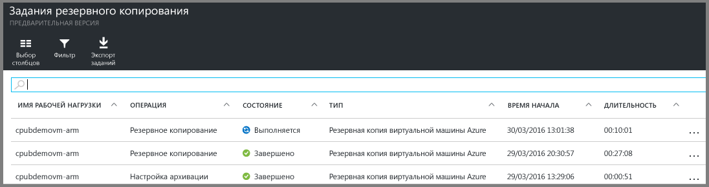

# Резервное копирование виртуальных машин Azure в хранилище служб восстановления
> [!div class="op_single_selector"]
> * [Резервное копирование виртуальных машин в хранилище служб восстановления](backup-azure-arm-vms.md)
> * [Резервное копирование виртуальных машин в хранилище архивации](backup-azure-vms.md)
> 
> 

В этой статье описывается резервное копирование виртуальных машин Azure (развернутых с помощью классической модели и модели Resource Manager) в хранилище служб восстановления. В ходе резервного копирования большую часть времени занимает подготовка. Прежде чем начинать резервное копирование или защиту виртуальной машины, необходимо выполнить [предварительные требования](backup-azure-arm-vms-prepare.md), чтобы подготовить среду. После выполнения необходимых условий инициируйте операцию архивации для создания моментальных снимков виртуальной машины.

> [!NOTE]
> В Azure предусмотрены две модели развертывания, позволяющие создавать ресурсы и работать с ними: [модель Resource Manager и классическая модель](../resource-manager-deployment-model.md). Вы можете защитить виртуальные машины, развернутые с помощью классической модели и модели Resource Manager, используя хранилища служб восстановления. Дополнительные сведения о работе с виртуальными машинами, развернутыми с использованием классической модели, см. в статье [Резервное копирование виртуальных машин Azure](backup-azure-vms.md).
> 
> 

Дополнительные сведения см. в статьях [Планирование инфраструктуры резервного копирования виртуальных машин в Azure](backup-azure-vms-introduction.md) и [Виртуальные машины Azure – документация](https://azure.microsoft.com/documentation/services/virtual-machines/).

## Активация задания архивации
Политика архивации, связанная с хранилищем служб восстановления, определяет частоту и время выполнения операции архивации. По умолчанию начальным резервным копированием является первое запланированное резервное копирование. Пока начальная архивация не будет выполнена, для последнего задания архивации в колонке **Задания архивации** будет отображаться состояние **Предупреждение (ожидание начальной архивации)**.

Если плановая начальная архивация должна начаться не скоро, мы советуем выполнить **моментальную архивацию**. Чтобы приступить к архивации, перейдите на панель мониторинга хранилища. Эта процедура требуется, чтобы запустить начальную архивацию после выполнения предварительных требований. Если начальная архивация уже выполнена, эта процедура будет недоступна. Связанная политика архивации определяет следующее задание архивации.

Чтобы выполнить начальную архивацию, сделайте следующее:

1. На панели мониторинга хранилища на плитке **Резервное копирование** щелкните **Виртуальные машины Azure**.   
   
    Откроется колонка **Архивируемые элементы**.
2. В колонке **Архивируемые элементы** щелкните правой кнопкой мыши хранилище, которое необходимо архивировать, и выберите пункт **Выполнить архивацию**.
   
    
   
    Будет запущено задание архивации.  
   
    
3. Чтобы просмотреть, закончилась ли начальная архивация, на панели мониторинга хранилища под элементом **Задания архивации** щелкните **Виртуальные машины Azure**.
   
    
   
    После этого откроется колонка "Задания резервного копирования".
4. В колонке **Задания архивации** можно просмотреть состояние всех заданий.
   
    
   
   > [!NOTE]
   > В ходе резервного копирования служба архивации Azure дает команду расширению для резервного копирования на каждой виртуальной машине сохранять на диск все данные операций записи и делать согласованный моментальный снимок.
   > 
   > 
   
    После завершения задания архивации состояние изменится на *Завершено*.

## Устранение ошибок
Если во время архивации виртуальной машины возникнут проблемы, см. [статью об устранении неполадок виртуальной машины](backup-azure-vms-troubleshoot.md).

## Дальнейшие действия
Теперь, когда виртуальная машина защищена, ознакомьтесь со следующими статьями для получения дополнительных сведений о задачах управления и процессе восстановления виртуальных машин.

* [Мониторинг виртуальных машин и управление ими](backup-azure-manage-vms.md)
* [Восстановление виртуальных машин](backup-azure-arm-restore-vms.md)

<!---HONumber=AcomDC_0803_2016-->