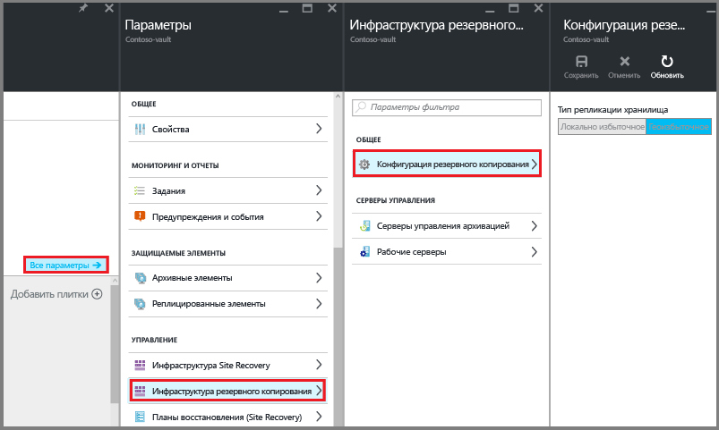

# <a name="preparing-to-back-up-workloads-using-azure-backup-server"></a>Подготовка к резервному копированию рабочих нагрузок с использованием Azure Backup Server
> [!div class="op_single_selector"]
> * [Azure Backup Server](backup-azure-microsoft-azure-backup.md)
> * [SCDPM](backup-azure-dpm-introduction.md)
>
>

В этой статье рассматривается подготовка среды к резервному копированию рабочих нагрузок с помощью Azure Backup Server. Используя Azure Backup Server, вы можете создавать резервные копии рабочих нагрузок приложения, таких как виртуальные машины Hyper-V, Microsoft SQL Server, SharePoint Server, Microsoft Exchange и клиенты Windows, с помощью единой консоли.

> [!NOTE]
> Azure Backup Server позволяет защитить виртуальные машины VMware и предоставляет возможности для повышения безопасности. Установите этот продукт, как описано в следующих разделах, затем нужно установить обновление 1 и последнюю версию агента службы архивации Azure. Дополнительные сведения о резервном копировании серверов VMware с помощью Azure Backup Server см. в статье [Резервное копирование сервера VMware с помощью сервера резервного копирования Azure](backup-azure-backup-server-vmware.md). Чтобы узнать о возможностях обеспечения безопасности, обратитесь к [документации по функциям безопасности службы архивации Azure](backup-azure-security-feature.md).
>
>

Можно также настроить защиту рабочих нагрузок инфраструктуры как услуги (IaaS), например виртуальных машин в Azure.

> [!NOTE]
> В Azure предусмотрены две модели развертывания, позволяющие создавать ресурсы и работать с ними: [модель Resource Manager и классическая модель](../azure-resource-manager/resource-manager-deployment-model.md). Данная статья содержит сведения о восстановлении виртуальных машин, развернутых с использованием модели Resource Manager.
>
>

Azure Backup Server наследует большую часть функциональных возможностей резервного копирования рабочих нагрузок Data Protection Manager (DPM). В этой статье содержатся ссылки на документацию DPM, где рассматриваются некоторые общие функциональные возможности. Azure Backup Server и DPM имеют практически одинаковые функциональные возможности. Azure Backup Server не поддерживает резервное копирование на ленту, а также интеграцию с System Center.

## <a name="choose-an-installation-platform"></a>Выбор платформы для установки
Для начала работы с Azure Backup Server нужно настроить Windows Server. Он может находиться как в Azure, так в локальной среде.

### <a name="using-a-server-in-azure"></a>Использование сервера в Azure
При выборе сервера для запуска Azure Backup Server рекомендуется начать с образа коллекции Windows Server 2012 R2 Datacenter или Windows Server 2016 Datacenter. Статья [Создание первой виртуальной машины Windows на портале Azure](../virtual-machines/virtual-machines-windows-hero-tutorial.md?toc=%2fazure%2fvirtual-machines%2fwindows%2ftoc.json) содержит руководство по началу работы с рекомендуемой виртуальной машиной в Azure. Оно подходит даже тем, кто только начинает знакомиться с Azure. Рекомендуемые минимальные требования для виртуальной машины сервера: Standard A2 с двумя ядрами и 3,5 ГБ ОЗУ.

Защита рабочих нагрузок с помощью Azure Backup Server имеет свои особенности. Эти особенности рассматриваются в статье [Установка DPM в виде виртуальной машины Azure](https://technet.microsoft.com/library/jj852163.aspx). Прежде чем развертывать виртуальную машину, полностью ознакомьтесь с этой статьей.

### <a name="using-an-on-premises-server"></a>Использование локального сервера
Если вы не хотите запускать базовый сервер в Azure, можно запустить сервер на виртуальной машине Hyper-V, виртуальной машине VMware или на физическом узле. Рекомендуемые минимальные требования к оборудованию сервера: два ядра и 4 ГБ ОЗУ. В следующей таблице перечислены поддерживаемые операционные системы.

| Операционная система | платформа | SKU |
|:--- | --- |:--- |
| Windows Server 2016 и последние пакеты обновления |64-разрядная |Standard, Datacenter, Essentials (с версии MABS v2) |
| Windows Server 2012 R2 и последние пакеты обновления |64-разрядная |Standard, Datacenter, Foundation |
| Windows Server 2012 и последние пакеты обновления |64-разрядная |Datacenter, Foundation, Standard |
| Windows Storage Server 2012 R2 и последние пакеты обновления |64-разрядная |Standard, Workgroup |
| Windows Storage Server 2012 и последние пакеты обновления |64-разрядная |Standard, Workgroup |

С помощью дедупликации Windows Server можно выполнить дедупликацию хранилища DPM. См. дополнительные сведения об использовании [DPM и дедупликации](https://technet.microsoft.com/library/dn891438.aspx) при развертывании на виртуальных машинах Hyper-V.

> [!NOTE]
> Компонент Azure Backup Server предназначен для запуска на выделенном специализированном сервере. Azure Backup Server не может быть установлен на:
> - компьютере, выполняющем роль контроллера домена;
> - компьютере, на котором установлена роль сервера приложений;
> - компьютере, который является сервером управления System Center Operations Manager;
> - компьютере, на котором выполняется Exchange Server;
> - компьютере, который является узлом кластера.

Всегда присоединяйте Azure Backup Server к домену. Если вы планируете перемещать сервер на другой домен, рекомендуется присоединить сервер к новому домену перед установкой Azure Backup Server. Перемещение имеющегося компьютера с Azure Backup Server в новый домен после развертывания *не поддерживается*.

## <a name="recovery-services-vault"></a>Хранилище служб восстановления
Чтобы отправить данные резервного копирования в Azure или сохранить их локально, требуется подключить программное обеспечение к Azure. Проще говоря, компьютер Azure Backup Server необходимо зарегистрировать в хранилище служб восстановления.

Чтобы создать хранилище служб восстановления, сделайте следующее:

1. Войдите на [портале Azure](https://portal.azure.com/).
2. В главном меню щелкните **Обзор**, а затем в списке ресурсов введите **Службы восстановления**. Как только вы начнете вводить символы, список отфильтруется соответствующим образом. Щелкните **Хранилище служб восстановления**.

     <br/>

    После этого отобразится список хранилищ служб восстановления.
3. В меню **Хранилища служб восстановления** щелкните **Добавить**.

    

    Откроется колонка хранилища служб восстановления, в которой нужно указать **имя**, **подписку**, **группу ресурсов** и **расположение**.

    
4. В поле **Имя**введите понятное имя хранилища. Имя должно быть уникальным в пределах подписки Azure. Введите имя длиной от 2 до 50 знаков. Имя должно начинаться с буквы, оно может содержать только буквы, цифры и дефисы.
5. Щелкните **Подписка** , чтобы просмотреть список доступных подписок. Если неизвестно, какую подписку нужно использовать, оставьте подписку по умолчанию (или предлагаемую подписку). Вариантов будет несколько только в том случае, если учетная запись вашей организации связана с несколькими подписками Azure.
6. Щелкните **Группа ресурсов**, чтобы просмотреть список доступных групп ресурсов, или создайте группу ресурсов, щелкнув **Создать**. Дополнительные сведения о группах ресурсов см. в [обзоре Azure Resource Manager](../azure-resource-manager/resource-group-overview.md).
7. В поле **Расположение** выберите географический регион, в котором будет находиться хранилище.
8. Нажмите кнопку **Создать**. Для создания хранилища служб восстановления может потребоваться некоторое время. Следите за уведомлениями о состоянии на портале в верхней правой области.
   Сразу после создания хранилище откроется на портале.

### <a name="set-storage-replication"></a>Настройка репликации хранилища
При настройке репликации хранилища можно выбирать между геоизбыточным хранилищем и локально избыточным хранилищем. По умолчанию это геоизбыточное хранилище. Если данное хранилище является основным, оставьте установленный параметр, соответствующий геоизбыточному хранилищу. Если вам нужно более дешевое и не такое надежное решение, выберите локально избыточное хранилище. Дополнительные сведения о [геоизбыточном](../storage/common/storage-redundancy-grs.md) и [локально избыточном](../storage/common/storage-redundancy-lrs.md) хранилищах см. в [обзоре репликации службы хранилища Azure](../storage/common/storage-redundancy.md).

Чтобы изменить параметр репликации хранилища:

1. Выберите хранилище, чтобы открыть для него панель мониторинга и колонку "Параметры". Если колонка **Параметры** не открывается, щелкните **Все параметры** на панели мониторинга хранилища.
2. В колонке **Параметры** последовательно выберите **Инфраструктура резервного копирования** > **Конфигурация архивации**, чтобы открыть колонку **Конфигурация архивации**. В колонке **Конфигурация архивации** выберите вариант репликации для своего хранилища.

    

    Выбрав параметры хранилища, вы можете приступать к связыванию виртуальной машины с хранилищем. Перед началом связывания нужно обнаружить и зарегистрировать виртуальные машины Azure.

## <a name="software-package"></a>Программный пакет
### <a name="downloading-the-software-package"></a>Скачивание программного пакета
1. Войдите на [портал Azure](https://portal.azure.com/).
2. Если хранилище служб восстановления уже открыто, перейдите к шагу 3. Если хранилище служб восстановления не открыто, на портале Azure в главном меню щелкните **Обзор**.

   * В списке ресурсов введите **Службы восстановления**.
   * Как только вы начнете вводить, список отфильтруется соответствующим образом. Когда появится пункт **Хранилища служб восстановления**, щелкните его.

     

     После этого отобразится список хранилищ служб восстановления,
   * в котором нужно выбрать хранилище.

     Затем откроется панель мониторинга выбранного хранилища.

     
3. По умолчанию открывается колонка **Параметры**. Если колонка параметров закрыта, щелкните **Параметры** , чтобы открыть ее.

    
4. Щелкните **Архивация**, чтобы открыть мастер начальной настройки.

    

    В открывшейся колонке **Начало работы с резервным копированием** будет автоматически выбран раздел **Backup Goals** (Цели архивации).

    

5. В колонке **Backup Goals** (Цели архивации) в меню **Где выполняется рабочая нагрузка?** выберите пункт **Локально**.

    

    Из раскрывающегося меню **What do you want to backup?** (Для каких данных требуется выполнить резервное копирование?) выберите рабочие нагрузки, которые необходимо защитить с помощью Azure Backup Server, и нажмите кнопку **ОК**.

    Мастер **начала работы с резервным копированием** перейдет к этапу **Подготовка инфраструктуры** для настройки архивации рабочих нагрузок в Azure.

   > [!NOTE]
   > Если требуется только архивировать файлы и папки, то рекомендуется воспользоваться агентом службы архивации Azure и следовать инструкциям в статье [Первое знакомство. Резервное копирование файлов и папок с помощью службы архивации Azure с использованием модели развертывания Resource Manager](backup-try-azure-backup-in-10-mins.md). Если нужно защитить не только файлы и папки, а какие-либо рабочие нагрузки, или если в будущем планируется расширить защиту, то выберите соответствующие рабочие нагрузки.
   >
   >

    

6. В открывшейся колонке **Подготовка инфраструктуры** щелкните ссылки **Скачать**, чтобы установить Azure Backup Server и скачать учетные данные хранилища. Эти учетные данные используются для регистрации Azure Backup Server в хранилище служб восстановления. В результате откроется страница Центра загрузки, где можно скачать программный пакет.

    

7. Выберите все файлы и нажмите кнопку **Далее**. Скачайте все файлы со страницы скачивания Microsoft Azure Backup и поместите их в одну папку.

    

    Поскольку общий размер файлов превышает 3 ГБ, при скорости подключения 10 Мбит/с загрузка может занять до одного часа.

### <a name="extracting-the-software-package"></a>Извлечение программного пакета
После загрузки всех файлов щелкните **MicrosoftAzureBackupInstaller.exe**. Будет запущен **мастер установки Microsoft Azure Backup**, с помощью которого можно извлечь файлы установки в указанное расположение. Выполните указания мастера и нажмите кнопку **Извлечь** , чтобы начать процесс извлечения.

> [!WARNING]
> Для извлечения файлов установки требуется как минимум 4 ГБ свободного места.
>
>


Когда извлечение будет завершено, установите флажок, чтобы запустить только что извлеченный файл *setup.exe* и начать установку Microsoft Azure Backup Server, а затем нажмите кнопку **Готово**.

### <a name="installing-the-software-package"></a>Установка программного пакета
1. Щелкните **Microsoft Azure Backup**, чтобы запустить мастер установки.

    
2. На экране приветствия нажмите кнопку **Далее** . Вы перейдете в раздел *Проверки готовности* . На этом экране нажмите кнопку **Проверить**, чтобы определить, выполнены ли предварительные требования к оборудованию и программному обеспечению для Azure Backup Server. Если все обязательные условия выполнены, появится соответствующее сообщение. Нажмите кнопку **Далее** .

    
3. Для Microsoft Azure Backup Server необходимо, чтобы в SQL Server Standard и пакет установки Azure Backup Server были включены соответствующие двоичные файлы SQL Server. При запуске новой установки Azure Backup Server выберите параметр **Установить новый экземпляр SQL Server во время этой установки** и нажмите кнопку **Проверить и установить**. После успешной установки необходимых компонентов нажмите кнопку **Далее**.

    

    В случае сбоя и появления рекомендации перезагрузить компьютер, выполните инструкцию на экране и нажмите кнопку **Проверить снова**.

   > [!NOTE]
   > Azure Backup Server не поддерживает использование удаленного экземпляра SQL Server. Экземпляр, который использует Azure Backup Server, должен быть локальным.
   >
   >
4. Укажите расположение для установки файлов сервера Microsoft Azure Backup и нажмите кнопку **Далее**.

    

    Папка для временных файлов обязательна для резервного копирования в Azure. Убедитесь, что размер папки для временных файлов составляет по крайней мере 5 % объема данных, для которых планируется создать резервную копию в облаке. После завершения установки необходимо настроить защиту отдельных дисков. Дополнительные сведения о пулах носителей см. в статье [Настройка пулов носителей и дискового хранилища](https://technet.microsoft.com/library/hh758075.aspx).
5. Введите надежный пароль для локальных учетных записей пользователей с ограниченными правами и нажмите кнопку **Далее**.

    
6. Укажите, следует ли проверять обновления с помощью *Центра обновления Майкрософт* , и нажмите кнопку **Далее**.

   > [!NOTE]
   > Рекомендуется выполнять перенаправление из Центра обновления Windows в Центр обновления Майкрософт, который предлагает обновления безопасности и другие важные обновления для Windows и других продуктов, таких как Microsoft Azure Backup Server.
   >
   >

    
7. Просмотрите *Сводку параметров* и нажмите кнопку **Установить**.

    
8. Установка выполняется поэтапно. На первом этапе выполняется установка агента служб восстановления Microsoft Azure на сервер. В это время мастер также проверяет наличие подключения к Интернету. При наличии подключения к Интернету можно продолжить установку. В противном случае потребуется указать сведения о прокси-сервере.

    Следующий шаг — настроить агент служб восстановления Microsoft Azure. В рамках настройки необходимо предоставить учетные данные хранилища, чтобы зарегистрировать компьютер в хранилище служб восстановления. Вам также потребуется предоставить парольную фразу для шифрования и расшифровки данных, передаваемых между Azure и локальной средой. Вы можете сгенерировать парольную фразу автоматически или ввести ее вручную. Она должна включать не менее 16 символов. Продолжайте работу мастера, пока агент не будет настроен.

    
9. После успешного завершения регистрации сервера Microsoft Azure Backup работа мастера установки продолжается: выполняется установка и настройка SQL Server и компонентов Azure Backup Server. C установкой компонента SQL Server установка компонентов Azure Backup Server завершается.

    

По завершению установки на рабочем столе должны быть созданы соответствующие значки. Дважды щелкните значок для запуска продукта.

### <a name="add-backup-storage"></a>Добавление хранилища службы архивации
Первая резервная копия хранится в хранилище, подключенном к компьютеру Azure Backup Server. Дополнительные сведения о добавлении дисков см. в статье [Настройка пулов носителей и дискового хранилища](https://technet.microsoft.com/library/hh758075.aspx).

> [!NOTE]
> Хранилище службы архивации необходимо добавить, даже если вы планируете отправлять данные в Azure. В текущей архитектуре Azure Backup Server хранилище Azure Backup содержит *вторую* копию данных, а локальное хранилище — первую (и обязательную) резервную копию.
>
>

## <a name="network-connectivity"></a>Сетевое подключение
Для успешной работы Azure Backup Server необходимо подключение к службе Azure Backup. Чтобы проверить, подключен ли компьютер к Azure, используйте командлет ```Get-DPMCloudConnection``` в консоли PowerShell Azure Backup Server. Если выходные данные командлета имеют значение TRUE, то подключение существует. В противном случае оно отсутствует.

При этом подписка Azure должна быть активна. Чтобы определить состояние подписки и управлять им, войдите на [портал подписки](https://account.windowsazure.com/Subscriptions).

Узнав состояние подключения и подписки Azure, можно использовать следующую таблицу, чтобы определить влияние на предоставляемые возможности резервного копирования и восстановления.

| Состояние подключения | Подписка Azure | Резервное копирование в Azure | Резервное копирование на диск | Восстановление из Azure | Восстановление с диска |
| --- | --- | --- | --- | --- | --- |
| Подключено |Активна |Разрешено |Разрешено |Разрешено |Разрешено |
| Подключено |Срок действия истек |Остановлено |Остановлено |Разрешено |Разрешено |
| Подключено |Отозвана |Остановлено |Остановлено |Остановлено; точки восстановления Azure удалены |Остановлено |
| Подключение потеряно на 15 и более дней |Активна |Остановлено |Остановлено |Разрешено |Разрешено |
| Подключение потеряно на 15 и более дней |Срок действия истек |Остановлено |Остановлено |Разрешено |Разрешено |
| Подключение потеряно на 15 и более дней |Отозвана |Остановлено |Остановлено |Остановлено; точки восстановления Azure удалены |Остановлено |

### <a name="recovering-from-loss-of-connectivity"></a>Восстановление после потери подключения
При наличии брандмауэра или прокси-сервера, который препятствует доступу к Azure, необходимо добавить следующие адреса доменов в белый список в профиле брандмауэра или прокси-сервера:

* www.msftncsi.com
* \*.Microsoft.com
* \*.WindowsAzure.com
* \*.microsoftonline.com
* \*.windows.net

После восстановления подключения компьютера с Azure Backup Server к Azure доступные операции зависят от состояния подписки Azure. В таблице выше содержатся подробные сведения об операциях, которые можно выполнять после того, как состояние компьютера изменится на «Подключено».

### <a name="handling-subscription-states"></a>Сведения о состояниях подписки
Состояние подписки Azure можно изменить со *Срок действия истек* или *Отозвана* на *Активная*. Если подписка находится в состоянии, отличном от *Активная*, это может повлиять на поведение продукта:

* Если подписка находится в состоянии *Отозвана* , во время пребывания в этом состоянии основные возможности становятся недоступными. После изменения состояния подписки на *Активная*возможности архивации и восстановления снова становятся доступными. Кроме того, можно извлечь данные резервного копирования, хранящиеся на локальном диске, если период их удержания достаточно большой. Но как только состояние подписки меняется на *Отозвана* , данные архивации в Azure безвозвратно теряются.
* Если подписка находится в состоянии *Срок действия истек*, функциональные возможности теряются только до восстановления состояния *Активная*. Если подписка пребывает в состоянии *Срок действия истек* и на этот период времени запланирована архивация, она не будет выполнена.

## <a name="troubleshooting"></a>Устранение неполадок
Если на этапе установки, резервного копирования или восстановления происходит сбой сервера Microsoft Azure Backup с указанием кода ошибки, см. информацию о кодах ошибок [в этом документе](https://support.microsoft.com/kb/3041338).
Вы также можете изучить [часто задаваемые вопросы, связанные с резервным копированием в Azure](backup-azure-backup-faq.md).

## <a name="next-steps"></a>Дополнительная информация
См. дополнительные сведения о [подготовке среды для DPM](https://technet.microsoft.com/library/hh758176.aspx) на веб-сайте Microsoft TechNet. На этом сайте также содержатся сведения о поддерживаемых конфигурациях, при которых можно развернуть и использовать Azure Backup Server.

Вы можете использовать эти статьи для более глубокого изучения вариантов защиты рабочих нагрузок с помощью сервера Microsoft Azure Backup.

* [Резервное копирование сервера SQL Server](backup-azure-backup-sql.md)
* [Резервное копирование сервера SharePoint](backup-azure-backup-sharepoint.md)
* [Резервное копирование альтернативного сервера](backup-azure-alternate-dpm-server.md)
