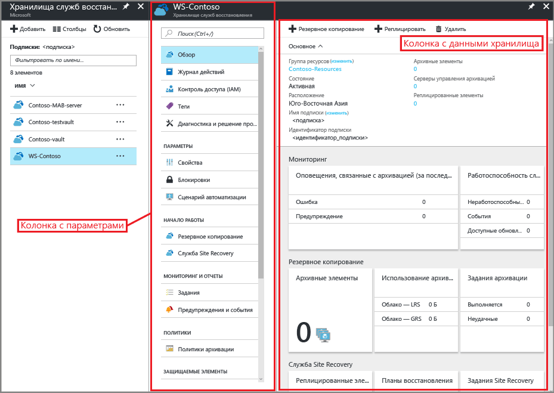
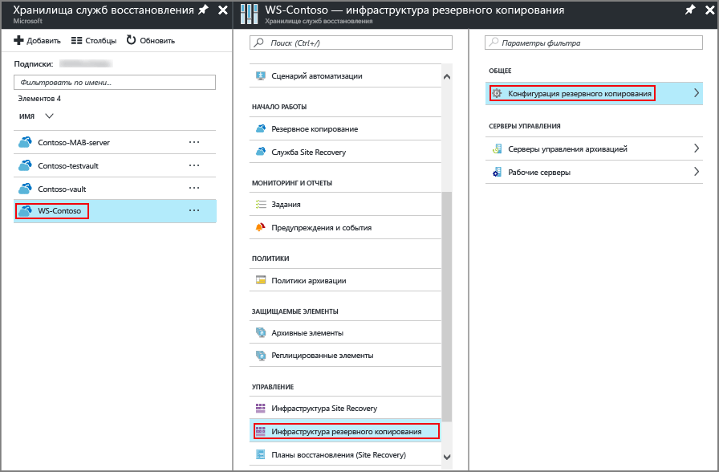
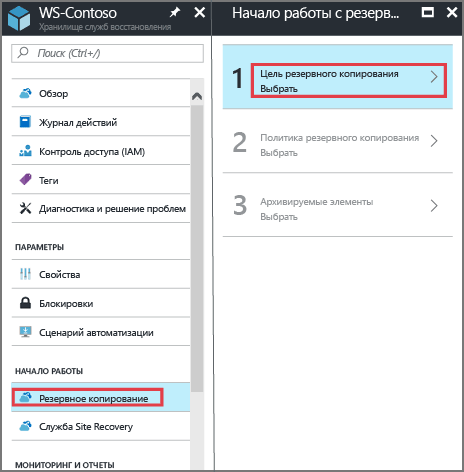
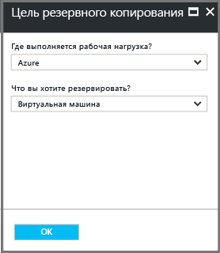
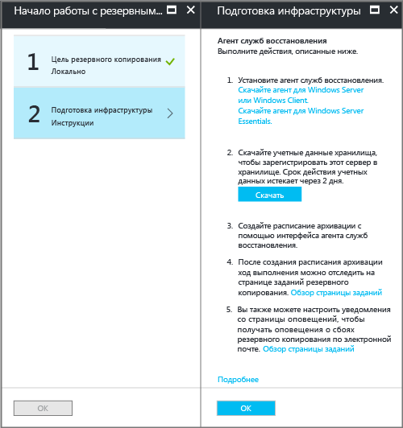
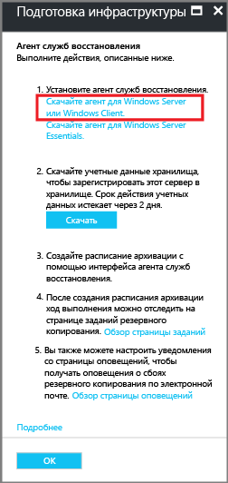
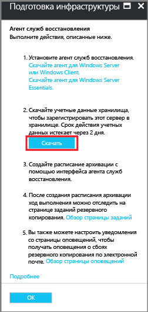
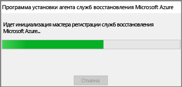
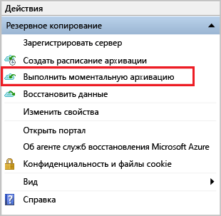

# Резервное копирование состояния системы Windows с использованием модели развертывания Resource Manager
В этой статье описано, как выполнить резервное копирование состояния системы Windows Server в Azure. В этом руководстве приведены общие сведения,

Дополнительные сведения о службе архивации Azure см. в этом [обзоре](backup-introduction-to-azure-backup.md).

Если у вас нет подписки Azure, вы можете создать [бесплатную учетную запись](https://azure.microsoft.com/free/), предоставляющую доступ ко всем службам Azure.

## Создание хранилища служб восстановления
Для резервного копирования состояния системы Windows Server нужно создать хранилище служб восстановления в том регионе, в котором планируется хранить данные. Кроме того, необходимо определить способ репликации хранилища.

### Создание хранилища служб восстановления
1. Используя подписку Azure, войдите на [портал Azure](https://portal.azure.com/) (если вы еще этого не сделали).
2. В главном меню выберите **Все службы**, а затем в списке ресурсов введите **Службы восстановления** и щелкните **Хранилища служб восстановления**.

      

    Если в подписке есть хранилища служб восстановления, они отобразятся в списке.
3. В меню **Хранилища служб восстановления** щелкните **Добавить**.

    

    Откроется колонка хранилища служб восстановления, в которой нужно указать **имя**, **подписку**, **группу ресурсов** и **расположение**.

    

4. В поле **Имя**введите понятное имя хранилища. Имя должно быть уникальным в пределах подписки Azure. Введите имя длиной от 2 до 50 знаков. Имя должно начинаться с буквы, оно может содержать только буквы, цифры и дефисы.

5. В разделе **Подписка** в раскрывающемся меню выберите подписку Azure. Если вы используете только одну подписку, она уже отображается и вы можете перейти к следующему шагу. Если неизвестно, какую подписку нужно использовать, оставьте подписку по умолчанию (или предлагаемую подписку). Вариантов будет несколько только в том случае, если учетная запись вашей организации связана с несколькими подписками Azure.

6. В разделе **Группа ресурсов** сделайте следующее:

    * выберите **Создать**, если вы хотите создать группу ресурсов;
    или
    * выберите **Использовать существующий** и просмотрите список доступных групп ресурсов в раскрывающемся меню.

  Дополнительные сведения о группах ресурсов см. в статье [Общие сведения об Azure Resource Manager](../azure-resource-manager/resource-group-overview.md).

7. В поле **Расположение** выберите географический регион, в котором будет находиться хранилище. Этот выбор определяет географический регион, в который будут отправляться данные архивации.

8. В нижней части колонки "Хранилище служб восстановления" нажмите кнопку **Создать**.

    Создание хранилища служб восстановления может занять несколько минут. Следите за уведомлениями о состоянии на портале в верхней правой области. После создания хранилище появится в списке хранилищ служб восстановления. Если через несколько минут хранилище не отобразилось, нажмите кнопку **Обновить**.

     

    Как только хранилище отобразится в списке хранилищ служб восстановления, для него можно определить избыточность.

### Настройка избыточности хранилища
При создании хранилища служб восстановления настройте его избыточность в соответствии со своими потребностями.

1. В колонке **Хранилища служб восстановления** щелкните новое хранилище.

    

    При выборе хранилища колонка **Хранилище служб восстановления** сужается и открывается колонка параметров (*с именем хранилища вверху*), а также колонка со сведениями о хранилище.

    
2. В колонке параметров нового хранилища прокрутите с помощью вертикального ползунка вниз к разделу "Управление" и щелкните **Инфраструктура резервного копирования**.
    Откроется колонка инфраструктуры резервного копирования.
3. В этой колонке выберите **Инфраструктура резервного копирования**, чтобы открыть колонку **Конфигурация архивации**.

    
4. Выберите нужный тип репликации для хранилища.

    

    По умолчанию это геоизбыточное хранилище. Если в качестве конечной точки основного хранилища службы архивации используется Azure, выберите **геоизбыточное хранилище**, а если нет, — **локально избыточное** (это позволит снизить плату за хранилище Azure). Дополнительные сведения о [геоизбыточном](../storage/common/storage-redundancy-grs.md) и [локально избыточном](../storage/common/storage-redundancy-lrs.md) хранилищах см. в статье [Репликация службы хранилища Azure](../storage/common/storage-redundancy.md).

Теперь, когда вы создали хранилище, настройте в нем резервное копирование состояния системы Windows.

## Настройка хранилища
1. В колонке хранилища служб восстановления (хранилища, которое вы только что создали) в разделе "Начало работы" выберите **Резервное копирование**. Затем в колонке **Начало работы с резервным копированием** выберите **Цель резервного копирования**.

    

    Откроется колонка **Цель резервного копирования**.

    

2. В раскрывающемся меню **Где выполняется рабочая нагрузка?** выберите **Локально**.

    Вы выбираете параметр **Локально**, потому что ваш компьютер Windows Server или Windows — это физический компьютер, которые не находится в Azure.

3. В меню **Что вы хотите резервировать?** выберите **Состояние системы** и нажмите кнопку **ОК**.

    

    После того как вы нажмете кнопку "ОК", рядом с параметром **Цель резервного копирования** появится флажок и откроется колонка **Подготовка инфраструктуры**.

    

4. В колонке **Подготовка инфраструктуры** щелкните **Скачать агент для Windows Server или Windows Client**.

    

    Если вы используете Windows Server Essential, выберите загрузку агента для Windows Server Essential. Во всплывающем меню появится запрос на запуск или сохранение файла MARSAgentInstaller.exe.

    

5. Во всплывающем окне скачивания нажмите кнопку **Сохранить**.

    По умолчанию файл **MARSagentinstaller.exe** сохраняется в папке для скачивания. После завершения установки появится всплывающее окно с двумя вариантами действий: запустить установщик или открыть папку.

    

    Пока не нужно устанавливать агент. Его можно установить после скачивания учетных данных хранилища.

6. В колонке **Подготовка инфраструктуры** щелкните **Скачать**.

    

    Учетные данные хранилища будут сохранены в папке "Загрузки". После этого вы увидите всплывающее окно с двумя вариантами действий: открыть или сохранить учетные данные. Выберите команду **Сохранить**. Если вы случайно нажали кнопку **Открыть**, подождите, пока попытка открыть учетные данные хранилища закончится ошибкой. Вы не можете открыть учетные данные хранилища. Перейдите к следующему шагу. Учетные данные хранилища находятся в папке "Загрузки".   

    
> [!NOTE]
> Учетные данные хранилища необходимо сохранить только в локальном для Windows Server расположении, где вы собираетесь использовать агент. 
>

[!INCLUDE [backup-upgrade-mars-agent.md](../../includes/backup-upgrade-mars-agent.md)]

## Установка и регистрация агента

> [!NOTE]
> Параметр для включения резервного копирования на портале Azure пока недоступен. Используйте агент служб восстановления Microsoft Azure для резервного копирования состояния системы Windows Server.
>

1. Найдите и дважды щелкните файл **MARSagentinstaller.exe** в папке "Загрузки" (или в другом расположении).

    В установщике будут отображаться соответствующие сообщения по мере извлечения, установки и регистрации агента служб восстановления.

    

2. Выполните шаги мастера настройки агента служб восстановления Microsoft Azure. Для завершения работы с мастерам вам нужно:

   * Выбрать папку установки и папку кэша.
   * Если для подключения к Интернету используется прокси-сервер, указать данные прокси-сервера.
   * Если используется прокси-сервер, прошедший проверку подлинности, ввести имя пользователя и пароль.
   * Указать скачанные учетные данные хранилища.
   * Сохранить парольную фразу шифрования в безопасном месте.

     > [!NOTE]
     > Если вы потеряли или забыли парольную фразу, корпорация Майкрософт не сможет помочь вам восстановить резервную копию данных. Сохраните файл в безопасном месте, так как он потребуется для восстановления резервной копии.
     >
     >

Теперь, когда агент установлен и компьютер зарегистрирован в хранилище, вы можете настроить параметры резервного копирования, в том числе расписание.

## Резервное копирование состояния системы Windows Server 
Начальная архивация включает в себя две задачи:

* Планирование архивации
* Первое резервное копирование состояния системы.

Чтобы выполнить первоначальное резервное копирование, используйте агент служб восстановления Microsoft Azure.

### Планирование задания резервного копирования

1. Откройте агент служб восстановления Microsoft Azure. Его можно найти, выполнив поиск строки **Microsoft Azure Backup** на компьютере.

    

2. В агенте служб восстановления щелкните **Создать расписание архивации**.

    

3. На странице "Приступая к работе" в мастере планирования архивации нажмите кнопку **Далее**.

4. На странице "Выбор элементов для архивации" щелкните **Добавить элементы**.

5. Выберите **Состояние системы** и нажмите кнопку **ОК**.

6. Нажмите кнопку **Далее**.

7. Выберите нужную частоту резервного копирования и политику хранения для резервного копирования состояния системы на последующих страницах. 

8. Проверьте сведения на странице подтверждения и нажмите кнопку **Готово**.

9. Когда мастер завершит создание расписания архивации, нажмите кнопку **Закрыть**.

### Первое резервное копирование состояния системы Windows Server

1. Убедитесь, что для Windows Server нет незавершенных обновлений, которые требуют перезагрузки.

2. В агенте служб восстановления щелкните **Выполнить моментальную архивацию**, чтобы завершить начальное заполнение по сети.

    

3. На экране **Выбор архивного элемента**, который появится, выберите **Состояние системы** и нажмите кнопку **Далее**.

4. На странице "Подтверждение" проверьте параметры, которые мастер будет использовать для архивации данных на компьютере. Затем нажмите кнопку **Архивировать**.

4. Нажмите кнопку **Закрыть**, чтобы закрыть мастер. Если сделать это до завершения архивации, мастер продолжит работу в фоновом режиме.

После завершения начальной архивации в консоли службы архивации отобразится состояние **Задание выполнено**.

  

## Вопросы?
Если вы хотите задать вопрос или предложить добавить какие-либо функции, [отправьте нам свой отзыв](http://aka.ms/azurebackup_feedback).

## Дополнительная информация
* См. дополнительные сведения об [архивации компьютеров Windows](backup-configure-vault.md).
* Теперь, когда вы выполнили резервное копирование состояния системы Windows Server, вы можете [управлять хранилищами и серверами](backup-azure-manage-windows-server.md).
* Если необходимо восстановить резервную копию, см. статью о [восстановлении файлов на компьютере Windows](backup-azure-restore-windows-server.md).
