# Резервное копирование виртуальных машин Azure в хранилище служб восстановления

В этой статье описывается, как настроить защиту виртуальной машины с помощью ее меню операций или с помощью хранилища служб восстановления. Хранилища служб восстановления защищают следующие ресурсы:

* Виртуальные машины, развернутые с помощью Azure Resource Manager
* классические виртуальные машины;
* виртуальные машины стандартного хранилища;
* виртуальные машины хранилища класса Premium.
* виртуальные машины, запущенные на управляемых дисках;
* виртуальные машины, зашифрованные при помощи шифрования дисков Azure;
* согласованные с состоянием приложений резервные копии виртуальных машин Windows (с помощью VSS) и Linux (с помощью пользовательских скриптов, выполняемых перед и после создания моментального снимка).

Дополнительные сведения о защите виртуальных машин хранилища класса Premium см. в разделе [Использование службы архивации Azure для виртуальных машин хранилища класса "Премиум"](backup-introduction-to-azure-backup.md#using-premium-storage-vms-with-azure-backup). Дополнительные сведения о поддержке для виртуальных машин, запущенных на управляемых дисках, см. в разделе [Использование службы архивации Azure для виртуальных машин, запущенных на управляемых дисках](backup-introduction-to-azure-backup.md#using-managed-disk-vms-with-azure-backup). Дополнительные сведения о платформе для резервного копирования виртуальных машин Linux с помощью платформы для предварительного и последующего выполнения скриптов см. в статье [Согласованное с приложениями резервное копирование виртуальных машин Linux в Azure](https://docs.microsoft.com/azure/backup/backup-azure-linux-app-consistent).

Чтобы узнать больше о том, для каких объектов можно создавать резервные копии, ознакомьтесь с разделом [Подготовка среды к архивации виртуальных машин, развернутых с помощью Resource Manager](backup-azure-arm-vms-prepare.md#limitations-when-backing-up-and-restoring-a-vm).

> [!NOTE]
> Служба Backup создает группу ресурсов, отличную от группы ресурсов виртуальной машины, для сохранения коллекции точек восстановления. Пользователям рекомендуется не блокировать группу ресурсов, созданную для использования службой Backup.
Формат именования группы ресурсов, созданной службой Backup: AzureBackupRG_`<Geo>`_`<number>`
 Например: AzureBackupRG_northeurope_1
>
>

В зависимости от количества виртуальных машин, которые необходимо защитить, можно начать с разных отправных точек. Если необходимо выполнить архивацию нескольких виртуальных машин в рамках одной операции, перейдите в хранилище служб восстановления и [инициируйте задание архивации из панели мониторинга хранилища](backup-azure-vms-first-look-arm.md#configure-the-backup-job-from-the-recovery-services-vault). Если необходимо выполнить резервное копирование одной виртуальной машины, [запустите задание резервного копирования в меню операций виртуальной машины](backup-azure-vms-first-look-arm.md#configure-the-backup-job-from-the-vm-operations-menu).

## Настройка задания резервного копирования в меню операций виртуальной машины

Выполните следующие действия, чтобы настроить задание резервного копирования с помощью меню операций виртуальной машины. Эти действия применяются только к виртуальным машинам на портале Azure.

1. Войдите на [портале Azure](https://portal.azure.com/).
2. В главном меню выберите **Все службы**, а затем в диалоговом окне фильтра введите **Виртуальные машины**. По мере ввода список ресурсов фильтруется. Когда появится элемент "Виртуальные машины", выберите его.

  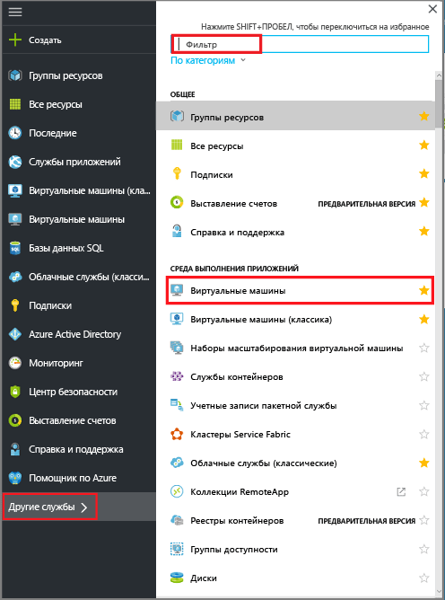

  Отобразится список виртуальных машин в подписке.

  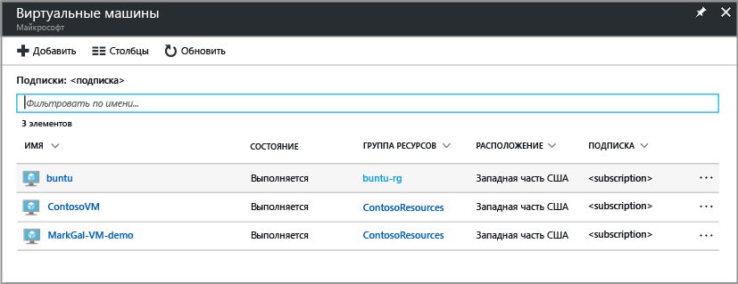

3. В этом списке выберите нужную виртуальную машину для архивации.

  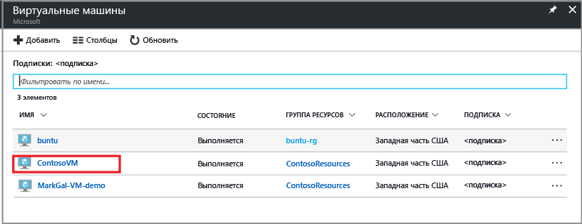

  При выборе виртуальной машины список виртуальных машин сдвинется влево и откроется меню управления виртуальной машиной и панель мониторинга виртуальной машины.

4. В меню управления виртуальной машиной в разделе **Операции** щелкните **Архивация**.  

  

  Откроется меню "Включение архивации".

  

5. В области "Хранилище служб восстановления" щелкните **Выбрать существующее** и выберите хранилище из раскрывающегося списка.

  

  Если хранилища служб восстановления отсутствуют или вы хотите использовать новое хранилище, выберите **Создать новое** и укажите имя нового хранилища. Новое хранилище создается в той же группе ресурсов и в том же регионе, что и виртуальная машина. Если необходимо создать хранилище служб восстановления с другими значениями, см. сведения в разделе о [создании хранилища служб восстановления](backup-azure-vms-first-look-arm.md#create-a-recovery-services-vault-for-a-vm).

6. В меню "Выбор политики архивации" выберите политику. Сведения о выбранной политике отобразятся под раскрывающимся меню.

  Если вы хотите создать новую или изменить существующую политику, щелкните **Create (or edit) a new policy** (Создать (или изменить) политику), чтобы открыть редактор политик резервного копирования. Инструкции по определению политики резервного копирования см. в разделе [Определение политики резервного копирования](backup-azure-vms-first-look-arm.md#defining-a-backup-policy). Чтобы сохранить изменения в политике резервного копирования и вернуться в меню включения резервного копирования, нажмите кнопку **ОК**.

  

7. Чтобы применить хранилище служб восстановления и политику резервного копирования к виртуальной машине, щелкните **Включить резервное копирование** для развертывания политики. Развертывание политики связывает ее с хранилищем и виртуальными машинами.

  

8. Ход выполнения настройки можно отслеживать с помощью уведомлений, отображаемых на портале. В примере ниже показано, что развертывание началось.

  

9. После выполнения настройки в меню управления виртуальной машиной щелкните **Архивация**, чтобы открыть меню "Архивация" и просмотреть доступные сведения.

  

  Пока начальная архивация не будет выполнена, для параметра **Состояние последней архивации** будет отображаться значение **Предупреждение (ожидание начальной архивации)**. Чтобы узнать, когда начинается следующее запланированное задание резервного копирования, в разделе **Сводка** щелкните имя политики. Откроется меню политики резервного копирования, в котором отображается время запланированного резервного копирования.

10. Чтобы защитить виртуальную машину, щелкните **Выполнить архивацию**. 

  

  Откроется меню "Моментальная архивация". 

  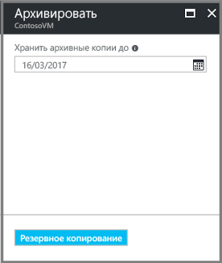

11. В меню "Выполнить архивацию" щелкните значок календаря и с помощью элементов управления календарем выберите последний день сохранения этой точки восстановления, а затем нажмите кнопку **ОК**.

  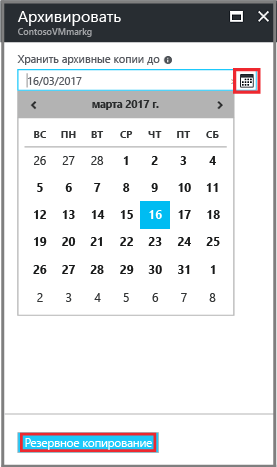

  Уведомления о развертывании извещают о том, что задание архивации запущено и что ход его выполнения можно отслеживать на странице заданий архивации.

## Настройка задания архивации в хранилище служб восстановления
Чтобы настроить задание архивации, выполните следующие действия:

1. Создайте хранилище служб восстановления для виртуальной машины.
2. Используйте портал Azure для выбора сценария, задания политики архивации и указания объектов, которые нужно защитить.
3. Выполнение начального резервного копирования.

## Создание хранилища служб восстановления для виртуальной машины
Хранилище служб восстановления — это сущность, в которой хранятся созданные резервные копии и точки восстановления. В нем также содержится политика резервного копирования, которая применяется к защищенным виртуальным машинам.

> [!NOTE]
> Резервное копирование виртуальных машин выполняется локально. Нельзя создавать резервные копии виртуальных машин, которые находятся в одном регионе, в хранилище служб восстановления в другом регионе. Таким образом, в каждом регионе Azure, в котором находятся виртуальные машины, требующие резервного копирования, должно быть по крайней мере одно хранилище служб восстановления.
>
>

Чтобы создать хранилище служб восстановления, сделайте следующее:

1. Войдите на [портал Azure](https://portal.azure.com/), используя подписку Azure, если вы еще этого не сделали.
2. В главном меню выберите **Все службы**, а затем в диалоговом окне фильтра введите **Службы восстановления**. По мере ввода список ресурсов фильтруется. Когда появится элемент "Хранилища служб восстановления", щелкните его.

    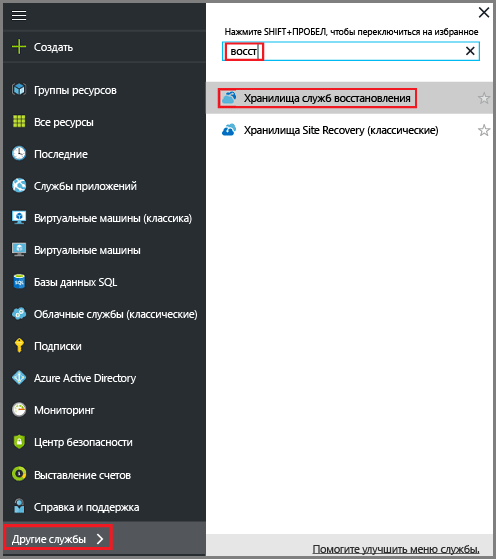  

    Если в подписке есть хранилища служб восстановления, они отобразятся в списке.

    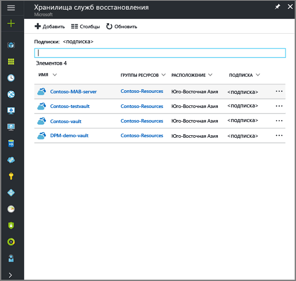
3. В меню **Хранилища служб восстановления** щелкните **Добавить**.

    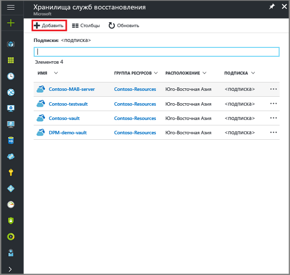

    Откроется меню хранилища служб восстановления, в которой нужно указать **имя**, **подписку**, **группу ресурсов** и **расположение**.

    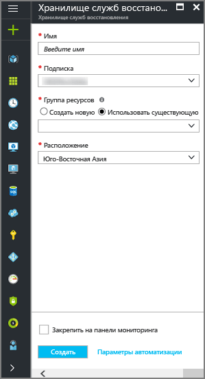

4. В поле **Имя**введите понятное имя хранилища. Имя должно быть уникальным в пределах подписки Azure. Введите имя длиной от 2 до 50 знаков. Имя должно начинаться с буквы, оно может содержать только буквы, цифры и дефисы.

5. В разделе **Подписка** в раскрывающемся меню выберите подписку Azure. Если вы используете только одну подписку, она уже отображается и вы можете перейти к следующему шагу. Если неизвестно, какую подписку нужно использовать, оставьте подписку по умолчанию (или предлагаемую подписку). Вариантов будет несколько только в том случае, если учетная запись вашей организации связана с несколькими подписками Azure.

6. В разделе **Группа ресурсов** сделайте следующее:

    * выберите **Создать**, если вы хотите создать группу ресурсов;
    или
    * выберите **Использовать существующий** и просмотрите список доступных групп ресурсов в раскрывающемся меню.

  Дополнительные сведения о группах ресурсов см. в статье [Общие сведения об Azure Resource Manager](../azure-resource-manager/resource-group-overview.md).

7. В поле **Расположение** выберите географический регион, в котором будет находиться хранилище. Этот выбор определяет географический регион, в который будут отправляться данные архивации.

  > [!IMPORTANT]
  > Если вы не уверены, в каком регионе находится ваша виртуальная машина, закройте диалоговое окно создания хранилища и перейдите к списку виртуальных машин на портале. Если у вас есть виртуальные машины в нескольких регионах, создайте хранилище служб восстановления в каждом из них. Прежде чем переходить к следующему региону, необходимо создать хранилище в первом регионе. Указывать учетные записи хранения для данных архивации не требуется: хранилище служб восстановления и служба архивации Azure сделают это автоматически.
  >

8. В нижней части меню "Хранилище служб восстановления" щелкните **Создать**.

    Создание хранилища служб восстановления может занять несколько минут. Следите за уведомлениями о состоянии на портале в верхней правой области. После создания хранилище появится в списке хранилищ служб восстановления. Если через несколько минут хранилище не отобразилось, нажмите кнопку **Обновить**.

    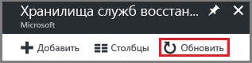 

    Как только хранилище отобразится в списке хранилищ служб восстановления, для него можно определить избыточность.

Теперь, когда вы создали хранилище, можно приступить к настройке репликации.

### Настройка репликации хранилища
При настройке репликации хранилища можно выбирать между геоизбыточным хранилищем и локально избыточным хранилищем. По умолчанию это геоизбыточное хранилище. Если хранилище служб восстановления является основной резервной копией, оставьте для параметра репликации хранилища это значение. Если вам нужно более дешевое и не такое надежное решение, выберите локально избыточное хранилище. Дополнительные сведения о [геоизбыточном](../storage/common/storage-redundancy-grs.md) и [локально избыточном](../storage/common/storage-redundancy-lrs.md) хранилищах см. в [обзоре репликации службы хранилища Azure](../storage/common/storage-redundancy.md).

Чтобы изменить параметр репликации хранилища:

1. В меню **Хранилища служб восстановления** выберите новое хранилище.

  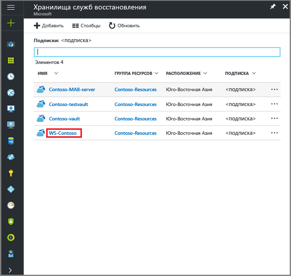

  При выборе хранилища откроется меню "Параметры" (*с именем хранилища вверху*), а также панель мониторинга хранилища.

  

2. Прокрутите меню управления новым хранилищем с помощью вертикального ползунка вниз к разделу "Управление" и щелкните **Инфраструктура резервного копирования**, чтобы открыть меню "Инфраструктура резервного копирования".
 
   

3. В меню "Инфраструктура резервного копирования" выберите **Конфигурация архивации**, чтобы открыть меню **Конфигурация архивации**.

    
4. Выберите нужный тип репликации для хранилища.

    

    По умолчанию это геоизбыточное хранилище. Если в качестве конечной точки основного хранилища службы архивации используется Azure, выберите **геоизбыточное хранилище**, а если нет, — **локально избыточное** (это позволит снизить плату за хранилище Azure). Дополнительные сведения о [геоизбыточном](../storage/common/storage-redundancy-grs.md) и [локально избыточном](../storage/common/storage-redundancy-lrs.md) хранилищах см. в статье [Репликация службы хранилища Azure](../storage/common/storage-redundancy.md).

## Выбор цели архивации, настройка политики и определение объектов для защиты
Прежде чем регистрировать виртуальную машину в хранилище, нужно запустить процесс обнаружения, чтобы определить все недавно добавленные в подписку виртуальные машины. В ходе этого процесса в Azure отправляется запрос о предоставлении списка виртуальных машин в подписке и дополнительных сведений, в том числе имени и региона облачной службы. На портале Azure под сценарием имеется в виду то, что вы собираетесь поместить в хранилище служб восстановления. Политика — это расписание, которое определяет частоту и время создания точек восстановления. Политика также включает диапазон хранения для точек восстановления.

1. Если хранилище служб восстановления уже открыто, перейдите к шагу 2. В противном случае щелкните **Все службы**. Введите **Службы восстановления** и щелкните **Хранилища служб восстановления**.

      

    После этого отобразится список хранилищ служб восстановления,

    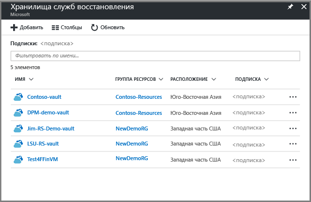

    В списке хранилищ служб восстановления выберите хранилище, чтобы открыть соответствующую панель мониторинга.

     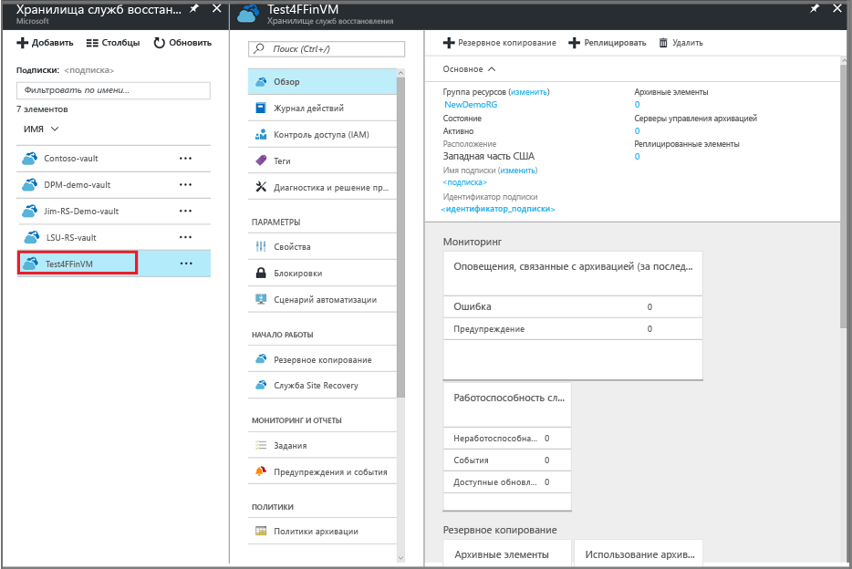

2. В меню панели мониторинга хранилища щелкните **Архивация**, чтобы открыть соответствующее меню.

    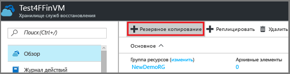

    Откроются меню "Архивация" и "Цель резервного копирования".

    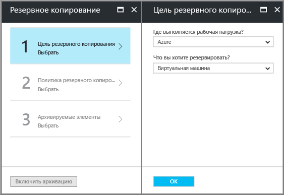
3. В меню "Цель резервного копирования" из раскрывающегося меню **Where is your workload running** (Где выполняется рабочая нагрузка) выберите "Azure". В раскрывающемся меню **What do you want to backup**(Что необходимо архивировать?) выберите виртуальную машину, затем нажмите кнопку **ОК**.

    При этом расширение виртуальной машины зарегистрируется в хранилище. После этого меню "Цель резервного копирования" закроется и откроется меню **Политика архивации**.

    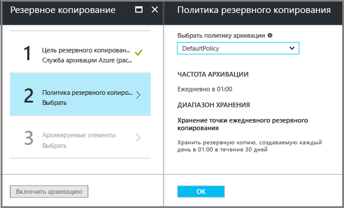

4. В меню "Политика архивации" выберите политику резервного копирования для своего хранилища.

    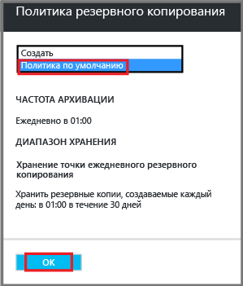

    Подробные сведения о политике по умолчанию указаны в раскрывающемся меню. Если вы хотите создать политику, в раскрывающемся меню выберите **Создать**. Инструкции по определению политики резервного копирования см. в разделе [Определение политики резервного копирования](backup-azure-vms-first-look-arm.md#defining-a-backup-policy).
    Чтобы связать политику архивации с хранилищем, нажмите кнопку **ОК**.

    После этого меню "Цель резервного копирования" закроется и откроется меню **Выбор виртуальных машин**.
5. Выберите виртуальные машины в меню **Выбор виртуальных машин**, чтобы связать их с указанной политикой, и нажмите кнопку **OK**.

    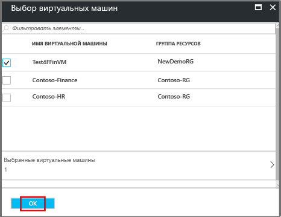

    Выбранная виртуальная машина пройдет проверку. Если необходимые вам виртуальные машины не отобразятся, проверьте, относятся ли они к тому же расположению Azure, что и хранилище служб восстановления, и не защищены ли они. Расположение хранилища служб восстановления отображается на панели мониторинга хранилища.

6. Теперь, когда все параметры для хранилища заданы, в меню "Архивация" щелкните **Включить резервное копирование**, чтобы развернуть политику для хранилища и виртуальных машин. Это не создает начальную точку восстановления для виртуальной машины.

    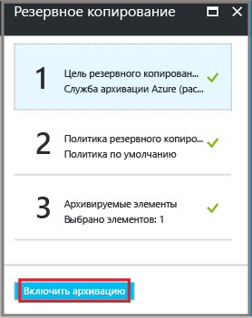

После успешного включения архивации политика архивации будет выполняться по расписанию. Тем не менее приступите к запуску первого задания архивации.

## Начальное резервное копирование
Если политика резервного копирования развернута на виртуальной машине, это не означает, что резервное копирование данных уже выполнено. По умолчанию начальным резервным копированием является первое запланированное резервное копирование (заданное в политике резервного копирования). Пока начальное резервное копирование не будет выполнено, для последнего задания резервного копирования в меню **Задания резервного копирования** будет отображаться состояние **Warning(initial backup pending)** (Предупреждение (ожидание начального резервного копирования)).

Если начальное резервное копирование должно начаться не скоро, советуем воспользоваться командой **Выполнить моментальную архивацию**.

Чтобы выполнить начальную архивацию, сделайте следующее:

1. На панели мониторинга хранилища щелкните число в разделе **Элементы архивации** или выберите элемент **Элементы архивации**.  
  

  Откроется меню **Архивные элементы**.

  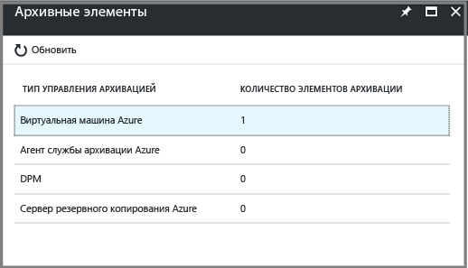

2. В меню **Элементы архивации** выберите элемент.

  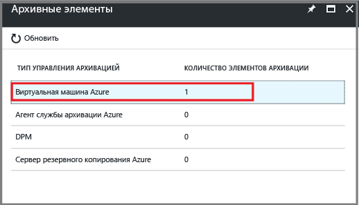

  Откроется список **Элементы архивации**.  

  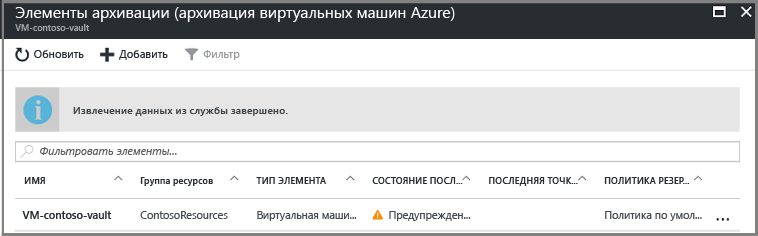

3. В списке **Элементы архивации** нажмите кнопку с многоточием **...**, чтобы открыть контекстное меню.

  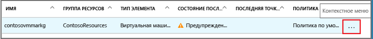

  Откроется контекстное меню.

  

4. В контекстном меню выберите команду **Выполнить моментальную архивацию**.

  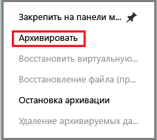

  Откроется меню "Моментальная архивация".

  

5. В меню "Выполнить архивацию" щелкните значок календаря и с помощью элементов управления календарем выберите последний день сохранения этой точки восстановления, а затем щелкните **Архивация**.

  

  Уведомления о развертывании извещают о том, что задание архивации запущено и что ход его выполнения можно отслеживать на странице заданий архивации. В зависимости от размера виртуальной машины создание начального архива может занять некоторое время.

6. Чтобы проверить или отследить состояние начальной архивации, на панели мониторинга хранилища в элементе **Задания архивации** щелкните **Выполняется**.

  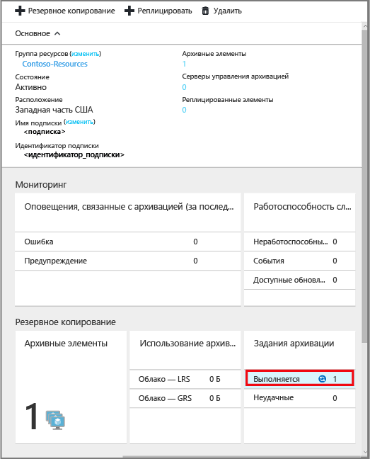

  Откроется меню "Задания резервного копирования".

  

  В меню **Задания резервного копирования** можно просмотреть состояние всех заданий. Проверьте, выполняется ли еще ваше задание архивации для виртуальной машины или уже выполнено. Когда задание архивации выполнено, состояние меняется на *Завершено*.

  > [!NOTE]
  > В ходе резервного копирования служба архивации Azure дает команду расширению для резервного копирования на каждой виртуальной машине сохранять на диск все данные операций записи и делать согласованный моментальный снимок.
  >
  >

[!INCLUDE [backup-create-backup-policy-for-vm](../../includes/backup-create-backup-policy-for-vm.md)]

## Установка агента ВМ на виртуальной машине
Эта информация приведена на случай необходимости. Агент VM Azure необходимо установить на виртуальной машине Azure, чтобы обеспечить работоспособность модуля резервного копирования. Однако если виртуальная машина создана из коллекции Azure, в ней уже установлен агент. На виртуальных машинах, которые переносятся из локальных центров обработки данных, агент отсутствует. Для таких виртуальных машин агент необходимо установить. Если у вас возникли сложности с архивацией виртуальной машины Azure, убедитесь, что на ней правильно установлен агент ВМ Azure (см. таблицу ниже). После создания пользовательской виртуальной машины установите агент виртуальной машины, прежде чем начать ее подготовку.

См. дополнительные сведения об [агенте виртуальной машины](https://go.microsoft.com/fwLink/?LinkID=390493&clcid=0x409) и [его установке](../virtual-machines/windows/classic/manage-extensions.md?toc=%2fazure%2fvirtual-machines%2fwindows%2fclassic%2ftoc.json).

В таблице ниже приведены дополнительные сведения об агенте для виртуальных машин Windows и Linux.

| **Операция** | **Windows** | **Linux** |
| --- | --- | --- |
| Установка агента VM |<li>Скачайте и установите [MSI-файл агента](http://go.microsoft.com/fwlink/?LinkID=394789&clcid=0x409). Чтобы выполнить установку, необходимо иметь права администратора. <li>[Обновите свойство виртуальной машины](http://blogs.msdn.com/b/mast/archive/2014/04/08/install-the-vm-agent-on-an-existing-azure-vm.aspx) , чтобы указать, что агент установлен. |<li> Установите последнюю версию [агента Linux](https://github.com/Azure/WALinuxAgent) с сайта GitHub. Чтобы выполнить установку, необходимо иметь права администратора. <li> [Обновите свойство виртуальной машины](http://blogs.msdn.com/b/mast/archive/2014/04/08/install-the-vm-agent-on-an-existing-azure-vm.aspx) , чтобы указать, что агент установлен. |
| Обновление агента виртуальной машины |Обновление агента виртуальной машины — это простая процедура, схожая с переустановкой [двоичных файлов агента виртуальной машины](http://go.microsoft.com/fwlink/?LinkID=394789&clcid=0x409).  Необходимо убедиться, что во время обновления агента виртуальной машины не выполняются операции архивации. |Следуйте указаниям по [обновлению агента виртуальной машины Linux ](../virtual-machines/linux/update-agent.md?toc=%2fazure%2fvirtual-machines%2flinux%2ftoc.json).  Необходимо убедиться, что во время обновления агента виртуальной машины не выполняются операции резервного копирования. |
| Проверка установки агента VM |<li>На виртуальной машине Azure перейдите в папку *C:\WindowsAzure\Packages*. <li>В ней должен находиться файл WaAppAgent.exe.<li> Щелкните правой кнопкой мыши этот файл, выберите пункт **Свойства** и перейдите на вкладку **Подробно**. В поле "Версия продукта" должно отображаться значение 2.6.1198.718 или выше. |Недоступно |

### Расширение резервного копирования
Когда агент будет установлен на виртуальной машине, служба архивации Azure установит для агента модуль резервного копирования. Служба резервного копирования Azure легко обновляет и применяет исправления к расширению резервного копирования без дополнительного вмешательства пользователя.

Служба архивации устанавливает расширение архивации, даже если виртуальная машина не запущена. На запущенной виртуальной машине проще получить точку восстановления, согласованную с приложениями. При этом служба архивации Azure продолжает архивацию виртуальной машины, даже если она выключена, и нельзя установить расширение. Этот тип архивации называется автономной виртуальной машиной с *отказоустойчивой* точкой восстановления.

## Сведения об устранении неполадок
Если у вас возникли проблемы при выполнении задач, описанных в этой статье, изучите [руководство по устранению неполадок](backup-azure-vms-troubleshoot.md).

## Цены
Затраты на архивацию виртуальных машин Azure зависят от количества защищенных экземпляров. Определение защищенного экземпляра см. в разделе [Что такое защищенный экземпляр](backup-introduction-to-azure-backup.md#what-is-a-protected-instance). Пример расчета стоимости архивации виртуальной машины см. в разделе [Как вычисляются защищенные экземпляры](backup-azure-vms-introduction.md#calculating-the-cost-of-protected-instances). Цены на службу архивации Azure см. на [этой странице](https://azure.microsoft.com/pricing/details/backup/).

## Вопросы?
Если вы хотите задать вопрос или предложить добавить какие-либо функции, [отправьте нам свой отзыв](http://aka.ms/azurebackup_feedback).
