# Первое знакомство: резервное копирование виртуальных машин Azure
> [!div class="op_single_selector"]
> * [Защита виртуальных машин в хранилище служб восстановления](backup-azure-vms-first-look-arm.md)
> * [Защита виртуальных машин Azure в хранилище службы архивации](backup-azure-vms-first-look.md)
>
>

В этом руководстве описана процедура резервного копирования виртуальной машины (ВМ) в резервное хранилище Azure. В этой статье описывается классическая модель развертывания (модель развертывания Service Manager) для резервного копирования виртуальных машин. Следующие инструкции применяются только к хранилищам службы архивации, созданным на классическом портале. Для новых развертываний мы советуем использовать модель развертывания Resource Manager.

Дополнительные сведения об архивации виртуальной машины в хранилище служб восстановления, которое принадлежит к группе ресурсов, см. в статье [Первое знакомство. Защита виртуальных машин в хранилище служб восстановления](backup-azure-vms-first-look-arm.md).

Для успешного выполнения заданий этого руководства необходимо предварительно:

* создать виртуальную машину в подписке Azure;
* обеспечить подключение виртуальной машины к общедоступным IP-адресам Azure. Дополнительные сведения см. в разделе [Сетевое подключение](backup-azure-vms-prepare.md#network-connectivity).

> [!NOTE]
> В Azure предусмотрены две модели развертывания, позволяющие создавать ресурсы и работать с ними: [модель Resource Manager и классическая модель](../azure-resource-manager/resource-manager-deployment-model.md). Это руководство предназначено для использования при работе с виртуальными машинами, созданными на классическом портале.
>
>

## создать хранилище архивации;
Хранилище архивации — это сущность, в которой хранятся созданные резервные копии и точки восстановления. Хранилище службы архивации также содержит политики резервного копирования, применяемые к виртуальным машинам, для которых настроена архивация.

> [!IMPORTANT]
> Начиная с марта 2017 года классический портал больше нельзя использовать для создания хранилищ службы архивации.
> Теперь можно обновить свои резервные хранилища до хранилищ служб восстановления. См. дополнительные сведения об [обновлении резервного хранилища до хранилища служб восстановления](backup-azure-upgrade-backup-to-recovery-services.md). Корпорация Майкрософт рекомендует обновить резервные хранилища до хранилищ служб восстановления.  После 15 октября 2017 г. вы не сможете использовать PowerShell для создания резервных хранилищ. **С 1 ноября 2017 г**:
>- Все остальные резервные хранилища будут автоматически обновлены до хранилищ служб восстановления.
>- Вы не сможете получить доступ к данным резервных копий на классическом портале. Вместо этого для доступа к данным резервных копий в хранилищах служб восстановления используйте портал Azure.
>

## Обнаружение и регистрация виртуальных машин Azure
Перед регистрацией VM в хранилище запустите процесс обнаружения, чтобы определить новые виртуальные машины. В ходе этого процесса возвращается список виртуальных машин в подписке и дополнительные сведения о них, в том числе имя и регион облачной службы.

1. Войдите на [классический портал Azure](http://manage.windowsazure.com/)
2. На классическом портале Azure щелкните **Службы восстановления**, чтобы открыть список хранилищ служб восстановления.
    
3. Из списка выберите хранилище для резервного копирования виртуальной машины.

    Когда вы выберете хранилище, откроется страница **Быстрый запуск** .
4. В меню хранилища выберите пункт **Зарегистрированные элементы**.

    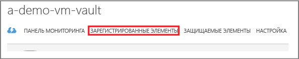
5. В меню **Тип** выберите пункт **Виртуальная машина Azure**.

    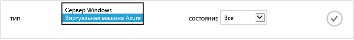
6. В нижней части страницы щелкните **Обнаружить** .
    

    Процесс обнаружения может длиться несколько минут, в течение которых будет создаваться таблица со списком виртуальных машин. В нижней части экрана отобразится уведомление о ходе выполнения процесса.

    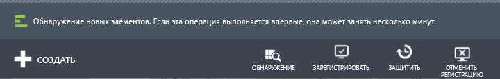

    Уведомление изменится, когда процесс завершится.

    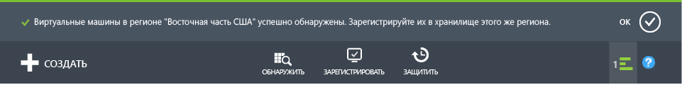
7. В нижней части страницы щелкните **Зарегистрировать** .
    
8. В контекстном меню **Регистрация элементов** выберите виртуальные машины, которые нужно зарегистрировать.

   > [!TIP]
   > В ходе одной процедуры можно зарегистрировать несколько виртуальных машин.
   >
   >

    Для каждой выбранной виртуальной машины будет создано задание.
9. В уведомлении щелкните **Просмотреть задание**, чтобы перейти на страницу **Задания**.

    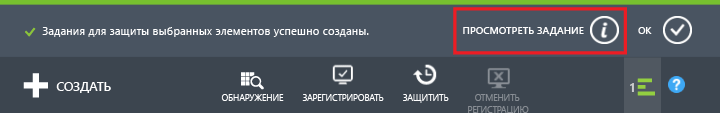

    Виртуальная машина также отображается в списке зарегистрированных элементов с указанием состояния операции регистрации.

    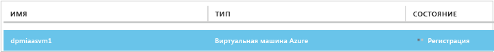

    По завершении операции состояние изменится на *registered* (зарегистрировано).

    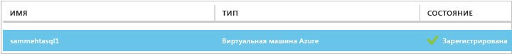

## Установка агента ВМ на виртуальной машине
Агент VM Azure необходимо установить на виртуальной машине Azure, чтобы обеспечить работоспособность модуля резервного копирования. Если виртуальная машина создана из коллекции Azure, на ней уже есть агент VM. Вы можете перейти к [защите виртуальных машин](backup-azure-vms-first-look.md#create-the-backup-policy).

Если виртуальная машина перенесена из локального центра данных, возможно, на ней не установлен агент VM. Чтобы защитить виртуальную машину, перед продолжением необходимо установить на ней агент VM. Подробные инструкции по установке агента виртуальной машины см. в [разделе, посвященном агенту виртуальной машины, статьи об архивации виртуальных машин Azure](backup-azure-vms-prepare.md#vm-agent).

## Создание политики архивации
Прежде чем инициировать задание начального резервного копирования, определите расписание создания снимков резервной копии. Расписание создания снимков резервной копии и время хранения этих снимков — это и есть политика резервного копирования. Сведения о хранении основаны на схеме ротации резервных копий "дед-отец-сын".

1. На классическом портале Azure в разделе **Службы восстановления** перейдите в хранилище службы архивации и откройте вкладку **Зарегистрированные элементы**.
2. В раскрывающемся меню выберите пункт **Виртуальная машина Azure** .

    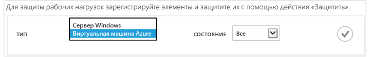
3. В нижней части страницы щелкните **Защитить** .
    

    Откроется **мастер защиты элементов** со списком *только* зарегистрированных и незащищенных виртуальных машин.

    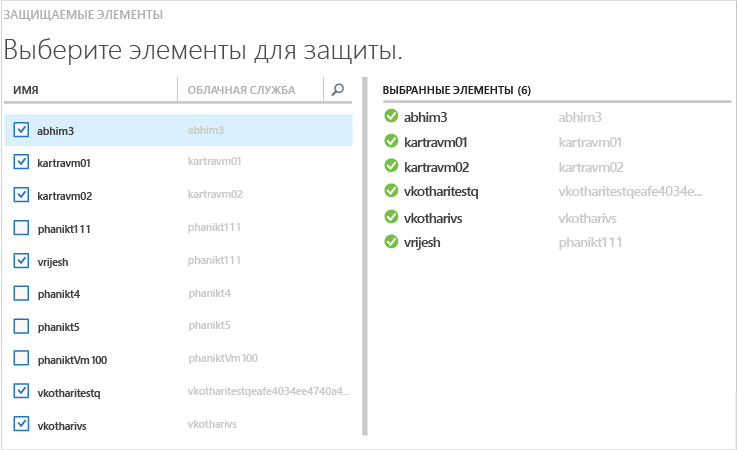
4. Выберите виртуальные машины, которые необходимо защитить.

    Чтобы различить несколько виртуальных машин с одинаковым именем, используйте облачную службу.
5. В меню **Настройка защиты** выберите существующую политику или создайте новую, чтобы защитить указанные виртуальные машины.

    Для новых хранилищ резервных копий устанавливается политика резервного копирования по умолчанию. Согласно этой политике снимок создается каждый вечер и хранится в течение 30 дней. У каждой политики резервного копирования может быть несколько связанных виртуальных машин. Но за один раз виртуальная машина может быть связана только с одной политикой.

    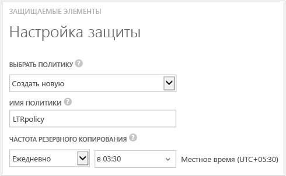

   > [!NOTE]
   > Политика резервного копирования включает схему хранения плановых резервных копий. Выбрав существующую политику резервного копирования, вы не сможете впоследствии изменить параметры хранения.
   >
   >
6. В разделе **Диапазон хранения** выберите нужный вариант для ваших точек резервного копирования: ежедневно, еженедельно, ежемесячно или ежегодно.

    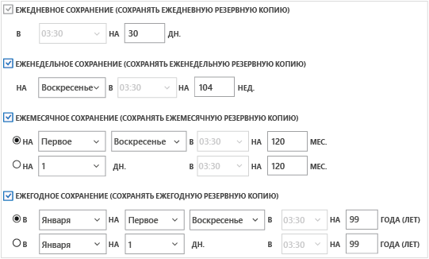

    Политика хранения определяет длительность хранения резервной копии. Можно указать разные политики хранения на основе времени создания резервной копии.
7. Щелкните **Задания**, чтобы просмотреть список заданий по **настройке защиты**.

    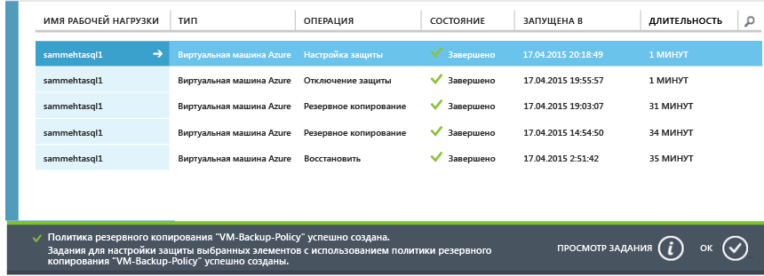

    Теперь, когда вы определили политику, перейдите к следующему этапу и запустите начальное резервное копирование.

## Начальное резервное копирование
Защитив виртуальную машину с помощью политики, можно просмотреть связанные сведения на вкладке **Защищенные элементы** . Пока не начнется начальное резервное копирование, для параметра **Состояние защиты** будет отображаться значение **Protected - (pending initial backup)** (Защищено (в ожидании начального резервного копирования)). По умолчанию *начальным резервным копированием*является первое запланированное резервное копирование.

Чтобы запустить начальное резервное копирование, выполните следующие действия.

1. В нижней части страницы **Защищенные элементы** щелкните **Архивировать**.
    

    Служба архивации Azure создаст задание резервного копирования для операции начального резервного копирования.
2. Чтобы просмотреть список заданий, щелкните вкладку **Задания** .

    

    Когда начальное резервное копирование будет завершено, на вкладке **Защищенные элементы** отобразится состояние виртуальной машины *Защищено*.

    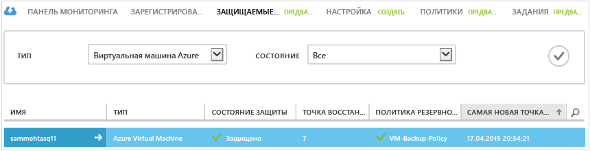

   > [!NOTE]
   > Резервное копирование виртуальных машин — локальный процесс. Создать резервную копию виртуальных машин из одного региона в хранилище службы архивации в другом регионе нельзя. Поэтому в каждом регионе Azure с виртуальными машинами, для которых требуется резервное копирование, необходимо создать как минимум одно хранилище службы архивации.
   >
   >

## Дальнейшие действия
Теперь, когда резервное копирование виртуальной машины успешно завершено, вы можете выполнить еще несколько действий. Логичнее всего будет ознакомиться с процессом восстановления данных на виртуальной машине. Но есть задачи управления, которые помогут вам понять, как безопасно хранить данные и сократить расходы.

* [Мониторинг виртуальных машин и управление ими](backup-azure-manage-vms.md)
* [Восстановление виртуальных машин](backup-azure-restore-vms.md)
* [Рекомендации по устранению неполадок](backup-azure-vms-troubleshoot.md)

## Вопросы?
Если вы хотите задать вопрос или предложить добавить какие-либо функции, [отправьте нам свой отзыв](http://aka.ms/azurebackup_feedback).

