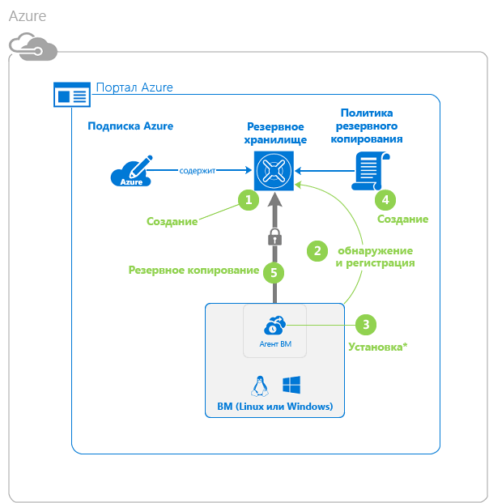
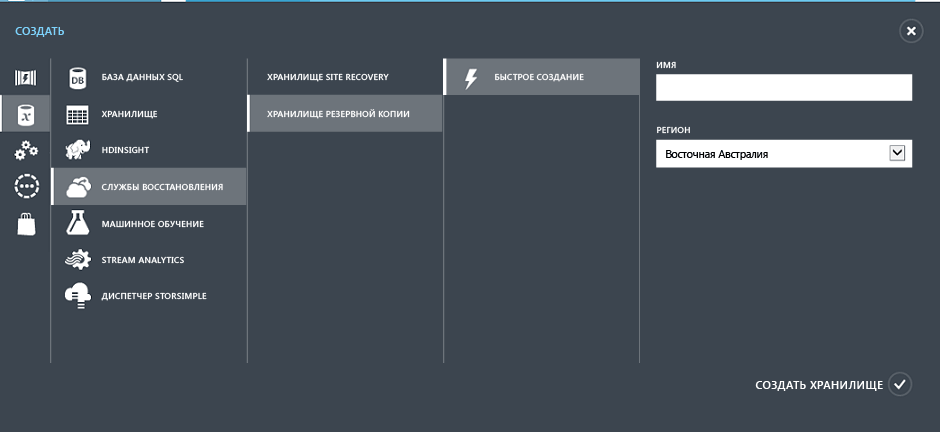
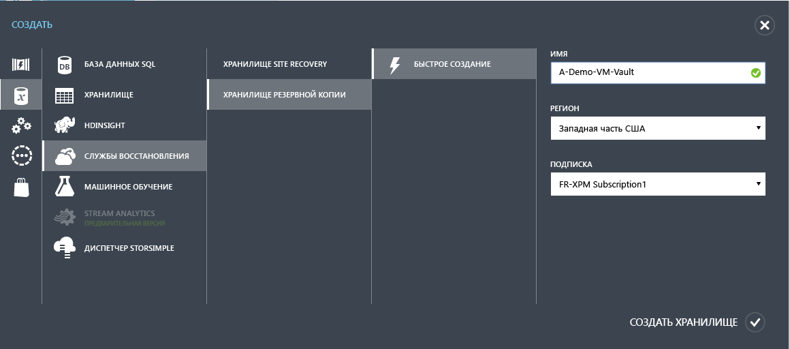
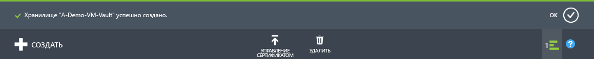
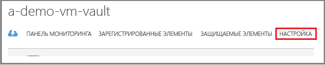
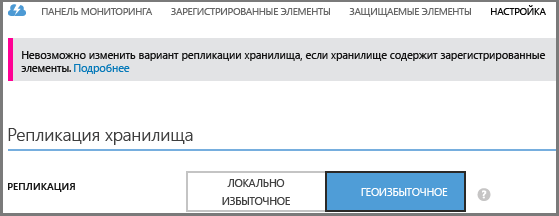

<properties
	pageTitle="Защита виртуальных машин в Azure с помощью службы архивации Azure | Microsoft Azure"
	description="Защитите виртуальные машины Azure с помощью службы архивации Azure. В этом руководстве объясняется, как создать хранилище, зарегистрировать виртуальные машины, создать политику и защитить виртуальные машины в Azure."
	services="backup"
	documentationCenter=""
	authors="markgalioto"
	manager="jwhit"
	editor=""/>

<tags
	ms.service="backup"
	ms.workload="storage-backup-recovery"
	ms.tgt_pltfrm="na"
	ms.devlang="na"
	ms.topic="hero-article"
	ms.date="04/12/2016"
	ms.author="markgal; jimpark"/>

# Первое знакомство: резервное копирование виртуальных машин Azure

> [AZURE.SELECTOR]
- [Резервное копирование виртуальных машин ARM](backup-azure-vms-first-look-arm.md)
- [Резервное копирование виртуальных машин — классическая модель](backup-azure-vms-first-look.md)

В этом руководстве описана процедура резервного копирования виртуальной машины (VM) Azure. Для успешного выполнения заданий этого руководства необходимо предварительно:

- создать виртуальную машину в подписке Azure;
- обеспечить доступ службы архивации к виртуальной машине.

Ниже представлен список основных действий, описанных в руководстве.

1. Создайте хранилище службы архивации или определите существующее хранилище службы архивации *в том же регионе, в котором расположена виртуальная машина*.
2. Обнаружение и регистрация виртуальных машин в подписке с помощью портала Azure.
3. Установите агент VM на виртуальной машине (если используется виртуальная машина из коллекции Azure, агент VM уже установлен).
4. Создание политики для защиты виртуальных машин.
5. Выполнение резервного копирования.

>[AZURE.NOTE] В Azure предусмотрены две модели развертывания, позволяющие создавать ресурсы и работать с ними: [модель Resource Manager и классическая модель](../resource-manager-deployment-model.md). Служба архивации Azure поддерживает виртуальные машины на основе Azure Resource Manager (ARM) — также они называются виртуальными машинами IaaS V2. Это руководство предназначено для использования с виртуальными машинами, которые могут быть созданы на классическом портале Azure.

## Шаг 1. Создание хранилища службы архивации для виртуальной машины

Хранилище архивации — это сущность, в которой хранятся созданные резервные копии и точки восстановления. Хранилище службы архивации также содержит политики резервного копирования, применяемые к виртуальным машинам, для которых настроена архивация.

На рисунке ниже показаны связи между разными сущностями службы архивации Azure. 

Создание хранилища службы архивации

1. Войдите на [портал Azure](http://manage.windowsazure.com/).

2. В левом нижнем углу портала Azure нажмите кнопку **Создать**

    

3. В мастере быстрого создания последовательно щелкните **Службы данных** > **Службы восстановления** > **Хранилище архивации** > **Быстрое создание**.

    

    В мастере появится запрос на ввод **имени** и **региона**. Если вы администрируете несколько подписок, откроется диалоговое окно для выбора подписки.

4. В поле **Имя** введите понятное имя хранилища. Имя должно быть уникальным в пределах подписки Azure. Введите имя длиной от 2 до 50 символов. Имя должно начинаться с буквы, оно может содержать только буквы, цифры и дефисы.

5. В поле **Область** выберите географический регион для хранилища архивации. Хранилище **должно** располагаться в том же регионе, что и виртуальные машины, которые необходимо защитить.

    Если вы не знаете точно, в каком регионе находится ваша виртуальная машина, закройте этот мастер и в списке служб Azure выберите пункт "Виртуальные машины". Название региона указано в столбце "Расположение". Если у вас есть виртуальные машины в нескольких регионах, создайте хранилище службы архивации в каждом из этих регионов.

6. Если в мастере нет диалогового окна **Подписка**, перейдите к следующему шагу. Если вы работаете с несколькими подписками, выберите из них ту, которую необходимо связать с новым хранилищем службы архивации.

    

7. Щелкните **Создать хранилище**. Для создания резервного хранилища может потребоваться некоторое время. Уведомления о состоянии процесса см. в нижней части портала.

    

    Появится сообщение о том, что хранилище успешно создано. На странице **служб восстановления** состояние хранилища имеет значение **Активно**.

    

8. В списке хранилищ на странице **служб восстановления** выберите созданное хранилище, чтобы открыть страницу **Быстрый запуск**.

    

9. На странице **Быстрый запуск** щелкните **Настройка**, чтобы открыть параметры репликации хранилища. 

10. В разделе **Репликация хранилища** выберите параметры репликации для хранилища.

    

    По умолчанию это геоизбыточное хранилище. Если вы используете Azure в качестве конечной точки основного хранилища службы архивации, рекомендуем продолжать использовать геоизбыточное хранилище. Если Azure используется как конечная точка неосновного хранилища службы архивации, можно попробовать использовать локально избыточное хранилище. Это позволит вам снизить затраты на хранение данных в Azure. Дополнительные сведения о [геоизбыточном](../storage/storage-redundancy.md#geo-redundant-storage) и [локально избыточном](../storage/storage-redundancy.md#locally-redundant-storage) хранилищах см. в этом [обзоре](../storage/storage-redundancy.md).

Выбрав параметры хранилища, вы можете приступать к связыванию виртуальной машины с хранилищем. Перед началом связывания нужно обнаружить и зарегистрировать виртуальные машины Azure.

## Шаг 2. Обнаружение и регистрация виртуальных машин Azure
Перед регистрацией VM в хранилище запустите процесс обнаружения, чтобы определить новые виртуальные машины. В ходе этого процесса в Azure отправляется запрос о предоставлении списка виртуальных машин в подписке и дополнительных сведений, в том числе имени и региона облачной службы.

1. Войдите на [портал Azure](http://manage.windowsazure.com/).

2. На классическом портале Azure щелкните **Службы восстановления**, чтобы открыть список хранилищ служб восстановления. 

3. Из списка выберите хранилище для резервного копирования виртуальной машины.

    При выборе хранилища откроется страница **Быстрый запуск**.

4. В меню хранилища выберите пункт **Зарегистрированные элементы**.

    

5. В меню **Тип** выберите пункт **Виртуальная машина Azure**.

    

6. В нижней части страницы щелкните **Обнаружить**. 

    Процесс обнаружения может длиться несколько минут, в течение которых будет создаваться таблица со списком виртуальных машин. В нижней части экрана отобразится уведомление о ходе выполнения процесса.

    

    Уведомление изменится, когда процесс завершится.

    

7. В нижней части страницы щелкните **Зарегистрировать**. 

8. В контекстном меню **Регистрация элементов** выберите виртуальные машины, которые нужно зарегистрировать. Если в меню отображаются виртуальные машины с одинаковыми именами, используйте облачную службу, чтобы идентифицировать их.

    >[AZURE.TIP] В ходе одной процедуры можно зарегистрировать несколько виртуальных машин.

    Для каждой выбранной виртуальной машины будет создано задание.

9. В уведомлении щелкните ссылку **Просмотр задания**, чтобы перейти на страницу **Задания**.

    

    Виртуальная машина также отображается в списке зарегистрированных элементов с указанием состояния операции регистрации.

    

    По завершении операции состояние изменится на *Зарегистрировано*.

    

## Шаг 3. Установка агента VM на виртуальной машине

Агент VM Azure необходимо установить на виртуальной машине Azure, чтобы обеспечить работоспособность модуля резервного копирования. Если виртуальная машина создана из коллекции Azure, на ней уже есть агент VM. Вы можете перейти к [защите виртуальных машин](backup-azure-vms-first-look.md#step-4---protect-azure-virtual-machines).

Если виртуальная машина перенесена из локального центра данных, возможно, на ней не установлен агент VM. Чтобы защитить виртуальную машину, перед продолжением необходимо установить на ней агент VM. Подробные инструкции по установке агента VM см. в [разделе "Агент виртуальной машины" статьи "Подготовка среды для резервного копирования виртуальных машин Azure"](backup-azure-vms-prepare.md#vm-agent).

## Шаг 4. Защита виртуальных машин Azure
Теперь вы можете настроить для виртуальной машины политику резервного копирования и хранения. Одним действием можно защитить несколько виртуальных машин. Хранилища службы архивации Azure, созданные после мая 2015 г., доступны со встроенной политикой по умолчанию. Эта политика определяет не только стандартный срок хранения (30 дней), но и расписание ежедневного резервного копирования.

1. На портале Azure перейдите в хранилище службы архивации в разделе **Службы восстановления**, а затем откройте вкладку **Зарегистрированные элементы**.
2. В раскрывающемся меню выберите пункт **Виртуальная машина Azure**.

    

3. В нижней части страницы щелкните **Защитить**. 

    Откроется **мастер защиты элементов** со списком *только* зарегистрированных и незащищенных виртуальных машин.

    

4. Выберите виртуальные машины, которые необходимо защитить.

    Чтобы различить несколько виртуальных машин с одинаковым именем, используйте облачную службу.

5. В меню **Настройка защиты** выберите существующую политику или создайте новую, чтобы защитить указанные виртуальные машины.

    У каждой политики резервного копирования может быть несколько связанных виртуальных машин. Но за один раз виртуальная машина может быть связана только с одной политикой.

    

    >[AZURE.NOTE] Политика резервного копирования включает схему хранения плановых резервных копий. Выбрав существующую политику резервного копирования, вы не сможете впоследствии изменить параметры хранения.

6. В разделе **Диапазон хранения** выберите нужный вариант для конкретных точек резервного копирования: ежедневно, еженедельно, ежемесячно или ежегодно.

    

    Политика хранения определяет длительность хранения резервной копии. Можно указать разные политики хранения на основе времени создания резервной копии.

7. Щелкните **Задания**, чтобы просмотреть список заданий по **настройке защиты**.

    

    Теперь, когда вы определили политику, перейдите к следующему этапу и запустите начальное резервное копирование.

## Шаг 5. Начальное резервное копирование

Защитив виртуальную машину с помощью политики, можно просмотреть связанные сведения на вкладке **Защищенные элементы**. Пока не начнется начальное резервное копирование, для параметра **Состояние защиты** будет отображаться значение **Защищено (в ожидании начального резервного копирования)**. По умолчанию *начальным резервным копированием* является первое запланированное резервное копирование.

Чтобы активировать начальное резервное копирование сразу же после настройки, выполните следующие действия.

1. В нижней части страницы **Защищенные элементы** щелкните **Создать резервную копию**. 

    Служба архивации Azure создаст задание резервного копирования для операции начального резервного копирования.

2. Чтобы просмотреть список заданий, щелкните вкладку **Задания**.

    

    По завершении начального резервного копирования на вкладке **Защищенные элементы** для виртуальной машины отобразится состояние *Защищено*.

    

    >[AZURE.NOTE] Резервное копирование виртуальных машин — локальный процесс. Создать резервную копию виртуальных машин из одного региона в хранилище службы архивации в другом регионе нельзя. Поэтому в каждом регионе Azure с виртуальными машинами, для которых требуется резервное копирование, необходимо создать как минимум одно хранилище службы архивации.

## Дальнейшие действия
Теперь, когда резервное копирование виртуальной машины успешно завершено, вы можете выполнить еще несколько действий. Логичнее всего будет ознакомиться с процессом восстановления данных на виртуальной машине. Однако существуют задачи управления, которые помогут понять, как безопасно хранить данные и сократить расходы.

- [Мониторинг виртуальных машин и управление ими](backup-azure-manage-vms.md)
- [Восстановление виртуальных машин](backup-azure-restore-vms.md)
- [Рекомендации по устранению неполадок](backup-azure-vms-troubleshoot.md)

## Вопросы?
Если вы хотите задать вопрос или предложить добавить какие-либо функции, [отправьте нам свой отзыв](http://aka.ms/azurebackup_feedback).

<!---HONumber=AcomDC_0420_2016-->