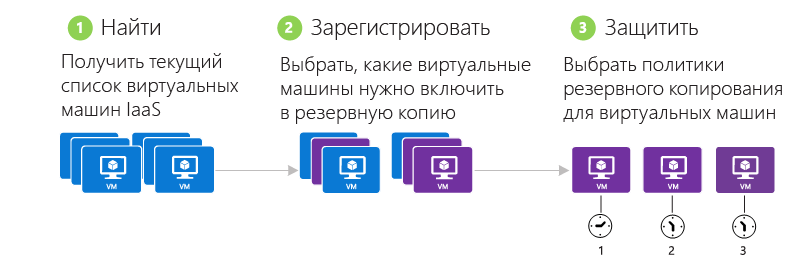
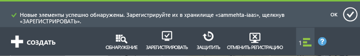
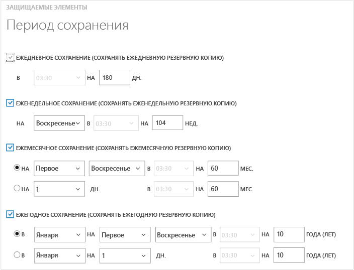
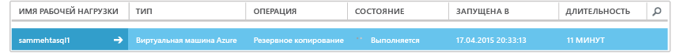
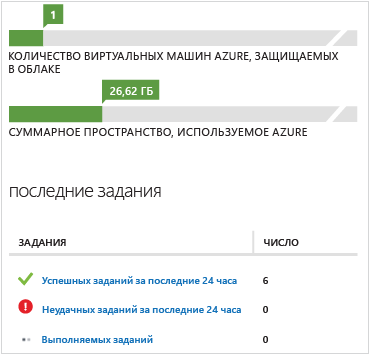

# Резервное копирование виртуальных машин Azure
> [!div class="op_single_selector"]
> * [Резервное копирование виртуальных машин в хранилище служб восстановления](backup-azure-arm-vms.md)
> * [Резервное копирование виртуальных машин в хранилище архивации](backup-azure-vms.md)
> 
> 

В этой статье описываются процедуры резервного копирования виртуальной машины (VM) Azure, развернутой с использованием классической модели развертывания, в хранилище архивации. Есть несколько задач, которые необходимо выполнить до резервного копирования виртуальной машины Azure. Выполните [предварительные требования](backup-azure-vms-prepare.md) (если вы еще этого не сделали), чтобы подготовить среду к резервному копированию виртуальных машин.

Дополнительные сведения см. в статьях о [планировании инфраструктуры архивации виртуальных машин в Azure](backup-azure-vms-introduction.md) и о [виртуальных машинах Azure](https://azure.microsoft.com/documentation/services/virtual-machines/).

> [!NOTE]
> В Azure предусмотрены две модели развертывания, позволяющие создавать ресурсы и работать с ними: [модель Resource Manager и классическая модель](../azure-resource-manager/resource-manager-deployment-model.md). Хранилище архивации может защитить только виртуальные машины, которые были развернуты с использованием классической модели развертывания. С помощью хранилища архивации невозможно защитить виртуальные машины, развернутые с использованием модели Resource Manager. Дополнительные сведения о работе с хранилищем служб восстановления см. в статье [Резервное копирование виртуальных машин Azure в хранилище служб восстановления](backup-azure-arm-vms.md).
> 
> 

Резервное копирование виртуальных машин Azure состоит из трех основных шагов.

> [!NOTE]
> Резервное копирование виртуальных машин — локальный процесс. Выполнить архивацию виртуальных машин из одного региона в хранилище архивации в другом регионе нельзя. Поэтому необходимо создать хранилище архивации в каждом регионе Azure, в котором есть виртуальные машины, которые будут архивироваться.
> 
> 

## Шаг 1. Обнаружение виртуальных машин Azure
Чтобы идентифицировать все виртуальные машины, недавно добавленные в подписку, перед регистрацией, запустите процесс обнаружения. В ходе этого процесса в Azure отправляется запрос о предоставлении списка виртуальных машин в подписке и дополнительных сведений, в том числе имени и региона облачной службы.

1. Войдите на [классический портал](http://manage.windowsazure.com/)
2. В списке служб Azure щелкните **Службы восстановления**, чтобы открыть список хранилищ служб архивации и Site Recovery.
    
3. Из списка хранилищ архивации выберите хранилище для архивации виртуальной машины.
   
    Если это новое хранилище, на портале откроется страница **быстрого запуска** .
   
    
   
    Если это уже настроенное хранилище, на портале откроется меню последних использованных элементов.
4. В меню хранилища (в верхней части страницы) щелкните **Зарегистрированные элементы**.
   
    
5. В меню **Тип** выберите пункт **Виртуальная машина Azure**.
   
    
6. В нижней части страницы щелкните **Обнаружить** .
    
   
    Процесс обнаружения может длиться несколько минут, в течение которых будет создаваться таблица со списком виртуальных машин. В нижней части экрана отобразится уведомление о ходе выполнения процесса.
   
    
   
    Уведомление изменится, когда процесс завершится. Если процессу обнаружения не удалось найти виртуальные машины, сначала убедитесь, что они существуют. Если виртуальные машины существует, убедитесь, что они находятся в одном регионе с хранилищем архивации. Если виртуальные машины существуют и находятся в том же регионе, убедитесь, что они еще не зарегистрированы в хранилище архивации. Если виртуальные машины назначены хранилищу архивации, их нельзя будет назначить другим хранилищам архивации.
   
    
   
    После обнаружения новых элементов перейдите к шагу 2 и зарегистрируйте виртуальные машины.

## Шаг 2. Регистрация виртуальных машин Azure
Чтобы связать виртуальную машину со службой архивации Azure, выполняется ее регистрация. Как правило, это разовая операция.

1. На портале Azure перейдите в хранилище архивации в разделе **Службы восстановления**, а затем откройте вкладку **Зарегистрированные элементы**.
2. В раскрывающемся меню выберите пункт **Виртуальная машина Azure** .
   
    
3. В нижней части страницы щелкните **Зарегистрировать** .
    
4. В контекстном меню **Регистрация элементов** выберите виртуальные машины, которые нужно зарегистрировать. Если в меню отображаются виртуальные машины с одинаковыми именами, используйте облачную службу, чтобы идентифицировать их.
   
   > [!TIP]
   > В ходе одной процедуры можно зарегистрировать несколько виртуальных машин.
   > 
   > 
   
    Для каждой выбранной виртуальной машины будет создано задание.
5. В уведомлении щелкните **Просмотреть задание**, чтобы перейти на страницу **Задания**.
   
    
   
    Виртуальная машина также отображается в списке зарегистрированных элементов с указанием состояния операции регистрации.
   
    
   
    По завершении операции состояние изменится на *registered* (зарегистрировано).
   
    

## Шаг 3. Защита виртуальных машин Azure
Теперь вы можете настроить для виртуальной машины политику резервного копирования и хранения. Одним действием можно защитить несколько виртуальных машин.

Хранилища службы архивации Azure, созданные после мая 2015 г., доступны со встроенной политикой по умолчанию. Эта политика определяет не только стандартный срок хранения (30 дней), но и расписание ежедневного резервного копирования.

1. На портале Azure перейдите в хранилище архивации в разделе **Службы восстановления**, а затем откройте вкладку **Зарегистрированные элементы**.
2. В раскрывающемся меню выберите пункт **Виртуальная машина Azure** .
   
    
3. В нижней части страницы щелкните **ЗАЩИТИТЬ** .
   
    Откроется **мастер защиты элементов** . В этом мастере перечислены только незарегистрированные и незащищенные виртуальные машины. Выберите виртуальные машины, которые необходимо защитить.
   
    При наличии двух или нескольких виртуальных машин с одинаковым именем используйте облачную службу, чтобы их различить.
   
   > [!TIP]
   > Можно защитить несколько виртуальных машин одновременно.
   > 
   > 
   
    
4. Выберите **расписание резервного копирования** , чтобы создать резервную копию выбранных виртуальных машин. Выберите политику из существующего набора или создайте новую.
   
    У каждой политики резервного копирования может быть несколько связанных виртуальных машин. Но в определенный момент времени виртуальная машина может быть связана только с одной политикой.
   
    
   
   > [!NOTE]
   > Политика резервного копирования включает схему хранения плановых резервных копий. Выбрав существующую политику архивации, вы не сможете изменить параметры хранения впоследствии.
   > 
   > 
5. Выберите **диапазон хранения** , который нужно связать с резервными копиями.
   
    
   
    Политика хранения определяет длительность хранения резервной копии. Можно указать разные политики хранения на основе времени создания резервной копии. Например, точка ежедневной архивации (которая служит точкой оперативного восстановления) может храниться в течение 90 дней. В то же время точка архивации, которая обновляется в конце каждого квартала (и служит для целей аудита) может храниться в течение нескольких месяцев или лет.
   
    
   
    Описание политик, приведенных на изображении выше:
   
   * **Ежедневная политика хранения**. Резервные копии, создаваемые ежедневно, хранятся в течение 30 дней.
   * **Еженедельная политика хранения**. Резервные копии, создаваемые каждое воскресенье, хранятся 104 недели.
   * **Ежемесячная политика хранения**. Резервные копии, создаваемые в последнее воскресенье каждого месяца, хранятся 120 месяцев.
   * **Ежегодная политика хранения**. Резервные копии, создаваемые в первое воскресенье января, хранятся 99 лет.
     
     Чтобы настроить политику защиты и связать ее с виртуальными машинами, для каждой выбранной виртуальной машины создается задание.
6. Чтобы просмотреть список заданий **настройки защиты**, в меню "Хранилища" щелкните **Задания** и выберите **Настройка защиты** для фильтра **Операция**.
   
    

## Начальное резервное копирование
Виртуальная машина, защищенная политикой, появится на вкладке **Защищенные элементы** с состоянием *Защищено (в ожидании начального резервного копирования)*. По умолчанию *начальным резервным копированием*является первое запланированное резервное копирование.

Чтобы активировать начальное резервное копирование сразу же после настройки, выполните следующие действия.

1. В нижней части страницы **Защищенные элементы** щелкните **Выполнить архивацию**.
   
    Служба архивации Azure создаст задание резервного копирования для операции начального резервного копирования.
2. Чтобы просмотреть список заданий, щелкните вкладку **Задания** .
   
    

> [!NOTE]
> В ходе архивации служба архивации Azure отправляет расширению архивации на каждой виртуальной машине команду освободить все задания записи и сделать согласованный моментальный снимок.
> 
> 

После завершения начальной архивации состояние виртуальной машины на вкладке **Защищенные элементы** изменится на *Защищено*.

## Просмотр состояния резервного копирования и подробностей
После обеспечения защиты число виртуальных машин также увеличивается на странице сводки **Панели мониторинга** . На странице **Панель мониторинга** также отображается количество *успешных*, *завершившихся сбоем* и *выполняющихся* заданий за последние 24 часа. На странице **Задания** используйте меню **Состояние**, **Операция**, **Из** и **Кому**, чтобы отфильтровать задания.

Значения на панели мониторинга обновляются каждые 24 часа.

## Устранение ошибок
Если во время архивации виртуальной машины возникнут проблемы, см. статью об [устранении неполадок при архивации виртуальных машин Azure](backup-azure-vms-troubleshoot.md).

## Дальнейшие действия
* [Мониторинг виртуальных машин и управление ими](backup-azure-manage-vms.md)
* [Восстановление виртуальных машин](backup-azure-restore-vms.md)

<!--HONumber=Nov16_HO4-->

