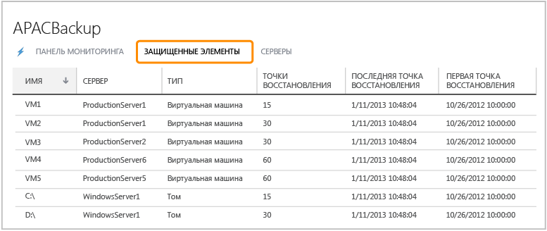
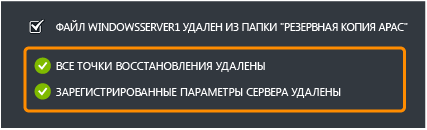

<properties 
	pageTitle="Настройка службы архивации Azure для быстрой и удобной архивации Windows Server" 
	description="С помощью данного учебника можно получить необходимые навыки по использованию службы архивации в облачных решениях Microsoft Azure для архивирования Windows Server в облачную среду." 
	services="backup" 
	documentationCenter="" 
	authors="markgalioto" 
	manager="jwhit" 
	editor="tysonn"/>

<tags 
	ms.service="backup" 
	ms.workload="storage-backup-recovery" 
	ms.tgt_pltfrm="na" 
	ms.devlang="na" 
	ms.topic="article" 
	ms.date="06/03/2015" 
	ms.author="markgal"/>

#Настройка службы архивации Azure для быстрой и удобной архивации Windows Server

Для работы с этим учебником требуется учетная запись Azure. В этом учебнике рассказывается о том, как включить службу архивации Azure.
>[AZURE.NOTE]Ранее требовалось создать или получить сертификат X.509 v3 для регистрации сервера архивации. Сертификаты по-прежнему поддерживаются, но теперь, чтобы облегчить регистрацию хранилища Azure на сервере, можно создавать учетные данные хранилища прямо на странице «Быстрый запуск». Если ее нет, можно создать бесплатную пробную учетную запись всего за несколько минут. Дополнительные сведения см. в разделе [Бесплатная пробная версия Azure](https://azure.microsoft.com/pricing/free-trial/).

Для архивации файлов и данных из Windows Server в Azure необходимо создать хранилище архивации в том географическом регионе, где вы хотите хранить данные. В этом руководстве представлена информация о:

- создании хранилища для хранения резервных копий;
- скачивании учетных данных хранилища;
- установке агента службы резервного копирования;
- задачах управления резервным копированием, которые можно выполнять на портале управления (краткий обзор).

##Создание хранилища архивации

1. Выполните вход на [Портал управления](https://manage.windowsazure.com).
2. Последовательно щелкните **Создать** > **Службы данных** > **Службы восстановления** > **Хранилище архивации** > **Быстрое создание**.
3. В поле **Имя** введите понятное имя для идентификации хранилища архивации.
4. В разделе **Регион** выберите географический регион для хранилища службы архивации.

    

5. Щелкните **Создать хранилище**.

    Для создания резервного хранилища может потребоваться некоторое время. Для проверки состояния можно отслеживать уведомления в нижней части портала. После создания хранилища службы архивации появится сообщение об успешном создании хранилища, а само хранилище будет отмечено в ресурсах для служб восстановления как **Активное**.

    

6. Если с учетной записью вашей организации связано несколько подписок, выберите учетную запись, которую следует связать с хранилищем архивации.

##Скачивание учетных данных хранилища

Учетные данные хранилища замещают сертификаты как способ регистрации службы Azure на вашем сервере. Сертификаты по-прежнему можно использовать, но учетные записи хранилища более удобны, так как для генерирования и скачивания учетных данных вы используете портал Azure.

1. Выполните вход на [Портал управления](https://manage.windowsazure.com).
2. Щелкните **Службы восстановления**, затем выберите хранилище архивации, которое необходимо зарегистрировать на сервере. Появится страница «Быстрый запуск» для этого хранилища архивации.
3. На **странице быстрого запуска** щелкните **Загрузить учетные данные хранилища**, чтобы портал начал процесс создания и скачивания учетных данных хранилища, которые будут использоваться для регистрации вашего сервера в хранилище службы архивации.

    Портал создаст учетные данные хранилища с помощью сочетания имени хранилища и текущей даты.

4. Щелкните **Сохранить**, чтобы скачать учетные данные хранилища в папку скачиваемых файлов локальной учетной записи, или выберите пункт **Сохранить как** в меню **Сохранить**, чтобы указать расположение учетных данных хранилища. Изменить учетные данные хранилища нельзя, поэтому нет смысла щелкать «Открыть». После скачивания учетных данных вам предложат открыть папку. Щелкните **x**, чтобы закрыть это меню.

##Скачивание и установка агента архивации

1. На [портале управления Azure](https://manage.windowsazure.com).
2. Щелкните **Службы восстановления**, а затем выберите хранилище архивации, чтобы просмотреть соответствующую страницу «Быстрый запуск».
3. На странице «Быстрый запуск» выберите тип агента для скачивания. Можно выбрать **Скачать Azure Backup Agent**, **Windows Server и System Center Data Protection Manager** или **Windows Server Essentials**. Дополнительные сведения см. в разделах:

	* [Установка агента службы архивации Azure для Windows Server 2012 и System Center 2012 с пакетом обновления 1 (SP1) — Data Protection Manager](http://technet.microsoft.com/library/hh831761.aspx#BKMK_installagent)
	* [Установка агента службы архивации Azure для Windows Server 2012 Essentials](http://technet.microsoft.com/library/jj884318.aspx)

После установки агента можно воспользоваться соответствующим локальным интерфейсом управления (например, оснасткой консоли управления (MMC), консолью System Center Data Protection Manager или панелью мониторинга Windows Server Essentials), чтобы настроить политику архивации для данного сервера.

##Управление хранилищами и серверами архивации

1. Выполните вход на [Портал управления](https://manage.windowsazure.com).
2. Щелкните **Службы восстановления** и выберите имя хранилища архивации, чтобы просмотреть соответствующую страницу «Быстрый запуск».
3. Щелкните **Панель мониторинга**, чтобы посмотреть обзор использования сервера. Вот какие задачи можно выполнять в нижней части панели мониторинга:

    - **Управление сертификатом**. Если для регистрации сервера использовался сертификат, тогда следует использовать эту функцию, чтобы обновить сертификат. При использовании учетных данных хранилища не используйте пункт **Управление сертификатом**.
    - **Удалить**. Удаляет текущее хранилище архивации. Если хранилище архивации больше не используется, его можно удалить для освобождения места. Элемент **Удалить** становится доступен только после удаления из хранилища всех зарегистрированных серверов.
    - **Учетные данные хранилища**. Используйте этот элемент меню «Быстрый просмотр» для настройки учетных данных хранилища.

4. Щелкните элемент **Защищенные элементы** для просмотра элементов, заархивированных с серверов. Этот список предназначен только для информационных целей.

    

5. Щелкните элемент **Серверы** для просмотра имен серверов, зарегистрированных в этом хранилище. Отсюда можно выполнять следующие задачи:

    - **Разрешить повторную регистрацию**. Когда для сервера выбран этот параметр, можно воспользоваться доступным в агенте мастером регистрации, чтобы зарегистрировать сервер для хранилища архивации во второй раз. Повторная регистрация может потребоваться из-за ошибки в сертификате или перестроения сервера. Повторную регистрацию для отдельного имени сервера можно выполнять только один раз.
    - **Удалить**. Удаляет сервер из хранилища архивации. Все сохраненные данные, связанные с этим сервером, сразу же удаляются.

        

##Дальнейшие действия

- Дополнительную информацию о службе архивации Azure см. в разделе [Общие сведения о резервном копировании Azure](http://go.microsoft.com/fwlink/p/?LinkId=222425). 
- Посетите [форум о службе архивации Azure](http://go.microsoft.com/fwlink/p/?LinkId=290933).

 

<!---HONumber=July15_HO4-->