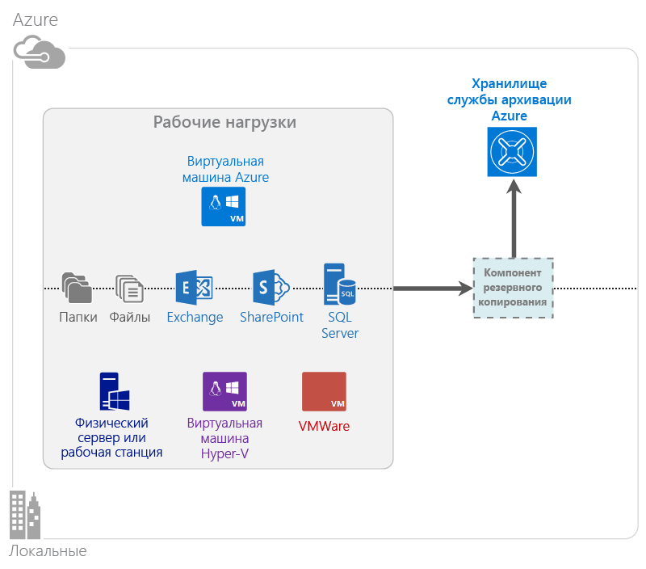

<properties
	pageTitle="Что такое служба архивации Azure | Microsoft Azure"
	description="С помощью службы архивации и служб восстановления Azure можно создавать резервные копии и восстанавливать данные и приложения на серверах Windows, клиентских компьютерах Windows, серверах System Center DPM и виртуальных машинах Azure."
	services="backup"
	documentationCenter=""
	authors="Jim-Parker"
	manager="jwhit"
	editor="tysonn"
	keywords="резервное копирование и восстановление; службы восстановления; решения для резервного копирования"/>

<tags
	ms.service="backup"
	ms.workload="storage-backup-recovery"
	ms.tgt_pltfrm="na"
	ms.devlang="na"
	ms.topic="get-started-article"
	ms.date="07/21/2016"
	ms.author="jimpark; trinadhk"/>

# Что такое служба архивации Azure?
Служба архивации Azure — служба, используемая для резервного копирования и восстановления данных в Microsoft Cloud. Она заменяет существующее локальное или автономное решение для резервного копирования на надежное, безопасное и конкурентоспособное облачное решение. Она также позволяет защитить ресурсы-контейнеры, которые используются в облаке. Служба архивации Azure предоставляет службы восстановления на основе масштабируемой, долговечной и высокодоступной инфраструктуры мирового уровня.

[Просмотрите видеообзор службы архивации Azure](https://azure.microsoft.com/documentation/videos/what-is-azure-backup/)

## Зачем использовать службу архивации Azure?
Традиционные решения для резервного копирования используют облако в качестве конечной точки подобно диску или магнитной ленте. Несмотря на простоту, у этого подхода есть ограничения. Он не позволяет использовать все преимущества базовой облачной платформы, вынуждая прибегать к неэффективному и дорогому решению. В то же время служба архивации Azure реализует все преимущества мощного и доступного облачного решения для резервного копирования. Ниже приведены некоторые из основных преимуществ службы архивации Azure.

| Функция | Преимущество |
| ------- | ------- |
| Автоматическое управление хранилищем | Отсутствие существенных затрат на локальные устройства хранения данных. Служба архивации Azure обеспечивает автоматическое выделение хранилища для резервных копий и управление им, при этом оплата осуществляется по мере использования. |
| Неограниченное масштабирование | Вы можете использовать все преимущества гарантии высокой доступности без расходов на обслуживание и мониторинг. Служба архивации Azure использует базовые возможности и масштабирование облака Azure, а также возможности ненавязчивого автоматического масштабирования. |
| Несколько вариантов хранения | Выберите хранилище для резервных копий в соответствии со своими потребностями. <li>Локально избыточное хранилище блочных BLOB-объектов идеально подходит для клиентов, задумывающихся о расходах. При этом решение обеспечивает защиту данных от сбоев локального оборудования. <li>Хранилище блочных BLOB-объектов с георепликацией предоставляет три дополнительные копии в сопряженном центре обработки данных. Это гарантирует высокую доступность данных резервных копий даже в случае аварии на уровне веб-сайта Azure. |
| Отсутствие ограничений на передачу данных | Исходящие данные, передаваемые во время восстановления из хранилища службы архивации, не тарифицируются. Входящие данные, передаваемые в хранилище Azure, также не тарифицируются. Передачу данных можно использовать со службой импорта, если она доступна. |
| Шифрование данных | Шифрование данных обеспечивает безопасность при передаче данных клиента в общедоступное облако и их хранении там. Парольная фраза для шифрования содержится в источнике и никогда не передается и не хранится в Azure. Для восстановления любых данных необходим ключ шифрования, и только у клиента есть полный доступ к данным в службе. |  
| Согласованные с приложениями резервные копии | Согласованность резервных копий с приложениями в Windows гарантирует, что во время восстановления не потребуется исправление. Это сокращает целевое время восстановления и позволяет пользователям быстрее вернутся к работе. |
| Длительный период удержания | Вместо того чтобы платить за использование автономных решений резервного копирования на магнитную ленту, клиенты могут выполнять резервное копирование в службу Azure. Возможности последней функционально сопоставимы с возможностями решения резервного копирования на магнитную ленту, но отличаются низкой стоимостью. |

## Компоненты службы архивации Azure
Так как служба архивации — это гибридное решение для резервного копирования, она состоит из нескольких компонентов, которые работают вместе, позволяя полностью реализовать рабочие процессы резервного копирования и восстановления.

### Сценарии развертывания

| Компонент | Можно развернуть в Azure? | Можно развернуть локально? | Поддерживаемое целевое хранилище|
| --- | --- | --- | --- |
| Агент службы архивации Azure | 
**Да**
 
Агент службы архивации Azure можно развернуть на любой виртуальной машине Windows Server в Azure
 | 
**Да**
 
Агент службы архивации можно развернуть на любой виртуальной машине Windows Server и на любом физическом компьютере
 | 
Хранилище службы архивации Azure
 |
| System Center Data Protection Manager (DPM) | 
**Да**
 
Узнайте больше о том, [как защитить рабочие нагрузки в Azure с помощью System Center DPM](http://blogs.technet.com/b/dpm/archive/2014/09/02/azure-iaas-workload-protection-using-data-protection-manager.aspx)
 | 
**Да**
 
Узнайте больше о том, [как защитить рабочие нагрузки и виртуальные машины в центре обработки данных](https://technet.microsoft.com/library/hh758173.aspx)
 | 
Локально подключенный диск,
 
хранилище службы архивации Azure,
 
магнитная лента (только локально)
 |
| Сервер службы архивации Azure | 
**Да**
 
Узнайте больше о том, [как защитить рабочие нагрузки в Azure с помощью сервера службы архивации Azure](backup-azure-microsoft-azure-backup.md)
 | 
**Да**
 
Узнайте больше о том, [как защитить рабочие нагрузки в Azure с помощью сервера службы архивации Azure](backup-azure-microsoft-azure-backup.md)
 | 
Локально подключенный диск,
 
хранилище службы архивации Azure
 |
| Служба архивации Azure (расширение виртуальной машины) | 
**Да**
 
Принадлежит к структуре Azure

Предназначена специально для [резервного копирования виртуальных машин IaaS Azure](backup-azure-vms-introduction.md)
 | 
**Нет**
 
Используйте System Center DPM для резервного копирования виртуальных машин в центре обработки данных
 | 
Хранилище службы архивации Azure
 |

### Преимущества и ограничения компонентов

| Компонент | Преимущества | Ограничения | Восстанавливаемые объекты |
| --- | --- | --- | --- |
| Агент службы архивации Azure | <li>Может создавать резервные копии файлов и папок на физических или виртуальных компьютерах с Windows (виртуальные машины могут быть расположены локально или в Azure).<li>Отдельный сервер для резервных копий не требуется.<li>Используется хранилище службы архивации Azure | <li>Задания резервного копирования, а также восстановления файлов ограничены до трех в день.<li>Восстанавливаются файлы, папки или тома, но не приложения.<li>Linux не поддерживается | Файлы, папки и тома |
| System Center Data Protection Manager | <li>Поддерживаются моментальные снимки для приложений (VSS).<li>Гибкая настройка времени создания резервных копий.<li>Полное восстановление.<li>Может использоваться хранилище службы архивации Azure.<li>Поддерживаются виртуальные машины Linux (размещенные в Hyper-V) | <li>Разнородное резервное копирование (виртуальных машин VMware, рабочих нагрузок Oracle) не поддерживается | Файлы, папки, тома , виртуальные машины и приложения |
| Сервер службы архивации Microsoft Azure | <li>Поддерживаются моментальные снимки для приложений (VSS).<li>Гибкая настройка времени создания резервных копий.<li>Полное восстановление.<li>Может использоваться хранилище службы архивации Azure.<li>Поддерживаются виртуальные машины Linux (размещенные в Hyper-V).<li>Лицензия System Center не требуется | <li>Разнородное резервное копирование (виртуальных машин VMware, рабочих нагрузок Oracle) не поддерживается.<li>Всегда требуется активная подписка Azure.<li>Резервное копирование на магнитную ленту не поддерживается | Файлы, папки, тома , виртуальные машины и приложения |
| Служба архивации виртуальных машин Azure IaaS | <li>Собственные технологии резервного копирования для Windows и Linux.<li>Установка агентов не требуется.<li>Поддерживается резервное копирование на уровне структуры. Для этого не требуется инфраструктура | <li>Резервное копирование и восстановление дисков один раз в день.<li>Резервное копирование в локальной среде не поддерживается | Виртуальные машины Все диски (с помощью PowerShell) |

## Приложения и рабочие нагрузки, для которых можно создать резервную копию

| Рабочая нагрузка | Исходный компьютер | Решение службы архивации Azure |
| --- | --- |---|
| Файлы и папки | Windows Server | 
[Агент службы архивации Azure](backup-configure-vault.md),
 
[System Center DPM](backup-azure-dpm-introduction.md) (и агент службы архивации Azure),
 
[сервер службы архивации Azure](backup-azure-microsoft-azure-backup.md) (включает в себя агент службы архивации Azure)
 |
| Файлы и папки | Клиент Windows | 
[Агент службы архивации Azure](backup-configure-vault.md),
 
[System Center DPM](backup-azure-dpm-introduction.md) (и агент службы архивации Azure),
 
[сервер службы архивации Azure](backup-azure-microsoft-azure-backup.md) (включает в себя агент службы архивации Azure)
 |
| Виртуальная машина Hyper-V (Windows) | Windows Server | 
[System Center DPM](backup-azure-backup-sql.md) (и агент службы архивации Azure),
 
[сервер службы архивации Azure](backup-azure-microsoft-azure-backup.md) (включает в себя агент службы архивации Azure)
 |
| Виртуальная машина Hyper-V (Linux) | Windows Server | 
[System Center DPM](backup-azure-backup-sql.md) (и агент службы архивации Azure),
 
[сервер службы архивации Azure](backup-azure-microsoft-azure-backup.md) (включает в себя агент службы архивации Azure)
 |
| Microsoft SQL Server | Windows Server | 
[System Center DPM](backup-azure-backup-sql.md) (и агент службы архивации Azure),
 
[сервер службы архивации Azure](backup-azure-microsoft-azure-backup.md) (включает в себя агент службы архивации Azure)
 |
| Microsoft SharePoint | Windows Server | 
[System Center DPM](backup-azure-backup-sql.md) (и агент службы архивации Azure),
 
[сервер службы архивации Azure](backup-azure-microsoft-azure-backup.md) (включает в себя агент службы архивации Azure)
 |
| Microsoft Exchange | Windows Server | 
[System Center DPM](backup-azure-backup-sql.md) (и агент службы архивации Azure),
 
[сервер службы архивации Azure](backup-azure-microsoft-azure-backup.md) (включает в себя агент службы архивации Azure)
 |
| Виртуальные машины IaaS Azure (Windows)| — | [Служба архивации Azure (расширение виртуальной машины)](backup-azure-vms-introduction.md) | | Виртуальные машины Azure IaaS (Linux) | — | [Служба архивации Azure (расширение виртуальной машины)](backup-azure-vms-introduction.md) |

## Поддержка ARM и Linux

| Компонент | Поддержка ARM | Поддержка Linux (рекомендованная для Azure) |
| --- | --- | --- |
| Агент службы архивации Azure | Да | Нет (только агент для Windows) |
| System Center Data Protection Manager | Да (агент в гостевой ОС) | Только для виртуальных машин Hyper-V (но не Azure) возможно резервное копирование с согласованием файлов |
| Сервер службы архивации Azure | Да (агент в гостевой ОС) | Только для виртуальных машин Hyper-V (но не Azure) возможно резервное копирование с согласованием файлов (как и с помощью DPM) |
| Служба архивации виртуальных машин Azure IaaS | Да | Да |

[AZURE.INCLUDE [learn-about-deployment-models](../../includes/learn-about-deployment-models-include.md)]

## Резервное копирование и восстановление виртуальных машин хранилища класса Premium

Служба архивации Azure теперь защищает и виртуальные машины хранилища класса Premium.

### Резервное копирование ВМ хранилища класса Premium

Когда служба архивации выполняет резервное копирование виртуальных машин хранилища класса Premium, она создает временное расположение промежуточного хранения в учетной записи хранилища класса Premium. Это расположение промежуточного хранения получает имя "AzureBackup-", а его размер равен полному размеру данных на дисках хранилища класса Premium, подключенных к виртуальной машине.

>[AZURE.NOTE] Не изменяйте свойства или содержимое этого расположения.

После завершения задания резервного копирования расположение промежуточного хранения удаляется. Плата за использование расположения промежуточного хранения взимается в соответствии с [тарифами на использование хранилища класса Premium](../storage/storage-premium-storage.md#pricing-and-billing).

### Восстановление ВМ хранилища класса Premium

Виртуальную машину хранилища класса Premium можно восстановить в это же хранилище или обычное. Восстановление ВМ хранилища класса Premium из точки восстановления обратно в хранилище выполняется так же, как любой обычный процесс восстановления. Обратите внимание, что в целях экономии можно восстановить ВМ хранилища класса Premium в стандартное хранилище. Такой тип восстановления удобен, если нужно только получить доступ к некоторым файлам виртуальной машины.

## Функции
В пяти таблицах ниже содержатся сводные сведения о том, как реализованы функции службы архивации в каждом компоненте.

### Хранилище

| Функция | Агент службы архивации Azure | System Center DPM | Сервер службы архивации Azure | Служба архивации Azure (расширение виртуальной машины) |
| ------- | --- | --- | --- | ---- |
| Хранилище службы архивации Azure | ![Да][green] | ![Да][green] | ![Да][green] | ![Да][green] |
| Дисковый накопитель | | ![Да][green] | ![Да][green] | |
| Ленточный накопитель | | ![Да][green] | | |
| Сжатие (в резервном хранилище) | ![Да][green] | ![Да][green]| ![Да][green] | |
| Добавочное резервное копирование | ![Да][green] | ![Да][green] | ![Да][green] | ![Да][green] |
| Дедупликация диска | | ![Частично][yellow] | ![Частично][yellow]| | |

Хранилище службы архивации — предпочтительное хранилище для всех компонентов. С помощью System Center DPM и резервного копирования вы также можете выполнять копирование локального диска. Однако только System Center DPM позволяет записывать данные на ленточный накопитель для хранения.

#### Добавочное резервное копирование
Независимо от целевого хранилища (диск, магнитная лента, хранилище службы архивации) каждый компонент поддерживает добавочное резервное копирование. Добавочное резервное копирование гарантирует эффективное использование времени и ресурсов хранилища во время резервного копирования, передавая только изменения, внесенные с момента последнего резервного копирования.

#### Сжатие
Резервные копии сжимаются, чтобы сократить требуемый объем хранилища. Единственный компонент, для которого не выполняется сжатие, — это расширение виртуальной машины. Для этого компонента все данные резервных копий копируются из пользовательской учетной записи хранения в хранилище службы архивации в том же регионе без сжатия. Хотя это немного увеличивает используемый объем хранилища, хранение данных без сжатия позволяет сократить время восстановления.

#### Дедупликация
Для System Center DPM и сервера службы архивации поддерживается дедупликация при [развертывании на виртуальной машине Hyper-V](http://blogs.technet.com/b/dpm/archive/2015/01/06/deduplication-of-dpm-storage-reduce-dpm-storage-consumption.aspx). Дедупликация (соответствующая функция Windows Server) выполняется на уровне узла на виртуальных жестких дисках, подключенных к виртуальной машине в качестве хранилища службы архивации.

>[AZURE.WARNING] Дедупликация в Azure недоступна ни для одного из компонентов службы архивации. При развертывании System Center DPM и сервера службы архивации в Azure нельзя выполнить дедупликацию дисков, подключенных к виртуальной машине.

### Безопасность

| Функция | Агент службы архивации Azure | System Center DPM | Сервер службы архивации Azure | Служба архивации Azure (расширение виртуальной машины) |
| ------- | --- | --- | --- | ---- |
| Сетевая безопасность (в Azure) | ![Да][green] |![Да][green] | ![Да][green] | ![Частично][yellow]|
| Защита данных (в Azure) | ![Да][green] |![Да][green] | ![Да][green] | ![Частично][yellow]|

Все данные трафика резервного копирования с серверов в хранилище службы архивации подвергаются шифрованию с использованием AES 256. Данные передаются через защищенное соединение HTTPS. Данные резервных копий также хранятся в зашифрованном виде в хранилище службы архивации. Парольная фраза для расшифровки есть только у клиента. Мы не можем расшифровывать данные резервных копий.

>[AZURE.WARNING] Ключ, используемый для шифрования резервной копии данных, есть только у клиента. Мы не храним копии ключей в Azure и не имеет к ключам никакого доступа. При утрате ключа Майкрософт не сможет восстановить данные из резервных копий.

Чтобы выполнять резервное копирование виртуальных машин Azure, необходимо настроить шифрование *в рамках* виртуальной машины. На виртуальных машинах Windows используйте средство BitLocker, а на виртуальных машинах Linux — **dm-crypt**. Служба архивации Azure не предусматривает автоматическое шифрование резервных копий данных, поступающих по указанному пути.

### Поддерживаемые рабочие нагрузки

| Функция | Агент службы архивации Azure | System Center DPM | Сервер службы архивации Azure | Служба архивации Azure (расширение виртуальной машины) |
| ------- | --- | --- | --- | ---- |
| Для компьютеров Windows Server: файлы и папки | ![Да][green] | ![Да][green] | ![Да][green] | |
| Для клиентских компьютеров Windows: файлы и папки | ![Да][green] | ![Да][green] | ![Да][green] | |
| Виртуальная машина Hyper-V (Windows) | | ![Да][green] | ![Да][green] | |
| Виртуальная машина Hyper-V (Linux) | | ![Да][green] | ![Да][green] | |
| Microsoft SQL Server | | ![Да][green] | ![Да][green] | |
| Microsoft SharePoint | | ![Да][green] | ![Да][green] | |
| Microsoft Exchange | | ![Да][green] | ![Да][green] | |
| Виртуальная машина Azure (Windows) | | | | ![Да][green] |
| Виртуальная машина Azure (Linux) | | | | ![Да][green] |

### Сеть

| Функция | Агент службы архивации Azure | System Center DPM | Сервер службы архивации Azure | Служба архивации Azure (расширение виртуальной машины) |
| ------- | --- | --- | --- | ---- |
| Сжатие в сети (на сервер службы архивации) | | ![Да][green] | ![Да][green] | |
| Сжатие в сети (в хранилище службы архивации) | ![Да][green] | ![Да][green] | ![Да][green] | |
| Сетевой протокол (на сервер службы архивации) | | TCP | TCP | |
| Сетевой протокол (в хранилище службы архивации) | HTTPS | HTTPS | HTTPS | HTTPS |

Так как расширение виртуальных машин считывает данные напрямую из учетной записи хранения Azure по сети хранения данных, оптимизация этого трафика не обязательна. Трафик проходит по локальной сети хранения в центре обработки данных Azure, поэтому потребность в сжатии данных для сохранения пропускной способности сводится к минимуму.

Если вы копируете свои данные на сервер службы архивации (DPM или сервер службы архивации), в целях экономии пропускной способности данные, передаваемые с основного сервера на сервер службы архивации, можно сжать.

#### Регулирование сети
В агенте службы архивации Azure реализована функция регулирования, которая позволяет управлять использованием пропускной способности сети при передаче данных. Регулирование может быть полезно, если вам нужно создать резервную копию данных в рабочее время так, чтобы операция копирования не мешала другим процессам, связанным с обработкой интернет-данных. Регулирование передачи данных применяется при резервном копировании и восстановлении.

### Резервное копирование и период удержания

| | Агент службы архивации Azure | System Center DPM | Сервер службы архивации Azure | Служба архивации Azure (расширение виртуальной машины) |
| --- | --- | --- | --- | --- |
| Частота резервного копирования (в хранилище службы архивации) | Три резервных копии в день | Две резервных копии в день |Две резервных копии в день | Одна резервная копия в день |
| Частота резервного копирования (на диск) | Не применяется | 
Каждые 15 минут для SQL Server
 
Каждый час для других рабочих нагрузок
 | 
Каждые 15 минут для SQL Server
 
Каждый час для других рабочих нагрузок
 |Не применяется |
| Параметры хранения | Ежедневно, еженедельно, ежемесячно, ежегодно | Ежедневно, еженедельно, ежемесячно, ежегодно | Ежедневно, еженедельно, ежемесячно, ежегодно |Ежедневно, еженедельно, ежемесячно, ежегодно |
| Срок хранения | До 99 лет | До 99 лет | До 99 лет | До 99 лет |
| Точки восстановления в хранилище службы архивации | Без ограничений | Без ограничений | Без ограничений | Без ограничений |
| Точки восстановления на локальном диске | Не применяется | 64 для файловых серверов,  448 для серверов приложений | 64 для файловых серверов,  448 для серверов приложений |Не применяется |
| Точки восстановления на ленточном накопителе | Не применяется | Без ограничений | Не применяется | Не применяется |

## Что такое файл учетных данных хранилища

Файл учетных данных хранилища представляет собой сертификат, который создается порталом для каждого хранилища архивации. Затем портал отправляет открытый ключ в службу контроля доступа (ACS). Закрытый ключ предоставляется пользователю при загрузке учетных данных; его нужно указать во время регистрации компьютера. Закрытый ключ используется для проверки подлинности компьютера при отправке данных резервных копий в указанное хранилище в службе архивации Azure.

Учетные данные хранилища используются только в рабочем процессе регистрации. За безопасность файла учетных данных хранилища отвечает пользователь. Если файл попадет в руки посторонних лиц, им могут воспользоваться для регистрации других компьютеров в том же хранилище. Но так как резервные копии данных зашифрованы с помощью парольной фразы (она известна только пользователю), существующие данные резервных копий не будут скомпрометированы. Чтобы устранить эту проблему, для учетных данных хранилища настроен срок действия в 48 часов. Хотя учетные данные хранилища можно загружать неограниченное количество раз, только последний загруженный файл можно использовать для регистрации.

## Чем служба архивации Azure отличается от Azure Site Recovery?
Многие клиенты путают восстановление резервных копий и аварийное восстановление. В обоих случаях происходит сбор данных и предоставляется семантика восстановления, но основные предлагаемые преимущества процессов отличаются.

Служба архивации Azure позволяет создавать резервные копии данных локально или в облаке. Azure Site Recovery обеспечивает координирование репликации, отработки отказа и восстановления размещения виртуальных машин и физических серверов. Обе службы важны, так как решение по аварийному восстановлению данных должно не только обеспечивать надежное хранение и восстановление данных (за это отвечает служба архивации), *но и* поддерживать доступность рабочих нагрузок при сбоях (за это отвечает Site Recovery).

Ознакомившись со следующими понятиями, вы сможете выбрать правильный способ резервного копирования и аварийного восстановления.

| Концепция | Сведения | Архивация | Аварийное восстановление |
| ------- | ------- | ------ | ----------------- |
| Целевая точка восстановления (RPO) | Объем допустимой потери данных при необходимости выполнить восстановление. | Допустимые целевые точки восстановления решений для резервного копирования сильно отличаются. Резервное копирование виртуальных машин обычно предусматривает одну RPO в день, тогда как резервное копирование баз данных — всего в 15 минут. | Решения аварийного восстановления отличаются низкими значениями RPO. Копия аварийного восстановления может отставать на несколько секунд или несколько минут. |
| Целевое время восстановления (RTO) | Количество времени, необходимое для полного восстановления. | Из-за большего значения RPO объем данных, которые будут обработаны решением резервного копирования, обычно также возрастает, что приводит к повышению значений RTO. Например, восстановление данных с магнитных лент может занимать несколько дней в зависимости от того, сколько времени требуется для транспортировки ленты из места ее размещения. | Для решений аварийного восстановления характерно меньшее RTO, так как они более синхронизированы с источником и им необходимо обрабатывать меньшее количество изменений. |
| Сохранение | Как долго должны храниться данные | Когда требуется оперативное восстановление (при повреждении данных, случайном удалении файла или сбое операционной системы), резервные копии данных обычно хранятся не более 30 дней. Чтобы обеспечить соответствие требованиям, данные могут храниться в течение нескольких месяцев или даже лет. В таких случаях резервные копии данных лучше всего архивировать. | Чтобы выполнить аварийное восстановление, нужны только данные оперативного восстановления; сама операция обычно длится от нескольких часов до одного дня. Так как в решениях для аварийного восстановления используется детальный сбор данных, длительное хранение данных аварийного восстановления не рекомендуется. |

## Дальнейшие действия

Ознакомьтесь с простой службой архивации Azure. Указания см. в одном из следующих учебников:

- [Знакомство со службой архивации Azure](backup-try-azure-backup-in-10-mins.md)
- [Резервное копирование виртуальных машин Azure](backup-azure-vms-first-look.md)

Так как эти руководства предназначены помочь быстро создать резервную копию, в них описаны только самые простые способы резервного копирования данных. Дополнительные сведения о типах резервного копирования, которые вы можете выполнять, см. в статьях для следующих сценариев.

- [Резервное копирование компьютеров Windows](backup-configure-vault.md)
- [Резервное копирование рабочих нагрузок приложений](backup-azure-microsoft-azure-backup.md)
- [Резервное копирование виртуальных машин Azure IaaS](backup-azure-vms-prepare.md)

[green]: ./media/backup-introduction-to-azure-backup/green.png
[yellow]: ./media/backup-introduction-to-azure-backup/yellow.png
[red]: ./media/backup-introduction-to-azure-backup/red.png

<!---HONumber=AcomDC_0727_2016-->