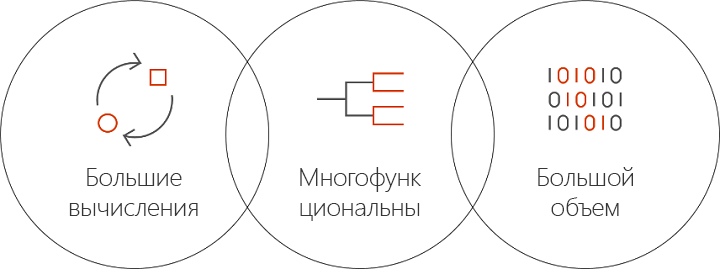

# Что собой представляет Azure Batch AI
Batch AI — это управляемая служба, которая позволяет специалистам по обработке и анализу данных и исследователям искусственного интеллекта (ИИ) обучать модель ИИ и другие модели машинного обучения на кластерах виртуальных машин Azure, в том числе виртуальных машин с поддержкой GPU. Вы описываете требования своего задания, где можно найти входные данные и куда сохранить выходные данные, а Batch AI выполняет все остальное.  
 
## Почему Batch AI 
Разработка многофункциональных алгоритмов искусственного интеллекта — это ресурсоемкий и итеративный процесс. Специалисты по обработке и анализу данных и исследователи искусственного интеллекта (ИИ) работают все с более крупными наборами данных. Они разрабатывают модели с большим количеством слоев. Для этого они выполняют множество экспериментов в отношении структуры сети и используемых гиперпараметров. Чтобы делать это эффективно, требуется несколько ЦП или GPU для каждой модели, проводить эксперименты параллельно и иметь общую память для данных обучения, журналов и выходных данных модели.   
 

Специалисты по обработке и анализу данных и исследователи ИИ являются экспертами в своих сферах, однако при управлении инфраструктурой в масштабе могут возникнуть проблемы. Для разработки модели ИИ с поддержкой масштабирования требуется выполнить множество задач инфраструктуры: подготовку кластеров виртуальных машин, установку программного обеспечения и контейнеров, упорядочивание заданий в очередь, приоритезацию и планирование заданий, обработку сбоев, распределение данных, совместное использование результатов, масштабирование ресурсов для управления затратами и интеграцию со средствами и рабочими процессами. Batch AI выполняет эти задачи. 
 
## Что собой представляет Batch AI 

Batch AI обеспечивает управление ресурсами и планирование заданий для обучения и тестирования модели искусственного интеллекта. Ниже перечислены ключевые возможности: 

* выполнение длительных пакетных заданий, итеративное экспериментирование и итеративное обучение; 
* автоматическое или ручное масштабирование кластеров виртуальных машин с использованием GPU и ЦП; 
* настройка обмена данными по SSH между виртуальными машинами, а также для удаленного доступа; 
* поддержка любых платформ глубокого обучения или машинного обучения за счет применения оптимизированной конфигурации для популярных наборов средств, таких как [Microsoft Cognitive Toolkit](https://github.com/Microsoft/CNTK), [TensorFlow](https://www.tensorflow.org/) и [Chainer](https://chainer.org/); 
* очередь заданий, основанная на приоритетах, для совместного использования кластеров и возможности использования виртуальных машин с низким приоритетом и зарезервированных виртуальных машин;  
* гибкие варианты хранилища, в том числе служба файлов Azure и управляемый сервер NFS; 
* подключение удаленных файловых ресурсов к виртуальной машине и дополнительный контейнер; 
* предоставление состояния задания и перезапуск в случае сбоев виртуальной машины; 
* доступ к журналам входных данных, stdout, stderr и моделям, в том числе к каналу потоковой передачи из службы хранилища Azure; 
* [интерфейс командной строки](/cli/azure) Azure, пакеты SDK для [Python](https://github.com/Azure/azure-sdk-for-python), [C#](https://www.nuget.org/packages/Microsoft.Azure.Management.BatchAI/1.0.0-preview) и Java, мониторинг на портале Azure и интеграция со средствами искусственного интеллекта Майкрософт. 

Пакет SDK для Batch AI поддерживает написание скриптов и приложений для управления конвейерами обучения и интеграции со средствами. В настоящее время пакет SDK поддерживает Python, C#, Java и REST API.  
 

Batch AI использует Azure Resource Manager для операций уровня управления (создание, получение списка, получение, удаление). Azure Active Directory используется для проверки подлинности и управления доступом на основе ролей.  
 
## Как использовать Batch AI 

Чтобы использовать Batch AI, необходимо настроить *кластеры* и *задания* и управлять ими. 

 
В **кластерах** описаны требования к вычислениям: 
* регион Azure, в котором вы хотите выполнять вычисления; 
* семейство и размер используемой виртуальной машины, например виртуальная машина NC24 с 4 GPU NVIDIA K80; 
* число виртуальных машин или минимальное и максимальное число для масштабирования; 
* образ виртуальной машины, например Ubuntu 16.04 LTS или [виртуальная машина для глубокого обучения](https://azuremarketplace.microsoft.com/marketplace/apps/microsoft-ads.dsvm-deep-learning);
* любые удаленные тома файловых ресурсов для подключения, например, служба файлов Azure или NFS-сервер, управляемый Batch AI; 
* имя пользователя и ключ SSH или пароль, которые нужно задать на виртуальных машинах, чтобы включить интерактивный вход в систему для отладки.  
 

**Задания** описывают: 
* кластер и регион для использования; 
* количество виртуальных машин, требуемых для задания; 
* каталоги входных и выходных данных, которые будут переданы в задание при запуске (обычно используется общая файловая система, подключенная во время настройки кластера); 
* дополнительный контейнер для запуска программного обеспечения или скрипта установки; 
* конфигурация, связанная с платформой искусственного интеллекта, или командная строка и параметры для запуска задания. 
 

Приступите к использованию Batch AI с [Azure CLI](/cli/azure) и файлами конфигурации для кластеров и заданий. Этот подход используется, чтобы быстро создать кластер и выполнить задания для экспериментирования со структурой сети или гиперпараметрами.  
 

Batch AI позволяет с легкостью работать одновременно с несколькими GPU. Когда заданиям необходимо масштабироваться в пределах нескольких GPU, Batch AI настраивает защищенное сетевое подключение между виртуальными машинами. Когда используется InfiniBand, Batch AI настраивает драйверы и запускает MPI на узлах в задании.  

## Управление данными
Batch AI предоставляет гибкие варианты для сценариев обучения, данных для обучения и выходных данных:
  
* Используйте **локальный диск** для раннего экспериментирования и небольших наборов данных. В этом сценарии требуется подключение к виртуальной машине через SSH, чтобы редактировать скрипты и читать журналы. 

* Используйте **службу файлов Azure** для совместного использования данных для обучения в нескольких заданиях и хранения журналов выходных данных и моделей в одном расположении. 

* Настройте **NFS-сервер** для поддержки крупного объема данных и большого числа виртуальных машин для обучения. Batch AI может настроить NFS-сервер в качестве специального типа кластера с дисками, резервная копия которых находится в службе хранилища Azure. 
 
* **Параллельная файловая система** обеспечивает дальнейшую масштабируемость данных и параллельное обучение. Хотя Batch AI не управляет параллельными файловыми системами, примеры шаблонов развертывания доступны для Luster, Gluster и BeeGFS.  

## Дополнительная информация

* Приступите к созданию первого задания обучения Batch AI с помощью [Azure CLI](quickstart-cli.md) или [Python](quickstart-python.md).
* Ознакомьтесь с примерами [инструкций по обучению](https://github.com/Azure/BatchAI) для различных платформ.

