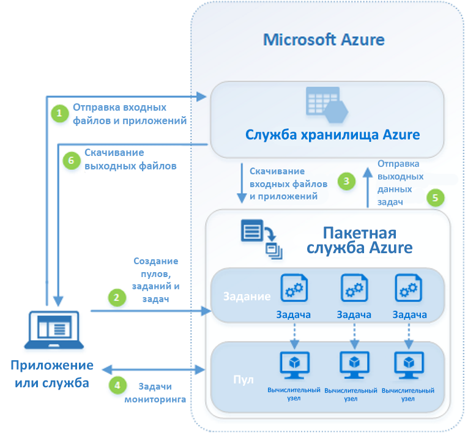

# Что такое пакетная служба Azure?

Используйте пакетную службу Azure, чтобы эффективно выполнять пакетные задания для крупномасштабных параллельных и высокопроизводительных вычислений (HPC). Пакетная служба Azure создает пул вычислительных узлов (виртуальных машин) и управляет им, устанавливает приложения, которые требуется запустить, и планирует задания для выполнения на узлах. Программного обеспечения планировщика заданий для установки, управления и масштабирования не существует. Вместо этого для настройки, управления и мониторинга заданий используются [средства и API пакетной службы](batch-apis-tools.md), скрипты командной строки или портал Azure. 

Разработчики могут использовать пакетную службу в качестве службы платформы для создания приложений SaaS или клиентских приложений, в которых требуется крупномасштабное выполнение. Например, можно создать службу с использованием пакетной службы для выполнения моделирования риска методом Монте-Карло для компании, предоставляющей финансовые услуги, или службу для обработки множества изображений.

За использование пакетной службы дополнительная плата не взимается. Вы платите только за использованные базовые ресурсы, такие как виртуальные машины, хранилище и сетевые ресурсы.

Сравнение решений пакетной службы с другими решениями HPC в Azure см. в руководстве по [решениям HPC, пакетной службы и больших вычислений](../virtual-machines/linux/high-performance-computing.md).

## Параллельное выполнение рабочих нагрузок
Пакетная служба хорошо работает с рабочими нагрузками с усложненным параллелизмом. В параллельных рабочих нагрузках приложения могут выполняться независимо, а каждый экземпляр выполняет свою часть работы. При выполнении приложения они могут получить доступ к некоторых общим данным, но они не будут обмениваться данными с другими экземплярами приложения. Параллельные рабочие нагрузки могут выполняться в больших масштабах, определяемых размерами доступных для одновременного выполнения вычислительных ресурсов.

Некоторые примеры параллельных рабочих нагрузок, которые можно использовать в пакетной службе:

* моделирование финансовых рисков с помощью модели Монте-Карло;
* отрисовка трехмерных изображений и VFX;
* анализ и обработка изображений;
* Перекодирование мультимедиа
* Анализ генетических последовательностей.
* оптическое распознавание символов;
* прием данных, обработка и операции извлечения, преобразования и загрузки;
* выполнение тестов программного обеспечения.

Пакетную службу можно также использовать для [выполнения тесно связанных рабочих нагрузок](batch-mpi.md). Это рабочие нагрузки, в которых приложениям необходимо обмениваться данными между собой, а не выполняться независимо. Тесно связанные приложения обычно используют API интерфейса передачи сообщений. Вы можете запускать тесно связанные рабочие нагрузки с пакетной службой, используя [Microsoft MPI](https://msdn.microsoft.com/library/bb524831(v=vs.85).aspx) или Intel MPI. Повысьте производительность приложений с использованием специализированных размеров виртуальных машин, оптимизированных для [HPC](../virtual-machines/linux/sizes-hpc.md) и [GPU](../virtual-machines/linux/sizes-gpu.md).

Некоторые примеры тесно связанных рабочих нагрузок:
* анализ конечного элемента;
* гидродинамика;
* обучение искусственного интеллекта с несколькими узлами.

С помощью пакетной службы множество тесно связанных заданий могут выполняться параллельно. Например, выполнение нескольких имитаций прохождения жидкости через трубу различной ширины.

## Дополнительные возможности пакета

В пакетной службе Azure также доступны высокоуровневые возможности для конкретных рабочих нагрузок:
* Пакетная служба поддерживает крупномасштабные [рабочие нагрузки рендеринга](batch-rendering-service.md) с использованием средств отрисовки, которые включают Autodesk Maya, 3ds Max, Arnold и V-Ray. 
* Пользователи R могут установить [пакет R doAzureParallel](https://github.com/Azure/doAzureParallel), чтобы легко развертывать выполнение алгоритмов R в пулах пакетной службы.

Кроме того, задания пакетной службы можно использовать как часть более крупного рабочего процесса Azure для преобразования данных, управляемых такими средствами, как [фабрика данных Azure](../data-factory/v1/data-factory-data-processing-using-batch.md).

## Принцип работы
Распространенный сценарий пакетной службы включает в себя масштабирование принципиально параллельных рабочих нагрузок, таких как отрисовка изображений для 3D-формата, в пуле вычислительных узлов. Этот пул вычислительных узлов может быть своего рода фермой отрисовки, которая предоставляет десятки, сотни или даже тысячи ядер для заданий отрисовки.

На следующей схеме показан общий рабочий процесс, в котором используется клиентское приложение или размещенная служба для запуска параллельной рабочей нагрузки с помощью пакетной службы.

|Шаг  |ОПИСАНИЕ  |
|---------|---------|
|1.  Передайте **входные файлы** и **приложение** для обработки этих файлов в учетную запись службы хранилища Azure.     |Входными файлами могут быть любые данные, которые будет обрабатывать приложение, например данные финансового моделирования или видеофайлы, которые необходимо перекодировать. Файлы приложения могут включать скрипты или приложения, которые обрабатывают данные, такие как транскодер мультимедиа.|
|2.  Создайте пул вычислительных узлов **пакетной службы** в своей учетной записи пакетной службы, **задание** для выполнения рабочей нагрузки в пуле и **задачи** в задании.     | Узлы пула — это виртуальные машины, выполняющие задачи. Укажите свойства, такие как номер и количество узлов, образ виртуальной машины Windows или Linux и приложение для установки, если узлы присоединяются к пулу. Управляйте затратами и размером пула, используя [виртуальные машины с низким приоритетом](batch-low-pri-vms.md) или [автоматическое масштабирование](batch-automatic-scaling.md) количества узлов при изменении рабочей нагрузки.   При добавлении задач в задание пакетная служба автоматически планирует их выполнение в вычислительных узлах пула. Каждая задача использует приложение, переданное для обработки входных файлов. |
|3.  Скачайте **входные файлы** и **приложения** для пакетной службы.     |Перед выполнением каждой задачи входные данные, которые нужно обработать, могут быть скачаны в назначенный задаче вычислительный узел. Если приложение еще не установлено в пуле узлов, оно будет скачано на данном этапе. При завершении скачивания из службы хранилища Azure задача выполняется в назначенном узле.|
|4.  Мониторинг **выполнения задач**     |При выполнении задач можно отправить запрос к пакетной службе, чтобы отслеживать ход выполнения задания и задач. Ваше клиентское приложение или служба взаимодействует с пакетной службой через протокол HTTPS. Если вам нужно отслеживать тысячи задач, которые выполняются на тысячах вычислительных узлов, целесообразно [отправлять в пакетную службу эффективные запросы](batch-efficient-list-queries.md).|
|5.  Отправка **выходных данных задачи**     |Выполненные задачи отправляют выходные данные в службу хранилища Azure. Вы также можете извлечь файлы непосредственно из файловой системы в вычислительном узле.|
|6.  Скачивание **выходных файлов**     |Если при мониторинге обнаруживается, что задачи в задании выполнены, выходные данные могут быть скачаны для дальнейшей обработки через клиентское приложение или службу.|

Это всего лишь один из способов использования пакетной службы, и в этом сценарии описываются только некоторые доступные функции. Например, можно выполнить [несколько задач параллельно](batch-parallel-node-tasks.md) на каждом вычислительном узле. Для подготовки узлов для заданий и последующей очистки также [можно использовать подготовку заданий и выполнение задач](batch-job-prep-release.md). 

Дополнительные сведения о пулах, узлах, заданиях, задачах и множестве функций API, которые можно использовать при создании приложения пакетной службы, см. в [этой статье](batch-api-basics.md). Также см. последние [обновления пакетной службы](https://azure.microsoft.com/updates/?product=batch).

## Дополнительная информация

Приступая к работе с пакетной службой Azure, ознакомьтесь с одним из наших кратких руководств:
* [Краткое руководство по выполнению первого пакетного задания с помощью Azure CLI](quick-create-cli.md)
* [Краткое руководство по выполнению первого пакетного задания на портале Azure](quick-create-portal.md)
* [Краткое руководство по выполнению первого пакетного задания Azure с помощью API для .NET](quick-run-dotnet.md)
* [Краткое руководство по выполнению первого пакетного задания с помощью API Python](quick-run-python.md)

