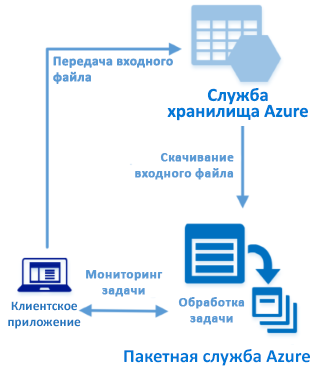

# <a name="quickstart-run-your-first-azure-batch-job-with-the-net-api"></a>Краткое руководство по выполнению первого пакетного задания Azure с помощью API для .NET

В этом кратком руководстве описаны действия по запуску задания пакетной службы Azure из приложения C#, созданного в API пакетной службы Azure для.NET. Приложение отправляет несколько файлов входных данных в службу хранилища Azure, а затем создает *пул* вычислительных узлов пакетной службы (виртуальных машин). Затем оно создает образец *задания*, которое запускает *задачи* для обработки каждого входного файла в пуле путем использования основных команд. Выполняя действия из этого краткого руководства, вы изучите основные понятия пакетной службы и сможете использовать ее с более реалистичными рабочими нагрузками в большем масштабе.



[!INCLUDE [quickstarts-free-trial-note.md](../../includes/quickstarts-free-trial-note.md)]

## <a name="prerequisites"></a>предварительным требованиям

* [Visual Studio IDE](https://www.visualstudio.com/vs) (Visual Studio 2015 или более поздняя версия); 

* учетная запись пакетной службы и связанная учетная запись службы хранилища Azure. Чтобы создать эти учетные записи, см. примеры быстрого начала работы с пакетной службой с помощью [портала Azure](quick-create-portal.md) или [Azure CLI](quick-create-cli.md). 

## <a name="sign-in-to-azure"></a>Вход в Azure

Войдите на портал Azure по адресу [https://portal.azure.com](https://portal.azure.com).

[!INCLUDE [batch-common-credentials](../../includes/batch-common-credentials.md)]

## <a name="download-the-sample"></a>Скачивание примера приложения

[Скачайте или клонируйте пример приложения](https://github.com/Azure-Samples/batch-dotnet-quickstart) с GitHub. Чтобы клонировать пример репозитория приложения с клиентом Git, выполните следующую команду:

```
git clone https://github.com/Azure-Samples/batch-dotnet-quickstart.git
```

Перейдите в каталог, в котором содержится файл решения Visual Studio `BatchDotNetQuickstart.sln`.

Откройте файл решения в Visual Studio и замените строки учетных данных в `program.cs` значениями, полученными для своих учетных записей. Например: 

```csharp
// Batch account credentials
private const string BatchAccountName = "mybatchaccount";
private const string BatchAccountKey  = "xxxxxxxxxxxxxxxxE+yXrRvJAqT9BlXwwo1CwF+SwAYOxxxxxxxxxxxxxxxx43pXi/gdiATkvbpLRl3x14pcEQ==";
private const string BatchAccountUrl  = "https://mybatchaccount.mybatchregion.batch.azure.com";

// Storage account credentials
private const string StorageAccountName = "mystorageaccount";
private const string StorageAccountKey  = "xxxxxxxxxxxxxxxxy4/xxxxxxxxxxxxxxxxfwpbIC5aAWA8wDu+AFXZB827Mt9lybZB1nUcQbQiUrkPtilK5BQ==";
```

## <a name="build-and-run-the-app"></a>Создание и запуск приложения

Чтобы просмотреть действие рабочего процесса пакетной службы, создайте и запустите приложение. После запуска приложения просмотрите код, чтобы узнать, как работает каждый компонент приложения. 

* Щелкните правой кнопкой мыши решение в обозревателе решений и выберите **Build Solution** (Сборка решения). 

* Подтвердите восстановление пакетов NuGet, если появится соответствующий запрос. Если вам необходимо скачать отсутствующие пакеты, установите [диспетчер пакетов NuGet](https://docs.nuget.org/consume/installing-nuget).

Затем запустите его. Когда вы запустите пример приложения, консоль будет выглядеть так. Во время выполнения может возникнуть пауза на этапе `Monitoring all tasks for 'Completed' state, timeout in 00:30:00...`, когда будут запускаться вычислительные узлы пула. Задачи помещаются в очередь для запуска после выполнения первого вычислительного узла. Перейдите в учетную запись пакетной службы на [портале Azure](https://portal.azure.com), чтобы отследить пул, вычислительные узлы, задания и задачи.

```
Sample start: 12/4/2017 4:02:54 PM

Container [input] created.
Uploading file taskdata0.txt to container [input]...
Uploading file taskdata1.txt to container [input]...
Uploading file taskdata2.txt to container [input]...
Creating pool [DotNetQuickstartPool]...
Creating job [DotNetQuickstartJob]...
Adding 3 tasks to job [DotNetQuickstartJob]...
Monitoring all tasks for 'Completed' state, timeout in 00:30:00...
```

После завершения задач отобразятся выходные данные для каждой задачи, аналогичные приведенным ниже.

```
Printing task output.
Task: Task0
Node: tvm-2850684224_3-20171205t000401z
Standard out:
Batch processing began with mainframe computers and punch cards. Today it still plays a central role in business, engineering, science, and other pursuits that require running lots of automated tasks....
stderr:
...
```

Обычное время выполнения — примерно 5 минут, если для приложения задана конфигурация по умолчанию. Настройка начального пула занимает больше всего времени. Чтобы запустить задание повторно, удалите его из предыдущего запуска и не удаляйте пул. В предварительно настроенном пуле задание завершается через несколько секунд.


## <a name="review-the-code"></a>Просмотр кода

Приложение .NET в этом кратком руководстве выполняет следующие задачи.

* Отправляет три небольших текстовых файла в контейнер больших двоичных объектов в учетной записи хранения Azure. Эти файлы являются входными данными для обработки в пакетной службе.
* Создает пул вычислительных узлов под управлением Windows Server.
* Создает задание, а также три задачи, выполняемые на узлах. Каждая задача обрабатывает один из входных файлов, используя командную строку Windows. 
* Отображает файлы, возвращаемые задачами.

Дополнительные сведения см. в следующих разделах и в файле `Program.cs`. 

### <a name="preliminaries"></a>Предварительные требования

Чтобы взаимодействовать с учетной записью хранения, приложение использует клиентскую библиотеку службы хранилища Azure для .NET. Оно создает ссылку на учетную запись, используя [CloudStorageAccount](/dotnet/api/microsoft.windowsazure.storage.cloudstorageaccount), а затем из этой учетной записи — клиент [CloudBlobClient](/dotnet/api/microsoft.windowsazure.storage.blob.cloudblobclient).

```csharp
CloudBlobClient blobClient = storageAccount.CreateCloudBlobClient();
```

Приложение использует ссылку `blobClient` для создания контейнера в учетной записи хранения и передачи в него файлов данных. Файлы в хранилище определяются как объекты пакетной службы [ResourceFile](/dotnet/api/microsoft.azure.batch.resourcefile), которые она может впоследствии скачать на вычислительные узлы.

```csharp
List<string> inputFilePaths = new List<string>
{
    @"..\..\taskdata0.txt",
    @"..\..\taskdata1.txt",
    @"..\..\taskdata2.txt"
};

List<ResourceFile> inputFiles = new List<ResourceFile>();

foreach (string filePath in inputFilePaths)
{
    inputFiles.Add(UploadFileToContainer(blobClient, inputContainerName, filePath));
}
```

Приложение создает объект [BatchClient](/dotnet/api/microsoft.azure.batch.batchclient) для создания пулов, заданий и задач в пакетной службе, а также для управления ими. В примере клиент пакетной службы использует проверку подлинности с общим ключом. (Пакетная служба также поддерживает аутентификацию на основе Azure Active Directory.)

```csharp
BatchSharedKeyCredentials cred = new BatchSharedKeyCredentials(BatchAccountUrl, BatchAccountName, BatchAccountKey);

using (BatchClient batchClient = BatchClient.Open(cred))
...    
```

### <a name="create-a-pool-of-compute-nodes"></a>Создание пула вычислительных узлов

Для создания пула пакетной службы приложение использует метод [BatchClient.PoolOperations.CreatePool](/dotnet/api/microsoft.azure.batch.pooloperations.createpool), чтобы настроить количество узлов, размер виртуальной машины и конфигурацию пула. Объект [VirtualMachineConfiguration](/dotnet/api/microsoft.azure.batch.virtualmachineconfiguration) указывает [ImageReference](/dotnet/api/microsoft.azure.batch.imagereference) в образе Windows Server, опубликованном в Azure Marketplace. Пакетная служба поддерживает широкий спектр образов Linux и Windows Server в Azure Marketplace, а также пользовательских образов виртуальной машины.

Количество узлов (`PoolNodeCount`) и размер виртуальной машины (`PoolVMSize`) являются определенными константами. В образце по умолчанию создается пул с 2 узлами размера *Standard_A1_v2*. Предлагаемый размер в этом кратком руководстве обеспечивает оптимальный баланс производительности и стоимости. 

Метод [фиксации](/dotnet/api/microsoft.azure.batch.cloudpool.commit) отправляет пул в пакетную службу.

```csharp
ImageReference imageReference = new ImageReference(
    publisher: "MicrosoftWindowsServer",
    offer: "WindowsServer",
    sku: "2012-R2-Datacenter-smalldisk",
    version: "latest");

VirtualMachineConfiguration virtualMachineConfiguration =
new VirtualMachineConfiguration(
   imageReference: imageReference,
   nodeAgentSkuId: "batch.node.windows amd64");

try
{
    CloudPool pool = batchClient.PoolOperations.CreatePool(
    poolId: PoolId,
    targetDedicatedComputeNodes: PoolNodeCount,
    virtualMachineSize: PoolVMSize,
    virtualMachineConfiguration: virtualMachineConfiguration);

    pool.Commit();
}
...

```
### <a name="create-a-batch-job"></a>Создание пакетного задания

Пакетное задание — это логическая группа из одной или нескольких задач. Задание включает в себя параметры, общие для задач (например, приоритет и пул для запуска задач). Приложение использует метод [BatchClient.JobOperations.CreateJob](/dotnet/api/microsoft.azure.batch.joboperations.createjob) для создания задания в пуле. 

Метод [фиксации](/dotnet/api/microsoft.azure.batch.cloudjob.commit) отправляет задание в пакетную службу. Изначально у задания нет задач.

```csharp
try
{
    CloudJob job = batchClient.JobOperations.CreateJob();
    job.Id = JobId;
    job.PoolInformation = new PoolInformation { PoolId = PoolId };

    job.Commit(); 
}
...       
```

### <a name="create-tasks"></a>Создание задач
Приложение создает список объектов [CloudTask](/dotnet/api/microsoft.azure.batch.cloudtask). Каждая задача обрабатывает входной объект `ResourceFile`, используя свойство [CommandLine](/dotnet/api/microsoft.azure.batch.cloudtask.commandline). В этом примере командная строка запускает команду Windows `type`, чтобы отобразить входной файл. Эта команда является простым примером для демонстрационных целей. При использовании пакетной службы в командной строке задайте приложение или скрипт. В пакетной службе предусмотрен ряд способов для развертывания приложений и скриптов на вычислительных узлах.

Затем приложение добавляет задачи к заданию с помощью метода [AddTask](/dotnet/api/microsoft.azure.batch.joboperations.addtask), который ставит их в очередь для запуска на вычислительных узлах. 

```csharp
for (int i = 0; i < inputFiles.Count; i++)
{
    string taskId = String.Format("Task{0}", i);
    string inputFilename = inputFiles[i].FilePath;
    string taskCommandLine = String.Format("cmd /c type {0}", inputFilename);

    CloudTask task = new CloudTask(taskId, taskCommandLine);
    task.ResourceFiles = new List<ResourceFile> { inputFiles[i] };
    tasks.Add(task);
}

batchClient.JobOperations.AddTask(JobId, tasks);
```
 
### <a name="view-task-output"></a>Просмотр выходных данных задачи

Приложение создает [TaskStateMonitor](/dotnet/api/microsoft.azure.batch.taskstatemonitor) для отслеживания задач, чтобы убедиться в их выполнении. Затем приложение использует свойство [CloudTask.ComputeNodeInformation](/dotnet/api/microsoft.azure.batch.cloudtask.computenodeinformation), чтобы отобразить файл `stdout.txt`, сформированный после завершения каждой задачи. Если задача выполняется успешно, выходные данные команды задачи записываются в файл `stdout.txt`.

```csharp
foreach (CloudTask task in completedtasks)
{
    string nodeId = String.Format(task.ComputeNodeInformation.ComputeNodeId);
    Console.WriteLine("Task: {0}", task.Id);
    Console.WriteLine("Node: {0}", nodeId);
    Console.WriteLine("Standard out:");
    Console.WriteLine(task.GetNodeFile(Constants.StandardOutFileName).ReadAsString());
}
```

## <a name="clean-up-resources"></a>Очистка ресурсов

Приложение автоматически удаляет созданный контейнер хранилища, а также предоставляет возможность удалить пул и задание пакетной службы. Но если во время работы узлов используется пул, плата взимается даже если задания не запланированы. Если вы больше не будете использовать пул, удалите его. При удалении пула удаляются все выходные данные задачи на узлах.

Ставшие ненужными группу ресурсов, учетную запись пакетной службы и учетную запись хранения можно удалить. Для этого на портале Azure выберите группу ресурсов для учетной записи пакетной службы и щелкните **Удалить группу ресурсов**.

## <a name="next-steps"></a>Дополнительная информация

В этом кратком руководстве вы запустили небольшое приложение, созданное с помощью API пакетной службы для .NET, для создания пула пакетной службы и пакетного задания. Это задание запустило образец задач и скачало выходные данные, созданные на одном узле. Изучив основные понятия пакетной службы, вы сможете использовать ее с более реалистичными рабочими нагрузками в большем масштабе. Дополнительные сведения о пакетной службе Azure и параллельной рабочей нагрузке с реальным приложением см. в следующем руководстве по пакетной службе для .NET.


> [!div class="nextstepaction"]
> [Руководство. Запуск параллельной рабочей нагрузки с помощью пакета Azure с использованием .NET API](tutorial-parallel-dotnet.md)
