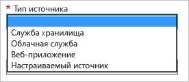

<properties
	 pageTitle="Использование Azure CDN"
	 description="В этом разделе показано, как включить сеть доставки содержимого (CDN) для Azure. В этом руководстве описано, как создать профиль CDN и конечную точку."
	 services="cdn"
	 documentationCenter=""
	 authors="camsoper"
	 manager="erikre"
	 editor=""/>
<tags
	 ms.service="cdn"
	 ms.workload="media"
	 ms.tgt_pltfrm="na"
	 ms.devlang="na"
	 ms.topic="get-started-article"
	 ms.date="04/15/2016" 
	 ms.author="casoper"/>

# Использование Azure CDN  

CDN можно включить на [портале Azure](https://portal.azure.com). Поддерживается несколько типов интегрированных источников Azure, включая веб-приложения, хранилища BLOB-объектов и облачные службы. CDN можно также включить для конечной точки потоковой передачи служб мультимедиа Azure. Если ваш источник не является одной из этих служб Azure или он размещен за пределами среды Azure, вы можете создать настраиваемый источник. После включения конечной точки CDN для вашего источника все общедоступные объекты становятся доступными для пограничного кэширования CDN.

>[AZURE.NOTE] Общие сведения о работе сети CDN, включая список функций, см. в [обзорной статье о CDN](./cdn-overview.md).

## Создание нового профиля сети CDN

Профиль сети CDN представляет собой коллекцию конечных точек сети CDN. Каждый профиль содержит одну или несколько конечных точек сети CDN. Вы можете использовать несколько профилей для упорядочения конечных точек сети CDN по домену Интернета, веб-приложению или согласно другим условиям.

> [AZURE.NOTE] По умолчанию в одной подписке Azure можно создать не более четырех профилей CDN. Каждый профиль CDN может содержать не более десяти конечных точек CDN.
>
> Стоимость использования CDN определяется уровнем профиля CDN. Если вы хотите использовать функции CDN из двух ценовых категорий («Стандартный» и «Премиум»), вам потребуется несколько профилей CDN.

**Создание нового профиля сети CDN**

1. На [портале Azure](https://portal.azure.com) слева вверху щелкните **Создать**. В колонке **Новый** выберите **Носитель + CDN**, а затем **CDN**.

    Появится колонка нового профиля сети CDN.

    ![Новый профиль сети CDN][new-cdn-profile]

2. Введите имя профиля сети CDN.

3. Выберите значение для параметра **Ценовая категория** или используйте значение по умолчанию.

4. Выберите или создайте **группу ресурсов**. Дополнительные сведения о группах ресурсов см. в статье [Общие сведения о диспетчере ресурсов Azure](resource-group-overview/#resource-groups).

5. Выберите **подписку** для этого профиля сети CDN.

6. Выберите **расположение**. Это расположение Azure, где будут храниться данные профиля сети CDN. Оно не влияет на расположение конечных точек сети CDN. Это расположение не должно совпадать с расположением учетной записи хранения.

7. Нажмите кнопку **Создать**, чтобы создать новый профиль.

## Создание новой конечной точки сети CDN

**Создание новой конечной точки CDN для учетной записи хранения**

1. На [портале Azure](https://portal.azure.com) перейдите к профилю CDN. На предыдущем шаге вы могли прикрепить его к панели мониторинга. Если профиль не прикреплен, найдите его, нажав кнопку **Обзор**, выбрав **Профили CDN** и щелкнув профиль, к которому нужно добавить конечную точку.

    Появится колонка профиля сети CDN.

    ![Профиль сети CDN][cdn-profile-settings]

2. Нажмите кнопку **Добавить конечную точку**.

    ![Кнопка "Добавить конечную точку"][cdn-new-endpoint-button]

    Появится колонка **Добавление конечной точки**.

    ![Колонка "Добавление конечной точки"][cdn-add-endpoint]

3. Введите **имя** конечной точки сети CDN. Это имя будет использоваться для доступа к кэшированным ресурсам в домене `<endpointname>.azureedge.net`.

4. В раскрывающемся списке **Тип источника** выберите тип источника.

	

5. В раскрывающемся списке **Имя узла источника** выберите или введите исходный домен. В раскрывающемся списке будут перечислены все доступные источники типа, указанного на шаге 4. Если в качестве значения параметра **Тип источника** вы выбрали *Настраиваемый источник*, потребуется ввести домен вашего настраиваемого источника.

6. В поле **Путь к источнику** введите путь к ресурсам, которые нужно кэшировать, или оставьте поле пустым, чтобы разрешить кэшировать любые ресурсы в домене, указанном на шаге 5.

7. В поле **Заголовок узла источника** введите заголовок узла, который сеть CDN будет отправлять с каждым запросом, или оставьте значение по умолчанию.

8. Для параметров **Протокол** и **Порт источника** укажите протоколы и порты, используемые для доступа к ресурсам в источнике. Клиенты будут продолжать использовать эти же протоколы и порты при доступе к ресурсам в сети CDN. Необходимо указать хотя бы один протокол (HTTP или HTTPS).
	
	> [AZURE.TIP] Доступ к содержимому CDN с использованием HTTPS имеет следующие ограничения.
	> 
	> - Необходимо использовать сертификат, предоставленный CDN. Сертификаты третьих сторон не поддерживаются.
	> - Для доступа к содержимому HTTPS необходимо использовать предоставленный CDN домен (`<identifier>.azureedge.net`). Поддержка HTTPS для имен личных доменов (CNAME) недоступна, поскольку в данный момент CDN не поддерживает пользовательские сертификаты.

9. Нажмите кнопку **Добавить**, чтобы создать новую конечную точку.

10. Созданная конечная точка отображается в списке конечных точек для профиля. В режиме списка отображается URL-адрес для доступа к кэшированному содержимому, а также исходному домену.

    ![Конечная точка сети CDN][cdn-endpoint-success]

    > [AZURE.NOTE] Конечная точка не сразу будет доступна для использования. Распространение регистрации по сети CDN может занять 90 минут. Если пользователь попытается незамедлительно воспользоваться именем домена CDN, он может столкнуться с кодом состояния 404, пока содержимое не станет доступно через CDN.

##См. также
- [Управление режимом кэширования запросов CDN с использованием строк запроса](cdn-query-string.md)
- [Сопоставление содержимого CDN с пользовательским доменом](cdn-map-content-to-custom-domain.md)
- [Предварительная загрузка ресурсов на конечной точке CDN Azure](cdn-preload-endpoint.md)
- [Очистка конечной точки сети CDN Azure](cdn-purge-endpoint.md)

[new-cdn-profile]: ./media/cdn-create-new-endpoint/cdn-new-profile.png
[cdn-profile-settings]: ./media/cdn-create-new-endpoint/cdn-profile-settings.png
[cdn-new-endpoint-button]: ./media/cdn-create-new-endpoint/cdn-new-endpoint-button.png
[cdn-add-endpoint]: ./media/cdn-create-new-endpoint/cdn-add-endpoint.png
[cdn-endpoint-success]: ./media/cdn-create-new-endpoint/cdn-endpoint-success.png

<!---HONumber=AcomDC_0420_2016-->