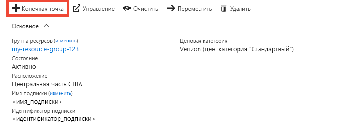
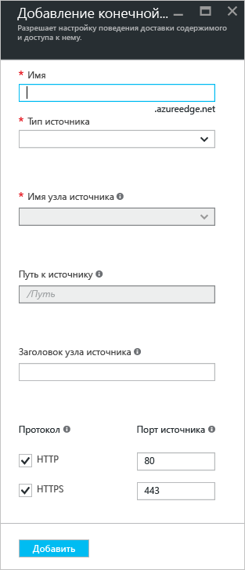
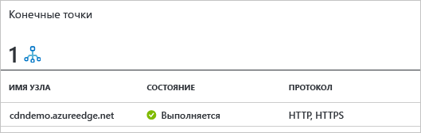

# Краткое руководство по созданию профиля и конечной точки Azure CDN
С помощью этого краткого руководства вы включите сеть доставки содержимого (CDN) Azure, создав профиль и конечную точку CDN. Когда профиль и конечная точка будут созданы, можете приступить к доставке содержимого своим клиентам.

[!INCLUDE [quickstarts-free-trial-note](../../includes/quickstarts-free-trial-note.md)]

## предварительным требованиям
Для работы с этим кратким руководством вам потребуется созданная учетная запись хранения с именем *mystorageacct123*, которое будет использоваться в качестве имени узла источника. Дополнительные сведения см. в статье [Интеграция учетной записи хранения Azure с Azure CDN](cdn-create-a-storage-account-with-cdn.md).

## Войдите на портал Azure.
Войдите на [портал Azure](https://portal.azure.com) со своей учетной записью Azure.

[!INCLUDE [cdn-create-profile](../../includes/cdn-create-profile.md)]

## Создание новой конечной точки сети CDN

Создав профиль CDN, можете использовать его для создания конечной точки.

1. На портале Azure выберите на панели мониторинга созданный профиль CDN. Если не удается его найти, последовательно выберите **Все службы** и **Профили CDN**. На странице **Профили CDN** выберите нужный профиль. 
   
    Откроется страница профиля CDN.

2. Выберите раздел **Конечная точка**.
   
    
   
    Откроется страница **Добавить конечную точку**.

    Используйте настройки, указанные в таблице под изображением.
   
    

    | Параметр | Значение |
    | ------- | ----- |
    | **Имя** | В качестве имени узла конечной точки введите *my-endpoint-123*. Это имя должно быть глобально уникальным. Если оно уже используется, введите другое имя. Это имя будет использоваться для доступа к кэшированным ресурсам в домене _&lt;имя конечной точки&gt;_.azureedge.net.|
    | **Тип источника** | Выберите **Хранилище**. | 
    | **Имя узла источника** | В качестве имени узла введите *mystorageacct123.blob.core.windows.net*. Это имя должно быть глобально уникальным. Если оно уже используется, введите другое имя. |
    | **Путь к источнику** | Не указывайте. |
    | **Заголовок узла источника** | Оставьте значение по умолчанию. |  
    | **Протокол** | Оставьте выбранные по умолчанию параметры **HTTP** и **HTTPS**. |
    | **Порт источника** | Оставьте значения портов по умолчанию. | 
    | **Оптимизировано для** | Оставьте значение по умолчанию — **Общая веб-доставка**. |
    
3. Для создания конечной точки нажмите кнопку **Добавить**.
   
   Созданная конечная точка отображается в списке конечных точек для профиля.
    
   
    
   Конечная точка станет доступна не сразу. Распространение регистрационных сведений может занять некоторое время. 

## Очистка ресурсов
На предыдущих шагах вы создали профиль и конечную точку CDN в группе ресурсов. Сохраните эти ресурсы, чтобы перейти к разделу [Дополнительная информация](#next-steps) и узнать, как добавить личный домен к конечной точке. Но если в будущем эти ресурсы вам не понадобятся, их можно удалить, удалив группу ресурсов, чтобы избежать дополнительных затрат:

1. На портале Azure в меню слева щелкните **Группы ресурсов**, а затем выберите **my-resource-group-123**.

2. На странице **Группа ресурсов** выберите **Удалить группу ресурсов**, в текстовое поле введите *my-resource-group-123* и щелкните **Удалить**.

    В результате удалится группа ресурсов, профиль и конечная точка, которые вы создали с помощью этого краткого руководства.

## Дополнительная информация
Дополнительные сведения о добавлении личного домена к конечной точке CDN см. в следующем руководстве:

> [!div class="nextstepaction"]
> [Добавить личный домен](cdn-map-content-to-custom-domain.md)

