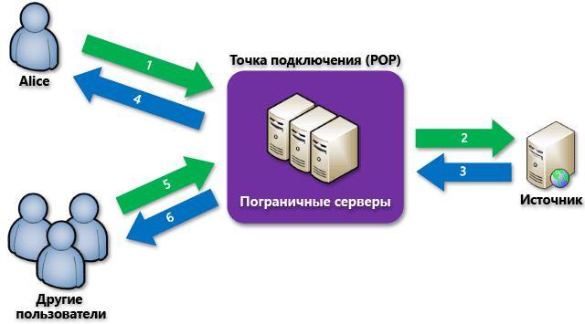

# Общие сведения о сети доставки содержимого(CDN) Azure
> [!NOTE]
> В этом документе объясняется, что такое сеть доставки содержимого Azure (CDN), принципы ее работы и функции каждого продукта Azure CDN.  Если вы хотите пропустить эту информацию и перейти сразу к руководству по созданию конечной точки CDN, см. статью [Использование Azure CDN](cdn-create-new-endpoint.md).  Список текущих расположений узлов CDN см. в статье [Расположение узлов POP сети Azure CDN](cdn-pop-locations.md).
> 
> 

Сеть доставки содержимого (CDN) Azure кэширует статическое веб-содержимое в стратегически расположенных точках. Это позволяет обеспечить максимальную пропускную способность для доставки содержимого пользователям.  CDN предлагает разработчикам глобальное решение для доставки содержимого с высокой пропускной способностью путем кэширования содержимого на физических узлах по всему миру. 

Использование сети CDN для кэширования ресурсов веб-сайтов приносит следующие преимущества.

* Повышение производительности и улучшение взаимодействия с конечными пользователями, особенно для тех приложений, в которых для загрузки содержимого требуется много циклов приема-передачи.
* Высокий уровень масштабирования, который улучшает обработку пиковых нагрузок, например при запуске нового продукта.
* Снижение трафика, отправляемого на источник содержимого, благодаря распределению запросов пользователей и доставке контента с пограничных серверов.

## Принцип работы

1. Пользователь (Alice) запрашивает файл (ресурс), обращаясь к нему по URL-адресу со специальным доменным именем, например `<endpointname>.azureedge.net`.  Служба DNS перенаправляет запрос на оптимальную точку присутствия (POP).  Обычно используется точка присутствия, которая географически ближе к пользователю.
2. Если в кэше пограничных серверов этой точки присутствия нет нужного файла, пограничный сервер запрашивает файл у источника содержимого.  Источником может служить веб-приложение Azure, облачная служба Azure, учетная запись хранилища Azure или любой общедоступный веб-сервер.
3. Источник содержимого возвращает пограничному серверу нужный файл и необязательные заголовки HTTP с информацией о сроке жизни (TTL) этого файла.
4. Пограничный сервер помещает файл в кэш, и одновременно передает его пользователю (Alice).  Файл будет храниться в кэше на пограничном сервере до истечения срока жизни.  Если источник не указывает срок жизни, по умолчанию принимается 7 дней.
5. После этого другой пользователь обращается к тому же файлу, используя тот же URL-адрес, и получает перенаправление на ту же точку присутствия.
6. Если срок жизни файла еще не истек, пограничный сервер возвращает файл из кэша.  Такая схема повышает скорость взаимодействия с пользователем и устраняет задержки.

## Компоненты Azure CDN
Существует три продукта Azure CDN: **Azure CDN уровня "Стандартный" от Akamai**, **Azure CDN уровня "Стандартный" от Verizon** и **Azure CDN уровня "Премиум" от Verizon**.  В следующей таблице перечислены функции, доступные в каждом из продуктов.

|  | Akamai уровня "Стандартный" | Verizon уровня "Стандартный" | Verizon уровня "Premium" |
| --- | --- | --- | --- |
| Простая интеграция со службами Azure, такими как [служба хранилища](cdn-create-a-storage-account-with-cdn.md), [облачные службы](cdn-cloud-service-with-cdn.md), [веб-приложения](../app-service-web/cdn-websites-with-cdn.md) и [службы мультимедиа](../media-services/media-services-portal-manage-streaming-endpoints.md). |**&#x2713;** |**&#x2713;** |**&#x2713;** |
| Управление с помощью [REST API](https://msdn.microsoft.com/library/mt634456.aspx), [.NET](cdn-app-dev-net.md), [Node.js](cdn-app-dev-node.md) или [PowerShell](cdn-manage-powershell.md). |**&#x2713;** |**&#x2713;** |**&#x2713;** |
| Поддержка HTTPS. |**&#x2713;** |**&#x2713;** |**&#x2713;** |
| Балансировка нагрузки. |**&#x2713;** |**&#x2713;** |**&#x2713;** |
| [DDOS-атак-атак](https://www.us-cert.gov/ncas/tips/ST04-015)  |**&#x2713;** |**&#x2713;** |**&#x2713;** |
| Двойной стек IPv4/IPv6 |**&#x2713;** |**&#x2713;** |**&#x2713;** |
| [Поддержка пользовательских доменных имен.](cdn-map-content-to-custom-domain.md) |**&#x2713;** |**&#x2713;** |**&#x2713;** |
| [Кэширование строк запроса.](cdn-query-string.md) |**&#x2713;** |**&#x2713;** |**&#x2713;** |
| [Геофильтрация](cdn-restrict-access-by-country.md) | |**&#x2713;** |**&#x2713;** |
| [Быстрая очистка.](cdn-purge-endpoint.md) |**&#x2713;** |**&#x2713;** |**&#x2713;** |
| [Предварительная загрузка ресурса.](cdn-preload-endpoint.md) | |**&#x2713;** |**&#x2713;** |
| [Базовая аналитика.](cdn-analyze-usage-patterns.md) | |**&#x2713;** |**&#x2713;** |
| [Поддержка HTTP/2](https://msdn.microsoft.com/library/mt762901.aspx) |**&#x2713;** | | |
| [Расширенные HTTP-отчеты.](cdn-advanced-http-reports.md) | | |**&#x2713;** |
| [Статистика в режиме реального времени.](cdn-real-time-stats.md) | | |**&#x2713;** |
| [Оповещения в реальном времени](cdn-real-time-alerts.md) | | |**&#x2713;** |
| [Настраиваемый модуль доставки контента на основе правил.](cdn-rules-engine.md) | | |**&#x2713;** |
| Параметры кэша и заголовка (с использованием [обработчика правил](cdn-rules-engine.md)) | | |**&#x2713;** |
| Перенаправление или перезапись URL-адреса (с использованием [обработчика правил](cdn-rules-engine.md)) | | |**&#x2713;** |
| Правила для мобильных устройств (с использованием [обработчик правил](cdn-rules-engine.md)) | | |**&#x2713;** |

> [!TIP]
> Хотите добавить в Azure CDN новую функцию?  [Расскажите нам о ней](https://feedback.azure.com/forums/169397-cdn). 
> 
> 

## Дальнейшие действия
Чтобы начать работу с сетью CDN, см. сведения в статье [Использование Azure CDN](cdn-create-new-endpoint.md).

Если вы являетесь действующим клиентом CDN, вы можете управлять своими конечными точками CDN с помощью [портала Microsoft Azure](https://portal.azure.com) или [PowerShell](cdn-manage-powershell.md).

Чтобы увидеть сеть CDN в действии, просмотрите [видео с конференции Build 2016](https://azure.microsoft.com/documentation/videos/build-2016-leveraging-the-new-azure-cdn-apis-to-build-wicked-fast-applications/).

Узнайте об автоматизации Azure CDN с помощью [.NET](cdn-app-dev-net.md) или [Node.js](cdn-app-dev-node.md).

Сведения о ценах на CDN см. на [этой странице](https://azure.microsoft.com/pricing/details/cdn/).

<!--HONumber=Nov16_HO2-->

