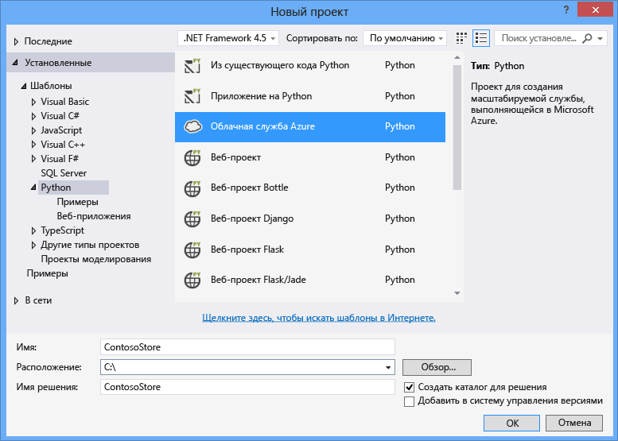
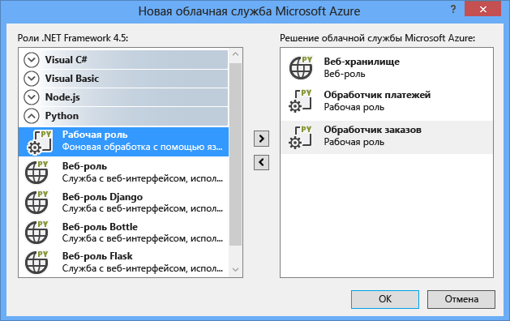
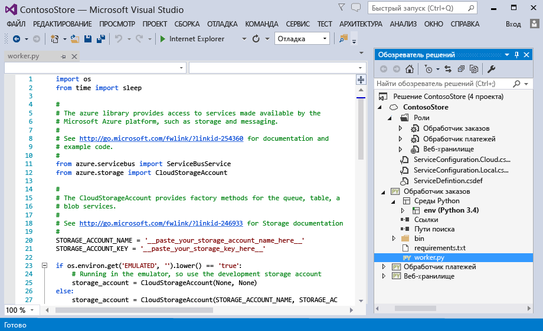
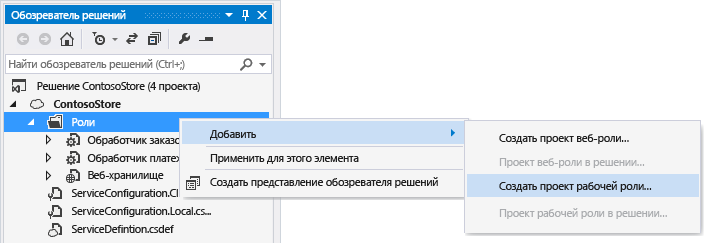
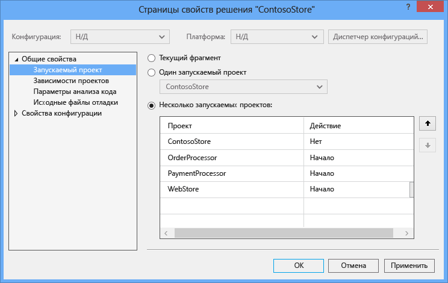
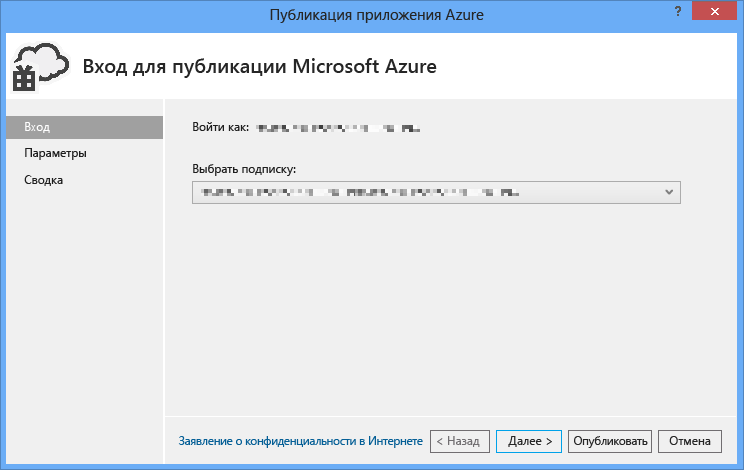
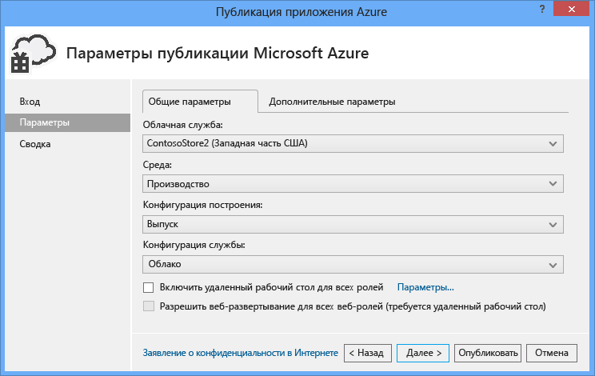
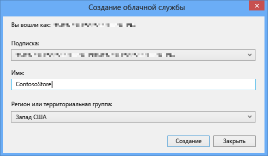
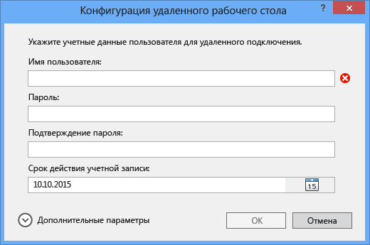
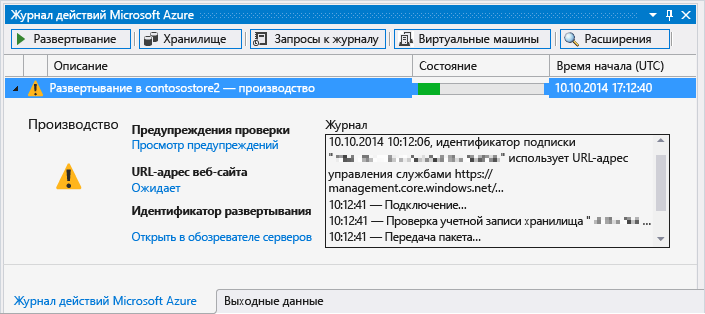

<properties linkid="develop-python-cloud-services-with-ptvs" urlDisplayName="Python Web and Worker Roles with Python Tools 2.1 for Visual Studio" pageTitle="Веб-роли и рабочие роли Python с помощью Python Tools 2.1 для Visual Studio" metaKeywords="Azure python, web role, worker role, PTVS, cloud service" description="Обзор использования Python Tools в Visual Studio для создания облачных служб Azure, включая веб-роли и рабочие роли." metaCanonical="" services="" documentationCenter="Python" title="Python Web and Worker Roles with Python Tools 2.1 for Visual Studio" authors="huvalo" solutions="" manager="wpickett" editor="" />

<tags ms.service="cloud-services" ms.workload="tbd" ms.tgt_pltfrm="na" ms.devlang="python" ms.topic="article" ms.date="10/10/2014" ms.author="huvalo" />

# Веб-роли и рабочие роли Python с помощью Python Tools 2.1 для Visual Studio

В данном руководстве рассматриваются способы использования веб-ролей и рабочих ролей Python с помощью [инструментов Python для Visual Studio][].

+ [Предварительные требования](#prerequisites)
+ [Что такое веб-роли и рабочие роли Python?](#what-are-python-web-and-worker-roles)
+ [Создание проекта](#project-creation)
+ [Локальный запуск](#run-locally)
+ [Публикация в Azure](#publish-to-azure)
+ [Дальнейшие действия](#next-steps)

##Предварительные требования

 - Visual Studio 2012 или 2013
 - [Инструменты Python 2.1 для Visual Studio][]
 - [Пакет инструментов SDK для Azure для VS 2013][] или [Пакет инструментов SDK для Azure для VS 2012][]
 - [Python 2.7 (32-разрядная версия)][] или [Python 3.4 (32-разрядная версия)][]

[WACOM.INCLUDE [create-account-and-websites-note](../includes/create-account-and-websites-note.md)]

##Что такое веб-роли и рабочие роли Python?

Azure предоставляет три вычислительные модели, необходимые для запуска приложений: [Веб-сайты Azure][execution model-web sites], [Виртуальные машины Azure][execution model-vms] и [Облачные службы Azure][execution model-cloud services]. Все три модели поддерживают Python. Облачные службы, которые включают веб-роли и рабочие роли, предоставляют *платформу как службу (PaaS)*. В рамках облачной службы веб-роль предоставляет выделенный веб-сервер IIS для размещения веб-приложений переднего плана, тогда как рабочая роль может выполнять асинхронные, долгосрочные или постоянные задачи, независимые от пользовательских действий и пользовательского ввода.

Дополнительную информацию см. в разделе [Что такое облачная служба?].

<strong>Требуется собрать простой веб-сайт?</strong>

Если ваш сценарий включает только простой интерфейс веб-сайта, следует рассмотреть возможность использования упрощенного веб-сайта Azure. По мере роста веб-сайта и изменения требований можно легко выполнить обновление к облачной службе. В <a href="/ru-ru/develop/python/">Центре по разработке для Python</a> вы можете найти статьи, посвященные вопросам разработки веб-сайтов Azure.

 

##Создание проекта

В Visual Studio вы можете выбрать пункт **Облачная служба Azure** в диалоговом окне **Новый проект** из меню **Python**. 

В мастере настройки Облачной службы Azure можно выбрать соответствующий пункт для создания новой веб-роли или рабочей роли.

Шаблон рабочей роли поставляется вместе со стандартным кодом для реализации подключения к учетной записи хранения Azure или к шине обслуживания.

Добавить веб-роль или рабочую роль к уже существующей облачной службе можно в любое время.  Также можно добавить к собственному решению существующий проект или создать новые проекты. 

В облачной службе могут присутствовать роли, реализованные на различных языках программирования.  Например, может существовать веб-роль на Python, реализованная с помощью Django, одновременно с рабочими ролями на Python и C#.  Можно без труда обмениваться данными между ролями с помощью очередей шины обслуживания или очередей хранилища.

##Локальный запуск

Если настроить проект облачной службы в качестве запускаемого при включении и нажать клавишу F5, тогда эта облачная служба запустится в локальном эмуляторе Azure.

Хотя PTVS поддерживает возможность запуска в эмуляторе, процедура отладки (расстановка точек прерывания и т. д.) в таком режиме не работает.

Чтобы отладить веб-роли и рабочие роли, необходимо установить в настройках проекта роли параметр, определяющий его запуск при включении, и выполнить отладку таким образом.  В качестве запускаемых при включении можно указать несколько проектов.  Щелкните правовой кнопкой мыши на решении и выберите пункт **Назначить запускаемые проекты**.

##Публикация в Azure

Чтобы выполнить публикацию, щелкните правой кнопкой мыши на проекте облачной службы в решении и выберите пункт **Опубликовать**.

На странице настроек отметьте облачную службу, предназначенную для выполнения публикации.

Можно создать новую облачную службу при ее отсутствии.

Также рекомендуется разрешить устанавливать сетевые подключения через удаленные рабочие столы к машинам для выполнения отладки сбоев.

После завершения настройки параметров щелкните **Опубликовать**.

В окне вывода можно будет наблюдать выполнение некоторых операций, а затем появится окно журнала действий Microsoft Azure.

Для развертывания потребуется несколько минут, после чего веб-роли и рабочие роли будут запущены на платформе Azure.

##Дальнейшие действия

С дополнительной информацией о работе с веб-ролями и рабочими ролями в Python Tools для Visual Studio можно ознакомиться в документации PTVS:

- [Проекты облачных служб][]

Для получения более подробной информации об использовании служб Azure из веб-ролей или рабочих ролей, например об использовании хранилища Azure или шины обслуживания, рекомендуется обратиться к следующим руководствам:
 
- [Служба BLOB-объектов][]
- [Служба таблиц][]
- [Служба очередей][]
- [Очереди Service Bus][]
- [Разделы Service Bus][]

<!--Link references-->

[Что такое облачная служба?]: /ru-ru/manage/services/cloud-services/what-is-a-cloud-service/
[модель выполнения - веб-сайты]: /ru-ru/documentation/articles/fundamentals-application-models/#WebSites
[модель выполнения - виртуальные машины]: /ru-ru/documentation/articles/fundamentals-application-models/#VMachine
[модель выполнения - облачные службы]: /ru-ru/documentation/articles/fundamentals-application-models/#CloudServices
[Центр по разработке для Python]: /ru-ru/develop/python/

[Служба BLOB-объектов]: /ru-ru/documentation/articles/storage-python-how-to-use-blob-storage/
[Служба очередей]: /ru-ru/documentation/articles/storage-python-how-to-use-queue-storage/
[Служба таблиц]: /ru-ru/documentation/articles/storage-python-how-to-use-table-storage/
[Очереди Service Bus]: /ru-ru/documentation/articles/service-bus-python-how-to-use-queues/
[Разделы Service Bus]: /ru-ru/documentation/articles/service-bus-python-how-to-use-topics-subscriptions/

<!--External Link references-->

[Инструменты Python для Visual Studio]: http://pytools.codeplex.com
[Документация по инструментам Python для Visual Studio]: http://pytools.codeplex.com/documentation 
[Проекты облачных служб]: http://pytools.codeplex.com/wikipage?title=Features%20Cloud%20Project

[Инструменты Python 2.1 для Visual Studio]: http://go.microsoft.com/fwlink/?LinkId=517189
[Инструменты пакета SDK для Azure для VS 2013]: http://go.microsoft.com/fwlink/?LinkId=323510
[Инструменты пакета SDK для Azure для VS 2012]: http://go.microsoft.com/fwlink/?LinkId=323511
[Python 2.7 (32-разрядная версия)]: http://go.microsoft.com/fwlink/?LinkId=517190 
[Python 3.4 (32-разрядная версия)]: http://go.microsoft.com/fwlink/?LinkId=517191

<!--HONumber=35.1-->
