<properties 
	pageTitle="Начало работы с облачными службами Azure и ASP.NET" 
	description="Как создать многоуровневое приложение с помощью ASP.NET MVC и Azure. Такое приложение выполняется в облачной службе и обладает веб-ролью и рабочей ролью. В его работе используются: Entity Framework, база данных SQL, очереди хранилища Azure и BLOB-объекты." 
	services="cloud-services, storage" 
	documentationCenter=".net" 
	authors="tdykstra" 
	manager="wpickett" 
	editor="mollybos"/>

<tags 
	ms.service="cloud-services" 
	ms.workload="tbd" 
	ms.tgt_pltfrm="na" 
	ms.devlang="dotnet" 
	ms.topic="hero-article" 
	ms.date="2/19/2015" 
	ms.author="tdykstra"/>

# Начало работы с облачными службами Azure и ASP.NET

> [AZURE.SELECTOR]
- [Node.js](cloud-services-nodejs-develop-deploy-app.md)
- [.NET](cloud-services-dotnet-get-started.md)

## Обзор

В этом учебнике показано, как создать многоуровневое приложение .NET на основе интерфейса ASP.NET MVC и развернуть его в [облачной службе Azure](fundamentals-application-models.md#CloudServices). В приложении используются [базы данных SQL Azure](http://msdn.microsoft.com/library/azure/ee336279), [службы больших двоичных объектов Azure](http://www.asp.net/aspnet/overview/developing-apps-with-windows-azure/building-real-world-cloud-apps-with-windows-azure/unstructured-blob-storage)и [службы очередей Azure](http://www.asp.net/aspnet/overview/developing-apps-with-windows-azure/building-real-world-cloud-apps-with-windows-azure/queue-centric-work-pattern). Можно [загрузить проект Visual Studio](http://code.msdn.microsoft.com/Simple-Azure-Cloud-Service-e01df2e4) из коллекции кода MSDN. 

В руководстве показано, как строить и запускать приложение локально, как разворачивать его в Azure и запускать в облаке и, наконец, как создавать его с нуля. Можно начать с построения с нуля и затем выполнить шаги по тестированию и развертыванию по желанию.

## Приложение Contoso Ads

Приложение представляет собой рекламную доску объявлений. Пользователи создают рекламу, вводя текст и загружая изображения. Они могут видеть список рекламы по эскизам изображений, и они могут видеть изображения в полном размере, когда выбирают рекламу для просмотра деталей. Ниже приведен снимок экрана:

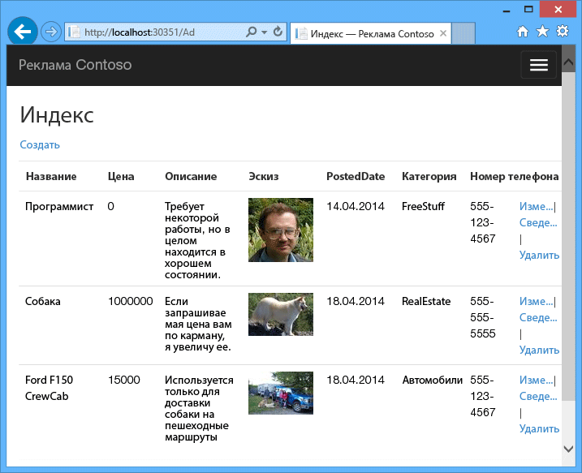

В приложении используется [рабочий шаблон на основе очередей](http://www.asp.net/aspnet/overview/developing-apps-with-windows-azure/building-real-world-cloud-apps-with-windows-azure/queue-centric-work-pattern), чтобы разгрузить ресурсоемкие в отношении использования ЦП задачи по созданию эскизов в процессе серверной части. 

## Альтернативная архитектура: веб-сайты и веб-задания

Это руководство описывает, как запускать фоновые и интерфейсные компоненты в облачной службе Azure. Альтернативой является запуск интерфейсной части [веб-сайта Azure](/services/web-sites/) и использование функции [Веб-задания](http://go.microsoft.com/fwlink/?LinkId=390226) (в настоящее время в предварительной версии) для серверной части. Учебник, где используются веб-задания, см. в разделе [Начало работы с веб-заданиями Azure SDK](../websites-dotnet-webjobs-sdk-get-started.md). О том, как выбрать службы, наилучшим образом отвечающие требованиям сценария, см. в разделе [Сравнение веб-сайтов Azure, облачных служб и виртуальных машин](http://azure.microsoft.com/documentation/articles/choose-web-site-cloud-service-vm/).

## Что вы узнаете

* Как подготовить компьютер к разработке для Azure путем установки пакета Azure SDK.
* Как создать проект облачной службы Visual Studio с веб-ролью ASP.NET MVC и рабочей ролью ASP.NET MVC.
* Как тестировать локально проект облачной службы, используя эмулятор хранилища Azure.
* Как опубликовать облачный проект в облачной службе Azure и тестировать его с использованием учетной записи хранилища Azure.
* Как отправлять файлы и хранить их в службе BLOB-объектов Azure.
* Как использовать службу очередей Azure для связи между уровнями.

## Предварительные требования

Работа с учебником предполагает знание [основных понятий облачных служб Azure,](fundamentals-application-models.md#CloudServices) например терминов  *web role* и  *worker role*.  Кроме того, предполагается, что вы умеете работать с [ASP.NET MVC](http://www.asp.net/mvc/tutorials/mvc-5/introduction/getting-started) и с проектами [веб-форм](http://www.asp.net/web-forms/tutorials/aspnet-45/getting-started-with-aspnet-45-web-forms/introduction-and-overview) в среде Visual Studio. Пример приложения использует MVC, но многое в руководство также применимо к веб-формам. 

Можно запускать приложение локально без подписки Azure, но она понадобится для развертывания приложения в облаке. Если у вас нет учетной записи, то можно [активировать преимущества для подписчиков MSDN](/pricing/member-offers/msdn-benefits-details/?WT.mc_id=A55E3C668) или [подписаться на бесплатную пробную версию](/pricing/free-trial/?WT.mc_id=A55E3C668).

Инструкции руководства применимы со следующими продуктами:

* Visual Studio 2013
* Visual Studio 2013 Express для Web

Если у вас нет одного из них, Visual Studio 2013 Express для Web установится автоматически, когда будет установлен Azure SDK.

## Архитектура приложения

Приложение хранит рекламу в базе данных SQL, используя Entity Framework Code First для создания таблиц и доступа к данным. Для каждой части рекламы база данных хранит два URL-адреса: один для полноразмерного изображения, другой для эскиза.

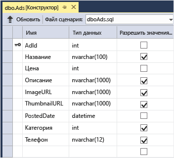

При загрузке изображения пользователем интерфейс в запущенной веб-роли сохраняет изображение в [большом двоичном объекте Azure](http://www.asp.net/aspnet/overview/developing-apps-with-windows-azure/building-real-world-cloud-apps-with-windows-azure/unstructured-blob-storage), а рекламные сведения - в базе данных с URL-адресом в большой двоичный объект. В это же время оно записывает сообщение в очередь Azure. Фоновый процесс, работающий в рабочей роли, периодически опрашивает очередь о новых сообщениях. Когда появляется новое сообщение, рабочая роль создает эскиз для изображения и обновляет поле базы данных с URL-адресом эскиза для этой рекламы. Вот диаграмма, которая показывает, как взаимодействуют части приложения:

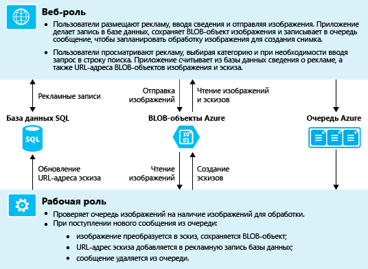

[AZURE.INCLUDE [install-sdk-2013-only](../../includes/install-sdk-2013-only.md)]

## Загрузка и запуск готового решения

1. Загрузите и распакуйте [готовое решение](http://code.msdn.microsoft.com/Simple-Azure-Cloud-Service-e01df2e4).

2. Запустите Visual Studio.

3. В меню **Файл** выберите **Открыть проект**, перейти к папке, куда вы загрузили решение, а затем откройте файл решения.

3. Чтобы построить решение, нажмите CTRL+SHIFT+B.

	По умолчанию Visual Studio автоматически восстанавливает содержимое пакета NuGet, которое не включено в ZIP-файл. Если пакеты не восстановлены, установите их вручную, перейдя к диалогу **Управление пакетами для NuGet решения** и нажав кнопку **Восстановить** вверху справа. 

3. В **обозревателе решений** убедитесь, что проект **ContosoAdsCloudService** выбран в качестве запускаемого.

1. Для запуска приложения нажмите сочетание клавиш CTRL+F5.

	При локальном запуске проекта облачной службы Visual Studio автоматически вызывает  *compute emulator* Azure и  *storage emulator* Azure. Эмулятор хранилища использует ресурсы компьютера для эмуляции сред рабочей и веб-ролей. Эмулятор хранилища использует базу данных [SQL Server Express LocalDB](http://msdn.microsoft.com/library/hh510202.aspx) для моделирования облачного хранилища Azure. 

	При первом запуске проекта облачной службы, запуск эмулятора займет минуту или около того. После завершения работы эмулятора стандартный браузер открывается с домашней страницей приложения.

	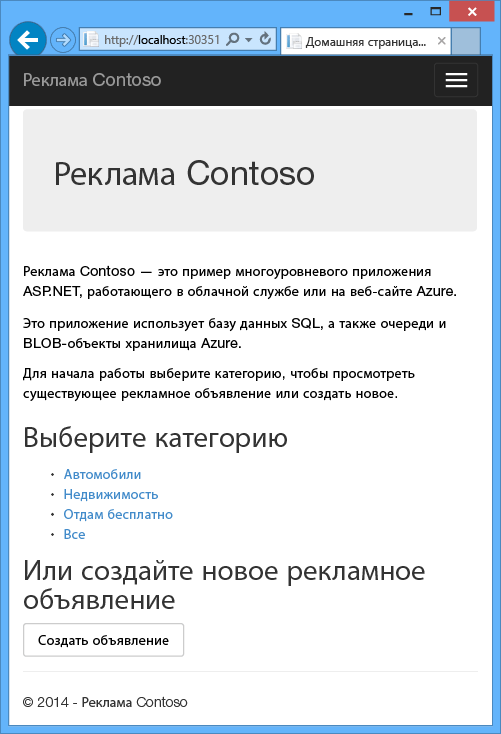

2. Нажмите **Создать рекламу**.

2. Введите некоторые тестовые данные, выберите изображение в формате JPG для загрузки и нажмите кнопку **Создать**.

	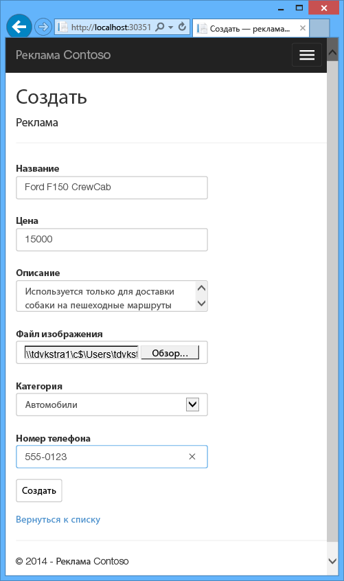

	Приложение переходит к странице индексации, но не показывает эскиз для новой рекламы, поскольку индексирование еще не проводилось.   

3. Подождите немного и затем обновите страницу индексации, чтобы увидеть эскиз.

	

4. Щелкните **Сведения** для своей рекламы, чтобы просмотреть полное изображение.

	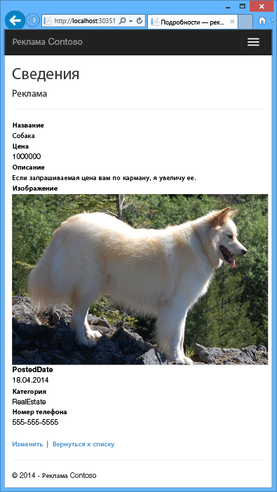

Приложение запущено полностью локально, без соединения с облаком. Эмулятор хранилища сохраняет очередь и данные большого двоичного объекта в базе данных SQL Server Express LocalDB, и приложение хранит данные рекламы в другой базе данных LocalDB. Entity Framework Code First автоматически создает базу данных рекламы в первый раз при обращении приложения к ней.

В следующем разделе будет настроено решение для использования ресурсов облака Azure для очередей, больших двоичных объектов и базы данных приложения, когда оно работает в облаке. При желании можно запускать приложение локально и далее, но можно делать это, используя облачные ресурсы хранилища и базы данных. Все зависит только от задания строк подключения, что показано далее. 

## Развертывание приложения в Azure

Чтобы запустить приложение в облаке, выполните следующие действия:

* Создание облачной службы Azure 
* Создание базы данных SQL Azure
* Создание учетной записи хранения Azure
* Настройка приложения для использования базы данных SQL Azure, когда оно работает в облаке Azure
* Настройка приложения для использования вашей учетной записи хранения при запуске в Azure
* Развертывание проекта в облачной службе Azure

### Создание облачной службы Azure

Облачная служба Azure - это среда, в которой запускают приложение.

1. Откройте в браузере [Портал управления Azure](http://manage.windowsazure.com).

2. Выберите **Создать** - **Вычисления** - **Облачная служба** - **Быстрое создание**.

4. В поле ввода URL-адреса введите префикс URL-адреса. 

	Этот URL-адрес должен быть уникальным.  Появится сообщение об ошибке, если выбранный префикс уже где-то использован.

5. Задайте регион, в котором требуется развернуть приложение.

	Это поле указывает, в каком центре обработки данных будет размещена облачная служба. Для рабочего приложения выбирают регион, ближайший к потребителям. Выберите здесь ближайший к вам регион.

6. Выберите **Создать облачную службу**. 

	На следующем рисунке создается облачная служба с использованием URL-адреса contosoads.cloudapp.net.

	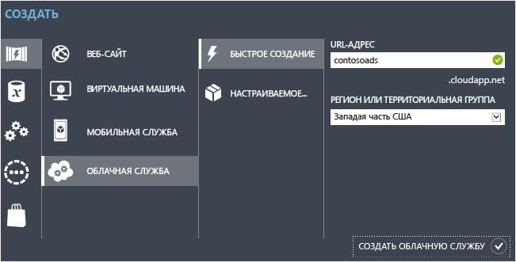	

### Создание базы данных SQL Azure

Когда приложение запускается в облаке, оно использует расположенную в облаке базу данных. 

1. На портале управления Azure выберите **Создать** - **Data Services** - **Базы данных SQL** - **Быстрое создание**.

1. В поле **Имя базы данных** введите *contosoads*.

1. В раскрывающемся списке **Сервер** выберите **Новый сервер базы данных SQL**.

	Если в подписке уже есть сервер, можно выбрать его в раскрывающемся списке.

1. Выберите ту же **Область**, которая была выбрана для облачной службы. 

	Когда облачная служба и база данных находятся в разных центрах обработки данных (различных регионах), увеличивается задержка и вам потребуется оплачивать пропускную способность за пределами центра обработки данных. Пропускная способность в рамках центра обработки данных предоставляется бесплатно.

1. Введите **Имя для входа в систему** и **Пароль** администратора. 

	Если выбрано действие **Создать сервер базы данных SQL**, не используйте здесь существующие имя и пароль, введите новые, которые в дальнейшем будут использоваться при обращении к базе данных. Если выбран созданный ранее сервер, появится запрос на ввод пароля для ранее созданной административной учетной записи.

1. Нажмите **Создать базу данных SQL**.

	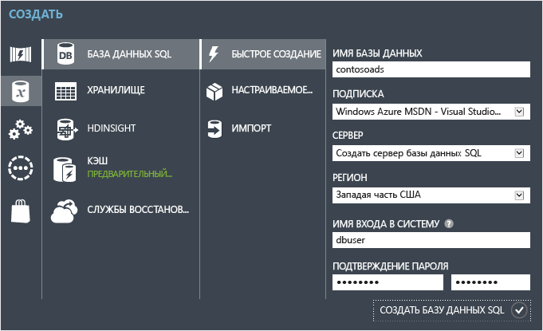	

1. После завершения создания базы данных Azure выберите **Базы данных SQL** в левой части портала, а затем имя новой базы данных.

2. Откройте вкладку **Панель мониторинга**.

3. Выберите **Управление разрешенными IP-адресами**.

4. В разделе **Разрешенные службы** измените **службы Azure** на **Да**.

5. Щелкните **Сохранить**.

### Создание учетной записи хранения Azure

Учетная запись хранения Azure обеспечивает ресурсы для хранения данных очередей и больших двоичных объектов в облаке.

В реальном приложении обычно создают отдельные учетные записи для данных приложения и данных журналов, а также отдельные учетные записи для тестовых данных и рабочих данных. В этом учебнике будет использоваться одна учетная запись.

1. На портале управления Azure щелкните **Создать** - **Службы данных** - **Хранилище** - **Быстрое создание**.

4. В поле **URL-адрес** введите префикс URL-адреса. 

	Этот префикс в сочетании с текстом, который отображается под полем, будет уникальным URL-адресом для вашей учетной записи хранения. Если введенный префикс уже использован где-либо, придется выбрать другой.

5. Выберите в раскрывающемся списке **Область** ту же область, которая была выбрана для облачной службы.

	Когда облачная служба и учетная запись хранения находятся в разных центрах обработки данных (различных областях), увеличивается задержка и вам потребуется оплачивать пропускную способность за пределами центра обработки данных. Пропускная способность в рамках центра обработки данных предоставляется бесплатно.

	Территориальные группы Azure обеспечивают механизм для минимизации расстояния между ресурсами в центре обработки данных, что позволяет уменьшить задержку. В этом учебнике территориальные группы не используются. Дополнительные сведения см. в разделе [Создание территориальной группы в Azure](http://msdn.microsoft.com/library/jj156209.aspx).

6. В раскрывающемся списке **Репликация** выберите **Локально избыточная**. 

	При включении георепликации для учетной записи хранения хранящиеся данные реплицируются в дополнительный центр обработки данных для обеспечения возможности отработки отказа в это расположение в случае крупной аварии в основном расположении. Георепликация может потребовать дополнительных затрат. Для учетных записей тестирования и разработки оплачивать георепликацию обычно не требуется. Дополнительные сведения см. в разделе [Создание, удаление учетной записи хранилища или управление ею](../storage-create-storage-account/#replication-options).

5. Щелкните **Создать учетную запись хранения**. 

	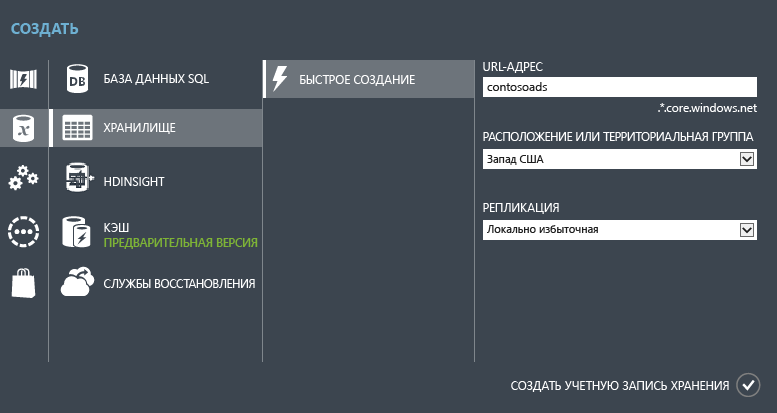	

	На следующем рисунке показано создание учетной записи хранилища с URL-адресом `contosoads.core.windows.net`.

### Настройка приложения для использования базы данных SQL Azure, когда оно работает в облаке Azure

Веб-проект и проект рабочей роли имеют свои строки подключения к базе данных, и обе они должны указывать на базу данных SQL Azure, когда приложение работает в Azure.

[Преобразования Web.config](http://www.asp.net/mvc/tutorials/deployment/visual-studio-web-deployment/web-config-transformations) будут использоваться для веб-роли и настройки среды облачной службы для рабочей роли.

>[AZURE.NOTE] В этом и следующем разделах учетные данные будут сохранены в файлах проектов. [Не сохраняйте конфиденциальные данные в общедоступном репозитории исходного кода](http://www.asp.net/aspnet/overview/developing-apps-with-windows-azure/building-real-world-cloud-apps-with-windows-azure/source-control#secrets).

1. В проекте ContosoAdsWeb откройте файл преобразования *Web.Release.config* для файла приложения *Web.config*, удалите блок комментариев, содержащий элемент <connectionStrings>, и вставьте вместо него следующий код. 

		<connectionStrings>
	        <add name="ContosoAdsContext" connectionString="{connectionstring}"
		    providerName="System.Data.SqlClient" xdt:Transform="SetAttributes" xdt:Locator="Match(name)"/>
		</connectionStrings>

	Оставьте файл открытым для редактирования.

2. На портале управления Azure щелкните **Базы данных SQL**, в области слева выберите базу данных, созданную в этом учебнике, затем **Панель мониторинга**, а затем пункт **Показать строки подключения**.

	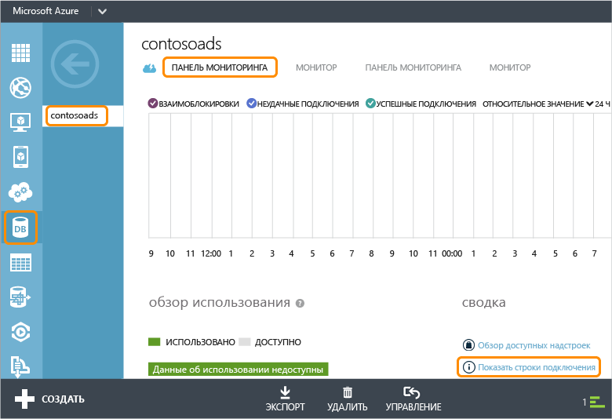	

	Портал выведет строки подключения со звездочками вместо пароля.

	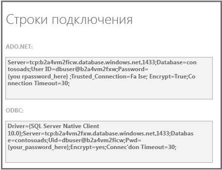	

4. В файле преобразования *Web.Release.config* удалите `{connectionstring}` и вставьте на это место строку подключения ADO.NET с портала управления.

5. В строке подключения, вставленной в файл преобразования *Web.Release.config*, замените `{your_password_here}` паролем, созданным для новой базы данных SQL.

7. Сохраните файл.  

6. Выберите и скопируйте строку подключения (без знаков кавычек) для использования на следующих шагах настройки проекта с рабочей ролью.

5. В **обозревателе решений**в разделе **Роли** проекта облачной службы щелкните правой кнопкой мыши **ContosoAdsWorker** и выберите **Свойства**.

	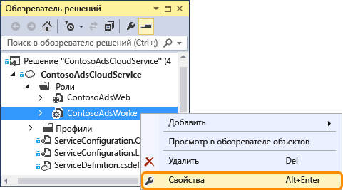	

6. Перейдите на вкладку **Параметры**.

7. Поле **Конфигурация службы** измените на **Облако**.

7. Выберите текст в параметре `ContosoAdsDbConnectionString` и вставьте строку подключения, которую скопировали в предыдущем разделе учебника.

	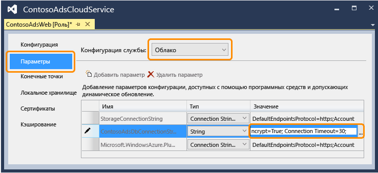	

7. Сохраните изменения.  
 
### Настройка приложения для использования вашей учетной записи хранения при запуске в Azure

Строки подключения учетной записи хранения Azure для проектов рабочей роли и веб-роли сохраняются в настройках среды в проекте облачной службы. Для каждого проекта используется отдельный набор настроек, если приложение запущено локально или в облаке. Следует обновить настройки облачной среды для проектов рабочей роли и веб-роли. 

4. В **обозревателе решений** щелкните правой кнопкой мыши **ContosoAdsWeb** в разделе **Роли** проекта **ContosoAdsCloudService** и выберите **Свойства**.

	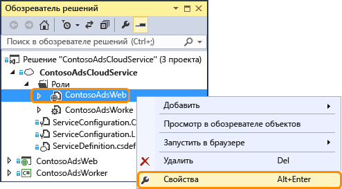	

5. Перейдите на вкладку **Параметры**. В раскрывающемся списке **Конфигурация службы** выберите **Облако**.

	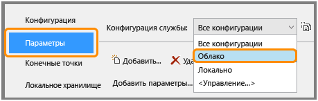	

6. Выбрав запись **StorageConnectionString**, вы увидите кнопку с многоточием (**...**), расположенную справа от строки. Нажмите ее, чтобы открыть диалоговое окно **Создание строки подключения учетной записи хранения**.

	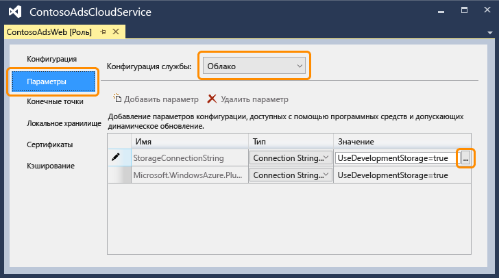	

1. В диалоговом окне **Создание строки подключения хранилища** нажмите кнопку **Подключиться с использованием подписки**, выберите ранее созданную учетную запись хранилища и нажмите кнопку **ОК**. Если вы еще не вошли, появится запрос на ввод учетных данных учетной записи Azure.

	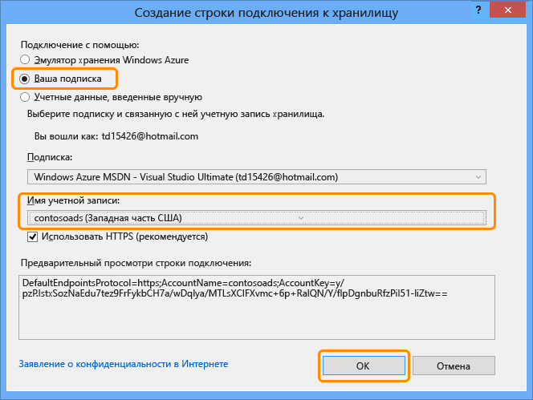	

1. Сохраните изменения.

2. Следуйте той же процедуре, которую использовали для строки подключения `StorageConnectionString`, чтобы задать строку подключения `Microsoft.WindowsAzure.Plugins.Diagnostics.ConnectionString`.

	Эта строка подключения используется для журнала.

2. Выполните ту же процедуру, которая использовалась для роли **ContosoAdsWeb**, чтобы задать обе строки подключения для роли **ContosoAdsWorker**. Не забудьте выбрать в поле **Конфигурация службы** значение **Облако**.

Настройки среды роли, которые были заданы с использованием интерфейса Visual Studio, сохраняются в следующих файлах в проекте ContosoAdsCloudService:

* *ServiceDefinition.csdef* определяет имена параметров.
* *ServiceConfiguration.Cloud.cscfg* представляет значения для времени выполнения приложения в облаке.
* *ServiceConfiguration.local.cscfg* представляет значения для локального выполнения приложения.

Например, ServiceDefinition.csdef включает такие определения:

		<ConfigurationSettings>
		  <Setting name="StorageConnectionString" />
		  <Setting name="ContosoAdsDbConnectionString" />
		</ConfigurationSettings>

Файл *ServiceConfiguration.Cloud.cscfg* содержит значения, введенные для этих параметров в Visual Studio.

		<Role name="ContosoAdsWorker">
		  <Instances count="1" />
		  <ConfigurationSettings>
		    <Setting name="StorageConnectionString" value="{yourconnectionstring}" />
		    <Setting name="ContosoAdsDbConnectionString" value="{yourconnectionstring}" />
		    <!-- other settings not shown -->
		  </ConfigurationSettings>
		  <!-- other settings not shown -->
		</Role>

Параметр <Instances> указывает число виртуальных машин, на которых Azure будет запускать код рабочий роли. В разделе [Дальнейшие действия](#next-steps) содержит ссылки на дополнительные сведения о масштабировании облачной службы.

###  Развертывание проекта в Azure

3.	В **обозревателе решений** щелкните правой кнопкой мыши облачный проект **ContosoAdsCloudService** и выберите **Опубликовать**.

	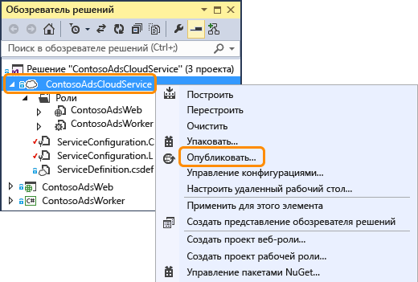	

2. На шаге **Вход** мастера **Публикации приложений Microsoft Azure** нажмите кнопку **Далее**.

	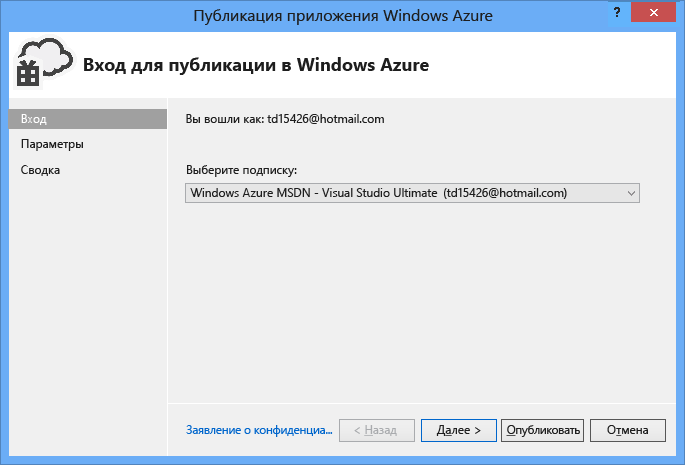	

3. На шаге мастера **Параметры** нажмите кнопку **Далее**.

	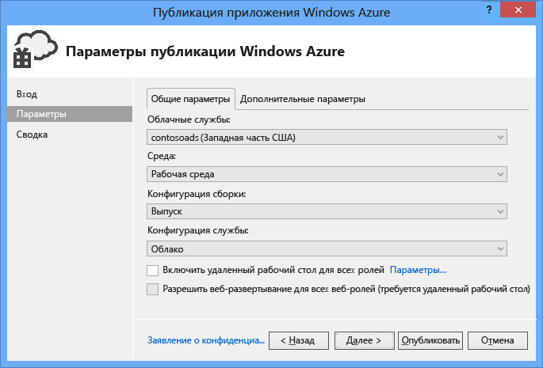	

	Заданные на вкладке **Дополнительно** значения по умолчанию подходят для работы с этим учебником. Дополнительные сведения о вкладке "Дополнительно" см. в разделе [Мастер публикации приложения Azure](http://msdn.microsoft.com/library/hh535756.aspx).

2. На шаге **Сводка** нажмите кнопку **Опубликовать**.

	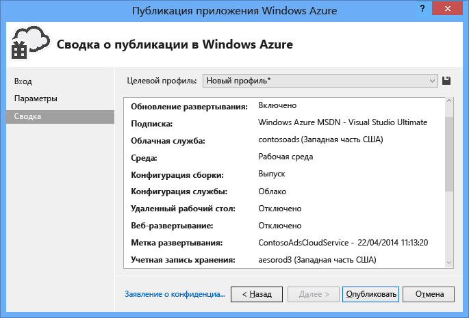	
   
   Окно **Журнал действий Azure** открывается в Visual Studio. 

2. Нажмите значок со стрелкой вправо, чтобы развернуть сведения о развертывании.

	Развертывание может занять около 5 минут и более.

	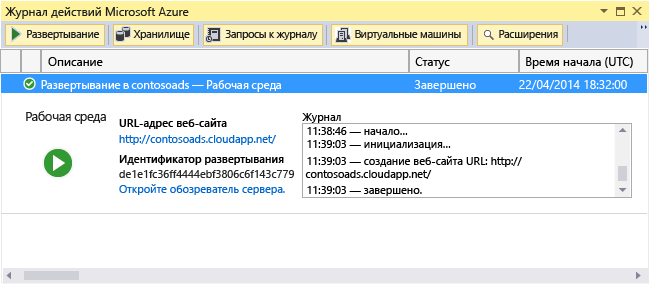	

1. После завершения развертывания щелкните элемент **URL-адрес веб-сайта** для запуска приложения.

9. Теперь можно протестировать приложение, создавая, просматривая и редактируя некоторые элементы рекламы так же, как это происходило при локальном запуске приложения.

>[AZURE.NOTE] После завершения тестирования удалите или остановите облачную службу. Даже если облачная служба не используется, плата за нее начисляется, поскольку ресурсы виртуальной машины для нее зарезервированы. Если оставить ее работающей, любой кто найдет этот URL-адрес, сможет создать и просмотреть рекламу. На портале управления Azure перейдите на **Панель мониторинга** для облачной службы, а затем нажмите кнопку **Удалить** в нижней части страницы. Если нужно временно запретить другим пользователям доступ к сайту, вместо этого нажмите **Остановить**. В этом случае плата будет взиматься. Можно повторить эту же процедуру для удаления базы данных SQL и учетной записи хранения, если они больше не нужны.

## Создание приложения с нуля 

Если вы еще не загрузили 
[готовое приложение](http://code.msdn.microsoft.com/Simple-Azure-Cloud-Service-e01df2e4), сделайте это сейчас. Скопируйте файлы из загруженного проекта в новый проект.

Создание приложения Contoso Ads состоит из следующих шагов:

* Создайте новое решение облачной службы в Visual Studio
* Обновите и добавьте пакеты NuGet
* Установите ссылки проекта
* Настройте строки подключения
* Добавьте файлы кода

После создания решения просмотрите код, уникальный для проектов облачных служб, больших двоичных объектов и очередей Azure.
 
### Создайте новое решение облачной службы в Visual Studio

1. В Visual Studio выберите **Создать проект** в меню **Файл**.

2. В левой области диалогового окна **Создание проекта** разверните **Visual C#**, выберите шаблоны **Облачные** и шаблон **Облачная служба Microsoft Azure**.

3. Присвойте имя проекту и решению ContosoAdsCloudService и нажмите кнопку **ОК**.

	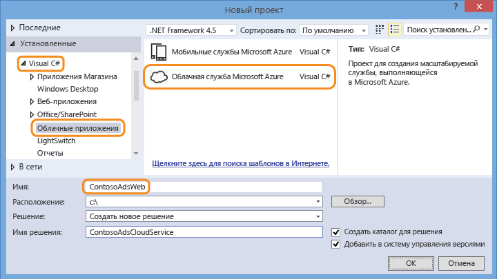	

4. В диалоговом окне **Создание облачной службы Azure** добавьте веб-роль и рабочую роль. Присвойте веб-роли имя ContosoAdsWeb, а рабочей роли - ContosoAdsWorker. (Используйте значок карандаша на правой панели для изменения имен ролей по умолчанию.)

	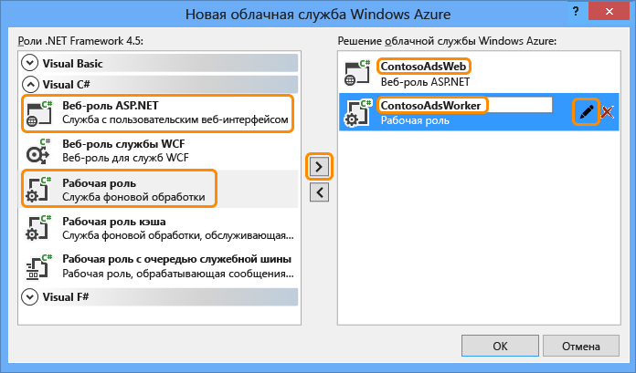	

5. При появлении диалогового окна **Новый проект ASP.NET** для веб-роли выберите шаблон MVC и нажмите кнопку **Изменить проверку подлинности**.

	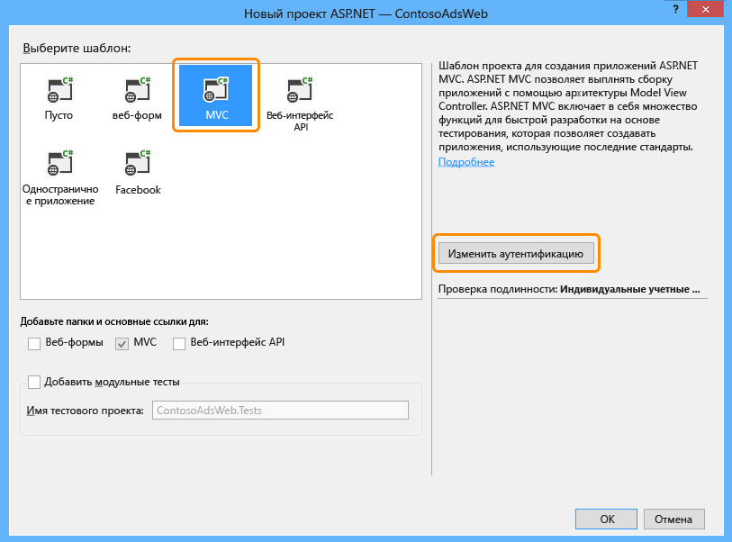	

7. В диалоговом окне "Изменение проверки подлинности" выберите **Без проверки подлинности**, а затем нажмите кнопку **ОК**.

	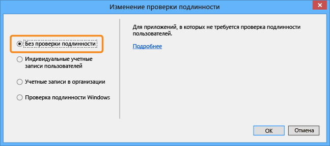	

8. В диалоговом окне **Новый проект ASP.NET** нажмите кнопку **ОК**. 

9. В **обозревателе решений** щелкните правой кнопкой мыши решение (не один из проектов) и выберите **Добавить - новый проект**.

11. В диалоговом окне **Добавление нового проекта** выберите **Рабочий стол Windows** под **Visual C#** на левой панели, а затем выберите шаблон **Библиотека классов**.  

10. Присвойте проекту имя *ContosoAdsCommon*, а затем нажмите **ОК**.

	Необходимо сослаться на контекст и модель данных Entity Framework в обоих проектах - веб-роли и рабочей роли. Как вариант, можно определить связанные с EF классы в проекте веб-роли и сослаться на этот проект из проекта рабочей роли. Но при этом в проекте рабочей роли будет ссылка на веб-сборки, которые ему не нужны.

### Обновите и добавьте пакеты NuGet

11. Откройте диалоговое окно **Управление пакетами NuGet** для решения.

12. В левой области выберите **Обновления**.
   
13. Найдите пакет *Azure Storage* и, если он есть в списке, нажмите кнопку **Обновить**, чтобы получить последнюю версию клиентской библиотеки хранилища.

	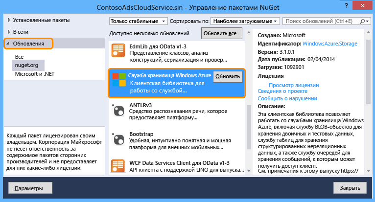	

	Клиентская библиотека хранилища обновляется чаще, чем шаблоны проектов Visual Studio, поэтому часто происходит так, что версию во вновь создаваемых проектах необходимо обновить.
 
14. В левой области выберите **В сети**.

16. Найдите пакет NuGet *EntityFramework* и установите его во все три проекта.

### Установите ссылки проекта

10. Задайте в проекте ContosoAdsWeb ссылку на проект ContosoAdsCommon. Щелкните правой кнопкой мыши проект ContosoAdsWeb и выберите **Ссылки** - **Добавление ссылок**. В диалоговом окне **Диспетчер ссылок** выберите **Решение - Проекты** в левой области, выберите ContosoAdsCommon и нажмите кнопку **ОК**.

11. Задайте в проекте ContosoAdsWorker ссылку на проект ContosoAdsCommon.

	ContosoAdsCommon будет содержать модель данных и контекстный класс Entity Framework, который будет использован как фоновой, так и интерфейсной службой.

11. Задайте в проекте ContosoAdsWorker ссылку на `System.Drawing`.

	Сборка используется внутренней службой для преобразования изображений в эскизы.

### Настройте строки подключения

В этом разделе настройте хранилище Azure и строки подключения SQL для локального тестирования. Инструкции по развертыванию ранее в этом руководстве объясняют, как установить строки подключения в случае, когда приложение работает в облаке.

3. В проекте ContosoAdsWeb откройте файл приложения Web.config и вставьте следующий элемент `connectionStrings` после элемента `configSections`:

		<connectionStrings>
		  <add name="ContosoAdsContext" connectionString="Data Source=(localdb)\v11.0; Initial Catalog=ContosoAds; Integrated Security=True; MultipleActiveResultSets=True;" providerName="System.Data.SqlClient" />
		</connectionStrings>

3. Сохраните изменения.

2. В проекте ContosoAdsCloudService щелкните правой кнопкой мыши ContosoAdsWeb ниже **Роли** и выберите **Свойства**.

		

3. В окне свойств **ContosAdsWeb [Роль]** щелкните вкладку **Параметры**, а затем выберите **Добавить параметр**.

	Оставьте поле **Конфигурация службы** в значении **Все конфигурации**.

4. Добавьте новый параметр *StorageConnectionString*. В столбце **Тип** задайте *ConnectionString*, а в столбце **Значение** - *UseDevelopmentStorage=true*.

	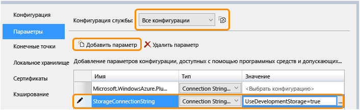	

5. Сохраните изменения.

3. Следуйте этой же процедуре для добавления строки подключения хранилища в свойства роли ContosoAdsWorker.

5. Не закрывая окно свойств **ContosoAdsWorker [Роль]** добавьте еще одну строку подключения.

	* Name: ContosoAdsDbConnectionString
	* Type: String
	* Value: Paste the same connection string you used for the web role project:
	
			Data Source=(localdb)\v11.0; Initial Catalog=ContosoAds; Integrated Security=True; MultipleActiveResultSets=True;
	
### Добавьте файлы кода

В этом разделе скопируйте файлы кода из загруженного решения в новое решение. Следующие разделы покажут и объяснят важные части этого кода.

Чтобы добавить файлы в проект или папку, щелкните правой кнопкой мыши проект или папку и выберите **Добавить** - **Существующий элемент**. Выберите файлы и нажмите кнопку **Добавить**. В ответ на запрос о замене существующих файлов нажмите кнопку **Да**.

3. В проекте ContosoAdsCommon удалите файл *Class1.cs* и добавьте на его место файлы *Ad.cs* и *ContosoAdscontext.cs* из скачанного проекта.

3. В проекте ContosoAdsCommon добавьте следующие файлы из загруженного проекта.
	- *Global.asax.cs*  
	- В папку  *Views\Shared*: <em>_Layout.cshtml</em>.
	- В *Views\Home* папку: *Index.cshtml*.
	- В *Controllers* папку: *AdController.cs*.
	- В *Views\Ad* папку (сначала создайте папку): 5 файлов *CSHTML*.

3. Добавьте в проект ContosoAdsWorker *WorkerRole.cs* из загруженного проекта.

Теперь можно создать и запустить приложение, как описывали инструкции ранее в этом руководстве, и приложение будет использовать локальные ресурсы эмуляторов базы данных и хранилища.

В следующих разделах объясняется код, связанный с работой среды Azure, больших двоичных объектов и очередей. В руководстве не объясняется, как создавать контроллеры и представления MVC, используя формирование шаблонов, как писать код Entity Framework, который работает с базой данных SQL Server, или основы асинхронного программирования в ASP.NET 4.5. Сведения по этим темам смотрите в следующих ресурсах:

* [Начало работы с MVC 5](http://www.asp.net/mvc/tutorials/mvc-5/introduction/getting-started)
* [Начало работы с EF 6 и MVC 5](http://www.asp.net/mvc/tutorials/getting-started-with-ef-using-mvc)
* [Введение в асинхронное программирование в .NET 4.5](http://www.asp.net/aspnet/overview/developing-apps-with-windows-azure/building-real-world-cloud-apps-with-windows-azure/web-development-best-practices#async).

### ContosoAdsCommon - Ad.cs

Файл Ad.cs определяет перечисляемый тип для класса Ad и класс сущностей POCO для информации в рекламе.

		public enum Category
		{
		    Cars,
		    [Display(Name="Real Estate")]
		    RealEstate,
		    [Display(Name = "Free Stuff")]
		    FreeStuff
		}

		public class Ad
		{
		    public int AdId { get; set; }

		    [StringLength(100)]
		    public string Title { get; set; }

		    public int Price { get; set; }

		    [StringLength(1000)]
		    [DataType(DataType.MultilineText)]
		    public string Description { get; set; }

		    [StringLength(1000)]
		    [DisplayName("Full-size Image")]
		    public string ImageURL { get; set; }

		    [StringLength(1000)]
		    [DisplayName("Thumbnail")]
		    public string ThumbnailURL { get; set; }

		    [DataType(DataType.Date)]
		    [DisplayFormat(DataFormatString = "{0:yyyy-MM-dd}", ApplyFormatInEditMode = true)]
		    public DateTime PostedDate { get; set; }

		    public Category? Category { get; set; }
		    [StringLength(12)]
		    public string Phone { get; set; }
		}

### ContosoAdsCommon - ContosoAdsContext.cs

Класс ContosoAdsContext указывает, что класс Ad используется коллекцией DbSet, которую Entity Framework хранит в базе данных SQL.

		public class ContosoAdsContext : DbContext
		{
		    public ContosoAdsContext() : base("name=ContosoAdsContext")
		    {
		    }
		    public ContosoAdsContext(string connString)
		        : base(connString)
		    {
		    }
		    public System.Data.Entity.DbSet<Ad> Ads { get; set; }
		}
 
Класс имеет два конструктора. Первый из них используется веб-проектом и указывает имя строки подключения, которая сохранена в файле Web.config. Второй конструктор дает возможность передачи действующей строки подключения. Это необходимо проекту рабочей роли, поскольку он не имеет файла Web.config. Ранее было показано, где хранится строка подключения, а потом будет показано, как код извлекает строку подключения, когда он создает экземпляр класса DbContext.

### ContosoAdsWeb - Global.asax.cs

Код, который вызывается из метода `Application_Start` создает контейнер больших двоичных объектов *images* и очередь *images*, если они еще не существуют. Это гарантирует, что при начале использования новой учетной записи хранения или эмулятора хранилища на новом компьютере требуемый контейнер больших двоичных объектов и очередь создаются автоматически.

Код получает доступ к учетной записи хранилища через строку подключения хранилища из CSCFG-файла.

		var storageAccount = CloudStorageAccount.Parse
		    (RoleEnvironment.GetConfigurationSettingValue("StorageConnectionString"));

Затем он получает ссылку на контейнер больших двоичных объектов *images*, создает контейнер, если он еще не существует, и наборы разрешений для нового контейнера. По умолчанию новые контейнеры разрешают доступ к большим двоичным объектам только клиентам с учетными данными записи хранилища. Веб-сайту требуются общедоступные большие двоичные объекты, чтобы он мог выводить изображения с использованием URL-адресов, которые указывают на объекты изображений.

		var blobClient = storageAccount.CreateCloudBlobClient();
		var imagesBlobContainer = blobClient.GetContainerReference("images");
		if (imagesBlobContainer.CreateIfNotExists())
		{
		    imagesBlobContainer.SetPermissions(
		        new BlobContainerPermissions
		        {
		            PublicAccess =BlobContainerPublicAccessType.Blob
		        });
		}

Аналогичный код получает ссылку на очередь *images* и создает новую очередь. В этом случае изменений разрешений не требуется.

		CloudQueueClient queueClient = storageAccount.CreateCloudQueueClient();
		var imagesQueue = queueClient.GetQueueReference("images");
		imagesQueue.CreateIfNotExists();

### ContosoAdsWeb - _Layout.cshtml

Файл *_Layout.cshtml* устанавливает имя приложения в заголовке и нижнем колонтитуле и создает запись меню "Ads".

### ContosoAdsWeb - Views\Home\Index.cshtml

Файл *Views\Home\Index.cshtml* выводит ссылки категорий на домашней странице. Ссылки передают целое значение перечисляемого типа  `Category` в переменную querystring на странице индекса Ads.
	
		<li>@Html.ActionLink("Cars", "Index", "Ad", new { category = (int)Category.Cars }, null)</li>
		<li>@Html.ActionLink("Real estate", "Index", "Ad", new { category = (int)Category.RealEstate }, null)</li>
		<li>@Html.ActionLink("Free stuff", "Index", "Ad", new { category = (int)Category.FreeStuff }, null)</li>
		<li>@Html.ActionLink("All", "Index", "Ad", null, null)</li>

### ContosoAdsWeb - AdController.cs

В файле *AdController.cs* конструктор вызывает метод `InitializeStorage` для создания объектов клиентской библиотеки службы хранилища Azure, который предоставляет API для работы с большими двоичными объектами и очередями. 

Затем код получает ссылку на контейнер больших двоичных объектов *images*, как показано ранее в *Global.asax.cs*. При этом он устанавливает [политику повторения](http://www.asp.net/aspnet/overview/developing-apps-with-windows-azure/building-real-world-cloud-apps-with-windows-azure/transient-fault-handling) по умолчанию, подходящую для веб-приложения. Политика повторения с экспоненциальной задержкой по умолчанию может застопорить веб-приложение более чем на минуту при повторяющихся повторах во время кратковременного сбоя. Политика повторения здесь указывает ожидание в 3 секунды после каждой попытки, всего до 3 повторений.

		var blobClient = storageAccount.CreateCloudBlobClient();
		blobClient.RetryPolicy = new LinearRetry(TimeSpan.FromSeconds(3), 3);
		imagesBlobContainer = blobClient.GetContainerReference("images");

Аналогичный код получает ссылку на очередь *images*.

		CloudQueueClient queueClient = storageAccount.CreateCloudQueueClient();
		queueClient.RetryPolicy = new LinearRetry(TimeSpan.FromSeconds(3), 3);
		imagesQueue = queueClient.GetQueueReference("images");

Большая часть кода контроллера обычна для работы с моделью данных Entity Framework с использованием класса DbContext. Исключением является метод `Create` HttpPost, который отправляет файл и сохраняет его в хранилище больших двоичных объектов. Связыватель модели предоставляет методу объект [HttpPostedFileBase](http://msdn.microsoft.com/library/system.web.httppostedfilebase.aspx).

		[HttpPost]
		[ValidateAntiForgeryToken]
		public async Task<ActionResult> Create(
		    [Bind(Include = "Title,Price,Description,Category,Phone")] Ad ad,
		    HttpPostedFileBase imageFile)

При выборе файла для отправки код отправляет его, сохраняет его в большом двоичном объекте и обновляет запись базы данных URL-адресом, который указывает на большой двоичный объект.

		if (imageFile != null && imageFile.ContentLength != 0)
		{
		    blob = await UploadAndSaveBlobAsync(imageFile);
		    ad.ImageURL = blob.Uri.ToString();
		}

Код отправки содержится в методе  `UploadAndSaveBlobAsync`. Он создает имя GUID для большого двоичного объекта, отправляет и сохраняет файл, а также возвращает ссылку на сохраненный большой двоичный объект.

		private async Task<CloudBlockBlob> UploadAndSaveBlobAsync(HttpPostedFileBase imageFile)
		{
		    string blobName = Guid.NewGuid().ToString() + Path.GetExtension(imageFile.FileName);
		    CloudBlockBlob imageBlob = imagesBlobContainer.GetBlockBlobReference(blobName);
		    using (var fileStream = imageFile.InputStream)
		    {
		        await imageBlob.UploadFromStreamAsync(fileStream);
		    }
		    return imageBlob;
		}

После того как метод `Create` HttpPost загружает большой двоичный объект и обновляет базу данных, он создает сообщение очереди для информирования фонового процесса о том, что изображение готово для преобразования в эскиз.

		string queueMessageString = ad.AdId.ToString();
		var queueMessage = new CloudQueueMessage(queueMessageString);
		await queue.AddMessageAsync(queueMessage);

Код для метода `Edit` HttpPost аналогичен, за одним исключением - если пользователь выбирает новый файл изображения, все существующие большие двоичные объекты должны быть удалены.
 
		if (imageFile != null && imageFile.ContentLength != 0)
		{
		    await DeleteAdBlobsAsync(ad);
		    imageBlob = await UploadAndSaveBlobAsync(imageFile);
		    ad.ImageURL = imageBlob.Uri.ToString();
		}

Вот код, который удаляет большие двоичные объекты при удалении элемента рекламы:

		private async Task DeleteAdBlobsAsync(Ad ad)
		{
		    if (!string.IsNullOrWhiteSpace(ad.ImageURL))
		    {
		        Uri blobUri = new Uri(ad.ImageURL);
		        await DeleteAdBlobAsync(blobUri);
		    }
		    if (!string.IsNullOrWhiteSpace(ad.ThumbnailURL))
		    {
		        Uri blobUri = new Uri(ad.ThumbnailURL);
		        await DeleteAdBlobAsync(blobUri);
		    }
		}
		private static async Task DeleteAdBlobAsync(Uri blobUri)
		{
		    string blobName = blobUri.Segments[blobUri.Segments.Length - 1];
		    CloudBlockBlob blobToDelete = imagesBlobContainer.GetBlockBlobReference(blobName);
		    await blobToDelete.DeleteAsync();
		}
 
### ContosoAdsWeb - Views\Ad\Index.cshtml и Details.cshtml

Файл *Index.cshtml* отображает эскизы с другими рекламными данными:

		

Файл *Details.cshtml* отображает полноразмерное изображение:

		

### ContosoAdsWeb - Views\Ad\Create.cshtml и Edit.cshtml

Файлы *Create.cshtml* и *Edit.cshtml* указывают кодирование формы, которое дает возможность контроллеру получить объект `HttpPostedFileBase`.

		@using (Html.BeginForm("Create", "Ad", FormMethod.Post, new { enctype = "multipart/form-data" }))

Элемент `<input>` сообщает браузеру, что нужно открыть диалоговое окно выбора файла.

		<input type="file" name="imageFile" accept="image/*" class="form-control fileupload" />

### ContosoAdsWorker - WorkerRole.cs - метод OnStart

Среда рабочей роли Azure вызывает метод `OnStart` в классе `WorkerRole`, когда рабочая роль начинает работу, и вызывает метод `Run`, когда метод `OnStart` завершает работу.

Метод `OnStart` получает строку подключения к базе данных из CSCFG-файла и передает ее в класс Entity Framework DbContext. Поставщик SQLClient используется по умолчанию, поэтому поставщик не нужно указывать.

		var dbConnString = CloudConfigurationManager.GetSetting("ContosoAdsDbConnectionString");
		db = new ContosoAdsContext(dbConnString);

Затем метод получит ссылку на учетную запись хранилища и создаст контейнер больших двоичных объектов и очередь, если они не существуют. Этот код аналогичен тому, что показан в методе `Application_Start` веб-роли.

### ContosoAdsWorker - WorkerRole.cs - метод Run

Метод `Run` вызывается, когда метод `OnStart` завершает свою начальную работу. Метод выполняет бесконечный цикл, в котором ждет новые сообщения в очереди и обрабатывает их, когда они прибывают.

		public override void Run()
		{
		    CloudQueueMessage msg = null;
		
		    while (true)
		    {
		        try
		        {
		            msg = this.imagesQueue.GetMessage();
		            if (msg != null)
		            {
		                ProcessQueueMessage(msg);
		            }
		            else
		            {
		                System.Threading.Thread.Sleep(1000);
		            }
		        }
		        catch (StorageException e)
		        {
		            if (msg != null && msg.DequeueCount > 5)
		            {
		                this.imagesQueue.DeleteMessage(msg);
		            }
		            System.Threading.Thread.Sleep(5000);
		        }
		    }
		}

После каждой итерации цикла, если сообщение найдено в очереди, программа останавливается на секунду. Это защищает рабочую роль от создания ненужных затрат при использовании времени процессора и транзакций в хранилище. Группа консультирования клиентов Майкрософт рассказывает историю о разработчике, который забыл включить ее, развернул в рабочей среде и уехал в отпуск. Когда он вернулся, то выяснил, что забывчивость встала ему в копеечку.

Иногда содержимое сообщения очереди вызывает ошибку при обработке. Это называется *poison message*, и если вы только что зарегистрировали ошибку и перезапустили цикл, то попытки обработки сообщения могут продолжаться бесконечно.  Поэтому блок catch включает правило if, которое проверяет, сколько раз приложение пыталось обработать текущее сообщение. Если уже насчитано 5 раз, сообщение удаляется из очереди.

При обнаружении сообщения очереди вызывается ProcessQueueMessage.

		private void ProcessQueueMessage(CloudQueueMessage msg)
		{
		    var adId = int.Parse(msg.AsString);
		    Ad ad = db.Ads.Find(adId);
		    if (ad == null)
		    {
		        throw new Exception(String.Format("AdId {0} not found, can't create thumbnail", adId.ToString()));
		    }
		
		    CloudBlockBlob inputBlob = this.imagesBlobContainer.GetBlockBlobReference(ad.ImageURL);
		
		    string thumbnailName = Path.GetFileNameWithoutExtension(inputBlob.Name) + "thumb.jpg";
		    CloudBlockBlob outputBlob = this.imagesBlobContainer.GetBlockBlobReference(thumbnailName);
		
		    using (Stream input = inputBlob.OpenRead())
		    using (Stream output = outputBlob.OpenWrite())
		    {
		        ConvertImageToThumbnailJPG(input, output);
		        outputBlob.Properties.ContentType = "image/jpeg";
		    }
		
		    ad.ThumbnailURL = outputBlob.Uri.ToString();
		    db.SaveChanges();
		
		    this.imagesQueue.DeleteMessage(msg);
		}

Код читает базу данных для получения URL-адреса изображения, конвертирует изображение в эскиз, сохраняет эскиз в большой двоичный объект, добавляет в базу данных URL-адрес большого двоичного объекта эскиза и удаляет сообщение из очереди.

>[AZURE.NOTE] Для простоты код в методе `ConvertImageToThumbnailJPG` использует классы в пространстве имен System.Drawing. Однако классы в этом пространстве имен были спроектированы для использования с формами Windows. Они не поддерживаются в службе Windows или ASP.NET.

## Устранение неполадок

У вас что-то не работает, когда вы выполняете инструкции из этого руководства? Вот несколько общих ошибок и способы их устранения.

### ServiceRuntime.RoleEnvironmentException

Объект `RoleEnvironment` предоставляется Azure, когда приложение запущено в Azure или локально с использованием эмулятора вычислений Azure.  Если сообщение об этой ошибке появляется при локальном выполнении, убедитесь, что проект ContosoAdsCloudService установлен как начальный. Это настраивает проект для запуска с использованием эмулятора вычислений Azure.

Среди прочего, приложение использует RoleEnvironment Azure для получения значений строк подключений из CSCFG-файлов, поэтому еще одной причиной исключения является отсутствие строки подключения. Убедитесь, что настройка StorageConnectionString создана для вариантов "Облако" и "Локально" в проекте ContosoAdsWeb, и что созданы обе строки подключения для обоих вариантов в проекте ContosoAdsWorker. Если вы выполняете поиск **Найти все** для StorageConnectionString во всем решении, то результат должен отобразиться 9 раз в 6 файлах.

### Невозможно переопределить на порт ххх. Новый порт ниже минимально разрешенного значения 8080 для протокола http

Попробуйте изменить номер порта, используемый веб-проектом. Щелкните правой кнопкой мыши проект ContosoAdsWeb и выберите **Свойства**. Откройте вкладку **Web**, а затем измените номер порта в параметре **URL-адрес проекта**.

Другой способ, который может решить проблему, см. в следующем разделе.

### Другие ошибки при работе локально

По умолчанию новые проекты облачной службы используют облегченный эмулятор вычислений Azure для имитации среды Azure. Это облегченная версия полнофункционального эмулятора вычислений; при некоторых условиях полнофункциональный эмулятор будет работать, а облегченный - нет.  

Чтобы изменить проект так, чтобы использовались все возможности эмулятора, щелкните правой кнопкой мыши проект ContosoAdsCloudService и выберите **Свойства**. В окне **Свойства** откройте вкладку **Web**, а затем выберите переключатель **Использовать полный эмулятор**.

Для запуска приложения с полным эмулятором следует открыть Visual Studio с правами администратора.

## Дальнейшие действия

Приложение Contoso Ads намеренно сделано простым для руководства по началу работы. Например, оно не реализует [вставку зависимостей](http://www.asp.net/mvc/tutorials/hands-on-labs/aspnet-mvc-4-dependency-injection) или [репозиторий и блок рабочих шаблонов](http://www.asp.net/mvc/tutorials/getting-started-with-ef-using-mvc/advanced-entity-framework-scenarios-for-an-mvc-web-application#repo), не [использует интерфейс для журналов](http://www.asp.net/aspnet/overview/developing-apps-with-windows-azure/building-real-world-cloud-apps-with-windows-azure/monitoring-and-telemetry#log), не использует [EF Code First Migrations](http://www.asp.net/mvc/tutorials/getting-started-with-ef-using-mvc/migrations-and-deployment-with-the-entity-framework-in-an-asp-net-mvc-application) для управления изменениями модели данных или [EF Connection Resiliency](http://www.asp.net/mvc/tutorials/getting-started-with-ef-using-mvc/connection-resiliency-and-command-interception-with-the-entity-framework-in-an-asp-net-mvc-application) для управления кратковременными ошибками сети и т. д.

Есть несколько примеров приложений облачной службы, которые демонстрируют более жизненные примеры кодирования - от менее сложных к более сложным:

* [PhluffyFotos](http://code.msdn.microsoft.com/PhluffyFotos-Sample-7ecffd31). Похоже на Contoso Ads, но реализует больше функций и больше примеров реального кода.
* [Многоуровневое приложение облачной службы Azure с таблицами, очередями и большими двоичными объектами](http://code.msdn.microsoft.com/windowsazure/Windows-Azure-Multi-Tier-eadceb36). Представляет таблицы хранилищ Azure, большие двоичные объекты и очереди, а также включает [серию пошаговых учебников](../cloud-services-dotnet-multi-tier-app-storage-1-overview.md).
* [Основы облачных служб в Microsoft Azure](http://code.msdn.microsoft.com/Cloud-Service-Fundamentals-4ca72649). Полный пример для демонстрации широкого набора приемов, применяемых группой Microsoft Patterns and Practices.

Общие сведения о разработке облака см. в разделе [Разработка реальных облачных приложений в Azure](http://www.asp.net/aspnet/overview/developing-apps-with-windows-azure/building-real-world-cloud-apps-with-windows-azure/introduction).

Видеоролик о рекомендациях и шаблонах хранилища Azure см. в разделе [Хранилище Microsoft Azure. Новости, рекомендации и шаблоны](http://channel9.msdn.com/Events/Build/2014/3-628).

Для получения дополнительных сведений см. следующие ресурсы:

* [Облачные службы Azure, часть 1: Введение](http://justazure.com/microsoft-azure-cloud-services-part-1-introduction/)
* [Облачные службы Azure](/documentation/services/cloud-services/)
* [Служба хранилища Azure](/documentation/services/storage/)
* [Использование хранилища BLOB-объектов из .NET](../storage-dotnet-how-to-use-blobs.md)
* [Как использовать хранилище очередей из .NET](../storage-dotnet-how-to-use-queues.md)

<!--HONumber=52--> 