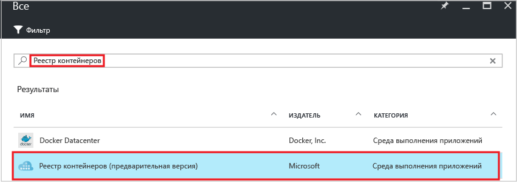
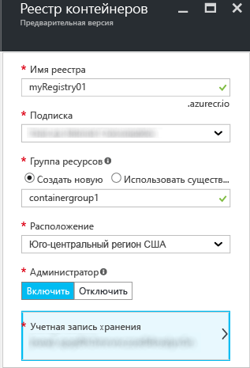
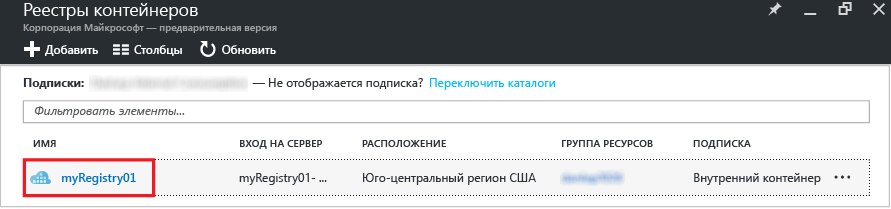
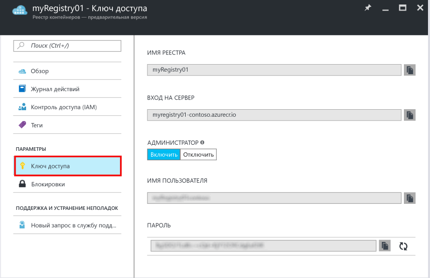

# Создание частного реестра контейнеров Docker с помощью портала Azure
На портале Azure можно создать реестр контейнеров и управлять его параметрами. Кроме того, эти действия можно выполнять с помощью [команд Azure CLI 2.0](container-registry-get-started-azure-cli.md) или программным образом с помощью [REST API](https://go.microsoft.com/fwlink/p/?linkid=834376) реестра контейнеров.

См. дополнительные сведения в [этом обзоре](container-registry-intro.md).

## Создание реестра контейнеров
1. На [портале Azure](https://portal.azure.com) нажмите кнопку **+ Создать**.
2. Найдите в Marketplace **реестр контейнеров Azure**.
3. Выберите **реестр контейнеров Azure** (издатель — корпорация **Майкрософт**).
    
4. Щелкните **Создать**. Откроется колонка **Реестр контейнеров Azure**.

    
5. В колонке **Реестр контейнеров Azure** введите следующую информацию. Закончив, нажмите кнопку **Создать**.

    а. **Имя реестра** — глобальное уникальное доменное имя верхнего уровня для определенного реестра. В этом примере в качестве имени реестра используется имя *myRegistry01*, но его нужно заменить собственным. Имя может содержать только буквы и цифры.

    b. **Группа ресурсов.** Выберите имеющуюся [группу ресурсов](../azure-resource-manager/resource-group-overview.md#resource-groups) или укажите имя, чтобы создать новую.

    c. **Расположение.** Выберите расположение центра обработки данных Azure, в котором [доступна](https://azure.microsoft.com/regions/services/) служба, например **юго-центральный регион США**.

    г) **Пользователь-администратор.** При необходимости укажите пользователя с правами администратора для доступа к реестру. Этот параметр можно изменить после создания реестра.

    > [!IMPORTANT]
    > Кроме предоставления доступа с помощью учетной записи пользователя-администратора, реестры контейнеров также поддерживают проверку подлинности с использованием субъектов-служб Azure Active Directory. Дополнительные сведения и рекомендации см. в статье [Authenticate with the container registry](container-registry-authentication.md) (Проверка подлинности с помощью реестра контейнеров).

    д. **Учетная запись хранения.** Создайте [учетную запись хранения](../storage/storage-introduction.md), используя параметры по умолчанию, или выберите существующую учетную запись хранения в том же расположении. Хранилище класса Premium сейчас не поддерживается.

## Управление параметрами реестра
После создания реестра откройте на портале колонку **Container Registry (предварительная версия)**, чтобы просмотреть его параметры. Например, здесь можно просмотреть параметры входа в реестр, а также включить или отключить пользователя с правами администратора.

1. В колонке **Container Registry (предварительная версия)** щелкните имя реестра.

    
2. Чтобы управлять параметрами доступа, щелкните **Ключ доступа**.

    
3. Обратите внимание на следующие параметры.

   * **Login server** (Сервер входа) — полное доменное имя, используемое для входа в реестр. В нашем примере поисковый запрос будет выглядеть так: `myregistry01.azurecr.io`.
   * **Пользователь-администратор** — установите переключатель в нужное положение, чтобы включить или отключить учетную запись пользователя-администратора.
   * **Имя пользователя** и **Пароль** — учетные данные пользователя-администратора (если включен), используемые для входа в реестр. При необходимости пароли можно создавать повторно. Создаются два пароля. Благодаря этому вы можете подключаться к реестру, используя один пароль, пока не будет повторно создан второй. См. дополнительные сведения об аутентификации с использованием субъекта-службы — [реестра частных контейнеров Docker](container-registry-authentication.md).

## Дальнейшие действия
* [Отправка первого образа с помощью интерфейса командной строки Docker](container-registry-get-started-docker-cli.md)

