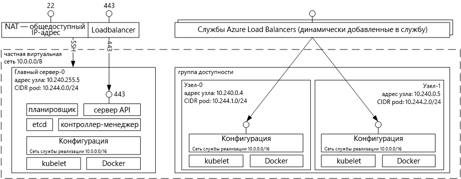

# Знакомство со службой контейнеров Azure для Kubernetes
Служба контейнеров Azure для Kubernetes упрощает создание, настройку и администрирование кластера виртуальных машин, настроенных для запуска контейнерных приложений. Это позволяет использовать имеющиеся навыки либо положиться на опыт обширного и постоянно увеличивающегося сообщества при развертывании приложений на основе контейнера в Microsoft Azure и управлении ими.

Служба контейнеров Azure позволяет пользоваться преимуществами функций корпоративного уровня в Azure, сохраняя при этом возможность переноса приложений в Kubernetes и поддержку формата образов Docker.

## Использование службы контейнеров Azure для Kubernetes
Цель, которой мы стремимся достичь с помощью службы контейнеров Azure, заключается в том, чтобы предоставить среду для размещения контейнеров, применяя средства и технологии с открытым исходным кодом, которые сейчас пользуются популярностью среди наших клиентов. Для этого мы предоставляем стандартные конечные точки API Kubernetes. С помощью этих стандартных конечных точек можно использовать любое программное обеспечение, способное взаимодействовать с кластером Kubernetes. Например, можно выбрать [kubectl](https://kubernetes.io/docs/user-guide/kubectl-overview/), [Helm](https://helm.sh/) или [Draft](https://github.com/Azure/draft).

## Создание кластера Kubernetes с помощью службы контейнеров Azure
Чтобы приступить к работе со службой контейнеров Azure, разверните кластер службы контейнеров Azure с помощью [Azure CLI 2.0](container-service-kubernetes-walkthrough.md) или портала (выполните в Marketplace поиск по словам **служба контейнеров Azure**). Если вы — опытный пользователь, которому требуется дополнительный контроль над шаблонами Azure Resource Manager, вы можете создать пользовательский кластер Kubernetes и развернуть его с помощью интерфейса командной строки `az`, используя проект с открытым кодом [acs-engine](https://github.com/Azure/acs-engine).

### Использование Kubernetes
Kubernetes автоматизирует развертывание, масштабирование приложений-контейнеров и управление ими. Это решение предоставляет обширный набор возможностей, в том числе:
* автоматическая упаковка в контейнеры;
* самовосстановление;
* горизонтальное масштабирование;
* обнаружение служб и балансировка нагрузки;
* автоматические обновления и откаты;
* управление секретами и конфигурациями;
* оркестрация хранилища;
* пакетное выполнение.

Архитектура службы Kubernetes, развернутой с помощью службы контейнеров Azure:

## Видеоролики

Поддержка Kubernetes в службе контейнеров ("Пятница с Azure", январь 2017 г.):

> [!VIDEO https://channel9.msdn.com/Shows/Azure-Friday/Kubernetes-Support-in-Azure-Container-Services/player]
>
>

Средства разработки и развертывания приложений в Kubernetes (Azure OpenDev, июнь 2017 г.):

> [!VIDEO https://channel9.msdn.com/Events/AzureOpenDev/June2017/Tools-for-Developing-and-Deploying-Applications-on-Kubernetes/player]
>
>

## Дальнейшие действия

Изучите [краткое руководство по Kubernetes](container-service-kubernetes-walkthrough.md), чтобы приступить к работе со службой контейнеров Azure прямо сейчас.