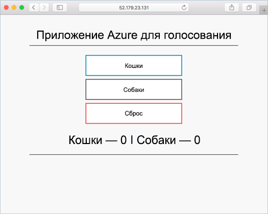

# <a name="deploy-kubernetes-cluster-for-linux-containers"></a>Развертывание кластера Kubernetes для контейнеров Linux

В этом кратком руководстве мы развернем кластер Kubernetes с помощью Azure CLI. Затем в кластере будет развернуто и запущено многоконтейнерное приложение, состоящее из веб-интерфейса и экземпляра Redis. По завершении приложение будет доступно через Интернет. 

Примера приложения, который используется в этом документе, написан на языке Python. Основные понятия и действия, описанные здесь, можно использовать для развертывания в кластере Kubernetes любого образа контейнера. Файл кода (Dockerfile) и предварительно созданные файлы манифеста Kubernetes, относящиеся к этому проекту, доступны на портале [GitHub](https://github.com/Azure-Samples/azure-voting-app-redis.git).



Для работы с этим кратким руководством необходимо знание основных понятий Kubernetes. Подробные сведения см. в [документации по Kubernetes]( https://kubernetes.io/docs/home/).

Если у вас еще нет подписки Azure, [создайте бесплатную учетную запись Azure](https://azure.microsoft.com/free/?WT.mc_id=A261C142F), прежде чем начинать работу.

[!INCLUDE [cloud-shell-try-it.md](../../../includes/cloud-shell-try-it.md)]

Если вы решили установить и использовать CLI локально, для выполнения инструкций в этом руководстве вам понадобится Azure CLI 2.0.4 или более поздней версии. Чтобы узнать версию, выполните команду `az --version`. Если вам необходимо выполнить установку или обновление, см. статью [Установка Azure CLI 2.0]( /cli/azure/install-azure-cli). 

## <a name="create-a-resource-group"></a>Создание группы ресурсов

Создайте группу ресурсов с помощью команды [az group create](/cli/azure/group#create). Группа ресурсов Azure — это логическая группа, в которой выполняется развертывание и администрирование ресурсов Azure. 

В следующем примере создается группа ресурсов с именем *myResourceGroup* в расположении *westeurope*.

```azurecli-interactive 
az group create --name myResourceGroup --location westeurope
```

Выходные данные:

```json
{
  "id": "/subscriptions/00000000-0000-0000-0000-000000000000/resourceGroups/myResourceGroup",
  "location": "westeurope",
  "managedBy": null,
  "name": "myResourceGroup",
  "properties": {
    "provisioningState": "Succeeded"
  },
  "tags": null
}
```

## <a name="create-kubernetes-cluster"></a>Создание кластера Kubernetes

Создание кластера Kubernetes в Службе контейнеров Azure с помощью команды [az acs create](/cli/azure/acs#create). В следующем примере создается кластер с именем *myK8sCluster* при помощи одного главного узла Linux и трех узлов-агентов Linux.

```azurecli-interactive 
az acs create --orchestrator-type kubernetes --resource-group myResourceGroup --name myK8sCluster --generate-ssh-keys 
```

Через несколько минут выполнение команды завершается, и отображаются сведения о кластере в формате JSON. 

## <a name="connect-to-the-cluster"></a>Подключение к кластеру

Управлять кластером Kubernetes можно при помощи [kubectl](https://kubernetes.io/docs/user-guide/kubectl/), клиента командной строки Kubernetes. 

Если вы используете Azure CloudShell, клиент kubectl уже установлен. Для локальной установки можно использовать команду [az acs kubernetes install-cli](/cli/azure/acs/kubernetes#install-cli).

Чтобы настроить kubectl для подключения к кластеру Kubernetes, выполните команду [az acs kubernetes get-credentials](/cli/azure/acs/kubernetes#get-credentials). На этом шаге скачиваются учетные данные и настраивается интерфейс командной строки Kubernetes для их использования.

```azurecli-interactive 
az acs kubernetes get-credentials --resource-group=myResourceGroup --name=myK8sCluster
```

Проверьте подключение к кластеру, выполнив команду [kubectl get](https://kubernetes.io/docs/user-guide/kubectl/v1.6/#get), чтобы просмотреть список узлов кластера.

```azurecli-interactive
kubectl get nodes
```

Выходные данные:

```bash
NAME                    STATUS                     AGE       VERSION
k8s-agent-14ad53a1-0    Ready                      10m       v1.6.6
k8s-agent-14ad53a1-1    Ready                      10m       v1.6.6
k8s-agent-14ad53a1-2    Ready                      10m       v1.6.6
k8s-master-14ad53a1-0   Ready,SchedulingDisabled   10m       v1.6.6
```

## <a name="run-the-application"></a>Выполнение приложения

Файл манифеста Kubernetes определяет требуемое состояние для кластера, включая образы контейнеров, которые нужно запустить. В этом примере манифест используется для создания всех объектов, необходимых для запуска приложения Azure для голосования. 

Создайте файл с именем `azure-vote.yml` и скопируйте в него следующий YAML-файл: Если вы работаете в Azure Cloud Shell, этот файл можно создать с помощью Vi или Nano, как при работе в виртуальной или физической системе.

```yaml
apiVersion: apps/v1beta1
kind: Deployment
metadata:
  name: azure-vote-back
spec:
  replicas: 1
  template:
    metadata:
      labels:
        app: azure-vote-back
    spec:
      containers:
      - name: azure-vote-back
        image: redis
        ports:
        - containerPort: 6379
          name: redis
---
apiVersion: v1
kind: Service
metadata:
  name: azure-vote-back
spec:
  ports:
  - port: 6379
  selector:
    app: azure-vote-back
---
apiVersion: apps/v1beta1
kind: Deployment
metadata:
  name: azure-vote-front
spec:
  replicas: 1
  template:
    metadata:
      labels:
        app: azure-vote-front
    spec:
      containers:
      - name: azure-vote-front
        image: microsoft/azure-vote-front:redis-v1
        ports:
        - containerPort: 80
        env:
        - name: REDIS
          value: "azure-vote-back"
---
apiVersion: v1
kind: Service
metadata:
  name: azure-vote-front
spec:
  type: LoadBalancer
  ports:
  - port: 80
  selector:
    app: azure-vote-front
```

Используйте команду [kubectl create](https://kubernetes.io/docs/user-guide/kubectl/v1.6/#create), чтобы запустить приложение.

```azurecli-interactive
kubectl create -f azure-vote.yml
```

Выходные данные:

```bash
deployment "azure-vote-back" created
service "azure-vote-back" created
deployment "azure-vote-front" created
service "azure-vote-front" created
```

## <a name="test-the-application"></a>Тестирование приложения

При запуске приложения создается [служба Kubernetes](https://kubernetes.io/docs/concepts/services-networking/service/), предоставляющая внешний интерфейс приложения в Интернете. Процесс создания может занять несколько минут. 

Чтобы отслеживать ход выполнения, используйте команду [kubectl get service](https://kubernetes.io/docs/user-guide/kubectl/v1.6/#get) с аргументом `--watch`.

```azurecli-interactive
kubectl get service azure-vote-front --watch
```

Изначально для параметра **ВНЕШНИЙ IP-АДРЕС** службы *azure-vote-front* отображается состояние *ожидания*. Как только для параметра "ВНЕШНИЙ IP-АДРЕС" состояние *ожидания* изменится на *IP-адрес*, используйте команду `CTRL-C`, чтобы остановить процесс отслеживания kubectl. 
  
```bash
azure-vote-front   10.0.34.242   <pending>     80:30676/TCP   7s
azure-vote-front   10.0.34.242   52.179.23.131   80:30676/TCP   2m
```

Теперь можно перейти по внешнему IP-адресу в приложение Azure для голосования.

  

## <a name="delete-cluster"></a>Удаление кластера
Чтобы удалить ненужные кластер, группу ресурсов, службу контейнеров и все связанные с ней ресурсы, выполните команду [az group delete](/cli/azure/group#delete).

```azurecli-interactive 
az group delete --name myResourceGroup --yes --no-wait
```

## <a name="get-the-code"></a>Получение кода

В этом кратком руководстве для развертывания Kubernetes используются предварительно созданные образы контейнеров. Связанный с приложением код, файл Dockerfile и файл манифеста Kubernetes доступны на сайте GitHub.

[https://github.com/Azure-Samples/azure-voting-app-redis](https://github.com/Azure-Samples/azure-voting-app-redis.git)

## <a name="next-steps"></a>Дальнейшие действия

В этом кратком руководстве мы развернули кластер Kubernetes, а затем развернули в нем многоконтейнерное приложение. 

Дополнительные сведения о службе контейнеров Azure и инструкции по созданию полного кода для примера развертывания см. в руководстве по кластерам Kubernetes.

> [!div class="nextstepaction"]
> [Create container images to be used with Azure Container Service](./container-service-tutorial-kubernetes-prepare-app.md) (Создание образов контейнеров для использования со Службой контейнеров Azure)

