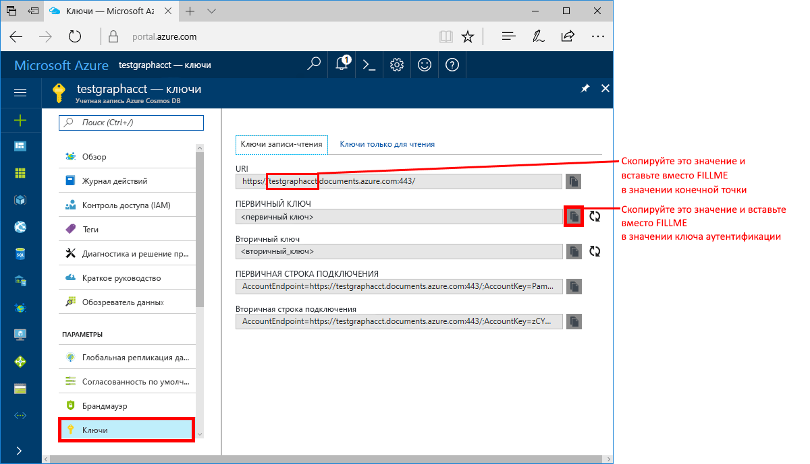
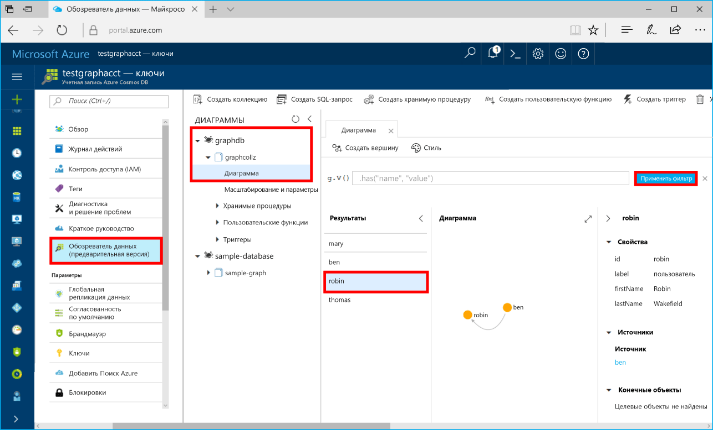

# <a name="azure-cosmos-db-build-a-net-framework-or-core-application-using-the-graph-api"></a>Azure Cosmos DB. Создание приложения .NET Framework или Core с помощью API Graph

Azure Cosmos DB — это глобально распределенная многомодельная служба базы данных Майкрософт. Вы можете быстро создавать и запрашивать документы, пары "ключ — значение" и базы данных графов, используя преимущества возможностей глобального распределения и горизонтального масштабирования базы данных Azure Cosmos DB. 

В этом кратком руководстве показано, как создать учетную запись [API Graph](graph-introduction.md) для Azure Cosmos DB, базу данных и граф (контейнер) с помощью портала Azure. Затем вы можете создать и запустить консольное приложение c помощью драйвера [Gremlin.Net](http://tinkerpop.apache.org/docs/3.2.7/reference/#gremlin-DotNet) с открытым кодом.  

## <a name="prerequisites"></a>предварительным требованиям

Если вы еще не установили Visual Studio 2017, вы можете скачать и использовать **бесплатный** [выпуск Community для Visual Studio 2017](https://www.visualstudio.com/downloads/). При установке Visual Studio необходимо включить возможность **разработки для Azure**.

Если у вас есть Visual Studio 2017, проверьте наличие [обновления 3 для Visual Studio 2017](https://www.visualstudio.com/en-us/news/releasenotes/vs2017-relnotes).

[!INCLUDE [quickstarts-free-trial-note](../../includes/quickstarts-free-trial-note.md)]

## <a name="create-a-database-account"></a>Создание учетной записи базы данных

[!INCLUDE [cosmos-db-create-dbaccount-graph](../../includes/cosmos-db-create-dbaccount-graph.md)]

## <a name="add-a-graph"></a>Добавление графа

[!INCLUDE [cosmos-db-create-graph](../../includes/cosmos-db-create-graph.md)]

## <a name="clone-the-sample-application"></a>Клонирование примера приложения

Теперь необходимо клонировать приложение API Graph из GitHub. Задайте строку подключения и выполните ее. Вы узнаете, как можно упростить работу с данными программным способом. 

1. Откройте окно терминала, например Git Bash, и выполните команду `cd`, чтобы перейти в рабочий каталог.  

2. Выполните команду ниже, чтобы клонировать репозиторий с примером. 

    ```bash
    git clone https://github.com/Azure-Samples/azure-cosmos-db-graph-gremlindotnet-getting-started.git
    ```

3. Затем откройте файл решения в Visual Studio.

4. Восстановите пакеты NuGet в проекте, в том числе драйвер Gremlin.Net и пакет Newtonsoft.Json.

5. Вы также можете установить драйвер Gremlin.Net (версии 3.2.7) вручную, используя диспетчер пакетов Nuget или [служебную программу командной строки NuGet](https://docs.microsoft.com/en-us/nuget/install-nuget-client-tools). 

    ```bash
    nuget install Gremlin.Net -Version 3.2.7
    ```

## <a name="review-the-code"></a>Просмотр кода

Сделаем краткий обзор того, что происходит в приложении. Откройте файл Program.cs, и вы увидите, что эти строки кода создают ресурсы Azure Cosmos DB. 

* Задайте параметры подключения на основе учетной записи, созданной ранее (строка 19). 

    ```csharp
    private static string hostname = "your-endpoint.gremlin.cosmosdb.azure.com";
    private static int port = 443;
    private static string authKey = "your-authentication-key";
    private static string database = "your-database";
    private static string collection = "your-collection-or-graph";
    ```

* Команды Gremlin, которые необходимо выполнить, перечислены в словаре (строка 26).

    ```csharp
    private static Dictionary<string, string> gremlinQueries = new Dictionary<string, string>
    {
        { "Cleanup",        "g.V().drop()" },
        { "AddVertex 1",    "g.addV('person').property('id', 'thomas').property('firstName', 'Thomas').property('age', 44)" },
        { "AddVertex 2",    "g.addV('person').property('id', 'mary').property('firstName', 'Mary').property('lastName', 'Andersen').property('age', 39)" },
        { "AddVertex 3",    "g.addV('person').property('id', 'ben').property('firstName', 'Ben').property('lastName', 'Miller')" },
        { "AddVertex 4",    "g.addV('person').property('id', 'robin').property('firstName', 'Robin').property('lastName', 'Wakefield')" },
        { "AddEdge 1",      "g.V('thomas').addE('knows').to(g.V('mary'))" },
        { "AddEdge 2",      "g.V('thomas').addE('knows').to(g.V('ben'))" },
        { "AddEdge 3",      "g.V('ben').addE('knows').to(g.V('robin'))" },
        { "UpdateVertex",   "g.V('thomas').property('age', 44)" },
        { "CountVertices",  "g.V().count()" },
        { "Filter Range",   "g.V().hasLabel('person').has('age', gt(40))" },
        { "Project",        "g.V().hasLabel('person').values('firstName')" },
        { "Sort",           "g.V().hasLabel('person').order().by('firstName', decr)" },
        { "Traverse",       "g.V('thomas').out('knows').hasLabel('person')" },
        { "Traverse 2x",    "g.V('thomas').out('knows').hasLabel('person').out('knows').hasLabel('person')" },
        { "Loop",           "g.V('thomas').repeat(out()).until(has('id', 'robin')).path()" },
        { "DropEdge",       "g.V('thomas').outE('knows').where(inV().has('id', 'mary')).drop()" },
        { "CountEdges",     "g.E().count()" },
        { "DropVertex",     "g.V('thomas').drop()" },
    };
    ```


* Создайте объект подключения `GremlinServer`, используя параметры, приведенные выше (строка 52).

    ```csharp
    var gremlinServer = new GremlinServer(hostname, port, enableSsl: true, 
                                                    username: "/dbs/" + database + "/colls/" + collection, 
                                                    password: authKey);
    ```

* Создайте объект `GremlinClient` (строка 56).

    ```csharp
    var gremlinClient = new GremlinClient(gremlinServer);
    ```

* Выполните каждый запрос Gremlin, используя объект `GremlinClient` с асинхронной задачей (строка 63). Это необходимо для чтения запросов Gremlin из словаря, указанного выше (строка 26).

    ```csharp
    var task = gremlinClient.SubmitAsync<dynamic>(query.Value);
    task.Wait();
    ```

* Извлеките результат и выполните чтение значений, отформатированных как словарь, с помощью класса `JsonSerializer` из Newtonsoft.Json.

    ```csharp
    foreach (var result in task.Result)
    {
        // The vertex results are formed as dictionaries with a nested dictionary for their properties
        string output = JsonConvert.SerializeObject(result);
        Console.WriteLine(String.Format("\tResult:\n\t{0}", output));
    }
    ```

## <a name="update-your-connection-string"></a>Обновление строки подключения

Теперь вернитесь на портал Azure, чтобы получить данные строки подключения. Скопируйте эти данные в приложение.

1. На [портале Azure](http://portal.azure.com/) щелкните **Ключи**. 

    Скопируйте первую часть значения URI.

    

2. В файл Program.cs вставьте это значение вместо `your-endpoint` в переменной `hostname` в строке 19. 

    `"private static string hostname = "your-endpoint.gremlin.cosmosdb.azure.com";`

    Значение конечной точки должно выглядеть так:

    `"private static string hostname = "testgraphacct.gremlin.cosmosdb.azure.com";`

3. Скопируйте значение **первичного ключа** с портала и вставьте его в переменную `authkey`, заменив заполнитель `"your-authentication-key"` в строке 21. 

    `private static string authKey = "your-authentication-key";`

4. Вставьте имя базы данных, созданной выше, в переменную `database` в строке 22. 

    `private static string database = "your-database";`

5. Аналогичным образом вставьте имя коллекции, созданной выше, (которое также является именем графа) в переменную `collection` в строке 23. 

    `private static string collection = "your-collection-or-graph";`

6. Сохраните файл Program.cs. 

Теперь приложение со всеми сведениями, необходимыми для взаимодействия с Azure Cosmos DB, обновлено. 

## <a name="run-the-console-app"></a>Запуск консольного приложения

Нажмите клавиши CTRL+F5 для запуска приложения. Приложение выведет команды запроса Gremlin и результаты в консоль.

   В окне консоли появятся вершины и ребра, добавляемые в граф. После завершения сценария закройте окно консоли, нажав клавишу ВВОД.

## <a name="browse-using-the-data-explorer"></a>Просмотр с помощью обозревателя данных

Теперь вернитесь в обозреватель данных на портале Azure. Здесь вы можете просмотреть и запросить новые данные графа.

1. В обозревателе данных новая база данных отображается в области "Графы". Разверните базу данных и узлы коллекции, а затем щелкните **Graph** (Граф).

2. Нажмите кнопку **Применить фильтр**, чтобы использовать запрос по умолчанию для просмотра всех вершин графа. Данные, созданные в примере приложения, отображаются на панели Graphs (Графы).

    Вы можете масштабировать граф, развернуть отображаемое пространство, указать дополнительные вершины и переместить их на поверхность отображения.

    

## <a name="review-slas-in-the-azure-portal"></a>Просмотр соглашений об уровне обслуживания на портале Azure

[!INCLUDE [cosmosdb-tutorial-review-slas](../../includes/cosmos-db-tutorial-review-slas.md)]

## <a name="clean-up-resources"></a>Очистка ресурсов

Если вы не собираетесь использовать это приложение дальше, удалите все ресурсы, созданные в ходе работы с этим руководством, на портале Azure, сделав следующее: 

1. В меню слева на портале Azure щелкните **Группы ресурсов**, а затем выберите имя созданного ресурса. 
2. На странице группы ресурсов щелкните **Удалить**, в текстовом поле введите имя ресурса для удаления и щелкните **Удалить**.

## <a name="next-steps"></a>Дополнительная информация

В этом кратком руководстве вы узнали, как создать учетную запись Azure Cosmos DB, граф с помощью обозревателя данных, а также как запустить приложение. Теперь вы можете создавать более сложные запросы и внедрять эффективную логику обхода графа с помощью Gremlin. 

> [!div class="nextstepaction"]
> [Как выполнять запросы к данным в базе данных Azure Cosmos DB с помощью API Graph (предварительная версия)](tutorial-query-graph.md)

