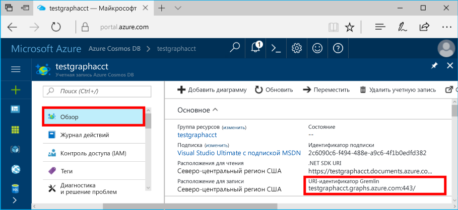

# <a name="azure-cosmos-db-create-query-and-traverse-a-graph-in-the-gremlin-console"></a>Azure Cosmos DB. Создание, запрос и просмотр в консоли Gremlin

Azure Cosmos DB — это глобально распределенная многомодельная служба базы данных Майкрософт. Вы можете быстро создавать и запрашивать документы, пары "ключ — значение" и базы данных графов, используя преимущества возможностей глобального распределения и горизонтального масштабирования базы данных Azure Cosmos DB. 

В этом кратком руководстве показано, как создать учетную запись [API Graph](graph-introduction.md) для Azure Cosmos DB, базу данных и граф (контейнер) с помощью портала Azure, а затем использовать [консоль Gremlin](https://tinkerpop.apache.org/docs/current/reference/#gremlin-console) из [Apache TinkerPop](http://tinkerpop.apache.org) для работы с данными API Graph. В этом руководстве вы создадите вершины и границы и отправите к ним запрос, обновите свойства вершины, отправите запросы к вершинам, просмотрите граф и удалите вершину.


Консоль Gremlin создана на базе Groovy и Java и работает на компьютерах Linux, Mac и Windows. Ее можно скачать с [сайта Apache TinkerPop](http://tinkerpop.apache.org/downloads.html).

## <a name="prerequisites"></a>предварительным требованиям

Для создания учетной записи Azure Cosmos DB во время работы с этим кратким руководством вам потребуется подписка Azure.

[!INCLUDE [quickstarts-free-trial-note](../../includes/quickstarts-free-trial-note.md)]

Вам также нужно установить [консоль Gremlin](http://tinkerpop.apache.org/). Используйте версию 3.2.5 или более позднюю.

## <a name="create-a-database-account"></a>Создание учетной записи базы данных

[!INCLUDE [cosmos-db-create-dbaccount-graph](../../includes/cosmos-db-create-dbaccount-graph.md)]

## <a name="add-a-graph"></a>Добавление графа

[!INCLUDE [cosmos-db-create-graph](../../includes/cosmos-db-create-graph.md)]

## <a id="ConnectAppService"></a>Подключение к службе приложений
1. Перед запуском консоли Gremlin создайте или измените файл конфигурации remote-secure.yaml в каталоге `apache-tinkerpop-gremlin-console-3.2.5/conf`.
2. Укажите *узел*, *порт*, *пользователя*, *пароль*, *пул подключений* и *сериализатор*:

    Параметр|Рекомендуемое значение|ОПИСАНИЕ
    ---|---|---
    Узлы|[***.gremlin.cosmosdb.azure.com] или [***.graphs.azure.com] для учетных записей, созданных до 20 декабря 2017 г.|Просмотрите указанный ниже снимок экрана. Это значение Gremlin URI на странице обзора портала Azure, заключенное в квадратные скобки и без окончания 443/.<br><br>Его также можно получить на вкладке "Ключи" с помощью значения URI, удалив https://, изменив документы на графы или gremlin.cosmosdb и удалив окончание 443/.
    порт|443|Задайте значение 443.
    Имя пользователя|*Имя пользователя*|Ресурс в формате `/dbs/<db>/colls/<coll>`, где `<db>` — это имя базы данных, а `<coll>` — имя коллекции.
    password|*Значение первичного ключа*| Просмотрите второй снимок экрана ниже. Это первичный ключ, который можно получить на странице "Ключи" на портале Azure в поле "Первичный ключ". Скопируйте значение с помощью кнопки копирования в левой части поля.
    Пул подключений|{enableSsl: true}|Параметр пула подключений для SSL.
    serializer|{ className: org.apache.tinkerpop.gremlin.<br>driver.ser.GraphSONMessageSerializerV1d0,<br> config: { serializeResultToString: true }}|Задайте это значение и удалите все разрывы строк `\n` при вставке значения.

    Для значений узлов скопируйте значение **Gremlin URI** со страницы **обзора**: 

    Для значений пароля скопируйте **первичный ключ** со страницы **Ключи**: 

Файл remote-secure.yaml должен выглядеть следующим образом:

```
hosts: [your_database_server.gremlin.cosmosdb.azure.com]
port: 443
username: /dbs/your_database_account/colls/your_collection
password: your_primary_key
connectionPool: {
  enableSsl: true
}
serializer: { className: org.apache.tinkerpop.gremlin.driver.ser.GraphSONMessageSerializerV1d0, config: { serializeResultToString: true }}
```

3. В окне терминала запустите файл `bin/gremlin.bat` или `bin/gremlin.sh`, чтобы запустить [консоль Gremlin](http://tinkerpop.apache.org/docs/3.2.5/tutorials/getting-started/).
4. Чтобы подключиться к службе приложений, в окне терминала запустите файл `:remote connect tinkerpop.server conf/remote-secure.yaml`.

    > [!TIP]
    > При возникновении ошибки `No appenders could be found for logger` убедитесь, что значение сериализатора в файле remote-secure.yaml обновлено, как описано на шаге 2. 

Отлично! Теперь, когда мы завершили настройку, начнем выполнять команды консоли.

Выполним простую команду count(). Введите следующее в командную строку консоли:
```
:> g.V().count()
```

> [!TIP]
> Обратите внимание на символы `:>`, предшествующие тексту `g.V().count()`. 
>
> Это — часть выполняемой команды, необходимая при использовании консоли Gremlin с Azure Cosmos DB.  
>
> Пропуск префикса `:>` указывает консоли выполнять команду локально — часто в отношении выполняющегося в памяти графа.
> Наличие префикса `:>` указывает консоли выполнять команду удаленно — на этот раз в отношении Cosmos DB (либо эмулятора localhost, либо > экземпляра Azure).


## <a name="create-vertices-and-edges"></a>Создание вершин и границ

Начнем с добавления пяти вершин для пользователей *Thomas*, *Mary Kay*, *Robin*, *Ben* и *Jack*.

Входные данные (Thomas):

```
:> g.addV('person').property('firstName', 'Thomas').property('lastName', 'Andersen').property('age', 44).property('userid', 1)
```

Выходные данные:

```
==>[id:796cdccc-2acd-4e58-a324-91d6f6f5ed6d,label:person,type:vertex,properties:[firstName:[[id:f02a749f-b67c-4016-850e-910242d68953,value:Thomas]],lastName:[[id:f5fa3126-8818-4fda-88b0-9bb55145ce5c,value:Andersen]],age:[[id:f6390f9c-e563-433e-acbf-25627628016e,value:44]],userid:[[id:796cdccc-2acd-4e58-a324-91d6f6f5ed6d|userid,value:1]]]]
```
Входные данные (Mary Kay):

```
:> g.addV('person').property('firstName', 'Mary Kay').property('lastName', 'Andersen').property('age', 39).property('userid', 2)

```

Выходные данные:

```
==>[id:0ac9be25-a476-4a30-8da8-e79f0119ea5e,label:person,type:vertex,properties:[firstName:[[id:ea0604f8-14ee-4513-a48a-1734a1f28dc0,value:Mary Kay]],lastName:[[id:86d3bba5-fd60-4856-9396-c195ef7d7f4b,value:Andersen]],age:[[id:bc81b78d-30c4-4e03-8f40-50f72eb5f6da,value:39]],userid:[[id:0ac9be25-a476-4a30-8da8-e79f0119ea5e|userid,value:2]]]]

```

Входные данные (Robin):

```
:> g.addV('person').property('firstName', 'Robin').property('lastName', 'Wakefield').property('userid', 3)
```

Выходные данные:

```
==>[id:8dc14d6a-8683-4a54-8d74-7eef1fb43a3e,label:person,type:vertex,properties:[firstName:[[id:ec65f078-7a43-4cbe-bc06-e50f2640dc4e,value:Robin]],lastName:[[id:a3937d07-0e88-45d3-a442-26fcdfb042ce,value:Wakefield]],userid:[[id:8dc14d6a-8683-4a54-8d74-7eef1fb43a3e|userid,value:3]]]]
```

Входные данные (Ben):

```
:> g.addV('person').property('firstName', 'Ben').property('lastName', 'Miller').property('userid', 4)

```

Выходные данные:

```
==>[id:ee86b670-4d24-4966-9a39-30529284b66f,label:person,type:vertex,properties:[firstName:[[id:a632469b-30fc-4157-840c-b80260871e9a,value:Ben]],lastName:[[id:4a08d307-0719-47c6-84ae-1b0b06630928,value:Miller]],userid:[[id:ee86b670-4d24-4966-9a39-30529284b66f|userid,value:4]]]]
```

Входные данные (Jack):

```
:> g.addV('person').property('firstName', 'Jack').property('lastName', 'Connor').property('userid', 5)
```

Выходные данные:

```
==>[id:4c835f2a-ea5b-43bb-9b6b-215488ad8469,label:person,type:vertex,properties:[firstName:[[id:4250824e-4b72-417f-af98-8034aa15559f,value:Jack]],lastName:[[id:44c1d5e1-a831-480a-bf94-5167d133549e,value:Connor]],userid:[[id:4c835f2a-ea5b-43bb-9b6b-215488ad8469|userid,value:5]]]]
```


Далее добавим границы для создания связей между пользователями.

Входные данные (Thomas -> Mary Kay):

```
:> g.V().hasLabel('person').has('firstName', 'Thomas').addE('knows').to(g.V().hasLabel('person').has('firstName', 'Mary Kay'))
```

Выходные данные:

```
==>[id:c12bf9fb-96a1-4cb7-a3f8-431e196e702f,label:knows,type:edge,inVLabel:person,outVLabel:person,inV:0d1fa428-780c-49a5-bd3a-a68d96391d5c,outV:1ce821c6-aa3d-4170-a0b7-d14d2a4d18c3]
```

Входные данные (Thomas -> Robin):

```
:> g.V().hasLabel('person').has('firstName', 'Thomas').addE('knows').to(g.V().hasLabel('person').has('firstName', 'Robin'))
```

Выходные данные:

```
==>[id:58319bdd-1d3e-4f17-a106-0ddf18719d15,label:knows,type:edge,inVLabel:person,outVLabel:person,inV:3e324073-ccfc-4ae1-8675-d450858ca116,outV:1ce821c6-aa3d-4170-a0b7-d14d2a4d18c3]
```

Входные данные (Robin -> Ben):

```
:> g.V().hasLabel('person').has('firstName', 'Robin').addE('knows').to(g.V().hasLabel('person').has('firstName', 'Ben'))
```

Выходные данные:

```
==>[id:889c4d3c-549e-4d35-bc21-a3d1bfa11e00,label:knows,type:edge,inVLabel:person,outVLabel:person,inV:40fd641d-546e-412a-abcc-58fe53891aab,outV:3e324073-ccfc-4ae1-8675-d450858ca116]
```

## <a name="update-a-vertex"></a>Обновление вершины

Давайте обновим вершину *Thomas* и добавим свойство возраста (*45*).

Входные данные:
```
:> g.V().hasLabel('person').has('firstName', 'Thomas').property('age', 45)
```
Выходные данные:

```
==>[id:ae36f938-210e-445a-92df-519f2b64c8ec,label:person,type:vertex,properties:[firstName:[[id:872090b6-6a77-456a-9a55-a59141d4ebc2,value:Thomas]],lastName:[[id:7ee7a39a-a414-4127-89b4-870bc4ef99f3,value:Andersen]],age:[[id:a2a75d5a-ae70-4095-806d-a35abcbfe71d,value:45]]]]
```

## <a name="query-your-graph"></a>Запрос графа

Теперь давайте отправим разные запросы к графу.

Сначала давайте отправим запрос с фильтрацией, который возвращает сведения только о людях старше 40 лет.

Входные данные (запрос с фильтрацией):

```
:> g.V().hasLabel('person').has('age', gt(40))
```

Выходные данные:

```
==>[id:ae36f938-210e-445a-92df-519f2b64c8ec,label:person,type:vertex,properties:[firstName:[[id:872090b6-6a77-456a-9a55-a59141d4ebc2,value:Thomas]],lastName:[[id:7ee7a39a-a414-4127-89b4-870bc4ef99f3,value:Andersen]],age:[[id:a2a75d5a-ae70-4095-806d-a35abcbfe71d,value:45]]]]
```

Далее давайте спроектируем имя для людей старше 40 лет.

Входные данные (запрос с фильтрацией и проекцией):

```
:> g.V().hasLabel('person').has('age', gt(40)).values('firstName')
```

Выходные данные:

```
==>Thomas
```

## <a name="traverse-your-graph"></a>Просмотр графа

Давайте просмотрим граф, чтобы возвратить сведения обо всех друзьях пользователя Thomas.

Входные данные (друзья пользователя Thomas):

```
:> g.V().hasLabel('person').has('firstName', 'Thomas').outE('knows').inV().hasLabel('person')
```

Выходные данные: 

```
==>[id:f04bc00b-cb56-46c4-a3bb-a5870c42f7ff,label:person,type:vertex,properties:[firstName:[[id:14feedec-b070-444e-b544-62be15c7167c,value:Mary Kay]],lastName:[[id:107ab421-7208-45d4-b969-bbc54481992a,value:Andersen]],age:[[id:4b08d6e4-58f5-45df-8e69-6b790b692e0a,value:39]]]]
==>[id:91605c63-4988-4b60-9a30-5144719ae326,label:person,type:vertex,properties:[firstName:[[id:f760e0e6-652a-481a-92b0-1767d9bf372e,value:Robin]],lastName:[[id:352a4caa-bad6-47e3-a7dc-90ff342cf870,value:Wakefield]]]]
```

Далее рассмотрим следующий уровень вершин. Давайте просмотрим граф, чтобы возвратить сведения обо всех знакомых пользователя Thomas.

Входные данные (знакомые пользователя Thomas):

```
:> g.V().hasLabel('person').has('firstName', 'Thomas').outE('knows').inV().hasLabel('person').outE('knows').inV().hasLabel('person')
```
Выходные данные:

```
==>[id:a801a0cb-ee85-44ee-a502-271685ef212e,label:person,type:vertex,properties:[firstName:[[id:b9489902-d29a-4673-8c09-c2b3fe7f8b94,value:Ben]],lastName:[[id:e084f933-9a4b-4dbc-8273-f0171265cf1d,value:Miller]]]]
```

## <a name="drop-a-vertex"></a>Удаление вершины

Теперь давайте удалим вершину из базы данных графа.

Входные данные (удаление вершины Jack):

```
:> g.V().hasLabel('person').has('firstName', 'Jack').drop()
```

## <a name="clear-your-graph"></a>Очистка графа

Наконец, давайте очистим базу данных ото всех вершин и границ.

Входные данные:

```
:> g.E().drop()
:> g.V().drop()
```

Поздравляем! Вы завершили работу с этим руководством по использованию API Graph в Azure Cosmos DB.

## <a name="review-slas-in-the-azure-portal"></a>Просмотр соглашений об уровне обслуживания на портале Azure

[!INCLUDE [cosmosdb-tutorial-review-slas](../../includes/cosmos-db-tutorial-review-slas.md)]

## <a name="clean-up-resources"></a>Очистка ресурсов

Если вы не собираетесь использовать это приложение дальше, удалите все ресурсы, созданные в ходе работы с этим руководством, на портале Azure, сделав следующее:  

1. В меню слева на портале Azure щелкните **Группы ресурсов**, а затем выберите имя созданного ресурса. 
2. На странице группы ресурсов щелкните **Удалить**, в текстовом поле введите имя ресурса для удаления и щелкните **Удалить**.

## <a name="next-steps"></a>Дополнительная информация

В этом кратком руководстве вы узнали, как создать учетную запись Azure Cosmos DB, создать граф с помощью обозревателя данных, вершины и границы, а также просмотреть граф с помощью консоли Gremlin. Теперь вы можете создавать более сложные запросы и внедрять эффективную логику обхода графа с помощью Gremlin. 

> [!div class="nextstepaction"]
> [Как выполнять запросы к данным в базе данных Azure Cosmos DB с помощью API Graph (предварительная версия)](tutorial-query-graph.md)
