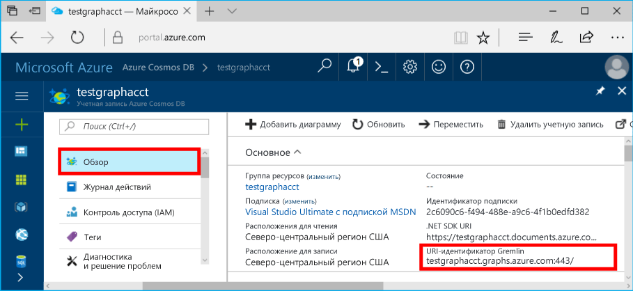
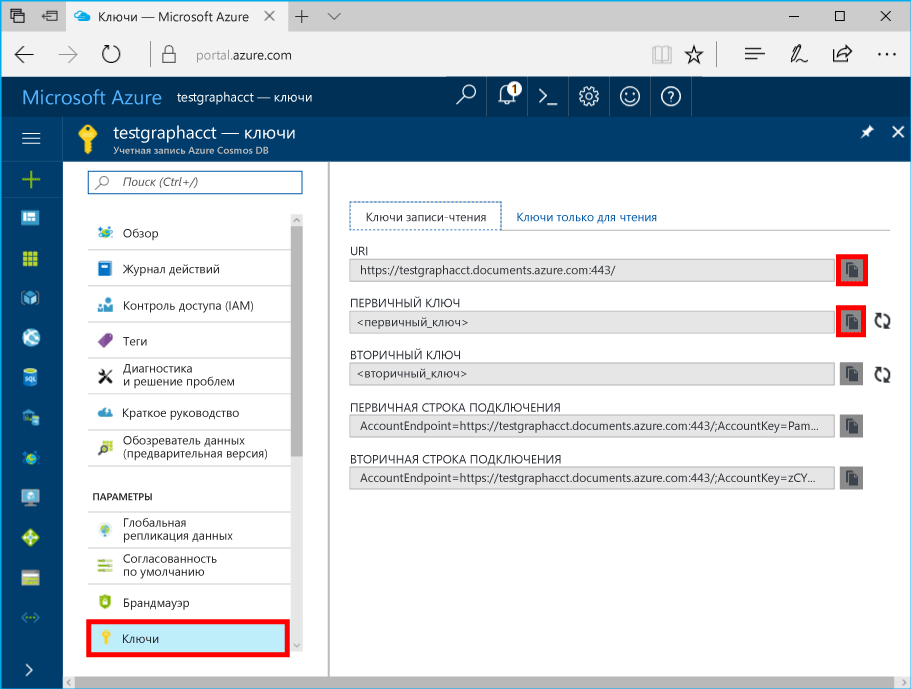

# <a name="azure-cosmos-db-build-a-nodejs-application-by-using-graph-api"></a>Azure Cosmos DB. Создание приложения Node.js с помощью API Graph

Azure Cosmos DB — это глобально распределенная многомодельная служба базы данных Майкрософт. Вы можете быстро создавать и запрашивать документы, пары "ключ — значение" и базы данных графов, используя преимущества возможностей глобального распределения и горизонтального масштабирования базы данных Azure Cosmos DB. 

В этом кратком руководстве показано, как создать учетную запись [API Graph](graph-introduction.md) для Azure Cosmos DB, базу данных и граф с помощью портала Azure. Затем вы можете создать и запустить консольное приложение, используя драйвер [Gremlin Node.js](https://www.npmjs.com/package/gremlin) с открытым кодом.

## <a name="prerequisites"></a>предварительным требованиям

Для выполнения этого примера вам потребуется:
* [Node.js](https://nodejs.org/en/) v0.10.29 или более поздней версии;
* [Git.](http://git-scm.com/)

[!INCLUDE [quickstarts-free-trial-note](../../includes/quickstarts-free-trial-note.md)]

## <a name="create-a-database-account"></a>Создание учетной записи базы данных

[!INCLUDE [cosmos-db-create-dbaccount-graph](../../includes/cosmos-db-create-dbaccount-graph.md)]

## <a name="add-a-graph"></a>Добавление графа

[!INCLUDE [cosmos-db-create-graph](../../includes/cosmos-db-create-graph.md)]

## <a name="clone-the-sample-application"></a>Клонирование примера приложения

Теперь необходимо клонировать приложение API Graph из GitHub. Задайте строку подключения и выполните ее. Вы узнаете, как можно упростить работу с данными программным способом. 

1. Откройте командную строку, создайте папку git-samples, а затем закройте окно командной строки.

    ```bash
    md "C:\git-samples"
    ```

2. Откройте окно терминала git, например git bash, и выполните команду `cd`, чтобы перейти в новую папку для установки примера приложения.

    ```bash
    cd "C:\git-samples"
    ```

3. Выполните команду ниже, чтобы клонировать репозиторий с примером. Эта команда создает копию примера приложения на локальном компьютере.

    ```bash
    git clone https://github.com/Azure-Samples/azure-cosmos-db-graph-nodejs-getting-started.git
    ```

3. Откройте файл решения в Visual Studio. 

## <a name="review-the-code"></a>Просмотр кода

Этот шаг не является обязательным. Если вы хотите узнать, как создать в коде ресурсы базы данных, изучите приведенные ниже фрагменты кода. Если вас это не интересует, можете сразу переходить к разделу [Обновление строки подключения](#update-your-connection-string). 

Приведенные ниже фрагменты кода взяты из файла app.js.

* Создание клиента Gremlin.

    ```nodejs
    const client = Gremlin.createClient(
        443, 
        config.endpoint, 
        { 
            "session": false, 
            "ssl": true, 
            "user": `/dbs/${config.database}/colls/${config.collection}`,
            "password": config.primaryKey
        });
    ```

  Все конфигурации находятся в файле `config.js`, который мы изменим в [следующем разделе](#update-your-connection-string).

* Для выполнения различных операций Gremlin определяется набор функций. Это один из них:

    ```nodejs
    function addVertex1(callback)
    {
        console.log('Running Add Vertex1'); 
        client.execute("g.addV('person').property('id', 'thomas').property('firstName', 'Thomas').property('age', 44).property('userid', 1)", { }, (err, results) => {
          if (err) callback(console.error(err));
          console.log("Result: %s\n", JSON.stringify(results));
          callback(null)
        });
    }
    ```

* Каждая функция выполняет метод `client.execute` с параметром строки запроса Gremlin. Ниже приведен пример выполнения `g.V().count()`:

    ```nodejs
    console.log('Running Count'); 
    client.execute("g.V().count()", { }, (err, results) => {
        if (err) return console.error(err);
        console.log(JSON.stringify(results));
        console.log();
    });
    ```

* В конце файла все методы вызываются с помощью метода `async.waterfall()`. После этого они выполняются один за другим:

    ```nodejs
    try{
        async.waterfall([
            dropGraph,
            addVertex1,
            addVertex2,
            addEdge,
            countVertices
            ], finish);
    } catch(err) {
        console.log(err)
    }
    ```


## <a name="update-your-connection-string"></a>Обновление строки подключения

1. Откройте файл config.js. 

2. В файле сonfig.js заполните значения ключа `config.endpoint` значением **Gremlin URI** со страницы **обзора** на портале Azure. 

    `config.endpoint = "GRAPHENDPOINT";`

    

   Если **универсальный код ресурса (URI) Gremlin** имеет пустое значение, можно создать его, использовав страницу **Ключи** на портале. Используйте значение **URI**, удалите https:// и замените документы на gremlin.cosmosdb. Если ваша учетная запись графа создана до 20 декабря 2017 г., измените документы на графы. 

   Конечная точка Gremlin должна состоять из имени узла без имени протокола или номера порта, например `mygraphdb.gremlin.cosmosdb.azure.com` (а не `https://mygraphdb.gremlin.cosmosdb.azure.com` или `mygraphdb.gremlin.cosmosdb.azure.com:433`).

3. В файле config.js заполните значения параметра config.primaryKey значением **первичного ключа** на странице **Ключи** на портале Azure. 

    `config.primaryKey = "PRIMARYKEY";`

   

4. Введите имя базы данных и графа (контейнера) для значения config.database и config.collection. 

Вот как должен выглядеть файл config.js:

```nodejs
var config = {}

// Note that this must not have HTTPS or the port number
config.endpoint = "testgraphacct.gremlin.cosmosdb.azure.com";
config.primaryKey = "Pams6e7LEUS7LJ2Qk0fjZf3eGo65JdMWHmyn65i52w8ozPX2oxY3iP0yu05t9v1WymAHNcMwPIqNAEv3XDFsEg==";
config.database = "graphdb"
config.collection = "Persons"

module.exports = config;
```

## <a name="run-the-console-app"></a>Запуск консольного приложения

1. Откройте окно терминала. С помощью команды `cd` перейдите в каталог установки файла package.json, включенного в проект.

2. Запустите `npm install`, чтобы установить необходимые модули npm, включая `gremlin`.

3. Запустите `node app.js` в окне терминала, чтобы запустить приложение Node.

## <a name="browse-with-data-explorer"></a>Просмотр с помощью обозревателя данных

Теперь вернитесь в обозреватель данных на портале Azure. Здесь вы можете просматривать, запрашивать и изменять новые данные графа, а также работать с ними.

В обозревателе данных новая база данных отображается в области **Графы**. Разверните базу данных, а затем коллекцию и выберите **Граф**.

Данные, созданные в примере приложения, отображаются в следующей области в пределах вкладки **Граф** при нажатии **Применить фильтр**.

Повторите выполнение `g.V()` с `.has('firstName', 'Thomas')` для тестирования фильтра. Обратите внимание, что в значении учитывается регистр.

## <a name="review-slas-in-the-azure-portal"></a>Просмотр соглашений об уровне обслуживания на портале Azure

[!INCLUDE [cosmosdb-tutorial-review-slas](../../includes/cosmos-db-tutorial-review-slas.md)]

## <a name="clean-up-your-resources"></a>Очистка ресурсов

[!INCLUDE [cosmosdb-delete-resource-group](../../includes/cosmos-db-delete-resource-group.md)]

## <a name="next-steps"></a>Дополнительная информация

Из этой статьи вы узнали, как создать учетную запись Azure Cosmos DB, как создать граф с помощью обозревателя данных, а также как запустить приложение. Теперь вы можете создавать более сложные запросы и внедрять эффективную логику обхода графа с помощью Gremlin. 

> [!div class="nextstepaction"]
> [Как выполнять запросы к данным в базе данных Azure Cosmos DB с помощью API Graph (предварительная версия)](tutorial-query-graph.md)
