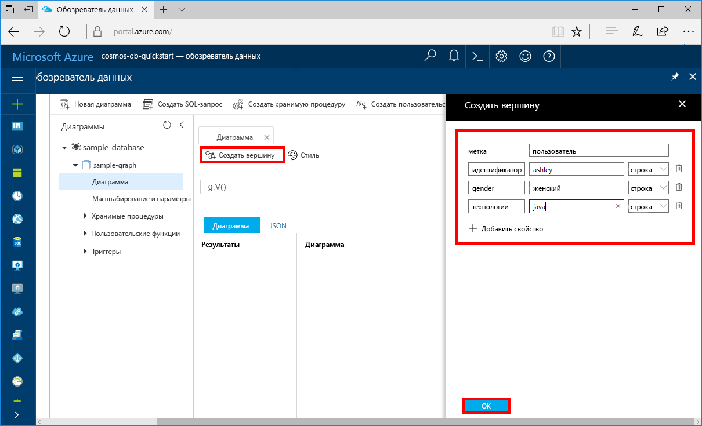

# <a name="azure-cosmos-db-create-a-graph-database-using-php-and-the-azure-portal"></a>Azure Cosmos DB: создание базы данных графа с помощью PHP и портала Azure

В этом руководстве показано, как использовать PHP и [API Graph](graph-introduction.md) Azure Cosmos DB для сборки консольного приложения путем клонирования примера с сайта GitHub. Кроме того, здесь показано, как создать учетную запись Azure Cosmos DB с помощью веб-портала Azure.   

Azure Cosmos DB — это глобально распределенная многомодельная служба базы данных Майкрософт. Вы можете быстро создавать и запрашивать документы, таблицы, пары "ключ — значение" и базы данных графов, используя возможности глобального распределения и горизонтального масштабирования Azure Cosmos DB.  

## <a name="prerequisites"></a>предварительным требованиям

[!INCLUDE [quickstarts-free-trial-note](../../includes/quickstarts-free-trial-note.md)] Кроме того, можно воспользоваться [бесплатной пробной версией Azure Cosmos DB](https://azure.microsoft.com/try/cosmosdb/) без подписки Azure, оплаты и каких-либо обязательств.

Кроме того, сделайте следующее:
* [PHP](http://php.net/) 5.6 или более поздней версии;
* [Редактор](https://getcomposer.org/download/)

## <a name="create-a-database-account"></a>Создание учетной записи базы данных

Перед созданием графовой базы данных необходимо создать учетную запись графовой базы данных Gremlin с Azure Cosmos DB.

[!INCLUDE [cosmos-db-create-dbaccount-graph](../../includes/cosmos-db-create-dbaccount-graph.md)]

## <a name="add-a-graph"></a>Добавление графа

[!INCLUDE [cosmos-db-create-graph](../../includes/cosmos-db-create-graph.md)]

## <a name="clone-the-sample-application"></a>Клонирование примера приложения

Теперь перейдем к работе с кодом. Мы клонируем приложение API Graph из GitHub, зададим строку подключения и выполним ее. Вы узнаете, как можно упростить работу с данными программным способом.  

1. Откройте командную строку, создайте папку git-samples, а затем закройте окно командной строки.

    ```bash
    md "C:\git-samples"
    ```

2. Откройте окно терминала git, например git bash, и выполните команду `cd`, чтобы перейти в папку для установки примера приложения.  

    ```bash
    cd "C:\git-samples"
    ```

3. Выполните команду ниже, чтобы клонировать репозиторий с примером. Эта команда создает копию примера приложения на локальном компьютере. 

    ```bash
    git clone https://github.com/Azure-Samples/azure-cosmos-db-graph-php-getting-started.git
    ```

## <a name="review-the-code"></a>Просмотр кода

Этот шаг не является обязательным. Если вы хотите узнать, как создать в коде ресурсы базы данных, изучите приведенные ниже фрагменты кода. Они взяты из файла connect.php, который расположен в папке C:\git-samples\azure-cosmos-db-graph-php-getting-started\. Если вас это не интересует, можете сразу переходить к разделу [Обновление строки подключения](#update-your-connection-information). 

* `connection` в Gremlin инициализируется в начале файла `connect.php` с помощью объекта `$db`.

    ```php
    $db = new Connection([
        'host' => '<your_server_address>.graphs.azure.com',
        'username' => '/dbs/<db>/colls/<coll>',
        'password' => 'your_primary_key'
        ,'port' => '443'

        // Required parameter
        ,'ssl' => TRUE
    ]);
    ```

* Выполнение шагов Gremlin с использованием метода `$db->send($query);`.

    ```php
    $query = "g.V().drop()";
    ...
    $result = $db->send($query);
    $errors = array_filter($result);
    }
    ```

## <a name="update-your-connection-information"></a>Обновление информации о подключении

Теперь вернитесь на портал Azure, чтобы получить данные для подключения. Скопируйте эти данные в приложение. Эти настройки обеспечат обмен данными между вашим приложением и размещенной базой данных.

1. На [портале Azure](http://portal.azure.com/) щелкните **Ключи**. 

    Скопируйте первую часть значения URI.

    
2. Откройте файл `connect.php` и в строке 8 вставьте значение URI вместо `your_server_address`.

    Код инициализации для объекта подключения теперь должен выглядеть примерно так:

    ```php
    $db = new Connection([
        'host' => 'testgraphacct.graphs.azure.com',
        'username' => '/dbs/<db>/colls/<coll>',
        'password' => 'your_primary_key'
        ,'port' => '443'

        // Required parameter
        ,'ssl' => TRUE
    ]);
    ```

3. Если учетная запись базы данных графа создана 20 декабря 2017 г. или позже, измените `graphs.azure.com` в имени узла на `gremlin.cosmosdb.azure.com`.

4. Измените параметр `username` в объекте подключения, указав имена вашей базы данных и графа. Если использовались рекомендуемые значения `sample-database` и `sample-graph`, код должен выглядеть следующим образом:

    `'username' => '/dbs/sample-database/colls/sample-graph'`

    Сейчас весь объект подключения должен выглядеть, как в следующем фрагменте кода:

    ```php
    $db = new Connection([
        'host' => 'testgraphacct.graphs.azure.com',
        'username' => '/dbs/sample-database/colls/sample-graph',
        'password' => 'your_primary_key',
        'port' => '443'

        // Required parameter
        ,'ssl' => TRUE
    ]);
    ```

5. На портале Azure с помощью кнопки "Копировать" скопируйте первичный ключ и вставить его вместо `your_primary_key` в параметр пароля (password).

    Код инициализации для объекта подключения теперь должен выглядеть так:

    ```php
    $db = new Connection([
        'host' => 'testgraphacct.graphs.azure.com',
        'username' => '/dbs/sample-database/colls/sample-graph',
        'password' => '2Ggkr662ifxz2Mg==',
        'port' => '443'

        // Required parameter
        ,'ssl' => TRUE
    ]);
    ```

6. Сохраните файл `connect.php`.

## <a name="run-the-console-app"></a>Запуск консольного приложения

1. В окне терминала Git перейдите к папке azure-cosmos-db-graph-php-getting-started с помощью команды `cd`.

    ```git
    cd "C:\git-samples\azure-cosmos-db-graph-php-getting-started"
    ```

2. В окне терминала Git используйте приведенную ниже команду, чтобы установить необходимые пакеты PHP.

   ```
   composer install
   ```

3. В окне терминала Git используйте приведенную ниже команду, чтобы запустить приложение PHP.
    
    ```
    php connect.php
    ```

    В окне терминала появятся вершины, добавляемые в граф. 
    
    Если возникают ошибки времени ожидания, проверьте, правильно ли вы [указали сведения о подключении](#update-your-connection-information), и попробуйте еще раз выполнить последнюю команду. 
    
    Когда программа завершит работу, нажмите клавишу ВВОД и переключитесь на окно веб-браузера с порталом Azure. 

<a id="add-sample-data"></a>
## <a name="review-and-add-sample-data"></a>Просмотр и добавление демонстрационных данных

Теперь можно вернуться в обозреватель данных, чтобы просмотреть вершины, добавленные в граф, и добавить дополнительные точки данных.

1. Щелкните **Обозреватель данных**, затем разверните **sample-graph**, щелкните **Граф** и нажмите кнопку **Применить фильтр**. 

   

2. В списке **результатов** обратите внимание на новых пользователей, добавленных в граф. Выберите пользователя **ben**. Вы увидите, что он связан с пользователем robin. Здесь можно перетаскивать вершины мышью, увеличивать или уменьшать масштаб колесиком мыши, а также увеличивать размер графа с помощью двойной стрелки. 

   

3. Давайте добавим несколько новых пользователей. Нажмите кнопку **New Vertex** (Создать вершину), чтобы добавить данные в граф.

   

4. Введите метку *person*.

5. Щелкните **Добавить свойство**, чтобы поочередно добавить каждое из указанных ниже свойств. Обратите внимание, что вы можете создать уникальные свойства для каждого пользователя в графе. Требуется только ключ идентификатора.

    key|value|Заметки
    ----|----|----
    id|ashley|Уникальный идентификатор вершины. Если не указать идентификатор, он создастся автоматически.
    gender|Женский| 
    Технология | java | 

    > [!NOTE]
    > С помощью этого краткого руководства вы создадите несекционированную коллекцию. Но если вы создаете секционированную коллекцию, указав ключ раздела во время создания коллекции, включите ключ раздела в качестве ключа каждой новой вершины. 

6. Последовательно выберите **ОК**. Чтобы увидеть кнопку **ОК** в нижней части экрана, может потребоваться развернуть экран.

7. Еще раз нажмите кнопку **New Vertex** (Создать вершину), чтобы добавить нового пользователя. 

8. Введите метку *person*.

9. Щелкните **Добавить свойство**, чтобы поочередно добавить следующие свойства:

    key|value|Заметки
    ----|----|----
    id|rakesh|Уникальный идентификатор вершины. Если не указать идентификатор, он создастся автоматически.
    gender|Мужской| 
    Учебное заведение|MIT| 

10. Последовательно выберите **ОК**. 

11. Нажмите кнопку **Применить фильтр** со стандартным значением фильтра `g.V()`, чтобы отобразить все значения графа. Все пользователи теперь отображаются в списке **Результаты**. 

    По мере добавления новых данных используйте фильтры для ограничения результатов. По умолчанию обозреватель данных использует `g.V()` для получения всех вершин в графе. Вы можете задать для него другой [запрос графа](tutorial-query-graph.md), например `g.V().count()`, который возвращает число всех вершин графа в формате JSON. Если вы изменили фильтр, для возвращения к полному списку результатов снова установите фильтр `g.V()` и щелкните **Применить фильтр**.

12. Теперь вы можете соединить пользователей rakesh и ashley. Выберите в списке **Результаты** пользователя **ashley**, а затем нажмите кнопку редактирования рядом с разделом **Целевые объекты** в нижнем правом углу. Чтобы отобразить область **Свойства**, может потребоваться развернуть окно.

   

13. В поле **Целевой объект** введите *rakesh*, затем в поле **Граничная метка** введите слово *знает* и щелкните значок галочки.

   

14. Теперь выберите пользователя **rakesh** в списке результатов. Вы увидите, что пользователи ashley и rakesh связаны. 

   

   На этом часть краткого руководства, посвященная созданию ресурсов, завершена. Вы можете дополнить граф новыми вершинами, а также изменить существующие вершины или запросы. Теперь давайте изучим метрики, которые предоставляет Azure Cosmos DB, а затем очистим все ресурсы. 

## <a name="review-slas-in-the-azure-portal"></a>Просмотр соглашений об уровне обслуживания на портале Azure

[!INCLUDE [cosmosdb-tutorial-review-slas](../../includes/cosmos-db-tutorial-review-slas.md)]

## <a name="clean-up-resources"></a>Очистка ресурсов

[!INCLUDE [cosmosdb-delete-resource-group](../../includes/cosmos-db-delete-resource-group.md)]

## <a name="next-steps"></a>Дополнительная информация

В этом кратком руководстве вы узнали, как создать учетную запись Azure Cosmos DB, граф с помощью обозревателя данных, а также как запустить приложение. Теперь вы можете создавать более сложные запросы и внедрять эффективную логику обхода графа с помощью Gremlin. 

> [!div class="nextstepaction"]
> [Как выполнять запросы к данным в базе данных Azure Cosmos DB с помощью API Graph (предварительная версия)](tutorial-query-graph.md)

