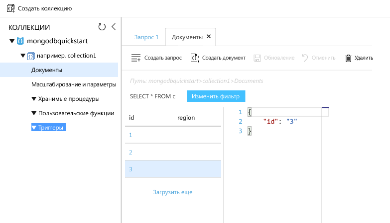

# <a name="azure-cosmos-db-migrate-an-existing-nodejs-mongodb-web-app"></a>Azure Cosmos DB. Перемещение имеющегося веб-приложения MongoDB Node.js 

Azure Cosmos DB — это глобально распределенная многомодельная служба базы данных Майкрософт. Вы можете быстро создавать и запрашивать документы, пары "ключ — значение" и базы данных графов, используя преимущества возможностей глобального распределения и горизонтального масштабирования базы данных Azure Cosmos DB. 

В этом кратком руководстве объясняется, как использовать существующее приложение MongoDB, написанное на Node.js, а также как подключить его к базе данных Azure Cosmos DB, поддерживающей клиентские подключения MongoDB с использованием [API MongoDB](mongodb-introduction.md). Другими словами, только приложение Node.js "знает" о подключении к базе данных с помощью API-интерфейсов MongoDB. Приложению понятно, что данные хранятся в службе Azure Cosmos DB.

В итоге вы получите приложение MEAN (MongoDB, Express, AngularJS и Node.js), выполняющееся в [Azure Cosmos DB](https://azure.microsoft.com/services/cosmos-db/). 


[!INCLUDE [cloud-shell-try-it](../../includes/cloud-shell-try-it.md)]

Если вы решили установить и использовать интерфейс командной строки локально, для работы с этим руководством вам понадобится Azure CLI 2.0 или более поздней версии. Чтобы узнать версию, выполните команду `az --version`. Если вам необходимо выполнить установку или обновление, см. статью [Установка Azure CLI 2.0]( /cli/azure/install-azure-cli). 

## <a name="prerequisites"></a>предварительным требованиям 
Если у вас еще нет подписки Azure, [создайте бесплатную учетную запись Azure](https://azure.microsoft.com/free/?WT.mc_id=A261C142F), прежде чем начинать работу. 
[!INCLUDE [cosmos-db-emulator-mongodb](../../includes/cosmos-db-emulator-mongodb.md)]

Кроме Azure CLI, вам нужно локально установить [Node.js](https://nodejs.org/) и [Git](http://www.git-scm.com/downloads) для выполнения команд `npm` и `git`.

У вас должен быть опыт работы с Node.js. В целом разработка приложений Node.js в этом кратком руководстве не рассматривается.

## <a name="clone-the-sample-application"></a>Клонирование примера приложения

Затем выполните следующие команды, чтобы клонировать репозиторий с примером. Этот репозиторий с примером содержит приложение по умолчанию [MEAN.js](http://meanjs.org/).

1. Откройте командную строку, создайте папку git-samples, а затем закройте окно командной строки.

    ```bash
    md "C:\git-samples"
    ```

2. Откройте окно терминала git, например git bash, и выполните команду `cd`, чтобы перейти в новую папку для установки примера приложения.

    ```bash
    cd "C:\git-samples"
    ```

3. Выполните команду ниже, чтобы клонировать репозиторий с примером. Эта команда создает копию примера приложения на локальном компьютере. 

    ```bash
    git clone https://github.com/prashanthmadi/mean
    ```

## <a name="run-the-application"></a>Выполнение приложения

Установите необходимые пакеты и запустите приложение.

```bash
cd mean
npm install
npm start
```
Приложение попытается подключиться к источнику MongoDB, что ему не удастся. Выйдите из приложения, если в выходных данных появится ошибка [MongoError: connect ECONNREFUSED 127.0.0.1:27017].

## <a name="log-in-to-azure"></a>Вход в Azure

Если вы используете установленную версию Azure CLI, войдите в подписку Azure с помощью команды [az login](/cli/azure/reference-index#az_login) и следуйте инструкциям на экране. Этот шаг можно пропустить, если вы используете Azure Cloud Shell.

```azurecli
az login 
``` 
   
## <a name="add-the-azure-cosmos-db-module"></a>Добавление модуля Azure Cosmos DB

Если вы используете установленную версию Azure CLI, проверьте наличие компонента `cosmosdb`, выполнив команду `az`. Если компонент `cosmosdb` включен в список базовых команд, перейдите к следующей команде. Этот шаг можно пропустить, если вы используете Azure Cloud Shell.

Если компонента `cosmosdb` нет в списке базовых команд, переустановите [Azure CLI 2.0]( /cli/azure/install-azure-cli).

## <a name="create-a-resource-group"></a>Создание группы ресурсов

Создайте [группу ресурсов](../azure-resource-manager/resource-group-overview.md) с помощью команды [az group create](/cli/azure/group#az_group_create). Группа ресурсов Azure — это логический контейнер, в котором происходит развертывание ресурсов Azure (веб-приложений, баз данных и учетных записей хранения) и управление ими. 

В следующем примере показано создание группы ресурсов в регионе "Западная Европа". Выберите уникальное имя для группы ресурсов.

Если вы используете Azure Cloud Shell, щелкните **Попробовать**, войдите в систему, следуя указаниям на экране, а затем скопируйте команду в командную строку.

```azurecli-interactive
az group create --name myResourceGroup --location "West Europe"
```

## <a name="create-an-azure-cosmos-db-account"></a>создание учетной записи Azure Cosmos DB;

Создайте учетную запись Azure Cosmos DB с помощью команды [az cosmosdb create](/cli/azure/cosmosdb#az_cosmosdb_create).

В следующей команде замените `<cosmosdb-name>` уникальным именем своей базы данных Azure Cosmos DB везде, где встречается этот заполнитель. Это уникальное имя будет использоваться как часть конечной точки Azure Cosmos DB (`https://<cosmosdb-name>.documents.azure.com/`), поэтому оно должно быть уникальным для всех учетных записей Cosmos DB в Azure. 

```azurecli-interactive
az cosmosdb create --name <cosmosdb-name> --resource-group myResourceGroup --kind MongoDB
```

Параметр `--kind MongoDB` разрешает клиентские подключения MongoDB.

После создания учетной записи Azure Cosmos DB в Azure CLI отображаются сведения, схожие с теми, которые приведены ниже. 

> [!NOTE]
> В этом примере JSON по умолчанию используется как формат выходных данных Azure CLI. Чтобы использовать другой формат выходных данных, см. статью [Форматы выходных данных для команд Azure CLI 2.0](https://docs.microsoft.com/cli/azure/format-output-azure-cli).

```json
{
  "databaseAccountOfferType": "Standard",
  "documentEndpoint": "https://<cosmosdb-name>.documents.azure.com:443/",
  "id": "/subscriptions/00000000-0000-0000-0000-000000000000/resourceGroups/myResourceGroup/providers/Microsoft.Document
DB/databaseAccounts/<cosmosdb-name>",
  "kind": "MongoDB",
  "location": "West Europe",
  "name": "<cosmosdb-name>",
  "readLocations": [
    {
      "documentEndpoint": "https://<cosmosdb-name>-westeurope.documents.azure.com:443/",
      "failoverPriority": 0,
      "id": "<cosmosdb-name>-westeurope",
      "locationName": "West Europe",
      "provisioningState": "Succeeded"
    }
  ],
  "resourceGroup": "myResourceGroup",
  "type": "Microsoft.DocumentDB/databaseAccounts",
  "writeLocations": [
    {
      "documentEndpoint": "https://<cosmosdb-name>-westeurope.documents.azure.com:443/",
      "failoverPriority": 0,
      "id": "<cosmosdb-name>-westeurope",
      "locationName": "West Europe",
      "provisioningState": "Succeeded"
    }
  ]
} 
```

## <a name="connect-your-nodejs-application-to-the-database"></a>Подключение приложения Node.js к базе данных

На этом шаге вы подключите пример приложения MEAN.js к только что созданной базе данных Azure Cosmos DB с помощью строки подключения MongoDB. 

<a name="devconfig"></a>
## <a name="configure-the-connection-string-in-your-nodejs-application"></a>Настройка строки подключения в приложении Node.js

В репозитории MEAN.js откройте `config/env/local-development.js`.

Замените содержимое этого файла приведенным ниже кодом. Замени также два заполнителя `<cosmosdb-name>` на имя учетной записи Azure Cosmos DB.

```javascript
'use strict';

module.exports = {
  db: {
    uri: 'mongodb://<cosmosdb-name>:<primary_master_key>@<cosmosdb-name>.documents.azure.com:10255/mean-dev?ssl=true&sslverifycertificate=false'
  }
};
```

## <a name="retrieve-the-key"></a>Получение ключа

Чтобы подключиться к базе данных Azure Cosmos DB, вам понадобится ключ базы данных. Чтобы получить первичный ключ, выполните команду [az cosmosdb list-keys](/cli/azure/cosmosdb#list-keys).

```azurecli-interactive
az cosmosdb list-keys --name <cosmosdb-name> --resource-group myResourceGroup --query "primaryMasterKey"
```

В Azure CLI отображаются сведения, подобные следующим: 

```json
"RUayjYjixJDWG5xTqIiXjC..."
```

Скопируйте значение `primaryMasterKey`. Вставить это над `<primary_master_key>` в `local-development.js`.

Сохраните изменения.

### <a name="run-the-application-again"></a>Повторный запуск приложения

Еще раз запустите `npm start`. 

```bash
npm start
```

Должно появиться сообщение консоли, что среда разработки подготовлена к работе. 

Откройте браузер и перейдите по адресу `http://localhost:3000`. Щелкните **регистрацию** в верхней области меню и создайте двух фиктивных пользователей. 

В примере приложения MEAN.js данные пользователя хранятся в базе данных. Если все получилось и вы вошли в приложение MEAN.js под созданным пользователем, это означает, что подключение Azure Cosmos DB работает. 


## <a name="view-data-in-data-explorer"></a>Просмотр данных в обозревателе данных

Данные, сохраненные Azure Cosmos DB, доступны для просмотра, запроса и выполнения бизнес-логики на портале Azure.

Чтобы просмотреть данные пользователя, созданные на предыдущем шаге, запросить их и начать с ними работать, войдите на [портал Azure](https://portal.azure.com) с помощью своего браузера.

В поле поиска в верхней области введите Azure Cosmos DB. Когда откроется колонка учетной записи Cosmos DB, выберите свою учетную запись Cosmos DB. В левой области навигации щелкните обозреватель данных. Разверните свою коллекцию на панели коллекций. Вы сможете увидеть документы в коллекции, запросить данные и даже создать и запустить хранимые процедуры, триггеры и определенные пользователем функции. 




## <a name="deploy-the-nodejs-application-to-azure"></a>Развертывание приложения Node.js в Azure

На этом шаге вы развернете приложение Node.js, подключенное к MongoDB, в службе Azure Cosmos DB.

Заметьте, что файл конфигурации, измененный ранее, понадобится для среды разработки (`/config/env/local-development.js`). Когда вы развернете приложение в службу приложений, оно запустится в рабочей среде по умолчанию. Таким образом, вам необходимо внести те же изменения в соответствующий файл конфигурации.

В репозитории MEAN.js откройте `config/env/production.js`.

В объекте `db` замените значение `uri`, как показано в следующем примере. Обязательно замените заполнители на фактические значения, как и в прошлый раз.

```javascript
'mongodb://<cosmosdb-name>:<primary_master_key>@<cosmosdb-name>.documents.azure.com:10255/mean?ssl=true&sslverifycertificate=false',
```

> [!NOTE] 
> Параметр `ssl=true` важен, так как [Azure Cosmos DB требуется протокол SSL](connect-mongodb-account.md#connection-string-requirements). 
>
>

В окне терминала зафиксируйте все изменения в Git. Вы можете скопировать обе команды, чтобы выполнить их вместе.

```bash
git add .
git commit -m "configured MongoDB connection string"
```
## <a name="clean-up-resources"></a>Очистка ресурсов

[!INCLUDE [cosmosdb-delete-resource-group](../../includes/cosmos-db-delete-resource-group.md)]

## <a name="next-steps"></a>Дополнительная информация

Из этого краткого руководства вы узнали, как создать учетную запись Azure Cosmos DB и коллекцию MongoDB с помощью обозревателя данных. Теперь вы можете перенести свои данные MongoDB в Azure Cosmos DB.  

> [!div class="nextstepaction"]
> [Перенос данных MongoDB в Azure Cosmos DB](mongodb-migrate.md)
