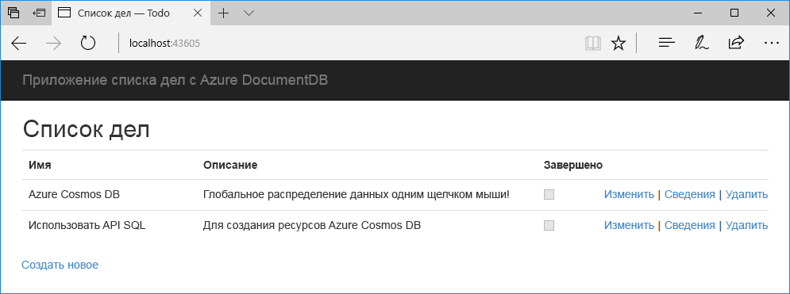
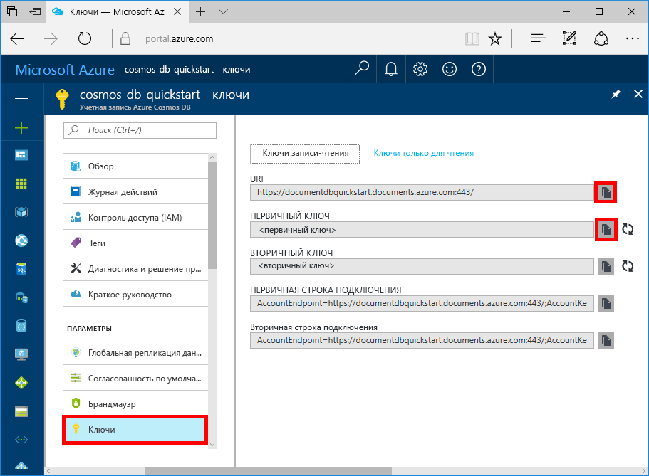

# <a name="quickstart-build-a-net-web-app-with-azure-cosmos-db-using-the-sql-api-and-the-azure-portal"></a>Краткое руководство. Создание веб-приложения .NET при помощи Azure Cosmos DB с использованием API SQL и портала Azure

Azure Cosmos DB — это глобально распределенная многомодельная служба базы данных Майкрософт. Вы можете быстро создавать и запрашивать документы, пары "ключ — значение" и базы данных графов, используя преимущества возможностей глобального распределения и горизонтального масштабирования базы данных Azure Cosmos DB. 

В этом кратком руководстве показано, как создать учетную запись [API SQL](sql-api-introduction.md) для Azure Cosmos DB, базу данных документов и коллекцию с использованием портала Azure. Затем вы создадите и развернете веб-приложение со списком дел на основе [API-интерфейса .NET для SQL](sql-api-sdk-dotnet.md), как показано на снимке экрана ниже. 



## <a name="prerequisites"></a>предварительным требованиям

Если вы еще не установили Visual Studio 2017, вы можете скачать и использовать **бесплатный** [выпуск Community для Visual Studio 2017](https://www.visualstudio.com/downloads/). При установке Visual Studio необходимо включить возможность **разработки для Azure**.

[!INCLUDE [quickstarts-free-trial-note](../../includes/quickstarts-free-trial-note.md)] 
[!INCLUDE [cosmos-db-emulator-docdb-api](../../includes/cosmos-db-emulator-docdb-api.md)]  

<a id="create-account"></a>
## <a name="create-a-database-account"></a>Создание учетной записи базы данных

[!INCLUDE [cosmos-db-create-dbaccount](../../includes/cosmos-db-create-dbaccount.md)]

<a id="create-collection"></a>
## <a name="add-a-collection"></a>Добавление коллекции

[!INCLUDE [cosmos-db-create-collection](../../includes/cosmos-db-create-collection.md)]

<a id="add-sample-data"></a>
## <a name="add-sample-data"></a>Добавление демонстрационных данных

[!INCLUDE [cosmos-db-create-sql-api-add-sample-data](../../includes/cosmos-db-create-sql-api-add-sample-data.md)]

## <a name="query-your-data"></a>Обращение к данным

[!INCLUDE [cosmos-db-create-sql-api-query-data](../../includes/cosmos-db-create-sql-api-query-data.md)]

## <a name="clone-the-sample-application"></a>Клонирование примера приложения

Теперь перейдем к работе с кодом. Давайте клонируем приложение API SQL из GitHub. Задайте строку подключения и выполните ее. Вы узнаете, как можно упростить работу с данными программным способом. 

1. Откройте командную строку, создайте папку git-samples, а затем закройте окно командной строки.

    ```bash
    md "C:\git-samples"
    ```

2. Откройте окно терминала git, например git bash, и выполните команду `cd`, чтобы перейти в новую папку для установки примера приложения.

    ```bash
    cd "C:\git-samples"
    ```

3. Выполните команду ниже, чтобы клонировать репозиторий с примером. Эта команда создает копию примера приложения на локальном компьютере.

    ```bash
    git clone https://github.com/Azure-Samples/documentdb-dotnet-todo-app.git
    ```

4. Затем откройте файл решения в Visual Studio. 

## <a name="review-the-code"></a>Просмотр кода

Этот шаг не является обязательным. Если вы хотите узнать, как создать в коде ресурсы базы данных, изучите приведенные ниже фрагменты кода. Если вас это не интересует, можете сразу переходить к разделу [Обновление строки подключения](#update-your-connection-string). 

Следующие фрагменты кода взяты из файла DocumentDBRepository.cs.

* DocumentClient инициализируется в строке 76.

    ```csharp
    client = new DocumentClient(new Uri(ConfigurationManager.AppSettings["endpoint"]), ConfigurationManager.AppSettings["authKey"]);
    ```

* База данных создается в строке 91.

    ```csharp
    await client.CreateDatabaseAsync(new Database { Id = DatabaseId });
    ```

* Коллекция создается в строке 110.

    ```csharp
    await client.CreateDocumentCollectionAsync(
        UriFactory.CreateDatabaseUri(DatabaseId),
        new DocumentCollection
            {
               Id = CollectionId
            },
        new RequestOptions { OfferThroughput = 400 });
    ```

## <a name="update-your-connection-string"></a>Обновление строки подключения

Теперь вернитесь на портал Azure, чтобы получить данные строки подключения. Скопируйте эти данные в приложение.

1. На [портале Azure](http://portal.azure.com/) перейдите к учетной записи базы данных Azure Cosmos DB и на левой панели навигации щелкните **Ключи**, а затем выберите **Ключи записи-чтения**. На следующем шаге используйте кнопку копирования в правой части экрана, чтобы скопировать универсальный код ресурса (URI) и первичный ключ в файл web.config.

    

2. В Visual Studio 2017 откройте файл web.config. 

3. Скопируйте значение универсального кода ресурса (URI) на портале (с помощью кнопки копирования) и добавьте его в качестве значения параметра ключа конечной точки в файле web.config. 

    `<add key="endpoint" value="FILLME" />`

4. Затем скопируйте значение первичного ключа с портала и добавьте его в качестве значения параметра authKey в файле web.config. Теперь приложение со всеми сведениями, необходимыми для взаимодействия с Azure Cosmos DB, обновлено. 

    `<add key="authKey" value="FILLME" />`
    
## <a name="run-the-web-app"></a>Запуск веб-приложения
1. В Visual Studio в **обозревателе решений** щелкните проект правой кнопкой мыши и выберите **Управление пакетами NuGet**. 

2. В окне NuGet в поле **Обзор** введите *DocumentDB*.

3. В результатах поиска найдите библиотеку **Microsoft.Azure.DocumentDB** и установите ее. При этом будет установлен пакет Microsoft.Azure.DocumentDB, а также все зависимые компоненты.

4. Нажмите клавиши CTRL+F5 для запуска приложения. Приложение откроется в браузере. 

5. Щелкните **Создать** в браузере и создайте несколько задач в приложении со списком задач.

   

Вернитесь в обозреватель данных, где вы можете просматривать, запрашивать и изменять новые данные, а также работать с ними. 

## <a name="review-slas-in-the-azure-portal"></a>Просмотр соглашений об уровне обслуживания на портале Azure

[!INCLUDE [cosmosdb-tutorial-review-slas](../../includes/cosmos-db-tutorial-review-slas.md)]

## <a name="clean-up-resources"></a>Очистка ресурсов

[!INCLUDE [cosmosdb-delete-resource-group](../../includes/cosmos-db-delete-resource-group.md)]

## <a name="next-steps"></a>Дополнительная информация

В этом кратком руководстве вы узнали, как создать учетную запись Azure Cosmos DB, коллекцию с помощью обозревателя данных, а также как запустить веб-приложение. Теперь можно импортировать дополнительные данные в учетную запись Azure Cosmos DB. 

> [!div class="nextstepaction"]
> [Импорт данных в DocumentDB с помощью средства миграции базы данных](import-data.md)


