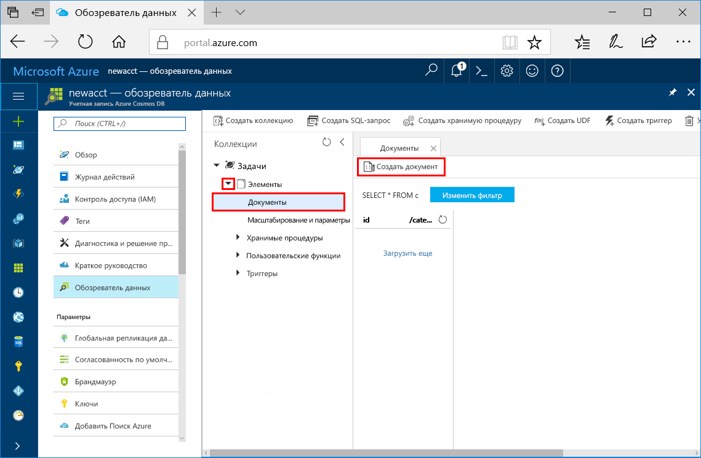

# <a name="azure-cosmos-db-create-a-document-database-using-java-and-the-azure-portal"></a>Azure Cosmos DB: создание базы данных документов с помощью Java и портала Azure

Azure Cosmos DB — это глобально распределенная многомодельная служба базы данных Майкрософт. С помощью Azure Cosmos DB вы можете быстро создавать базы данных управляемых документов, таблиц и диаграмм и обращаться к ним.

Выполнив инструкции в этом кратком руководстве, вы создадите базу данных документов с помощью средств портала Azure для [API-интерфейса SQL](sql-api-introduction.md) службы Azure Cosmos DB. Из этого краткого руководства вы также узнаете, как быстро создать консольное приложение Java с помощью [API для SQL на Java](sql-api-sdk-java.md). Указания в этом руководстве применимы к любой операционной системе, с которой может работать Java. Выполнив инструкции в этом руководстве, вы узнаете, как создавать и изменять ресурсы базы данных документов с помощью пользовательского интерфейса или программных средств.

## <a name="prerequisites"></a>предварительным требованиям

[!INCLUDE [quickstarts-free-trial-note](../../includes/quickstarts-free-trial-note.md)] 
[!INCLUDE [cosmos-db-emulator-docdb-api](../../includes/cosmos-db-emulator-docdb-api.md)]

Кроме того, сделайте следующее: 

* [Комплект разработчика Java (JDK 1.7+)](http://www.oracle.com/technetwork/java/javase/downloads/jdk8-downloads-2133151.html)
    * В Ubuntu выполните команду `apt-get install default-jdk`, чтобы установить JDK.
    * Обязательно настройте переменную среды JAVA_HOME так, чтобы она указывала на папку, в которой установлен пакет JDK.
* [Скачайте](http://maven.apache.org/download.cgi) и [установите](http://maven.apache.org/install.html) двоичный архив [Maven](http://maven.apache.org/).
    * В Ubuntu выполните команду `apt-get install maven`, чтобы установить Maven.
* [Git.](https://www.git-scm.com/)
    * В Ubuntu выполните команду `sudo apt-get install git`, чтобы установить Git.

## <a name="create-a-database-account"></a>Создание учетной записи базы данных

Перед созданием базы данных документов необходимо создать в Azure Cosmos DB учетную запись API SQL.

[!INCLUDE [cosmos-db-create-dbaccount](../../includes/cosmos-db-create-dbaccount.md)]

## <a name="add-a-collection"></a>Добавление коллекции

[!INCLUDE [cosmos-db-create-collection](../../includes/cosmos-db-create-collection.md)]

<a id="add-sample-data"></a>
## <a name="add-sample-data"></a>Добавление демонстрационных данных

Теперь вы можете добавить данные в новую коллекцию с помощью обозревателя данных.

1. Разверните коллекцию **Элементы**, щелкните **Документы** > **Новый документ**.

   
  
2. Теперь добавьте в коллекцию документ со описанной ниже структурой и щелкните **Сохранить**. Чтобы скопировать код JSON в буфер обмена, используйте кнопку **Копировать** в поле кода.

     ```json
     {
         "id": "1",
         "category": "personal",
         "name": "groceries",
         "description": "Pick up apples and strawberries.",
         "isComplete": false
     }
     ```

    

3.  Создайте и сохраните еще один документ, изменив в нем `id` на значение 2. Остальные свойства вы тоже можете изменить по своему усмотрению. Новые документы могут иметь любую структуру, так как Azure Cosmos DB не устанавливает определенные схемы данных.

## <a name="query-your-data"></a>Обращение к данным

Теперь вы можете применить запросы в обозревателе данных для получения и фильтрации данных.

1. Как вы видите, по умолчанию выбран запрос `SELECT * FROM c`. Этот запрос по умолчанию извлекает и отображает все документы в коллекции. 

    

2. Оставайтесь на вкладке **Документы**. Чтобы изменить запрос, нажмите кнопку **Изменить фильтр** и добавьте `ORDER BY c._ts DESC` в поле предиката запроса, а затем выберите действие **Применить фильтр**.

    

Новый запрос перечисляет все документы в порядке убывания метки времени, поэтому теперь первым в списке будет второй документ. Если вы знакомы с синтаксисом SQL, используйте в этом поле любой поддерживаемый [SQL-запрос](sql-api-sql-query.md). 

На этом мы завершим работу с обозревателем данных. Прежде чем продолжить работу с кодом, мы хотим напомнить вам вот о чем. В обозревателе данных вы можете создавать хранимые процедуры, триггеры и определяемые пользователем функции, чтобы реализовать бизнес-логику на стороне сервера и масштабировать пропускную способность. Это средство позволяет использовать все встроенные возможности программного доступа к данным, доступные в API-интерфейсах, к которым вы можете быстро получить доступ на портале Azure.

## <a name="clone-the-sample-application"></a>Клонирование примера приложения

Теперь перейдем к работе с кодом. Давайте клонируем приложение API SQL из GitHub. Задайте строку подключения и выполните ее. Вы узнаете, как можно упростить работу с данными программным способом. 

1. Откройте командную строку, создайте папку git-samples, а затем закройте окно командной строки.

    ```bash
    md "C:\git-samples"
    ```

2. Откройте окно терминала git, например git bash, и выполните команду `cd`, чтобы перейти в новую папку для установки примера приложения. 

    ```bash
    cd "C:\git-samples"
    ```

3. Выполните команду ниже, чтобы клонировать репозиторий с примером. Эта команда создает копию примера приложения на локальном компьютере.

    ```bash
    git clone https://github.com/Azure-Samples/azure-cosmos-db-documentdb-java-getting-started.git
    ```

## <a name="review-the-code"></a>Просмотр кода

Этот шаг не является обязательным. Если вы хотите узнать, как создать в коде ресурсы базы данных, изучите приведенные ниже фрагменты кода. Если вас это не интересует, можете сразу переходить к разделу [Обновление строки подключения](#update-your-connection-string). 

Следующие фрагменты кода взяты из файла C:\git-samples\azure-cosmos-db-documentdb-java-getting-started\src\GetStarted\Program.java.

* Инициализация `DocumentClient`. [DocumentClient](https://docs.microsoft.com/java/api/com.microsoft.azure.documentdb._document_client) является логическим представлением службы баз данных Azure Cosmos DB на стороне клиента. Этот клиент позволяет настраивать и выполнять запросы к службе. Части этого кода, содержащие `FILLME`, будут обновлены позднее при работе с этим кратким руководством.

    ```java
    this.client = new DocumentClient("https://FILLME.documents.azure.com",
            "FILLME", 
            new ConnectionPolicy(),
            ConsistencyLevel.Session);
    ```

* Создание [Database](https://docs.microsoft.com/java/api/com.microsoft.azure.documentdb._database).

    ```java
    Database database = new Database();
    database.setId(databaseName);
    
    this.client.createDatabase(database, null);
    ```

* Создание [DocumentCollection](https://docs.microsoft.com/java/api/com.microsoft.azure.documentdb._document_collection).

    ```java
    DocumentCollection collectionInfo = new DocumentCollection();
    collectionInfo.setId(collectionName);

    ...

    this.client.createCollection(databaseLink, collectionInfo, requestOptions);
    ```

* Создание документа с помощью метода [createDocument](https://docs.microsoft.com/java/api/com.microsoft.azure.documentdb._document_client.createdocument).

    ```java
    // Any Java object within your code can be serialized into JSON and written to Azure Cosmos DB
    Family andersenFamily = new Family();
    andersenFamily.setId("Andersen.1");
    andersenFamily.setLastName("Andersen");
    // More properties

    String collectionLink = String.format("/dbs/%s/colls/%s", databaseName, collectionName);
    this.client.createDocument(collectionLink, family, new RequestOptions(), true);
    ```

* SQL-запросы к JSON можно выполнить с помощью метода [queryDocuments](https://docs.microsoft.com/java/api/com.microsoft.azure.documentdb._document_client.querydocuments).

    ```java
    FeedOptions queryOptions = new FeedOptions();
    queryOptions.setPageSize(-1);
    queryOptions.setEnableCrossPartitionQuery(true);

    String collectionLink = String.format("/dbs/%s/colls/%s", databaseName, collectionName);
    FeedResponse<Document> queryResults = this.client.queryDocuments(
        collectionLink,
        "SELECT * FROM Family WHERE Family.lastName = 'Andersen'", queryOptions);

    System.out.println("Running SQL query...");
    for (Document family : queryResults.getQueryIterable()) {
        System.out.println(String.format("\tRead %s", family));
    }
    ```    

## <a name="update-your-connection-string"></a>Обновление строки подключения

Теперь вернитесь на портал Azure, чтобы получить данные строки подключения. Скопируйте эти данные в приложение. Так вы обеспечите обмен данными между приложением и размещенной базой данных.

1. На [портале Azure](http://portal.azure.com/) щелкните **Ключи**. 

    Используйте кнопки копирования в правой части экрана, чтобы скопировать верхнее значение URI.

    

2. Откройте файл `Program.java` из папки C:\git-samples\azure-cosmos-db-documentdb-java-getting-started\src\GetStarted. 

3. Вставьте полученное на портале значение URI над элементом `https://FILLME.documents.azure.com` в строке 45.

4. Вернитесь на портал и скопируйте значение первичного ключа, как показано на этом снимке экрана. Вставьте полученное на портале значение первичного ключа над элементом `FILLME` в строке 46.

    Метод getStartedDemo теперь должен выглядеть примерно так: 
    
    ```java
    private void getStartedDemo() throws DocumentClientException, IOException {
        this.client = new DocumentClient("https://youraccountname.documents.azure.com:443/",
                "your-primary-key...RJhQrqQ5QQ==", 
                new ConnectionPolicy(),
                ConsistencyLevel.Session);
    ```

5. Сохраните файл Program.java.

## <a name="run-the-app"></a>Запуск приложения

1. В окне терминала git перейдите к папке azure-cosmos-db-documentdb-java-getting-started при помощи команды `cd`.

    ```git
    cd "C:\git-samples\azure-cosmos-db-documentdb-java-getting-started"
    ```

2. В окне терминала Git введите приведенную ниже команду, чтобы установить необходимые пакеты Java.

    ```
    mvn package
    ```

3. В окне терминала Git выполните следующую команду, чтобы запустить приложение Java.

    ```
    mvn exec:java -D exec.mainClass=GetStarted.Program
    ```

    В окне терминала отобразится уведомление о создании базы данных FamilyDB. 
    
4. Нажмите клавишу, чтобы создать базу данных, а затем нажмите еще одну клавишу, чтобы создать коллекцию. 

    В конце программы все ресурсы будут удалены. Вернитесь в обозреватель данных в браузере, чтобы увидеть, содержатся ли в нем база данных FamilyDB и коллекция FamilyCollection.

5. Перейдите в окно консоли и нажмите клавишу, чтобы создать первый документ, а затем нажмите еще одну клавишу, чтобы создать второй документ. После этого вернитесь в обозреватель данных для их просмотра. 

6. Нажмите клавишу, чтобы выполнить запрос и просмотреть выходные данные в окне консоли. 

7. При нажатии следующей клавиши будут удалены все ресурсы. Если нужно сохранить ресурсы, нажмите клавиши CTRL+C в окне консоли, чтобы завершить программу. Или нажмите любую клавишу для удаления ресурсов из вашей учетной записи, чтобы с вас не взималась плата. 

    


## <a name="review-slas-in-the-azure-portal"></a>Просмотр соглашений об уровне обслуживания на портале Azure

[!INCLUDE [cosmosdb-tutorial-review-slas](../../includes/cosmos-db-tutorial-review-slas.md)]

## <a name="clean-up-resources"></a>Очистка ресурсов

[!INCLUDE [cosmosdb-delete-resource-group](../../includes/cosmos-db-delete-resource-group.md)]

## <a name="next-steps"></a>Дополнительная информация

В этом кратком руководстве вы узнали, как создать учетную запись Azure Cosmos DB, базу данных документов и коллекцию с помощью обозревателя данных, а также как запустить приложение, чтобы эти операции выполнялись программой. Теперь вы можете импортировать дополнительные данные в коллекцию Azure Cosmos DB. 

> [!div class="nextstepaction"]
> [Импорт данных в DocumentDB с помощью средства миграции базы данных](import-data.md)


