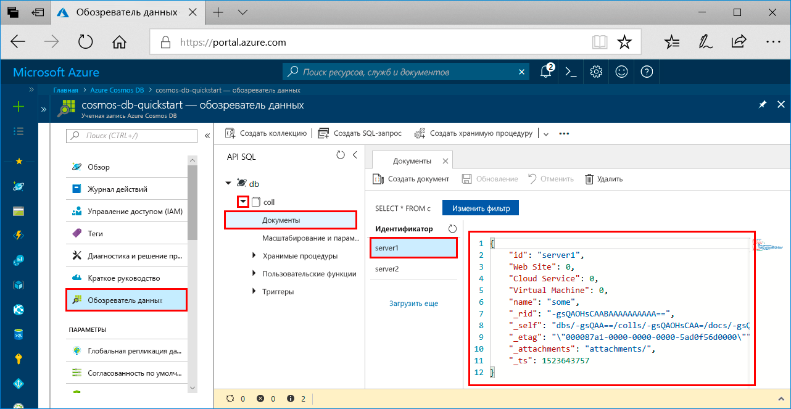

# <a name="azure-cosmos-db-build-a-sql-api-app-with-python-and-the-azure-portal"></a>Azure Cosmos DB. Создание приложения API SQL с помощью Python и портала Azure

Azure Cosmos DB — это глобально распределенная многомодельная служба базы данных Майкрософт. Вы можете быстро создавать и запрашивать документы, пары "ключ — значение" и базы данных графов, используя преимущества возможностей глобального распределения и горизонтального масштабирования базы данных Azure Cosmos DB. 

В этом кратком руководстве показано, как создать учетную запись [API SQL](sql-api-introduction.md) для Azure Cosmos DB, базу данных документов и коллекцию с использованием портала Azure. Затем вы создадите консольное приложение с помощью [API для SQL на Python](sql-api-sdk-python.md) и запустите его.

[!INCLUDE [quickstarts-free-trial-note](../../includes/quickstarts-free-trial-note.md)] [!INCLUDE [cosmos-db-emulator-docdb-api](../../includes/cosmos-db-emulator-docdb-api.md)]

## <a name="prerequisites"></a>предварительным требованиям

* [Python 3.6](https://www.python.org/downloads/) с ресурсами \<расположение установки\>\Python36 и \<расположение установки>\Python36\Scripts, добавленными в переменную PATH. 
* [Visual Studio Code](https://code.visualstudio.com/)
* [Расширение Python для Visual Studio Code](https://marketplace.visualstudio.com/items?itemName=ms-python.python#overview)

## <a name="create-a-database-account"></a>Создание учетной записи базы данных

[!INCLUDE [cosmos-db-create-dbaccount](../../includes/cosmos-db-create-dbaccount.md)]

## <a name="add-a-collection"></a>Добавление коллекции

[!INCLUDE [cosmos-db-create-collection](../../includes/cosmos-db-create-collection.md)]

## <a name="add-sample-data"></a>Добавление демонстрационных данных

[!INCLUDE [cosmos-db-create-sql-api-add-sample-data](../../includes/cosmos-db-create-sql-api-add-sample-data.md)]

## <a name="query-your-data"></a>Обращение к данным

[!INCLUDE [cosmos-db-create-sql-api-query-data](../../includes/cosmos-db-create-sql-api-query-data.md)]

## <a name="clone-the-sample-application"></a>Клонирование примера приложения

Теперь необходимо клонировать приложение API SQL из GitHub. Задайте строку подключения и выполните ее. Вы узнаете, как можно упростить работу с данными программным способом. 

1. Откройте командную строку, создайте папку git-samples, а затем закройте окно командной строки.

    ```bash
    md "C:\git-samples"
    ```

2. Откройте окно терминала git, например git bash, и выполните команду `cd`, чтобы перейти в новую папку для установки примера приложения.

    ```bash
    cd "C:\git-samples"
    ```

3. Выполните команду ниже, чтобы клонировать репозиторий с примером. Эта команда создает копию примера приложения на локальном компьютере. 

    ```bash
    git clone https://github.com/Azure-Samples/azure-cosmos-db-documentdb-python-getting-started.git
    ```  
    
## <a name="review-the-code"></a>Просмотр кода

Этот шаг не является обязательным. Если вы хотите узнать, как создать в коде ресурсы базы данных, изучите приведенные ниже фрагменты кода. Если вас это не интересует, можете сразу переходить к разделу [Обновление строки подключения](#update-your-connection-string). 

Следующие фрагменты кода взяты из файла DocumentDBGetStarted.py.

* Инициализация экземпляра DocumentClient.

    ```python
    # Initialize the Python client
    client = document_client.DocumentClient(config['ENDPOINT'], {'masterKey': config['MASTERKEY']})
    ```

* Создание базы данных.

    ```python
    # Create a database
    db = client.CreateDatabase({ 'id': config['SQL_DATABASE'] })
    ```

* Создание коллекции.

    ```python
    # Create collection options
    options = {
        'offerEnableRUPerMinuteThroughput': True,
        'offerVersion': "V2",
        'offerThroughput': 400
    }

    # Create a collection
    collection = client.CreateCollection(db['_self'], { 'id': config['SQL_COLLECTION'] }, options)
    ```

* Создание нескольких документов.

    ```python
    # Create some documents
    document1 = client.CreateDocument(collection['_self'],
        { 
            'id': 'server1',
            'Web Site': 0,
            'Cloud Service': 0,
            'Virtual Machine': 0,
            'name': 'some' 
        })
    ```

* Выполнение запросов с помощью SQL

    ```python
    # Query them in SQL
    query = { 'query': 'SELECT * FROM server s' }    
            
    options = {} 
    options['enableCrossPartitionQuery'] = True
    options['maxItemCount'] = 2

    result_iterable = client.QueryDocuments(collection['_self'], query, options)
    results = list(result_iterable);

    print(results)
    ```

## <a name="update-your-connection-string"></a>Обновление строки подключения

Теперь вернитесь на портал Azure, чтобы получить данные строки подключения. Скопируйте эти данные в приложение.

1. На [портале Azure](http://portal.azure.com/) в учетной записи Azure Cosmos DB щелкните **Ключи** в области навигации слева. На следующем шаге используйте кнопки копирования в правой части экрана, чтобы скопировать **универсальный код ресурса (URI)** и **первичный ключ** в файл DocumentDBGetStarted.py.

    

2. Откройте файл C:\git-samples\azure-cosmos-db-documentdb-python-getting-startedDocumentDBGetStarted.py в Visual Studio Code. 

3. Скопируйте значение **универсального кода ресурса (URI)** на портале (с помощью кнопки копирования) и добавьте его в качестве значения параметра ключа **конечной точки** в файле DocumentDBGetStarted.py. 

    `'ENDPOINT': 'https://FILLME.documents.azure.com',`

4. Затем скопируйте значение **первичного ключа** на портале и добавьте его в качестве значения **config.MASTERKEY** в файле DocumentDBGetStarted.py. Теперь приложение со всеми сведениями, необходимыми для взаимодействия с Azure Cosmos DB, обновлено. 

    `'MASTERKEY': 'FILLME',`

5. Сохраните файл DocumentDBGetStarted.py.
    
## <a name="run-the-app"></a>Запуск приложения

1. В Visual Studio Code выберите **Вид**>**Палитра команд**. 

2. В командной строке введите **Python: выберите интерпретатор** и установите нужную версию Python.

    Нижний колонтитул в Visual Studio Code будет обновлен для указания выбранного интерпретатора. 

3. Выберите **Вид** > **Интегрированный терминал**, чтобы открыть интегрированный терминал Visual Studio Code.

4. В окне терминала проверьте, находитесь ли вы в папке azure-cosmos-db-documentdb-python-getting-started. Если нет, выполните следующую команду, чтобы перейти в папку примера. 

    ```
    cd "C:\git-samples\azure-cosmos-db-documentdb-python-getting-started"`
    ```

5. Выполните следующую команду, чтобы установить пакет pydocumentdb. 

    ```
    pip3 install pydocumentdb
    ```

    Если при попытке установить пакет pydocumentdb появляется ошибка отказа в доступе, необходимо [запустить Visual Studio Code от имени администратора](https://stackoverflow.com/questions/37700536/visual-studio-code-terminal-how-to-run-a-command-with-administrator-rights).

6. Выполните следующую команду, чтобы запустить пример, а также создать и сохранить документы в Azure Cosmos DB.

    ```
    python DocumentDBGetStarted.py
    ```

7. Чтобы убедиться в том, что документы созданы и сохранены, на портале Azure выберите **Обозреватель данных**, разверните **coll**, затем **Документы** и выберите документ **server1**. Содержимое документа server1 соответствует содержимому, отображаемому в интегрированном окне терминала. 

    

## <a name="review-slas-in-the-azure-portal"></a>Просмотр соглашений об уровне обслуживания на портале Azure

[!INCLUDE [cosmosdb-tutorial-review-slas](../../includes/cosmos-db-tutorial-review-slas.md)]

## <a name="clean-up-resources"></a>Очистка ресурсов

[!INCLUDE [cosmosdb-delete-resource-group](../../includes/cosmos-db-delete-resource-group.md)]

## <a name="next-steps"></a>Дополнительная информация

В этом кратком руководстве вы узнали, как создать учетную запись Azure Cosmos DB, коллекцию с помощью обозревателя данных, а также как запустить приложение. Теперь можно импортировать дополнительные данные в учетную запись Azure Cosmos DB. 

> [!div class="nextstepaction"]
> [Импорт данных в Azure Cosmos DB для API SQL](import-data.md)


