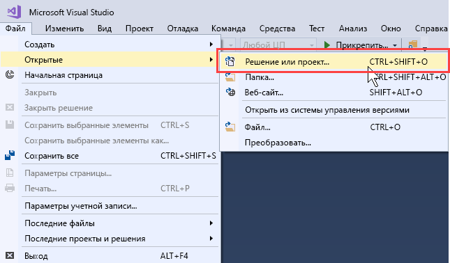
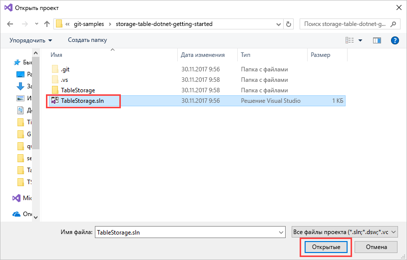
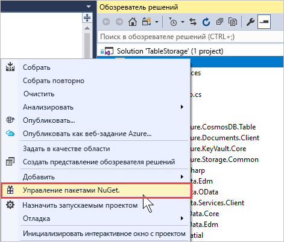
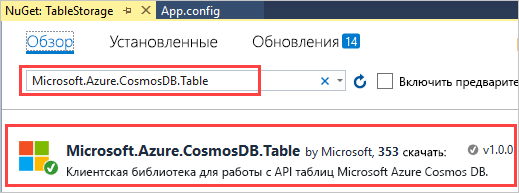
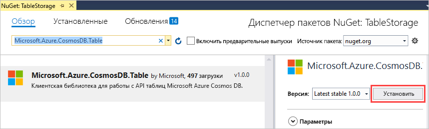
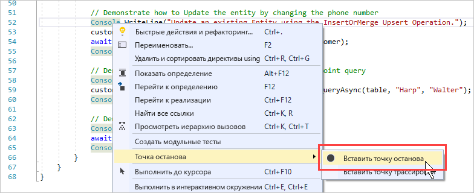
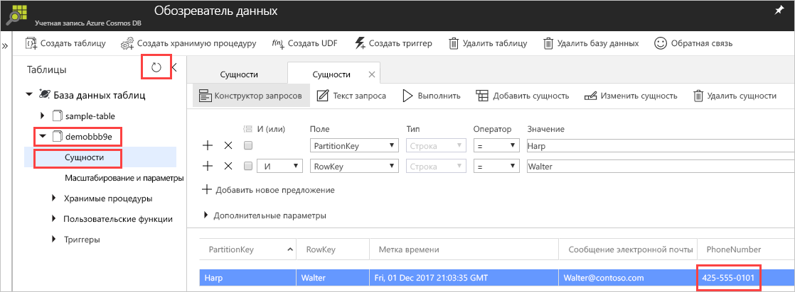

# <a name="quickstart-build-a-table-api-app-with-net-and-azure-cosmos-db"></a>Краткое руководство. Создание приложения API таблицы с помощью .NET и Azure Cosmos DB 

В этом руководстве показано, как использовать .NET и [API таблицы](table-introduction.md) Azure Cosmos DB для создания приложения путем клонирования примера с сайта GitHub. Кроме того, здесь показано, как создать учетную запись Azure Cosmos DB и использовать обозреватель данных для создания таблиц и сущностей на веб-портале Azure.

Azure Cosmos DB — это глобально распределенная многомодельная служба базы данных Майкрософт. Вы можете быстро создавать и запрашивать документы, пары "ключ — значение" и базы данных графов, используя преимущества возможностей глобального распределения и горизонтального масштабирования базы данных Azure Cosmos DB. 

## <a name="prerequisites"></a>предварительным требованиям

Если вы еще не установили Visual Studio 2017, вы можете скачать и использовать **бесплатный** [выпуск Community для Visual Studio 2017](https://www.visualstudio.com/downloads/). При установке Visual Studio необходимо включить возможность **разработки для Azure**.

[!INCLUDE [quickstarts-free-trial-note](../../includes/quickstarts-free-trial-note.md)]

## <a name="create-a-database-account"></a>Создание учетной записи базы данных

> [!IMPORTANT] 
> Для работы с общедоступными пакетами SDK для API таблицы нужно создать новую учетную запись API таблицы. Учетные записи API таблиц, созданные во время работы с предварительной версией, не поддерживаются в общедоступных пакетах SDK.
>

[!INCLUDE [cosmos-db-create-dbaccount-table](../../includes/cosmos-db-create-dbaccount-table.md)]

## <a name="add-a-table"></a>Добавление таблицы

[!INCLUDE [cosmos-db-create-table](../../includes/cosmos-db-create-table.md)]

## <a name="add-sample-data"></a>Добавление демонстрационных данных

[!INCLUDE [cosmos-db-create-table-add-sample-data](../../includes/cosmos-db-create-table-add-sample-data.md)]

## <a name="clone-the-sample-application"></a>Клонирование примера приложения

Теперь необходимо клонировать приложение "Таблица" из GitHub. Задайте строку подключения и выполните ее. Вы узнаете, как можно упростить работу с данными программным способом. 

1. Откройте командную строку, создайте папку git-samples, а затем закройте окно командной строки.

    ```bash
    md "C:\git-samples"
    ```

2. Откройте окно терминала git, например git bash, и выполните команду `cd`, чтобы перейти в новую папку для установки примера приложения.

    ```bash
    cd "C:\git-samples"
    ```

3. Выполните команду ниже, чтобы клонировать репозиторий с примером. Эта команда создает копию примера приложения на локальном компьютере.

    ```bash
    git clone https://github.com/Azure-Samples/storage-table-dotnet-getting-started.git
    ```
## <a name="open-the-sample-application-in-visual-studio"></a>Открытие примера приложения в Visual Studio

1. В Visual Studio в меню **Файл** нажмите **Открыть** и выберите **проект или решение**. 

    

2. Перейдите к папке, в которую вы клонировали пример приложения, и откройте файл TableStorage.sln.

    

## <a name="update-your-connection-string"></a>Обновление строки подключения

Теперь вернитесь на портал Azure, чтобы получить данные строки подключения. Скопируйте эти данные в приложение. Так вы обеспечите обмен данными между приложением и размещенной базой данных. 

1. На [портале Azure](http://portal.azure.com/) щелкните **Строка подключения**. 

    Используйте кнопку копирования в правой части окна, чтобы скопировать **основную строку подключения**.

    

2. В Visual Studio откройте файл app.config. 

3. Раскомментируйте элемент StorageConnectionString в строке 8 и закомментируйте элемент StorageConnectionString в строке 7, так как в этом руководстве не используется эмулятор хранения пакета Azure SDK. После этого строки 7 и 8 будут выглядеть так:

    ```
    <!--key="StorageConnectionString" value="UseDevelopmentStorage=true;" />-->
    <add key="StorageConnectionString" value="DefaultEndpointsProtocol=https;AccountName=[AccountName];AccountKey=[AccountKey]" />
    ```

4. Вставьте значение **основной строки подключения**, полученное на портале, вместо значения параметра StorageConnectionString в строке 8. Значение нужно вставлять в кавычках. 

    > [!IMPORTANT]
    > Если для вашей конечной точки указан адрес documents.azure.com, это значит, что вы используете учетную запись для предварительной версии. В этом случае для работы с общедоступными пакетами SDK для API таблицы вам нужно создать [новую учетную запись API таблицы](#create-a-database-account). 
    > 

    Теперь строка 8 должна выглядеть примерно так:

    ```
    <add key="StorageConnectionString" value="DefaultEndpointsProtocol=https;AccountName=<account name>;AccountKey=txZACN9f...==;TableEndpoint=https://<account name>.table.cosmosdb.azure.com;" />
    ```

5. Нажмите CTRL+S, чтобы сохранить файл App.config.

Теперь приложение со всеми сведениями, необходимыми для взаимодействия с Azure Cosmos DB, обновлено. 

## <a name="build-and-deploy-the-app"></a>Создание и развертывание приложения

1. Щелкните правой кнопкой мыши проект **TableStorage** в **обозревателе решений** Visual Studio и выберите **Управление пакетами NuGet**. 

   
2. В поле **обзора** NuGet введите *Microsoft.Azure.CosmosDB.Table*. Это запрос для поиска клиентской библиотеки API таблицы Cosmos DB.
   
   

3. Нажмите кнопку **Установить**, чтобы установить библиотеку **Microsoft.Azure.CosmosDB.Table**. Установится пакет API таблицы Azure Cosmos DB и все зависимые компоненты.

    

4. Откройте файл BasicSamples.cs. Щелкните правой кнопкой мыши строку 52, нажмите **Точка останова** и выберите **Вставить точку останова**. Вставьте еще одну точку останова в строке 55.

    

5. Нажмите клавишу F5 для запуска приложения.

    В окне консоли отобразятся имя новой базы данных таблиц (в этом примере demo91ab4) в Azure Cosmos DB. 
    
    

    Если возникнет ошибка о зависимостях, изучите раздел об [устранении неполадок](table-sdk-dotnet.md#troubleshooting).

    Когда будет достигнута первая точка останова, вернитесь к обозревателю данных на портале Azure. Нажмите кнопку **Обновить**, разверните пример* таблицы и щелкните **Сущности**. На вкладке **Сущности** справа отобразится новая сущность, добавленная для Walter Harp. Обратите внимание, что для новой сущности указан номер телефона 425-555-0101.

    
    
6. Закройте вкладку **Сущности** в обозревателе данных.
    
7. Нажмите клавишу F5, чтобы приложение выполнялось до следующей точки останова. 

    Когда будет достигнута точка останова, снова щелкните **Сущности** на портале Azure, чтобы открыть вкладку **Сущности**. Обратите внимание, что номер телефона изменился на 425-555-0105.

8. Нажмите клавишу F5, чтобы запустить приложение. 
 
   Приложение добавляет сущности для использования в расширенном примере приложения, который API таблицы сейчас не поддерживает. Затем приложение удаляет таблицу, созданную в примере приложения.

9. Откройте окно консоли и нажмите клавишу ВВОД, чтобы завершить работу приложения. 
  

## <a name="review-slas-in-the-azure-portal"></a>Просмотр соглашений об уровне обслуживания на портале Azure

[!INCLUDE [cosmosdb-tutorial-review-slas](../../includes/cosmos-db-tutorial-review-slas.md)]

## <a name="clean-up-resources"></a>Очистка ресурсов

[!INCLUDE [cosmosdb-delete-resource-group](../../includes/cosmos-db-delete-resource-group.md)]

## <a name="next-steps"></a>Дополнительная информация

Из этого краткого руководства вы узнали, как создать учетную запись Azure Cosmos DB и таблицу с помощью обозревателя данных, а также как запустить приложение.  Теперь вы можете выполнить запрос данных с помощью API таблиц.  

> [!div class="nextstepaction"]
> [Импорт данных таблиц в API таблицы](table-import.md)

