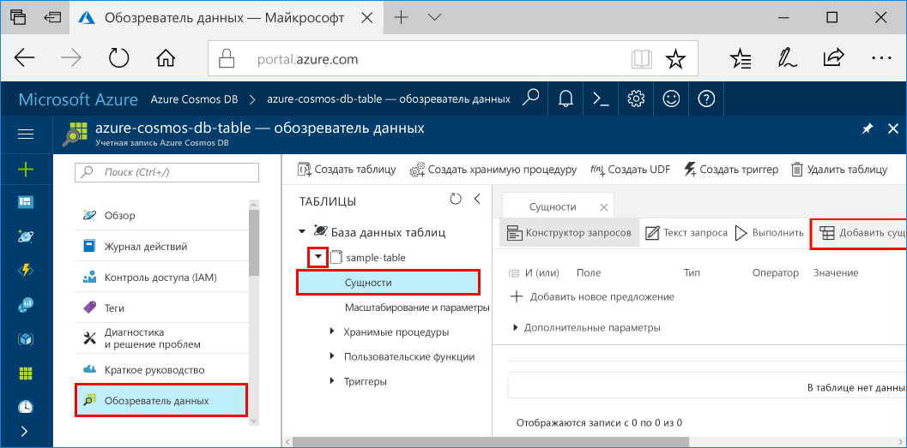
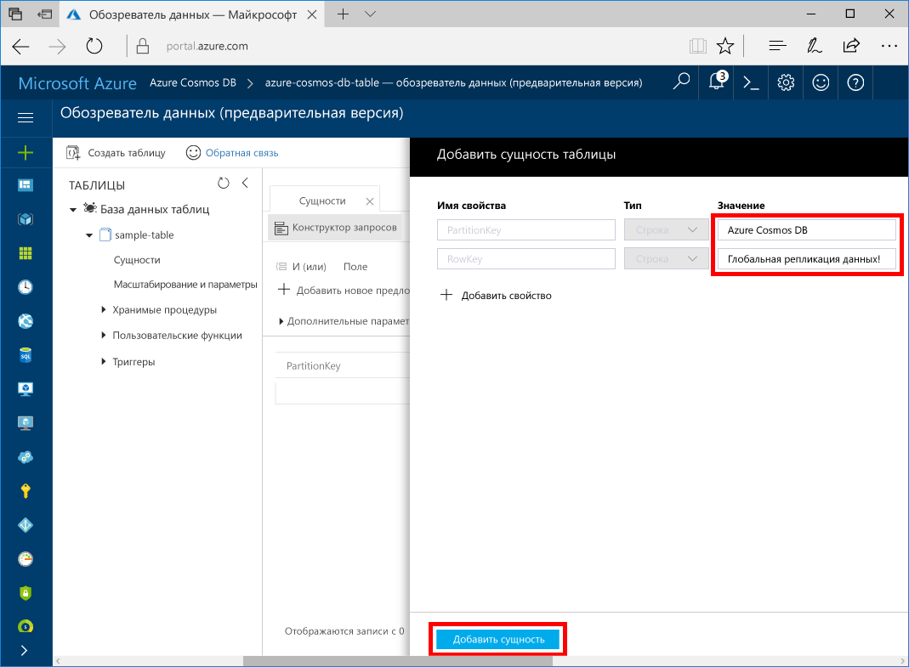

# <a name="quickstart-build-a-table-api-app-with-nodejs-and-azure-cosmos-db"></a>Краткое руководство. Создание приложения API таблицы с помощью Node.js и Azure Cosmos DB

В этом руководстве показано, как использовать Node.js и [API таблицы](table-introduction.md) Azure Cosmos DB для создания приложения, клонировав пример с сайта GitHub. Кроме того, здесь показано, как создать учетную запись Azure Cosmos DB и использовать обозреватель данных для создания таблиц и сущностей на веб-портале Azure.

Azure Cosmos DB — это глобально распределенная многомодельная служба базы данных Майкрософт. Вы можете быстро создавать и запрашивать базы данных документов, пар "ключ — значение", графов и базы данных с широкими столбцами, используя возможности глобального распределения и горизонтального масштабирования Azure Cosmos DB. 

## <a name="prerequisites"></a>предварительным требованиям

[!INCLUDE [quickstarts-free-trial-note](../../includes/quickstarts-free-trial-note.md)]
[!INCLUDE [cosmos-db-emulator-docdb-api](../../includes/cosmos-db-emulator-docdb-api.md)]

Кроме того, сделайте следующее:

* [Node.js](https://nodejs.org/en/) версии 0.10.29 или более поздней.
* [Git.](http://git-scm.com/)

## <a name="create-a-database-account"></a>Создание учетной записи базы данных

> [!IMPORTANT] 
> Для работы с общедоступными пакетами SDK для API таблиц нужно создать новую учетную запись API таблиц. Учетные записи API таблиц, созданные во время работы с предварительной версией, не поддерживаются в общедоступных пакетах SDK.
>

[!INCLUDE [cosmos-db-create-dbaccount-table](../../includes/cosmos-db-create-dbaccount-table.md)]

## <a name="add-a-table"></a>Добавление таблицы

[!INCLUDE [cosmos-db-create-table](../../includes/cosmos-db-create-table.md)]

## <a name="add-sample-data"></a>Добавление демонстрационных данных

Теперь вы можете добавить данные в созданную таблицу с помощью обозревателя данных.

1. В обозревателе данных разверните **пример таблицы**, затем щелкните **Сущности** и нажмите кнопку **Добавление сущности**.

   
2. Добавьте данные в поля значений свойств PartitionKey и RowKey, а затем нажмите кнопку **Добавить сущность**.

   
  
    Теперь вы можете добавить больше сущностей в свою таблицу, изменить эти сущности или выполнить запрос данных в обозревателе данных. В обозревателе данных вы можете масштабировать пропускную способность, а также добавлять хранимые процедуры, определенные пользователем функции и триггеры в свою таблицу.

## <a name="clone-the-sample-application"></a>Клонирование примера приложения

Теперь необходимо клонировать приложение "Таблица" из GitHub. Задайте строку подключения и выполните ее. Вы узнаете, как можно упростить работу с данными программным способом. 

1. Откройте окно терминала git, например git bash, и выполните команду `cd`, чтобы перейти в папку для установки примера приложения. 

    ```bash
    cd "C:\git-samples"
    ```

2. Выполните команду ниже, чтобы клонировать репозиторий с примером. Эта команда создает копию примера приложения на локальном компьютере. 

    ```bash
    git clone https://github.com/Azure-Samples/storage-table-node-getting-started.git
    ```

## <a name="update-your-connection-string"></a>Обновление строки подключения

Теперь вернитесь на портал Azure, чтобы получить данные строки подключения. Скопируйте эти данные в приложение. Так вы обеспечите обмен данными между приложением и размещенной базой данных. 

1. На [портале Azure](http://portal.azure.com/) щелкните **Строка подключения**. 

    

2. Скопируйте основную строку подключения с помощью кнопки копирования справа.

3. Откройте файл app.config и вставьте значение в connectionString в третьей строке. 

    > [!IMPORTANT]
    > Если для вашей конечной точки указан адрес documents.azure.com, это значит, что вы используете учетную запись для предварительной версии. В этом случае для работы с общедоступными пакетами SDK для API таблиц вам нужно создать [новую учетную запись API таблиц](#create-a-database-account).
    >

3. Сохраните файл app.config.

Теперь приложение со всеми сведениями, необходимыми для взаимодействия с Azure Cosmos DB, обновлено. 

## <a name="run-the-app"></a>Запуск приложения

1. В окне терминала git перейдите к папке storage-table-java-getting-started с помощью команды `cd`.

    ```
    cd "C:\git-samples\storage-table-node-getting-started"
    ```

2. Выполните следующую команду, чтобы установить модули [azure], [node-uuid], [nconf] и [async] локально, а также чтобы сохранить запись для них в файле package.json.

   ```
   npm install azure-storage node-uuid async nconf --save
   ```

2. В окне терминала git выполните приведенные ниже команды, чтобы запустить приложение Node.

    ```
    node ./tableSample.js 
    ```

    В окне консоли отобразятся данные таблицы, добавленные к новой базе данных таблиц в Azure Cosmos DB.

    Вернитесь в обозреватель данных, где вы можете просматривать, запрашивать и изменять новые данные, а также работать с ними. 

## <a name="review-slas-in-the-azure-portal"></a>Просмотр соглашений об уровне обслуживания на портале Azure

[!INCLUDE [cosmosdb-tutorial-review-slas](../../includes/cosmos-db-tutorial-review-slas.md)]

## <a name="clean-up-resources"></a>Очистка ресурсов

[!INCLUDE [cosmosdb-delete-resource-group](../../includes/cosmos-db-delete-resource-group.md)]

## <a name="next-steps"></a>Дополнительная информация

Из этого краткого руководства вы узнали, как создать учетную запись Azure Cosmos DB и таблицу с помощью обозревателя данных, а также как запустить приложение.  Теперь вы можете выполнить запрос данных с помощью API таблиц.  

> [!div class="nextstepaction"]
> [Импорт данных таблиц в API таблицы](table-import.md)
