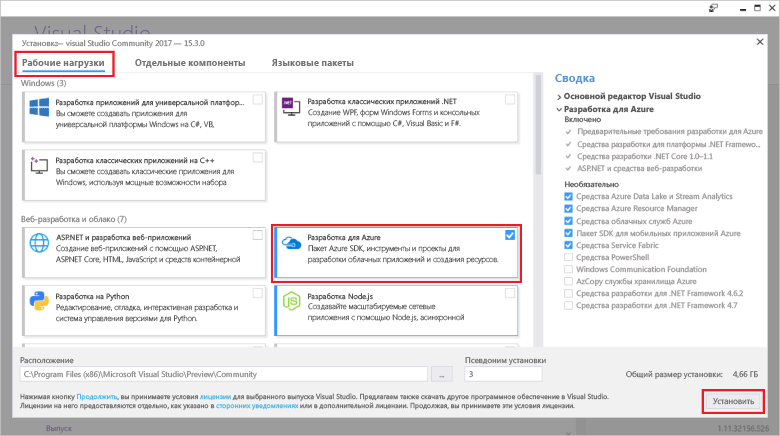

# <a name="create-an-azure-functions-http-trigger-with-an-azure-cosmos-db-input-binding"></a>Создание триггера HTTP в Функциях Azure с помощью входной привязки Azure Cosmos DB

Azure Cosmos DB — это глобально распределенная бессхемная и бессерверная многомодельная база данных. Функции Azure — это бессерверная служба вычислений, которая позволяет выполнять код по требованию. Свяжите эти две службы Azure, и вы получите базу для бессерверной архитектуры, которая позволяет сосредоточиться на создании эффективных приложений, не беспокоясь о подготовке и обслуживании серверов для требований вычислений и баз данных.

В этом руководстве используется код, созданный в кратком руководстве [Azure Cosmos DB. Создание приложения .NET с помощью API Graph](create-graph-dotnet.md). Здесь мы добавим функцию Azure, которая содержит [триггер HTTP](https://github.com/MicrosoftDocs/azure-docs-pr/azure-functions/functions-bindings-http-webhook.md#http-trigger). Триггер HTTP использует [входную привязку](https://github.com/MicrosoftDocs/azure-docs-pr/azure-functions/functions-triggers-bindings.md) Azure Cosmos DB для извлечения данных из базы данных графа, созданной при работе с кратким руководством. Этот определенный триггер HTTP запрашивает данные в Azure Cosmos DB, но входные привязки из Azure Cosmos DB можно использовать для получения входных значений данных для любой задачи функции.

В рамках этого руководства рассматриваются следующие задачи:

> [!div class="checklist"]
> * создание проекта функции Azure; 
> * создание триггера HTTP;
> * публикация функции Azure;
> * подключение функции Azure к базе данных Azure Cosmos DB.

## <a name="prerequisites"></a>предварительным требованиям

- [Visual Studio 2017 версия 15.3](https://www.visualstudio.com/vs/preview/), включая рабочую нагрузку**разработки в Azure**.

    
    
- Установив Visual Studio 2017 версии 15.3 или обновившись до этой версии, вы должны вручную обновить инструменты Visual Studio 2017 для решения "Функции Azure". Для обновления инструментов можно воспользоваться меню **Инструменты** в разделе **Расширения и обновления...** > **Обновления** > **Visual Studio Marketplace** > **Azure Functions and Web Jobs Tools** (Инструменты для функций и веб-заданий Azure)  > **Обновление**.

- Выполните действия, описанные в руководстве [Azure Cosmos DB. Разработка с помощью API Graph на .NET](tutorial-develop-graph-dotnet.md), или скачайте пример кода из репозитория GitHub [azure-cosmos-db-graph-dotnet-getting-started](https://github.com/Azure-Samples/azure-cosmos-db-graph-dotnet-getting-started) и создайте проект.
 
## <a name="build-a-function-in-visual-studio"></a>Создание функции в Visual Studio

1. Добавьте проект **Функции Azure** в решение. Для этого щелкните правой кнопкой мыши узел решения в **обозревателе решений** и выберите **Добавить** > **Создать проект**. Выберите пункт **Функции Azure** в диалоговом окне и присвойте имя **PeopleDataFunctions**.

   

2. После создания проекта функций Azure необходимо выполнить некоторые действия по обновлению и установке, связанные с NuGet. 

    a. Чтобы установить самую последнюю версию пакета SDK для функций, обновите пакет **Microsoft.NET.Sdk.Functions**, используя диспетчер NuGet. В **обозревателе решений** щелкните проект правой кнопкой мыши и выберите пункт **Управление пакетами NuGet**. На вкладке **Установлено** выберите Microsoft.NET.Sdk.Functions, а затем нажмите кнопку **Обновить**.

   

    Б. На вкладке **Обзор** введите **azure.graphs**, чтобы найти пакет **Microsoft.Azure.Graphs**, а затем нажмите кнопку **Установить**. Этот пакет содержит клиентский пакет SDK для .NET для API Graph.

   

    c. На вкладке **Обзор** введите **mono.csharp**, чтобы найти пакет **Mono.CSharp**, а затем нажмите кнопку **Установить**.

   

3. В обозревателе решений теперь должны содержаться установленные пакеты, как показано ниже. 
   
   После этого нужно написать код, поэтому мы добавим новый элемент **Функция Azure** в проект. 

    a. Щелкните правой кнопкой мыши узел проекта в **обозревателе решений**, а затем щелкните **Добавить** > **Новый элемент**.   
    Б. В диалоговом окне **Добавление нового элемента** выберите **Элементы Visual C#**, **Функция Azure**, введите **Search** в качестве имени проекта, а затем нажмите кнопку **Добавить**.  
 
   

4. Функция Azure будет отвечать на HTTP-запросы, поэтому здесь можно использовать шаблон триггера HTTP.
   
   В окне **Новая функция Azure** выберите **Триггер HTTP**. Мы также хотим, чтобы эта функция Azure была открыта для подключений, поэтому мы зададим для **прав доступа** значение **Анонимный**. Таким образом все пользователи смогут выполнять вход. Последовательно выберите **ОК**.

   

5. Добавив в проект функции Azure файл Search.cs, замените имеющиеся инструкции **using** следующими:

   ```csharp
   using Microsoft.Azure.Documents;
   using Microsoft.Azure.Documents.Client;
   using Microsoft.Azure.Documents.Linq;
   using Microsoft.Azure.Graphs;
   using Microsoft.Azure.WebJobs;
   using Microsoft.Azure.WebJobs.Extensions.Http;
   using Microsoft.Azure.WebJobs.Host;
   using System;
   using System.Collections.Generic;
   using System.Configuration;
   using System.Linq;
   using System.Net;
   using System.Net.Http;
   using System.Threading.Tasks;
   ```

6. Затем замените код класса функции Azure приведенным ниже кодом. Код выполняет поиск в базе данных Azure Cosmos DB с использованием API Graph для всех людей или для определенного пользователя, обозначенного параметром строки запроса `name`.

   ```csharp
   public static class Search
   {
       static string endpoint = ConfigurationManager.AppSettings["Endpoint"];
       static string authKey = ConfigurationManager.AppSettings["AuthKey"];

       [FunctionName("Search")]
       public static async Task<HttpResponseMessage> Run(
           [HttpTrigger(AuthorizationLevel.Anonymous, "get", "post", Route = null)]HttpRequestMessage req,
           TraceWriter log)
       {
           log.Info("C# HTTP trigger function processed a request.");

           // the person objects are free-form in structure
           List<dynamic> results = new List<dynamic>();

           // open the client's connection
           using (DocumentClient client = new DocumentClient(
               new Uri(endpoint),
               authKey,
               new ConnectionPolicy
               {
                   ConnectionMode = ConnectionMode.Direct,
                   ConnectionProtocol = Protocol.Tcp
               }))
           {
               // get a reference to the database the console app created
               Database database = await client.CreateDatabaseIfNotExistsAsync(
                   new Database
                   {
                       Id = "graphdb"
                   });

               // get an instance of the database's graph
               DocumentCollection graph = await client.CreateDocumentCollectionIfNotExistsAsync(
                   UriFactory.CreateDatabaseUri("graphdb"),
                   new DocumentCollection { Id = "graphcollz" },
                   new RequestOptions { OfferThroughput = 1000 });

               // build a gremlin query based on the existence of a name parameter
               string name = req.GetQueryNameValuePairs()
                   .FirstOrDefault(q => string.Compare(q.Key, "name", true) == 0)
                   .Value;

               IDocumentQuery<dynamic> query = (!String.IsNullOrEmpty(name))
                   ? client.CreateGremlinQuery<dynamic>(graph, string.Format("g.V('{0}')", name))
                   : client.CreateGremlinQuery<dynamic>(graph, "g.V()");

               // iterate over all the results and add them to the list
               while (query.HasMoreResults)
                   foreach (dynamic result in await query.ExecuteNextAsync())
                       results.Add(result);
           }

           // return the list with an OK response
           return req.CreateResponse<List<dynamic>>(HttpStatusCode.OK, results);
       }
   }
   ```

   Код, по сути, представляет ту же логику подключения, что и в исходном консольном приложении, использованном для заполнения базы данных, с простым запросом для получения соответствующих записей.

## <a name="debug-the-azure-function-locally"></a>Отладка функции Azure локально

Теперь, когда код готов, можно использовать локальные средства отладки функций Azure и эмулятор для выполнения кода локально в целях тестирования.

1. Прежде чем код будет выполнен правильно, необходимо настроить его для локального выполнения с использованием сведений о подключении к Azure Cosmos DB. Вы можете использовать файл local.settings.json, чтобы настроить функцию Azure для локального выполнения, так же, как бы вы использовали файл App.config для настройки исходного консольного приложения для выполнения.

    Чтобы сделать это, добавьте следующие строки кода в файл local.settings.json и скопируйте параметры Endpoint и AuthKey из файла App.Config в проекте GraphGetStarted, как показано на рисунке ниже.

   ```json
    "Endpoint": "",
    "AuthKey": ""
    ```

   

2. Выберите в качестве запускаемого проекта новое приложение функций. В **обозревателе решений** щелкните правой кнопкой мыши **PeopleDataFunctions** и выберите пункт **Назначить запускаемым проектом**.

3. В **обозревателе решений** щелкните правой кнопкой мыши **Зависимости** в проекте **PeopleDataFunctions**, а затем выберите **Добавить ссылку**. В списке выберите System.Configuration и нажмите кнопку **ОК**.

3. Теперь давайте запустим приложение. Нажмите клавишу F5, чтобы запустить локальное средство отладки, func.exe. При этом код Azure должен быть размещен и готов к использованию.

   В конце начальных выходных данных из func.exe видно, что функция Azure размещена на локальном узле 7071. Полезно протестировать ее в клиенте.

   

4. Чтобы проверить функцию Azure, используйте [Visual Studio Code](http://code.visualstudio.com/) с расширением Huachao Mao [REST Client](https://marketplace.visualstudio.com/items?itemName=humao.rest-client). REST Client позволяет запустить локальный или удаленный HTTP-запрос одним щелчком правой кнопки мыши. 

    Чтобы сделать это, создайте файл с именем test-function-locally.http и добавьте следующий код:

    ```http
    get http://localhost:7071/api/Search

    get http://localhost:7071/api/Search?name=ben
   ```

    Теперь щелкните правой кнопкой мыши в первой строке кода, а затем выберите **Отправить запрос**, как показано на следующем рисунке.

   

   Появится необработанный HTTP-ответ из заголовков локально выполняющейся функции Azure, содержимое текста JSON и все данные.

   

5. Теперь щелкните вторую строку кода, а затем выберите **Отправить запрос**. Добавив параметр строки запроса `name` со значением, содержащимся в базе данных, можно отфильтровать результаты, возвращаемые функцией Azure.

   

Проверив функцию Azure и удостоверившись, что она работает должным образом, остается лишь опубликовать ее в службе приложений Azure и настроить для работы в облаке.

## <a name="publish-the-azure-function"></a>Публикация функции Azure

1. Щелкните правой кнопкой мыши проект в **обозревателе решений** и выберите пункт **Опубликовать**.

   

2. Мы готовы опубликовать функцию в облаке, чтобы протестировать ее в общедоступном сценарии. На вкладке **Публикация** выберите **Приложение функции Azure**, установите переключатель **Создать**, чтобы создать функцию Azure в подписке Azure, а затем нажмите кнопку **Опубликовать**.

   

3. В диалоговом окне **Публикация** выполните следующие действия.
   
    a. В поле **Имя приложения** укажите уникальное имя функции.

    Б. В поле **Подписка** выберите необходимую подписку Azure.
   
    c. В поле **Группа ресурсов** создайте группу ресурсов с тем же именем, что и у приложения.
   
    d. Рядом с полем **План службы приложений** нажмите кнопку **Создать**, чтобы создать план службы приложений на основании потребления, так как мы собираемся использовать метод оплаты за использование для бессерверной функции Azure. Используйте значения по умолчанию на странице **Настроить план служб приложений** и нажмите кнопку **ОК**.
   
    д. Рядом с полем **Учетная запись хранения** нажмите кнопку **Создать**, чтобы создать учетную запись хранения для использования с функцией Azure на случай, если нам понадобится поддержка больших двоичных объектов, таблиц и очередей для активации выполнения других функций. Используйте значения по умолчанию на странице **Учетная запись хранения** и нажмите кнопку **ОК**.

    f. Нажмите кнопку **Создать** в диалоговом окне, чтобы создать все ресурсы в подписке Azure. Visual Studio скачает профиль публикации (простой XML-файл), который будет использоваться в следующий раз при публикации кода функции Azure.

   

    Затем в Visual Studio отобразится страница публикации, которую можно использовать, если вы внесете изменения в функцию и вам понадобится ее повторно опубликовать. Сейчас не нужно предпринимать на этой странице никаких действий.

4. После публикации функции Azure можно перейти на страницу [портала Azure](https://portal.azure.com/) для функции Azure. Там вы увидите ссылку на **параметры приложения** функции Azure. Откройте эту ссылку, чтобы настроить динамическую функцию Azure для подключения к базе данных Azure Cosmos DB с данными пользователя.

   

5. Так же как ранее в файле App.config консольного приложения и в файле local.settings.json приложения-функции Azure, необходимо добавить конечную точку и ключ авторизации для базы данных Azure Cosmos DB в опубликованную функцию. Таким образом, вам не понадобится вносить код конфигурации, содержащий ключи. Вы можете настроить их на портале и гарантировать, что они не хранятся в системе управления версиями. Для добавления каждого значения нажмите кнопку **Add new setting** (Добавить новый параметр), добавьте **Endpoint** и значение из файла app.config, а затем снова нажмите кнопку **Add new setting** (Добавить новый параметр) и добавьте **AuthKey** и пользовательское значение. Когда вы добавите и сохраните значения параметров, они будут выглядеть следующим образом.

   

6. Как только функция Azure будет настроена правильно в подписке Azure, можно снова использовать расширения REST Client Visual Studio Code для запроса общедоступного URL-адреса функции Azure. Добавьте эти две строки кода в test-function-locally.http, а затем запустите каждую строку, чтобы проверить эту функцию. Замените имя функции в URL-адресе именем вашей функции.

    ```json
    get https://peoplesearchfunction.azurewebsites.net/api/Search

    get https://peoplesearchfunction.azurewebsites.net/api/Search?name=thomas
    ```

    Функция возвращает данные, полученные из Azure Cosmos DB.

    


## <a name="next-steps"></a>Дополнительная информация

В этом руководстве вы выполнили следующее:

> [!div class="checklist"]
> * создали проект функции Azure; 
> * создали триггер HTTP;
> * опубликовали функцию Azure;
> * подключили функцию к базе данных Azure Cosmos DB.

Теперь вы можете перейти к разделу ключевых концепций, чтобы получить дополнительные сведения о службе Cosmos DB.

> [!div class="nextstepaction"]
> [Глобальное распределение](distribute-data-globally.md) 

Эта статья основана на записи из серии [на тему бессхемных и бессерверных сценариев в блоге Брейди Гестера (Brady Gaster)](http://www.bradygaster.com/category/%20Serverless%20&%20Schemaless). Посетите его блог, чтобы ознакомиться с другими записями этой серии.
