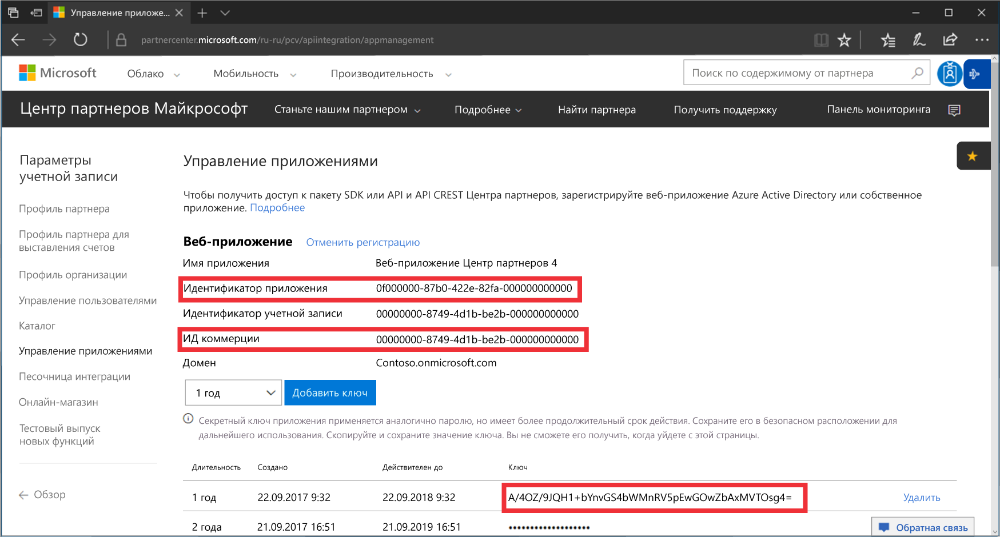
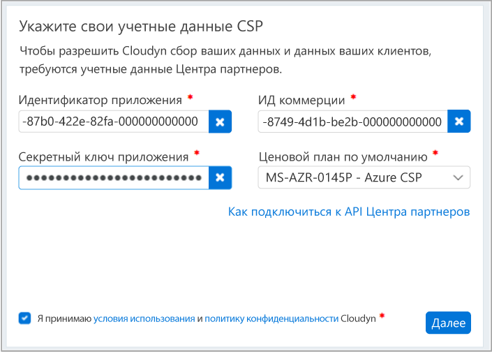

# Регистрация в партнерской программе CSP и просмотр данных о затратах

Как партнер CSP вы можете зарегистрироваться в службе "Управление затратами Azure". Такая регистрация предоставляет доступ к порталу Cloudyn. В этом кратком руководстве описывается процесс регистрации, который необходимо пройти для создания пробной подписки Cloudyn и входа на портал Cloudyn. Здесь также показано, как начать просматривать данные о затратах.

>[!NOTE]

>Только прямые партнеры CSP и косвенные поставщики CSP могут зарегистрироваться в Cloudyn.
>
>Для аутентификации и доступа к данным необходимо настроить API Центра партнеров. Для подготовки доступа к API необходима учетная запись глобального администратора Центра партнеров.
Дополнительные сведения см. в разделе о [подключении к API Центра партнеров](https://msdn.microsoft.com/library/partnercenter/mt709136.aspx).
>
>Доступ к Cloudyn можно предоставить торговым представителям косвенного CSP, после того как его косвенные поставщик CSP зарегистрируется в Cloudyn. Торговые представители косвенного CSP могут предоставить доступ к Cloudyn клиентам и подпискам Azure.

## Вход в Azure

- Войдите на портал Azure по адресу http://portal.azure.com.

## Регистрация в службе "Управление затратами Azure"

1. На портале Azure в списке служб выберите **Cost Management + Billing** (Управление затратами + Выставление счетов).
2. В разделе **Обзор**, щелкните **Управление затратами**.  
    
3. На странице **Управление затратами** нажмите кнопку **Go to Cost Management** (Перейти к управлению затратами), чтобы открыть страницу регистрации Cloudyn в новом окне.
4. На странице пробной регистрации на портале Cloudyn введите название вашей компании, выберите **Microsoft CSP Partner Program Administrator** (Администратор партнерской программы Microsoft CSP), а затем нажмите кнопку **Next** (Далее).  
5. Введите **Application ID** (Идентификатор приложения), **Commerce ID** (Идентификатор коммерции), **Application Secret key** (Секретный ключ приложения) и выберите **Default Pricing Plan** (Тарифный план по умолчанию). Если у вас нет под рукой этих сведений, войдите на портал Центра партнеров по адресу [https://partnercenter.microsoft.com](https://partnercenter.microsoft.com), используя основную учетную запись администратора, и выполните следующие действия:
  1. Последовательно выберите **Панель мониторинга** > **Параметры учетной записи** > **Управление приложениями**.
  2. Если вы ранее создали веб-приложение, то пропустите этот шаг. Если нет, то нажмите кнопку **Add new web app** (Добавить новое веб-приложение) в разделе **Веб-приложение**.
  3. Скопируйте **идентификатор приложения** (GUID) из своего веб-приложения.
  4. Скопируйте **идентификатор коммерции** (GUID) из своего веб-приложения.
  5. Выберите необходимый срок действия ключа — один или два года. Нажмите кнопку **Добавить ключ**, а затем скопируйте и сохраните значение секретного ключа.  
    
  6. Вернитесь на страницу регистрации и вставьте эти сведения.  
      
6. Примите условия использования, а затем проверьте свои данные. Нажмите кнопку **Next** (Далее), чтобы авторизовать Cloudyn для сбора данных ресурсов Azure. Собранные данные включают в себя сведения об использовании, производительности, выставлении счетов, а также данные тегов из подписок.  
7. В разделе **Invite other stakeholders** (Пригласить других заинтересованных лиц) можно добавить пользователей, введя их адреса электронной почты. По завершении нажмите кнопку **Next** (Далее). Добавление всех данных о выставлении счетов в Cloudyn занимает около двух часов.
8. Щелкните **Go to Cloudyn** (Перейти к Cloudyn), чтобы открыть портал Cloudyn. Затем на странице **Cloud Accounts Management** (Управление облачными учетными записями) должны отобразиться сведения вашей зарегистрированной учетной записи CSP.

## Настройка непрямого доступа CSP в Cloudyn

По умолчанию API Центра партнеров доступен только для прямых поставщиков CSP. Но прямой поставщик CSP может настроить доступ для своих непрямых клиентов или партнеров CSP с помощью групп сущностей в Cloudyn.

Чтобы предоставить доступ непрямым клиентам или партнерам CSP, выполните инструкции по настройке пробной регистрации, приведенные в разделе [Создание пробной регистрации](#create-a-trial-registration). Выполните приведенные ниже инструкции, чтобы сегментировать данные непрямых клиентов CSP с помощью сущностей Cloudyn. После этого назначьте группам сущностей соответствующие разрешения пользователей.

1. Создайте группу сущностей с данными, приведенными в разделе о [создании сущностей](tutorial-user-access.md#create-and-manage-entities).
2. Выполните действия, описанные в видео о [назначении подписок сущностям затрат](https://support.cloudyn.com/hc/en-us/articles/115005139425-Video-Assigning-subscriptions-to-Cost-Entities). Свяжите учетную запись и подписки Azure непрямого клиента CSP с сущностью, созданной ранее.
3. Выполните инструкции, приведенные в разделе [Создание пользователя с правами администратора](tutorial-user-access.md#create-a-user-with-admin-access), чтобы создать учетную запись пользователя с правами администратора. Затем убедитесь, что учетной записи предоставлен доступ администратора к конкретным сущностям, созданным ранее для учетной записи непрямого клиента.

Для входа на портал Cloudyn непрямые партнеры CSP должны использовать учетные записи, которые вы для них создали.

[!INCLUDE [cost-management-create-account-view-data](../../includes/cost-management-create-account-view-data.md)]

## Дополнительная информация

В этом кратком руководстве вы использовали данные CSP для регистрации в решении Cost Management. Вы также вошли на портал Cloudyn и начали просматривать данные о затратах. Дополнительные сведения о службе "Управление затратами Azure" см. в руководстве по решению "Управление затратами".

> [!div class="nextstepaction"]
> [Просмотр сведений об использовании и затратах](./tutorial-review-usage.md)
