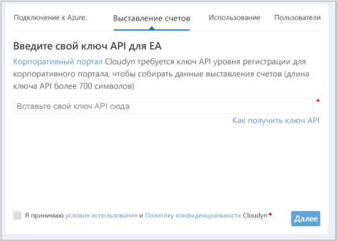
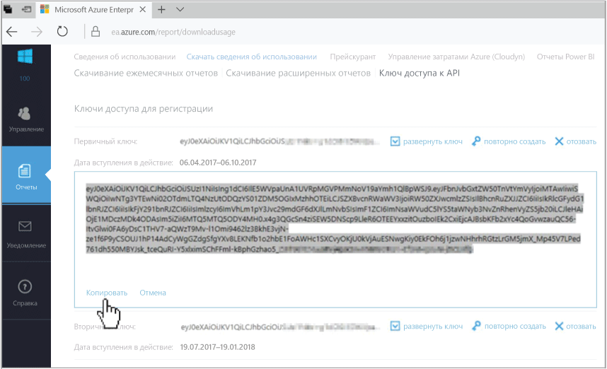
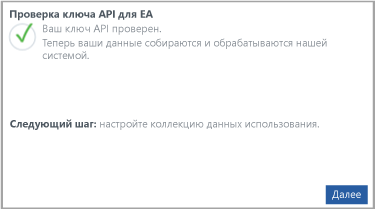

# Регистрация соглашения Azure Enterprise и просмотр данных о затратах

Вы можете использовать соглашение Azure Enterprise для регистрации в службе "Управление затратами Azure". Такая регистрация предоставляет доступ к порталу Cloudyn. В этом кратком руководстве описывается процесс регистрации, который необходимо пройти для создания пробной подписки Cloudyn и входа на портал Cloudyn. Здесь также показано, как начать просматривать данные о затратах.

## Вход в Azure

- Войдите на портал Azure по адресу http://portal.azure.com.

## Регистрация в службе "Управление затратами Azure"

1. На портале Azure в списке служб выберите **Cost Management + Billing** (Управление затратами + Выставление счетов).
2. В разделе **Обзор**, щелкните **Управление затратами**.  
    
3. На странице **Управление затратами** нажмите кнопку **Go to Cost Management** (Перейти к управлению затратами), чтобы открыть страницу регистрации Cloudyn в новом окне.
4. На странице пробной регистрации на портале Cloudyn введите название вашей компании, а затем выберите **Azure Enterprise Enrollment Administrator** (Администратор регистрации Azure Enterprise).  
    
5. Введите свой ключ API для регистрации на портале Enterprise Portal. Если у вас нет под рукой ключа, то щелкните ссылку [Enterprise Portal](https://ea.azure.com) и выполните описанные ниже действия.
  1. Войдите на веб-сайт Azure Enterprise и щелкните **Отчеты**. Затем выберите **API Access Key** (Ключ доступа к API) и скопируйте первичный ключ.  
    
  3. Вернитесь на страницу регистрации и вставьте эти ключ API.
6. Примите условия использования, а затем проверьте свой ключ. Нажмите кнопку **Next** (Далее), чтобы авторизовать Cloudyn для сбора данных ресурсов Azure. Собранные данные включают в себя сведения об использовании, производительности, выставлении счетов, а также данные тегов из подписок.  
    
7. В разделе **Invite other stakeholders** (Пригласить других заинтересованных лиц) можно добавить пользователей, введя их адреса электронной почты. По завершении нажмите кнопку **Next** (Далее). На добавление платежных данных в Cloudyn в зависимости от размера регистрации в Azure может потребоваться до 24 часов.
8. Щелкните **Go to Cloudyn** (Перейти к Cloudyn), чтобы открыть портал Cloudyn. Затем на странице **Cloud Accounts Management** (Управление облачными учетными записями) должны отобразиться сведения вашей зарегистрированной учетной записи EA.

Руководство по регистрации соглашения Enterprise см. в видео [How to Find Your EA Enrollment ID and API Key for use in Azure Cost Management](https://youtu.be/u_phLs_udig) (Как найти свой идентификатор регистрации EA и ключ API для использования в службе "Управление затратами Azure").

[!INCLUDE [cost-management-create-account-view-data](../../includes/cost-management-create-account-view-data.md)]

## Дополнительная информация

В этом кратком руководстве вы использовали данные соглашения Azure Enterprise для регистрации в решении Cost Management. Вы также вошли на портал Cloudyn и начали просматривать данные о затратах. Дополнительные сведения о службе "Управление затратами Azure" см. в руководстве по решению "Управление затратами".

> [!div class="nextstepaction"]
> [Просмотр сведений об использовании и затратах](./tutorial-review-usage.md)
