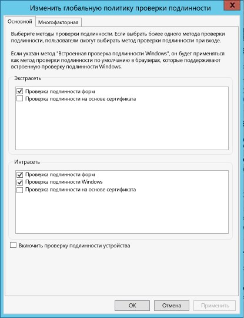

<properties
   pageTitle="Необходимые компоненты каталога данных Azure | Microsoft Azure"
   description="Необходимые компоненты каталога данных Azure, которые нужны для начала работы с каталогом данных Azure."
   services="data-catalog"
   documentationCenter=""
   authors="steelanddata"
   manager="NA"
   editor=""
   tags=""/>
<tags
   ms.service="data-catalog"
   ms.devlang="NA"
   ms.topic="article"
   ms.tgt_pltfrm="NA"
   ms.workload="data-catalog"
   ms.date="09/21/2016"
   ms.author="maroche"/>

# Предварительные условия для работы с каталогом данных Azure

## Что нужно, чтобы начать работу с каталогом данных Azure?

Есть несколько моментов, которые необходимо решить перед настройкой **каталога данных Azure**. Не стоит беспокоиться, это не займет много времени!

## Подписка Azure
Чтобы настроить каталог данных Azure, необходимо быть владельцем или совладельцем подписки Azure.

Подписки Azure помогают организовать доступ к ресурсам облачных служб, таких как каталог данных Azure. Они также позволяют управлять составлением отчетов об использовании ресурса, выставлением счетов за использование и их оплатой. Каждая подписка может иметь различные настройки для выставления счетов и их оплаты, поэтому у вас могут быть разные подписки и тарифные планы для разных отделов, проектов, региональных офисов и т. д. Каждая облачная служба привязана к подписке, поэтому необходимо иметь подписку перед настройкой каталога данных Azure. Дополнительные сведения см. в статье [Использование назначений ролей для управления доступом к ресурсам в подписке Azure](../active-directory/active-directory-assign-admin-roles.md).

## Azure Active Directory
Для настройки каталога данных Azure необходимо выполнить вход с использованием учетной записи пользователя Azure Active Directory.

Azure Active Directory (Azure AD) предоставляет компаниям простой способ управления удостоверениями и доступом не только в облаке, но и локально. Пользователи могут использовать единую рабочую или школьную учетную запись для единого входа во все облачные и локальные веб-приложения. Каталог данных Azure использует Azure AD для проверки подлинности входа. Дополнительные сведения см. в статье [Что такое Azure Active Directory](../active-directory/active-directory-whatis.md).

> [AZURE.NOTE] Пользователи могут входить на [портал Azure](http://portal.azure.com/) с помощью личной учетной записи Майкрософт, а также рабочей или учебной учетной записи Azure Active Directory. Чтобы настроить каталог данных Azure с помощью портала Azure или [портала каталога данных](http://www.azuredatacatalog.com), необходимо войти с помощью учетной записью Azure Active Directory, а не личной учетной записи.

## Настройка политики Active Directory

Иногда пользователи могут столкнуться с ситуацией, когда они могут войти на портал каталога данных Azure, но при попытке входа на средство регистрации источника данных отображается сообщение об ошибке, которая запрещает вход в систему. Эта ошибка может происходить только в том случае, если пользователь находится в локальной сети, или только в том случае, если пользователь подключается из-за пределов сети компании.

Средство регистрации источника данных использует проверку подлинности форм для проверки входа в систему пользователя с данными Active Directory. Для успешного входа в систему администратор Active Directory должен включить проверку подлинности форм в глобальную политику проверки подлинности.

Глобальная политика проверки подлинности позволяет включить методы проверки подлинности отдельно для интрасети и экстрасети, как показано ниже. Ошибки входа в систему могут возникать, если не включена проверка подлинности форм для сети, из которой пользователь подключается.

 

Подробнее: [Настройка политик проверки подлинности](https://technet.microsoft.com/library/dn486781.aspx).

<!---HONumber=AcomDC_0921_2016-->