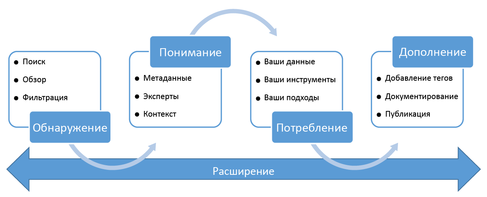

<properties
   pageTitle="Что такое каталог данных Azure? | Microsoft Azure"
   description="В этой статье приведен обзор каталога данных Microsoft Azure и его возможностей. В ней также рассказывается, какие проблемы он позволяет решать. Возможности каталога данных позволяют любому пользователю — от аналитиков до специалистов по обработке и анализу данных и разработчиков — регистрировать, обнаруживать, анализировать и использовать источники данных."
   services="data-catalog"
   documentationCenter=""
   authors="steelanddata"
   manager="NA"
   editor=""
   tags=""/>
<tags
   ms.service="data-catalog"
   ms.devlang="NA"
   ms.topic="get-started-article"
   ms.tgt_pltfrm="NA"
   ms.workload="data-catalog"
   ms.date="09/21/2016"
   ms.author="maroche"/>

# Что такое каталог данных Azure?

Каталог данных Azure представляет собой полностью управляемую облачную службу, которая предоставляет пользователям возможности для поиска необходимых источников данных и их анализа, а также помогает организациям повысить окупаемость существующих инвестиций. Возможности каталога данных позволяют любому пользователю — от аналитика и специалиста по обработке и анализу данных до разработчика — обнаруживать, анализировать и использовать источники данных. Каталог данных включает в себя краудсорсинговую модель метаданных и аннотаций и позволяет всем пользователям делиться знаниями для формирования сообщества и культуры данных.

## Сложности обнаружения для потребителей данных

Как правило, обнаружение корпоративных источников данных является неотъемлемым процессом, основанным на общей информации, известной ограниченной группе лиц внутри компании. Это создает множество проблем для компаний, желающих извлечь максимум пользы из своих информационных ресурсов.

-	Пользователи не знают о существовании источников данных, пока не столкнутся с ними в рамках другого процесса; не существует централизованного местоположения, где регистрируются эти источники данных.
-	Пока пользователь не знает, где располагается источник данных, он не может подключиться к данным с помощью клиентского приложения; для работы с данными ему необходимо знать строку или путь подключения.
-	Пока пользователь не знает, где располагается документация к источнику данных, он не может разобраться в назначении этих данных. Источники данных и документация располагаются в разных местах и используются в различных интерфейсах.
-	Если у пользователя есть вопросы по поводу информационного ресурса, он должен отыскать специалиста или их группу, ответственных за эти данные, и подключить их к работе вне сети; отсутствует явная связь между данными и стороной со специалистами, заинтересованной в их использовании.
-  Само обнаружение источника данных и документации не дает доступа к необходимым пользователю данным, пока он не поймет процесс запроса доступа к источнику этих данных.

## Сложности обнаружения для поставщиков данных

Пока потребители данных сталкиваются с перечисленными сложностями, пользователи, ответственные за создание и обслуживание информационных ресурсов, вынуждены решать собственные проблемы.

-	Комментирование источников данных с помощью описательных метаданных зачастую оказывается напрасным; клиентские приложения обычно пропускают описания, хранящиеся в источнике данных.
-	Создание документации для источников данных часто является напрасным занятием. Ответственность за постоянную синхронизацию документации с источником данных приводит к тому, что пользователи не доверяют документации, так как она часто воспринимается устаревшей.
- Ограничение доступа к источнику данных и уверенность в том, что пользователи данных знают, как запросить к ним доступ, является краеугольным камнем.

Создание и обслуживание документации для источника данных являются сложной и трудоемкой задачей. А обеспечение доступности этой документации для всех пользователей данного источника данных — еще более сложной.

Вместе эти трудности образуют серьезный барьер для компаний, желающих способствовать и содействовать использованию и восприятию данных предприятия.

## Решение проблем с помощью каталога данных Azure

Каталог данных предназначен для того, чтобы решать этих проблемы и помогать предприятиям извлекать максимальную пользу из существующих у них информационных ресурсов. Благодаря каталогу данных источники данных легко обнаруживаются и являются понятными для пользователей, которым требуются управляемые данные.

Каталог данных предоставляет облачную службу, в которой можно зарегистрировать источник данных. Эти данные остаются в существующем расположении, однако копия метаданных добавляется в каталог данных вместе со ссылкой на расположение источника данных. Кроме того, чтобы облегчить обнаружение каждого источника данных с помощью функции поиска и сделать их доступными для пользователей, эти метаданные индексируются.

После регистрации источника данных его метаданные могут быть дополнены пользователем, выполнившим регистрацию, либо другим пользователем организации. Любой пользователь может добавить комментарий к источнику данных, предоставляя описания, теги и другие метаданные, например документацию и инструкции по запросу доступа к источнику данных. Эти описательные метаданные дополняют структурные метаданные (например, имена столбцов и типы данных), зарегистрированные из источника данных.

Основной целью регистрации источников являются обнаружение, понимание и использование источников данных. Когда корпоративным пользователям потребуются данные для работы (например, для бизнес-аналитики, разработки приложений, обработки и анализа данных или любой другой задачи, требующей корректных данных), они могут использовать интерфейс обнаружения каталога данных, чтобы быстро найти соответствующие требованиям данные, оценить их целевую пригодность и использовать, открыв источник данных в выбранном средстве. В то же время пользователи каталога данных могут дополнять его, помечая, документируя и добавляя комментарии к уже зарегистрированным источникам данных. Они также могут регистрировать новые источники данных, которые сообщество пользователей каталога сможет обнаруживать, рассматривать и использовать.

## Начало работы с каталогом данных

Чтобы начать работу с каталогом данных уже сегодня, посетите сайт [www.azuredatacatalog.com](https://www.azuredatacatalog.com).

Руководство по началу работы доступно [здесь](data-catalog-get-started.md).

## Подробнее о каталоге данных

Чтобы получить дополнительные сведения о возможностях каталога данных, см. следующие статьи:

* [Как регистрировать источники данных](data-catalog-how-to-register.md)
* [Обнаружение источников данных](data-catalog-how-to-discover.md)
* [Создание заметок к источникам данных](data-catalog-how-to-annotate.md)
* [Как создать документацию по источникам данных](data-catalog-how-to-documentation.md)
* [Подключение к источникам данных](data-catalog-how-to-connect.md)
* [Работа с источниками больших данных в каталоге данных Azure](data-catalog-how-to-big-data.md)
* [Как управлять ресурсами данных](data-catalog-how-to-manage.md)
* [Как настроить бизнес-глоссарий для регулируемого добавления тегов](data-catalog-how-to-business-glossary.md)
* [Часто задаваемые вопросы](data-catalog-frequently-asked-questions.md)

<!---HONumber=AcomDC_0921_2016--->