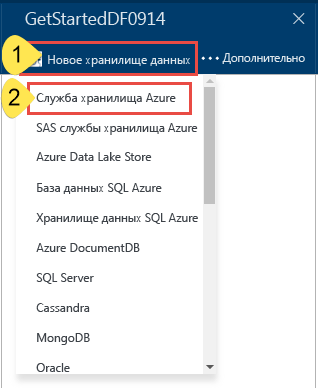
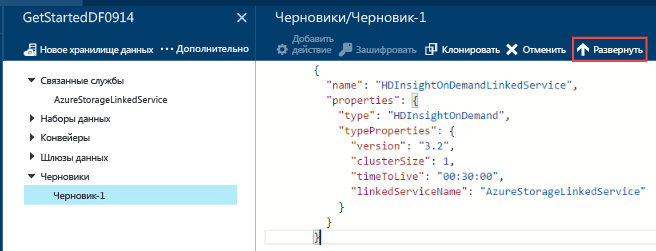
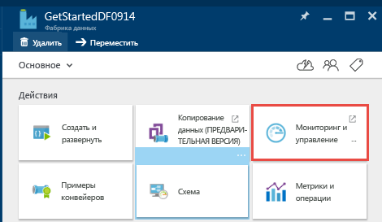

# <a name="tutorial-build-your-first-azure-data-factory-using-azure-portal"></a>Руководство. Создание первой фабрики данных Azure с помощью портала Azure
> [!div class="op_single_selector"]
> * [Обзор и предварительные требования](data-factory-build-your-first-pipeline.md)
> * [Портал Azure](data-factory-build-your-first-pipeline-using-editor.md)
> * [Visual Studio](data-factory-build-your-first-pipeline-using-vs.md)
> * [PowerShell](data-factory-build-your-first-pipeline-using-powershell.md)
> * [Шаблон Resource Manager](data-factory-build-your-first-pipeline-using-arm.md)
> * [ИНТЕРФЕЙС REST API](data-factory-build-your-first-pipeline-using-rest-api.md)


Из этой статьи вы узнаете, как создать свою первую фабрику данных Azure с помощью [портала Azure](https://portal.azure.com/). Чтобы выполнить приведенные здесь инструкции с помощью других средств или пакетов SDK, выберите в раскрывающемся списке один из доступных вариантов. 

В этом руководстве конвейеру доступно одно действие — **действие Hive HDInsight**. Это действие запускает сценарий Hive в кластере HDInsight Azure, который преобразует входные данные в выходные. Конвейер запускается раз в месяц по расписанию. Время начала и окончания запуска также указаны. 

> [!NOTE]
> В этом руководстве конвейер данных преобразовывает входные данные в выходные. Инструкции по копированию данных из хранилища BLOB-объектов Azure в базу данных SQL с помощью фабрики данных Azure см. в [этой статье](data-factory-copy-data-from-azure-blob-storage-to-sql-database.md).
> 
> Конвейер может содержать сразу несколько действий. Два действия можно объединить в цепочку (выполнить одно действие вслед за другим), настроив выходной набор данных одного действия как входной набор данных другого действия. Дополнительные сведения см. в разделе [Несколько действий в конвейере](data-factory-scheduling-and-execution.md#multiple-activities-in-a-pipeline).

## <a name="prerequisites"></a>Предварительные требования
1. Прочтите [обзорную статью](data-factory-build-your-first-pipeline.md) и выполните **предварительные требования** .
2. Здесь не приводятся общие сведения о службе фабрики данных Azure. Рекомендуем ознакомиться со статьей [Введение в службу фабрики данных Azure](data-factory-introduction.md) , в которой вы найдете подробный обзор этой службы.  

## <a name="create-data-factory"></a>Создание фабрики данных
Фабрика данных может иметь один или несколько конвейеров. Конвейер может содержать одно или несколько действий. Это может быть, например, действие копирования данных из исходного хранилища в целевое или действие HDInsight Hive для выполнения скрипта Hive, преобразующего входные данные в выходные данные продукта. Начнем с создания фабрики данных.

1. Войдите на [портал Azure](https://portal.azure.com/).
2. Щелкните **Создать** в меню слева, выберите **Данные+аналитика** и щелкните **Фабрика данных**.

   
3. В колонке **Новая фабрика данных** введите **GetStartedDF** в поле "Имя".

   

   > [!IMPORTANT]
   > Имя фабрики данных Azure должно быть **глобально уникальным**. Если появится сообщение об ошибке **Data factory name "GetStartedDF" is not availabl** (Имя GetStartedDF фабрики данных недоступно), измените это имя (например, на ваше_имя_GetStartedDF) и попробуйте создать ее снова. Ознакомьтесь с разделом [Фабрика данных — правила именования](data-factory-naming-rules.md) , чтобы узнать о правилах именования артефактов фабрики данных.
   >
   > В будущем имя фабрики данных может быть зарегистрировано в качестве **DNS-имени** и, следовательно, стать отображаемым.
   >
   >
4. Выберите **подписку Azure** , в рамках которой вы хотите создать фабрику данных.
5. Выберите имеющуюся **группу ресурсов** или создайте новую. Для примера в этом руководстве создайте группу ресурсов с именем **ADFGetStartedRG**.
6. Укажите **расположение** фабрики данных. В раскрывающемся списке отображаются только те регионы, которые поддерживаются службой фабрики данных.
7. Кроме того, установите флажок **Закрепить на панели мониторинга**. 
8. В колонке **Создание фабрики данных** нажмите кнопку **Создать**.

   > [!IMPORTANT]
   > Создавать экземпляры фабрики данных может пользователь с ролью [Участник фабрики данных](../active-directory/role-based-access-built-in-roles.md#data-factory-contributor) на уровне подписки или группы ресурсов.
   >
   >
7. На панели мониторинга вы увидите приведенный ниже элемент с состоянием "Deploying data factory" (Развертывание фабрики данных).    

   
8. Поздравляем! Вы успешно создали свою первую фабрику данных! Ее содержимое отобразится на соответствующей странице.     

    

Прежде чем создавать конвейер в фабрике данных, необходимо создать несколько сущностей этой службы. Сначала создайте связанные службы, чтобы связать хранилища данных и вычисления со своим хранилищем данных, и определите входные и выходные наборы данных, которые будут представлять входные и выходные данные в связанных хранилищах. Затем создайте конвейер с действием, в котором используются эти наборы данных.

## <a name="create-linked-services"></a>Создание связанных служб
На этом шаге вы свяжете учетную запись службы хранилища Azure и используемый по запросу кластер Azure HDInsight с фабрикой данных. В этом примере учетная запись хранения Azure содержит входные и выходные данные для конвейера. Для выполнения скрипта Hive, указанного в действии конвейера, в этом примере используется связанная служба HDInsight. определите, какие [хранилища данных](data-factory-data-movement-activities.md)/ и [службы вычислений](data-factory-compute-linked-services.md) используются в сценарии, и свяжите эти службы с фабрикой данных, создав связанные службы.  

### <a name="create-azure-storage-linked-service"></a>Создание связанной службы хранения Azure
На этом шаге вы свяжете учетную запись хранения Azure с фабрикой данных. В рамках этого руководства будет использоваться одна и та же учетная запись хранения Azure для хранения входных и выходных данных и файла скрипта HQL.

1. Щелкните **Создать и развернуть** в колонке **Фабрика данных** для **GetStartedDF**. Откроется редактор фабрики данных.

   
2. Щелкните **Новое хранилище данных** и выберите пункт **Служба хранилища Azure**.

   
3. В редакторе отобразится сценарий JSON для создания связанной службы хранилища Azure.

   
4. Замените **account name** именем своей учетной записи хранения Azure, а **account key** — ключом доступа к ней. Сведения о получении, просмотре, копировании и повторном создании ключей доступа к хранилищу см. в разделе [Управление учетной записью хранения](../storage/common/storage-create-storage-account.md#manage-your-storage-account).
5. Чтобы развернуть эту службу, нажмите кнопку **Развернуть** на панели команд.

    

   После развертывания связанной службы окно **Draft-1** должно исчезнуть, а в представлении в виде дерева слева отобразится служба **AzureStorageLinkedService**.

        

### <a name="create-azure-hdinsight-linked-service"></a>Создание связанной службы Azure HDInsight
На этом шаге вы свяжете используемый по запросу кластер HDInsight с фабрикой данных. Кластер HDInsight автоматически создается в среде выполнения и удаляется после завершения обработки и простоя в течение указанного времени.

1. В **редакторе фабрики данных** нажмите кнопку **... Еще**, щелкните **Новое вычисление** и выберите **On-demand HDInsight cluster** (Кластер HDInsight по требованию).

    
2. Вставьте следующий фрагмент в окно **Draft-1** . Фрагмент JSON описывает свойства, которые будут использоваться для создания кластера HDInsight по требованию.

    ```JSON
    {
        "name": "HDInsightOnDemandLinkedService",
        "properties": {
            "type": "HDInsightOnDemand",
            "typeProperties": {
                "version": "3.5",
                "clusterSize": 1,
                "timeToLive": "00:05:00",
                "osType": "Linux",
                "linkedServiceName": "AzureStorageLinkedService"
            }
        }
    }
    ```

    В следующей таблице приведены описания свойств JSON, используемых в этом фрагменте кода.

   | Свойство | Описание |
   |:--- |:--- |
   | ClusterSize (размер кластера) |Указывает размер кластера HDInsight. |
   | TimeToLive (срок жизни) | Указывает, сколько времени может простаивать кластер HDInsight, прежде чем он будет удален. |
   | linkedServiceName (имя связанной службы) | Указывает имя учетной записи хранения, в которой будут храниться журналы, создаваемые HDInsight. |

    Обратите внимание на следующие моменты.

   * С помощью JSON-файла фабрика данных создает кластер HDInsight **под управлением Linux**. Дополнительные сведения см. в разделе [Связанная служба Azure HDInsight по запросу](data-factory-compute-linked-services.md#azure-hdinsight-on-demand-linked-service).
   * Вместо кластера HDInsight по запросу можно использовать **собственный кластер HDInsight**. См. сведения о [связанной службе Azure HDInsight](data-factory-compute-linked-services.md#azure-hdinsight-linked-service).
   * Кластер HDInsight создает **контейнер по умолчанию** в хранилище BLOB-объектов, указанном в коде JSON (**linkedServiceName**). При удалении кластера HDInsight этот контейнер не удаляется. В этом весь замысел. Если используется связанная служба HDInsight по запросу, кластер HDInsight создается при каждой обработке среза данных (если не используется динамический кластер**timeToLive**). После завершения обработки кластер автоматически удаляется.

       По мере обработки новых срезов количество контейнеров в хранилище BLOB-объектов будет увеличиваться. Если эти контейнеры не используются для устранения неполадок с заданиями, удалите их — это позволит сократить расходы на хранение. Имена контейнеров указаны в формате adf**имя_фабрики_данных**-**имя_связанной_службы**-метка_даты_и_времени. Для удаления контейнеров в хранилище BLOB-объектов Azure используйте такие инструменты, как [Microsoft Storage Explorer](http://storageexplorer.com/) .

     Дополнительные сведения см. в разделе [Связанная служба Azure HDInsight по запросу](data-factory-compute-linked-services.md#azure-hdinsight-on-demand-linked-service).
3. Чтобы развернуть эту службу, нажмите кнопку **Развернуть** на панели команд.

    
4. Убедитесь, что обе службы (**AzureStorageLinkedService** и **HDInsightOnDemandLinkedService**) отображаются в представлении в виде дерева слева.

    

## <a name="create-datasets"></a>Создание наборов данных
На этом шаге вы создадите наборы данных, которые представляют входные и выходные данные для обработки Hive. Эти наборы данных ссылаются на службу **AzureStorageLinkedService** , созданную ранее в ходе работы с этим руководством. Точки связанной службы указывают на учетную запись хранения Azure, а наборы данных указывают контейнер, папку и имя файла в хранилище, в котором содержатся входные и выходные данные.   

### <a name="create-input-dataset"></a>Создание входного набора данных
1. В **редакторе фабрики данных** нажмите кнопку **... Еще** на панели команд, щелкните **Новый набор данных** и выберите **Хранилище больших двоичных объектов Azure**.

    
2. Вставьте следующий фрагмент в окно Draft-1. В фрагменте JSON создается набор данных с именем **AzureBlobInput** , представляющий входные данные для действия в конвейере. Кроме того, нужно указать, что входные данные размещаются в контейнере BLOB-объектов **adfgetstarted** и в папке **inputdata**.

    ```JSON
    {
        "name": "AzureBlobInput",
        "properties": {
            "type": "AzureBlob",
            "linkedServiceName": "AzureStorageLinkedService",
            "typeProperties": {
                "fileName": "input.log",
                "folderPath": "adfgetstarted/inputdata",
                "format": {
                    "type": "TextFormat",
                    "columnDelimiter": ","
                }
            },
            "availability": {
                "frequency": "Month",
                "interval": 1
            },
            "external": true,
            "policy": {}
        }
    }
    ```
    В следующей таблице приведены описания свойств JSON, используемых в этом фрагменте кода.

   | Свойство | Описание |
   |:--- |:--- |
   | type |Для свойства типа задано значение **AzureBlob**, так как данные хранятся в хранилище BLOB-объектов Azure. |
   | linkedServiceName (имя связанной службы) |Ссылается на созданную ранее **службу AzureStorageLinkedService**. |
   | folderPath | Определяет **контейнер** больших двоичных объектов и **папку**, которая содержит входные большие двоичные объекты. | 
   | fileName |Это необязательное свойство. Если это свойство не указано, выбираются все файлы из папки folderPath. В этом руководстве обрабатывается только файл **input.log**. |
   | type |Файлы журнала представлены в текстовом формате, поэтому мы используем значение **TextFormat**. |
   | columnDelimiter |Столбцы в файлах журнала разделяются **запятыми (`,`)**. |
   | frequency и interval |Для свойства frequency задано значение **Month**, а для свойства interval — значение **1**. Это означает, что срезы входных данных доступны ежемесячно. |
   | external | Это свойство имеет значение **true**, если этот конвейер не создает входные данные. В данном руководстве файл input.log не создается этим конвейером, поэтому мы присвоим этому свойству значение true. |

    Дополнительные сведения об этих свойствах JSON см. в [этом разделе](data-factory-azure-blob-connector.md#dataset-properties).
3. На панели команд нажмите кнопку **Развернуть** , чтобы развернуть только что созданный набор данных. Вы увидите набор данных в представлении в виде дерева слева.

### <a name="create-output-dataset"></a>Создание выходного набора данных
Теперь создайте выходной набор данных, представляющий выходные данные, которые хранятся в хранилище BLOB-объектов Azure.

1. В **редакторе фабрики данных** нажмите кнопку **... Еще** на панели команд, щелкните **Новый набор данных** и выберите **Хранилище больших двоичных объектов Azure**.  
2. Вставьте следующий фрагмент в окно Draft-1. Этот фрагмент кода JSON создает набор данных с именем **AzureBlobOutput**и определяет структуру данных, получаемых с помощью скрипта Hive. Кроме того, нужно указать, что результаты будут храниться в контейнере больших двоичных объектов с именем **adfgetstarted** и в папке с именем **partitioneddata**. В разделе **availability** указывается частота, с которой будет создаваться выходной набор данных (ежемесячно).

    ```JSON
    {
      "name": "AzureBlobOutput",
      "properties": {
        "type": "AzureBlob",
        "linkedServiceName": "AzureStorageLinkedService",
        "typeProperties": {
          "folderPath": "adfgetstarted/partitioneddata",
          "format": {
            "type": "TextFormat",
            "columnDelimiter": ","
          }
        },
        "availability": {
          "frequency": "Month",
          "interval": 1
        }
      }
    }
    ```
    Описание этих свойств можно найти в разделе **Создание входного набора данных** . Значение свойства external для выходного набора данных не указывается, так как набор данных создается службой фабрики данных.
3. На панели команд нажмите кнопку **Развернуть** , чтобы развернуть только что созданный набор данных.
4. Убедитесь, что набор данных успешно создан.

    

## <a name="create-pipeline"></a>Создание конвейера
На этом шаге вы создадите свой первый конвейер с действием **HDInsightHive** . Срез входных данных создается ежемесячно (frequency: Month, interval: 1), срез выходных данных создается ежемесячно, свойство scheduler для действия также указывается ежемесячно. Параметры выходного набора данных (outputs) и планировщика действия (scheduler) должны совпадать. В настоящее время расписание активируется с помощью выходного набора данных, поэтому его необходимо создать, даже если действие не создает никаких выходных данных. Если действие не принимает никаких входных данных, входной набор данных можно не создавать. Свойства, используемые в следующем фрагменте JSON, описаны в конце этого раздела.

1. В **редакторе фабрики данных** щелкните **значок многоточия (…) Дополнительные команды** и выберите **Новый конвейер**.

    
2. Вставьте следующий фрагмент в окно Draft-1.

   > [!IMPORTANT]
   > В JSON-файле замените свойство **storageaccountname** именем своей учетной записи хранения.
   >
   >

    ```JSON
    {
        "name": "MyFirstPipeline",
        "properties": {
            "description": "My first Azure Data Factory pipeline",
            "activities": [
                {
                    "type": "HDInsightHive",
                    "typeProperties": {
                        "scriptPath": "adfgetstarted/script/partitionweblogs.hql",
                        "scriptLinkedService": "AzureStorageLinkedService",
                        "defines": {
                            "inputtable": "wasb://adfgetstarted@<storageaccountname>.blob.core.windows.net/inputdata",
                            "partitionedtable": "wasb://adfgetstarted@<storageaccountname>.blob.core.windows.net/partitioneddata"
                        }
                    },
                    "inputs": [
                        {
                            "name": "AzureBlobInput"
                        }
                    ],
                    "outputs": [
                        {
                            "name": "AzureBlobOutput"
                        }
                    ],
                    "policy": {
                        "concurrency": 1,
                        "retry": 3
                    },
                    "scheduler": {
                        "frequency": "Month",
                        "interval": 1
                    },
                    "name": "RunSampleHiveActivity",
                    "linkedServiceName": "HDInsightOnDemandLinkedService"
                }
            ],
            "start": "2017-07-01T00:00:00Z",
            "end": "2017-07-02T00:00:00Z",
            "isPaused": false
        }
    }
    ```

    Этот фрагмент создает конвейер из одного действия, использующего Hive для обработки данных в кластере HDInsight.

    Файл сценария Hive, **partitionweblogs.hql**, хранится в учетной записи хранения Azure (указывается с помощью свойства scriptLinkedService, имеющего значение **AzureStorageLinkedService**) в папке **script** в контейнере **adfgetstarted**.

    Раздел **defines** используется для настройки параметров среды выполнения, которые будут переданы в скрипт Hive в качестве значений конфигурации Hive (например, ${hiveconf:inputtable}, ${hiveconf:partitionedtable}).

    Активный период конвейера задается с помощью свойств **start** и **end**.

    В действии JSON укажите, что скрипт Hive будет выполняться в среде вычислений, указанной в свойстве **linkedServiceName**, — **HDInsightOnDemandLinkedService**.

   > [!NOTE]
   > Сведения о свойствах JSON, используемых в этом примере, см. в разделе "Конвейер JSON" статьи [Конвейеры и действия в фабрике данных Azure](data-factory-create-pipelines.md).
   >
   >
3. Проверьте следующее:

   1. В папке **inputdata** контейнера **adfgetstarted** в хранилище BLOB-объектов есть файл **input.log**.
   2. В папке **script** контейнера **adfgetstarted** в хранилище BLOB-объектов есть файл **partitionweblogs.hql**. Выполните необходимые действия, описанные в [обзоре руководства](data-factory-build-your-first-pipeline.md) , если этих файлов нет в указанных папках.
   3. В JSON-файле конвейера замените свойство **storageaccountname** именем своей учетной записи хранения.
4. Чтобы развернуть конвейер, нажмите кнопку **Развернуть** на панели команд. Так как время в свойствах **start** и **end** задано в прошлом, а для свойства **isPaused** задано значение false, конвейер (действие в конвейере) запускается сразу после развертывания.
5. Убедитесь, что конвейер отображается в иерархической структуре.

    
6. Поздравляем! Вы создали свой первый конвейер!

## <a name="monitor-pipeline"></a>Отслеживание конвейера
### <a name="monitor-pipeline-using-diagram-view"></a>Мониторинг конвейера с использованием представления схемы
1. Щелкните **X**, чтобы закрыть колонки редактора фабрики данных и вернуться в колонку фабрики данных. Затем щелкните **Схема**.

    
2. В представлении схемы вы увидите все конвейеры и наборы данных, используемые в этом руководстве.

    
3. Чтобы просмотреть все действия в конвейере, щелкните конвейер в схеме правой кнопкой мыши и выберите пункт "Открыть конвейер".

    
4. Убедитесь, что действие HDInsightHive отображается в конвейере.

    

    Чтобы перейти к предыдущему представлению, щелкните **Фабрики данных** в меню навигации вверху.
5. В **представлении схемы** дважды щелкните набор данных **AzureBlobInput**. Убедитесь, что срез находится в состоянии **Готово** . Для отображения этого состояния может потребоваться несколько минут. Если это не произойдет через некоторое время, убедитесь, что входной файл (input.log) расположен в правильном контейнере (adfgetstarted) и папке (inputdata).

   
6. Щелкните **X**, чтобы закрыть колонку **AzureBlobInput**.
7. В **представлении схемы** дважды щелкните набор данных **AzureBlobOutput**. Вы увидите срез, который сейчас обрабатывается.

   
8. Как только обработка завершится, срез перейдет в состояние **Готово** .

     

   > [!IMPORTANT]
   > Создание используемого по требованию кластера HDInsight обычно занимает некоторое время (около 20 минут). Таким образом, конвейер обработает срез **примерно через 30 минут**.
   >
   >

9. Когда срез перейдет в состояние **Готово**, проверьте выходные данные в папке **partitioneddata** контейнера **adfgetstarted** в хранилище BLOB-объектов.  

   
10. Щелкните срез, чтобы просмотреть сведения о нем в колонке **Срез данных** .

     
11. Щелкните выполнение действия в списке **Выполнения действий**, чтобы просмотреть сведения о нем (действие Hive в нашем сценарии) в окне **Подробности о выполнении операции**.   

       

   В файлах журналов содержатся сведения о выполненном запросе Hive и его состоянии. Эти журналы полезны при устранении неполадок.
   Дополнительные сведения см. в статье [Мониторинг конвейеров фабрики данных Azure и управление ими](data-factory-monitor-manage-pipelines.md).

> [!IMPORTANT]
> В случае успешной обработки среза входной файл удаляется. Если вы хотите повторно обработать срез или еще раз выполнить инструкции из руководства, передайте входной файл (input.log) в папку inputdata в контейнере adfgetstarted.
>
>

### <a name="monitor-pipeline-using-monitor--manage-app"></a>Мониторинг конвейера с использованием приложения по мониторингу и управлению
Для мониторинга конвейеров также можно использовать приложение по мониторингу и управлению. Дополнительные сведения об использовании этого приложения см. в статье [Мониторинг конвейеров фабрики данных Azure и управление ими с помощью нового приложения по мониторингу и управлению](data-factory-monitor-manage-app.md).

1. Щелкните плитку **Monitor & Manage** (Мониторинг и управление) на домашней странице фабрики данных.

    
2. Вы должны увидеть **приложение по мониторингу и управлению**. Введите значения параметров **времени начала** и **времени окончания** для конвейера и щелкните **Применить**.

    
3. Выберите окно действия в списке **Activity Windows** (Окна действий), чтобы просмотреть сведения о нем.

    

## <a name="summary"></a>Сводка
Следуя инструкциям из этого руководства, вы создали фабрику данных Azure для обработки данных путем выполнения сценария Hive в кластере Hadoop HDInsight. Вы использовали редактор фабрики данных на портале Azure для выполнения следующих действий:  

1. создание **фабрики данных Azure**;
2. создание двух **связанных служб**.
   1. **Служба хранилища Azure** — связанная служба для связывания хранилища BLOB-объектов Azure, которое содержит входные и выходные файлы, с фабрикой данных.
   2. **Azure HDInsight** — связанная служба по запросу для связывания кластера HDInsight Hadoop с фабрикой данных. Фабрика данных Azure своевременно создает кластер HDInsight Hadoop для обработки входных данных и генерирования выходных данных.
3. Создание двух **наборов данных**, которые описывают входные и выходные данные для действия HDInsight Hive в конвейере.
4. Создание **конвейера** с действием **HDInsight Hive**.

## <a name="next-steps"></a>Дальнейшие действия
В этой статье вы создали конвейер с действием преобразования (действие HDInsight), которое выполняет сценарий Hive в кластере HDInsight по требованию. Сведения о том, как копировать данные из хранилища BLOB-объектов Azure в SQL Azure с помощью действия копирования, см. в статье [Копирование данных из хранилища BLOB-объектов Azure в базу данных SQL с помощью фабрики данных](data-factory-copy-data-from-azure-blob-storage-to-sql-database.md).

## <a name="see-also"></a>См. также
| Раздел | Описание |
|:--- |:--- |
| [Конвейеры](data-factory-create-pipelines.md) |Эта статья поможет вам понять сущность конвейеров и действий в фабрике данных Azure, а также научиться с их помощью создавать комплексные рабочие процессы, управляемые данными, для конкретных бизнес-сценариев. |
| [Наборы данных](data-factory-create-datasets.md) |Эта статья поможет вам понять, что такое наборы данных в фабрике данных Azure. |
| [Планирование и исполнение с использованием фабрики данных](data-factory-scheduling-and-execution.md) |Здесь объясняются аспекты планирования и исполнения в модели приложений фабрики данных. |
| [Мониторинг конвейеров фабрики данных Azure и управление ими с помощью нового приложения по мониторингу и управлению](data-factory-monitor-manage-app.md) |В этой статье описывается мониторинг и отладка конвейеров, а также управление ими с помощью приложения мониторинга и управления. |

