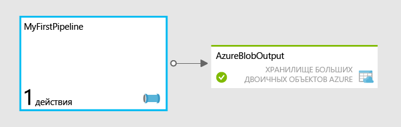

<properties
	pageTitle="Начало работы с фабрикой данных Azure"
	description="В этом учебнике показано, как создать конвейер, преобразующий данные с помощью Azure HDInsight."
	services="data-factory"
	documentationCenter=""
	authors="spelluru"
	manager="jhubbard"
	editor="monicar"/>

<tags
	ms.service="data-factory"
	ms.workload="data-services"
	ms.tgt_pltfrm="na"
	ms.devlang="na"
	ms.topic="hero-article" 
	ms.date="11/02/2015"
	ms.author="spelluru"/>

# Начало работы с фабрикой данных Azure
> [AZURE.SELECTOR]
- [Tutorial Overview](data-factory-build-your-first-pipeline.md)
- [Using Data Factory Editor](data-factory-build-your-first-pipeline-using-editor.md)
- [Using PowerShell](data-factory-build-your-first-pipeline-using-powershell.md)
- [Using Visual Studio](data-factory-build-your-first-pipeline-using-vs.md)

Эта статья поможет вам создать свою первую фабрику данных Azure.

> [AZURE.NOTE]Здесь не приводятся общие сведения о службе фабрики данных Azure. Подробный обзор службы см. в статье [Введение в фабрику данных Azure](data-factory-introduction.md).

## Обзор учебника
В этом руководстве приведены подробные инструкции по созданию первой фабрики данных с помощью конвейера. Вы создадите конвейер с нуля и укажете все необходимые ресурсы.

Если вы хотите быстро ознакомиться с различными возможностями фабрики данных, не создавая ее с нуля, используйте готовые образцы, представленные на портале предварительной версии Azure. Сведения о том, как развернуть образец, предназначенный для определенного сценария, с помощью портала предварительной версии Azure, см. в статье [Обновление фабрики данных Azure: упрощенное развертывание образца](http://azure.microsoft.com/blog/2015/04/24/azure-data-factory-update-simplified-sample-deployment/).

## Предварительные требования
Для работы с этим учебником необходимы:

1.	**Подписка Azure **. Если ее нет, можно за пару минут создать бесплатную пробную учетную запись. Сведения о том, как получить такую учетную запись, см. в статье [Бесплатная пробная версия](http://azure.microsoft.com/pricing/free-trial/).

2.	**Хранилище Azure**. В данном учебнике предполагается, что для хранения данных будет использоваться учетная запись хранения Azure. Если у вас ее нет, прочитайте статью [Создание учетной записи хранения](../storage-create-storage-account/#create-a-storage-account). После создания учетной записи хранения необходимо получить ключ, используемый для доступа к хранилищу. См. статью [Просмотр, копирование и повторное создание ключей доступа к хранилищу](../storage-create-storage-account/#view-copy-and-regenerate-storage-access-keys).

## Что рассматривается в этом учебнике?	
Фабрика данных Azure позволяет объединять задачи по перемещению и обработке данных в управляемый данными рабочий процесс. Вы узнаете, как построить конвейер, который использует HDInsight для ежемесячного преобразования и анализа веб-журналов.

Вот какие шаги вы выполните:

1.	Создадите фабрику данных.
2.	Создадите следующие связанные службы:
	1.	**Учетная запись хранилища Azure**, в которой будут храниться файлы, используемые кластером HDInsight по требованию.
	2.	**Кластер HDInsight по требованию**, который будет запускаться при необходимости преобразовать и проанализировать данные.
3.	Создадите выходной набор данных. 
4.	Вы создадите конвейер, который запускает сценарий Hive и сохраняет результат в выходном наборе данных. Сценарий Hive сначала создает внешнюю таблицу, которая ссылается на необработанные данные веб-журнала в хранилище BLOB-объектов Azure, а затем разбивает необработанные данные по месяцам и годам.

Конвейер, который вы создадите (**MyFirstPipeline**), будет использовать для преобразования и анализа веб-журналов действие Hive, развернутое в рамках кластера HDInsight и расположенное в папке **/HdiSamples/WebsiteLogSampleData/SampleLog/**.

Результаты выполнения сценария Hive будут сохранены в контейнере хранилища BLOB-объектов Azure **data/partitioneddata**.

Доступность набора данных **AzureBlobOutput** определяет частоту выполнения действия Hive. В этом учебнике действие выполняется ежемесячно.

## Подготовка хранилища Azure для выполнения инструкций учебника
Прежде чем приступить к работе с учебником, необходимо подготовить хранилище Azure и необходимые файлы.

1. Запустите **Блокнот** и вставьте следующий сценарий HQL. Этот сценарий Hive создает две внешние таблицы: **WebLogsRaw** и **WebLogsPartitioned**. Щелкните **Файл** в меню и выберите команду **Сохранить как**. Перейдите в папку **C:\\adfgettingstarted** на жестком диске. Выберите **Все файлы (*.*)** в поле **Тип файла**. Введите **partitionweblogs.hql** в поле **Имя файла**. Убедитесь, что в поле **Кодировка** в нижней части диалогового окна выбрано значение **ANSI**. Если значение **ANSI** не выбрано, выберите его.  
	
		set hive.exec.dynamic.partition.mode=nonstrict;
		
		DROP TABLE IF EXISTS WebLogsRaw; 
		CREATE TABLE WebLogsRaw (
		  date  date,
		  time  string,
		  ssitename string,
		  csmethod  string,
		  csuristem  string,
		  csuriquery string,
		  sport int,
		  susername string,
		  cipcsUserAgent string,
		  csCookie string,
		  csReferer string,
		  cshost  string,
		  scstatus  int,
		  scsubstatus  int,
		  scwin32status  int,
		  scbytes int,
		  csbytes int,
		  timetaken int
		)
		ROW FORMAT DELIMITED FIELDS TERMINATED BY ' '
		LINES TERMINATED BY '\n' 
		tblproperties ("skip.header.line.count"="2");
		
		LOAD DATA INPATH '/HdiSamples/WebsiteLogSampleData/SampleLog/909f2b.log' OVERWRITE INTO TABLE WebLogsRaw;
		
		DROP TABLE IF EXISTS WebLogsPartitioned ; 
		create external table WebLogsPartitioned (  
		  date  date,
		  time  string,
		  ssitename string,
		  csmethod  string,
		  csuristem  string,
		  csuriquery string,
		  sport int,
		  susername string,
		  cipcsUserAgent string,
		  csCookie string,
		  csReferer string,
		  cshost  string,
		  scstatus  int,
		  scsubstatus  int,
		  scwin32status  int,
		  scbytes int,
		  csbytes int,
		  timetaken int
		)
		partitioned by ( year int, month int)
		ROW FORMAT DELIMITED FIELDS TERMINATED BY ',' 
		STORED AS TEXTFILE 
		LOCATION '${hiveconf:partitionedtable}';
		
		INSERT INTO TABLE WebLogsPartitioned  PARTITION( year , month) 
		SELECT
		  date,
		  time,
		  ssitename,
		  csmethod,
		  csuristem,
		  csuriquery,
		  sport,
		  susername,
		  cipcsUserAgent,
		  csCookie,
		  csReferer,
		  cshost,
		  scstatus,
		  scsubstatus,
		  scwin32status,
		  scbytes,
		  csbytes,
		  timetaken,
		  year(date),
		  month(date)
		FROM WebLogsRaw
	 
2. Чтобы подготовить хранилище Azure для использования с учебником:
	1. Загрузите [последнюю версию средства **AzCopy**](http://aka.ms/downloadazcopy) или [последнюю предварительную версию](http://aka.ms/downloadazcopypr). Инструкции по использованию этой служебной программы см. в статье [Использование AzCopy](../storage/storage-use-azcopy.md).
	2. После установки программы AzCopy вы можете добавить путь к ней в переменную PATH, выполнив следующую команду в командной строке. 
	
			set path=%path%;C:\Program Files (x86)\Microsoft SDKs\Azure\AzCopy			 

	3. Перейдите в папку c:\\adfgettingstarted и выполните следующую команду, чтобы загрузить HQL-файл Hive в учетную запись хранения. Замените значения **StorageAccountName** и **Storage Key** именем и ключом своей учетной записи хранения Azure.

			AzCopy /Source:. /Dest:https://<StorageAccountName>.blob.core.windows.net/script /DestKey:<Storage Key>

		> [AZURE.NOTE]Указанная выше команда создает контейнер с именем **script** в вашем хранилище BLOB-объектов Azure и копирует файл **partitionweblogs.hql** с локального диска в контейнер BLOB-объектов.
	>
	5. После успешной загрузки файла будут отображены следующие данные из AzCopy.
	
			Finished 1 of total 1 file(s).
			[2015/06/15 15:47:13] Transfer summary:
			-----------------
			Total files transferred: 1
			Transfer successfully:   1
			Transfer skipped:        0
			Transfer failed:         0
			Elapsed time:            00.00:00:01

Выполните следующее:

- Щелкните ссылку [Использование редактора фабрики данных](data-factory-build-your-first-pipeline-using-editor.md) вверху, чтобы пройти учебник, используя редактор фабрики данных, который является компонентом портала Azure.
- Щелкните ссылку [Использование PowerShell](data-factory-build-your-first-pipeline-using-powershell.md) вверху, чтобы пройти учебник с помощью Azure PowerShell.
- Щелкните ссылку [Использование Visual Studio](data-factory-build-your-first-pipeline-using-vs.md), чтобы изучить учебник с применением Visual Studio. 

<!---HONumber=Nov15_HO4-->