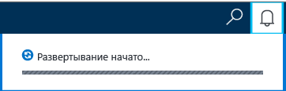
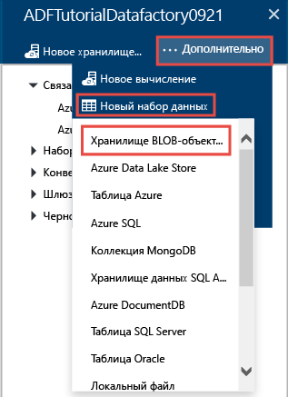
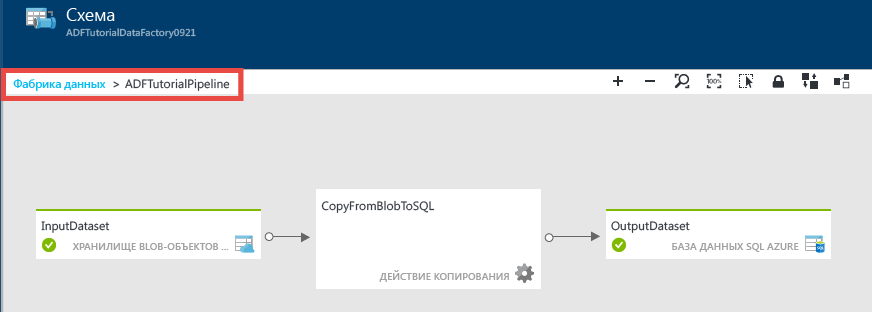
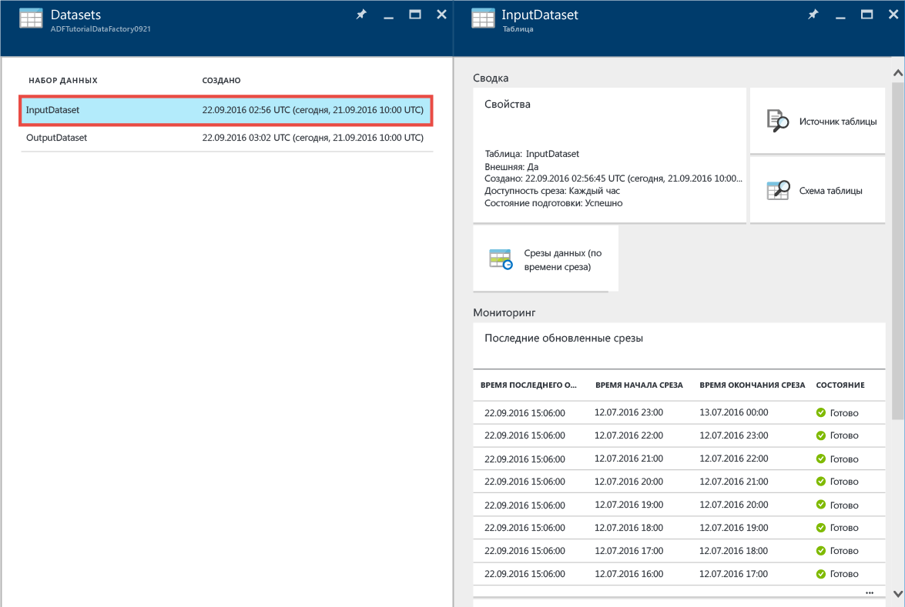
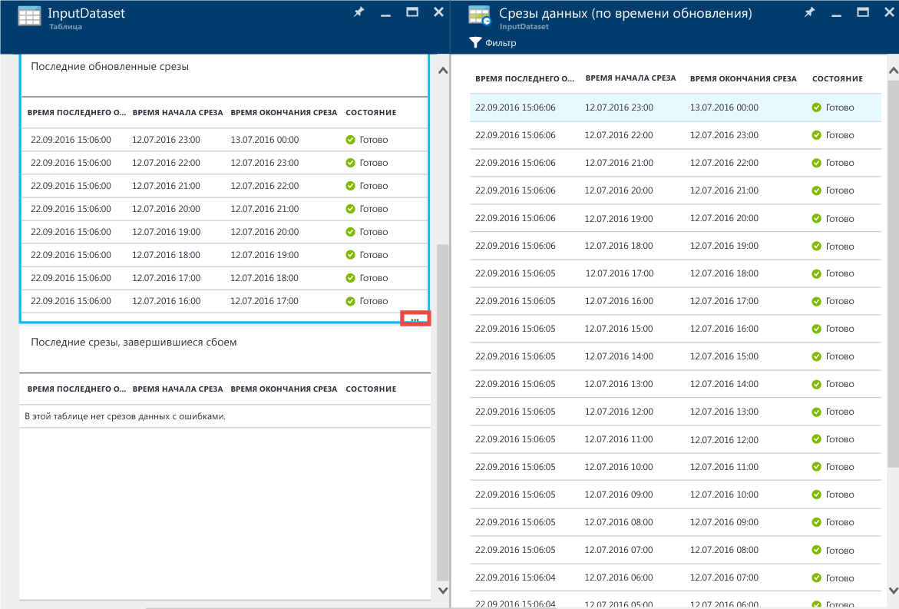
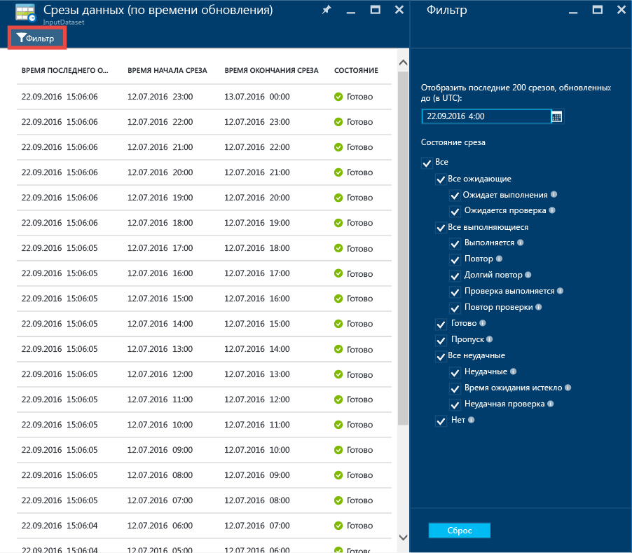
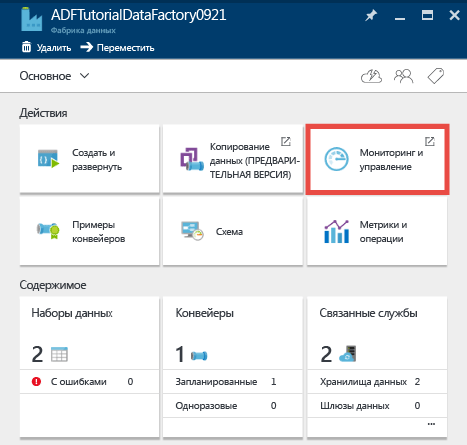
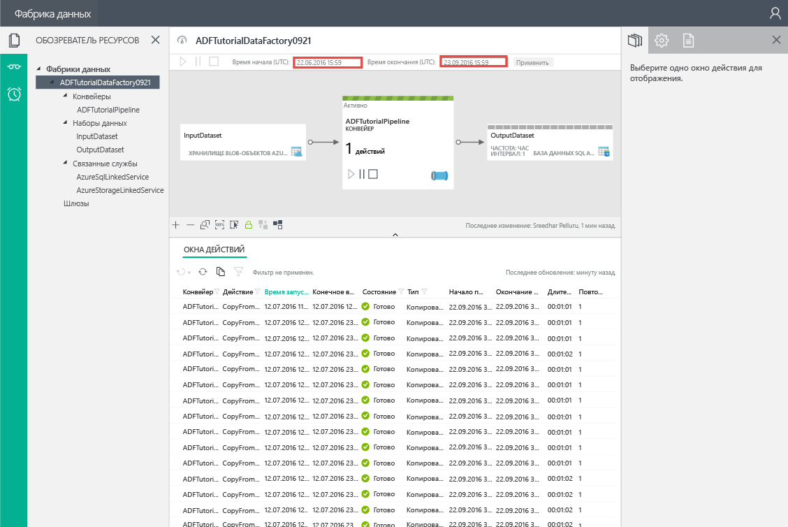
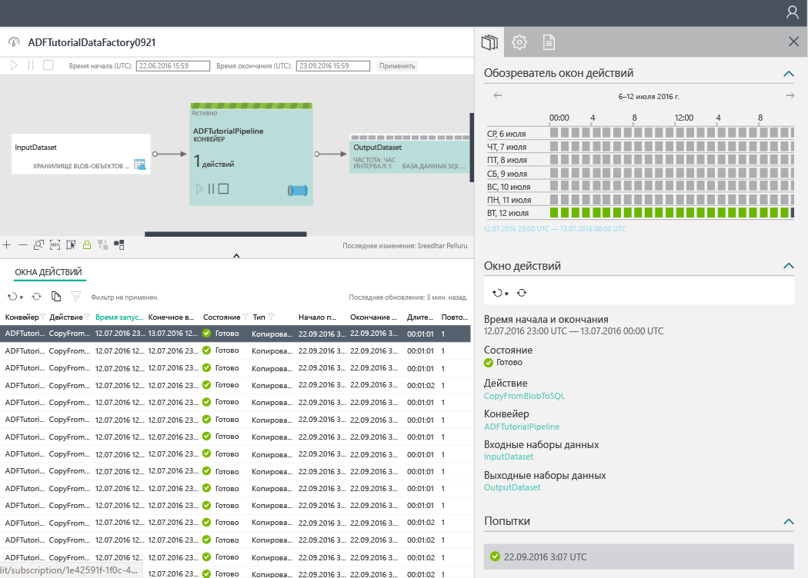

<properties 
	pageTitle="Руководство. Создание конвейера с действием копирования с помощью портала Azure | Microsoft Azure" 
	description="В этом руководстве вы создадите конвейер фабрики данных Azure с действием копирования при помощи редактора фабрики данных на портале Azure." 
	services="data-factory" 
	documentationCenter="" 
	authors="spelluru" 
	manager="jhubbard" 
	editor="monicar"/>

<tags 
	ms.service="data-factory" 
	ms.workload="data-services" 
	ms.tgt_pltfrm="na" 
	ms.devlang="na" 
	ms.topic="get-started-article" 
	ms.date="09/16/2016" 
	ms.author="spelluru"/>

# Руководство. Создание конвейера с действием копирования с помощью портала Azure
> [AZURE.SELECTOR]
- [Обзор и предварительные требования](data-factory-copy-data-from-azure-blob-storage-to-sql-database.md)
- [Портал Azure](data-factory-copy-activity-tutorial-using-azure-portal.md)
- [Visual Studio](data-factory-copy-activity-tutorial-using-visual-studio.md)
- [PowerShell](data-factory-copy-activity-tutorial-using-powershell.md)
- [ИНТЕРФЕЙС REST API](data-factory-copy-activity-tutorial-using-rest-api.md)
- [.NET API](data-factory-copy-activity-tutorial-using-dotnet-api.md)
- [Мастер копирования](data-factory-copy-data-wizard-tutorial.md)

В этом руководстве рассматривается создание и мониторинг фабрики данных Azure с помощью портала Azure. Конвейер в фабрике данных копирует данные из хранилища BLOB-объектов Azure в базу данных SQL Azure с помощью действия копирования.

Ниже приведены шаги, которые вы выполните в процессе работы с этим руководством.

Шаг | Описание
-----| -----------
[Создание фабрики данных Azure](#create-data-factory) | На этом шаге вы создадите фабрику данных Azure с именем **ADFTutorialDataFactory**.  
[Создание связанных служб](#create-linked-services) | На этом шаге создаются две связанные службы: **AzureStorageLinkedService** и **AzureSqlLinkedService**.   AzureStorageLinkedService связывает службу хранилища Azure, а AzureSqlLinkedService связывает базу данных SQL Azure с ADFTutorialDataFactory. Входные данные для конвейера размещены в контейнере в хранилище BLOB-объектов Azure, а выходные данные будут сохраняться в таблице в базе данных SQL Azure. Таким образом, можно добавить эти два хранилища данных как связанные службы в фабрику данных.      
[Создать входные и выходные наборы данных](#create-datasets) | На предыдущем шаге были созданы связанные службы, ссылающиеся на хранилища данных, содержащие входные и выходные данные. На этом этапе определяются два набора данных (**InputDataset** и **OutputDataset**), которые представляют входные и выходные данные, размещаемые в хранилищах данных.   Для InputDataset вам нужно указать контейнер больших двоичных объектов, содержащий большой двоичный объект с исходными данными, а для OutputDataset — таблицу SQL для хранения выходных данных. Нужно указать и другие свойства, такие как структура, доступность данных и политика. 
[Создать конвейер](#create-pipeline) | На этом шаге создается конвейер с именем **ADFTutorialPipeline** в ADFTutorialDataFactory.   Вам нужно добавить в конвейер **действие копирования**, которое копирует входные данные большого двоичного объекта Azure в выходную таблицу SQL Azure. Действие копирования перемещает данные в фабрике данных Azure. Это действие выполняется с помощью глобально доступной службы, обеспечивающей безопасное, надежное и масштабируемое копирование данных между разными хранилищами. Дополнительные сведения о действии копирования см. в статье [Действия перемещения данных](data-factory-data-movement-activities.md). 
[Отслеживание конвейера](#monitor-pipeline) | На этом шаге отслеживаются срезы входных и выходных таблиц с помощью портала Azure.

## Предварительные требования 
Прежде чем начать работу с этим руководством, выполните необходимые действия, перечисленные в [этой обзорной статье](data-factory-copy-data-from-azure-blob-storage-to-sql-database.md).

## Создание фабрики данных
На этом шаге с помощью портала Azure создается фабрика данных с именем **ADFTutorialDataFactory**.

1.	Войдите на [портал Azure](https://portal.azure.com/), нажмите кнопку **Создать**, откройте раздел **аналитики** и щелкните **Фабрика данных**.

	

6. В колонке **Создать фабрику данных** выполните следующие действия.
	1. Введите **ADFTutorialDataFactory** в поле **Имя**.
	
  		

		Имя фабрики данных Azure должно быть **глобально уникальным**. При возникновении указанной ниже ошибки измените имя фабрики данных (например, на ваше\_имя\_ADFTutorialDataFactory) и попробуйте создать фабрику данных снова. Ознакомьтесь со статьей [Фабрика данных Azure — правила именования](data-factory-naming-rules.md), чтобы узнать о правилах именования артефактов фабрики данных.
	
			Data factory name “ADFTutorialDataFactory” is not available  
	 
		
	2. Выберите свою **подписку Azure**.
	3. Для группы ресурсов выполните одно из следующих действий.
		1. Выберите **Использовать существующую** и укажите существующую группу ресурсов в раскрывающемся списке.
		2. Выберите **Создать новую** и укажите имя группы ресурсов.
	
			Некоторые действия, описанные в этом учебнике, предполагают, что для группы ресурсов используется имя **ADFTutorialResourceGroup**. Сведения о группах ресурсов см. в разделе [Использование групп ресурсов для управления ресурсами Azure](../resource-group-overview.md).
	4. Укажите **расположение** фабрики данных. В раскрывающемся списке отображаются только те регионы, которые поддерживаются службой фабрики данных.
	5. Выберите **Закрепить на начальной панели**.
	6. Щелкните **Создать**.

		> [AZURE.IMPORTANT] Создавать экземпляры фабрики данных может пользователь с ролью [Участник фабрики данных](../active-directory/role-based-access-built-in-roles.md/#data-factory-contributor) на уровне подписки или группы ресурсов.
		>  
		>  В будущем имя фабрики данных может быть зарегистрировано в качестве DNS-имени и, следовательно, стать отображаемым.
9.  Чтобы просмотреть сообщения о состоянии или сообщения уведомления, щелкните значок колокольчика на панели инструментов.

	
10. Когда экземпляр будет создан, вы увидите колонку **Фабрика данных**, как показано на рисунке ниже.

    

## Создание связанных служб
Связанные службы связывают хранилища данных или службы вычислений с фабрикой данных Azure. См. список [поддерживаемых хранилищ данных](data-factory-data-movement-activities.md##supported-data-stores-and-formats) для всех источников и приемников, которые поддерживаются действием копирования. См. список [связанных служб вычислений](data-factory-compute-linked-services.md), поддерживаемых фабрикой данных. В этом руководстве не рассматривается использование служб вычислений.

На этом шаге создаются две связанные службы: **AzureStorageLinkedService** и **AzureSqlLinkedService**. Связанная служба AzureStorageLinkedService связывает учетную запись хранения Azure, а AzureSqlLinkedService связывает базу данных SQL Azure с **ADFTutorialDataFactory**. Далее в этом руководстве будет создан конвейер, который копирует данные из контейнера больших двоичных объектов в AzureStorageLinkedService в таблицу SQL в AzureSqlLinkedService.

### Создание связанной службы для учетной записи хранилища Azure
1.	В колонке **Фабрика данных** щелкните плитку **Разработка и развертывание**, чтобы запустить **редактор** фабрики данных.

	
5. В **редакторе** нажмите кнопку **Новое хранилище данных** на панели инструментов и выберите в раскрывающемся меню пункт **Служба хранилища Azure**. На панели справа должен появиться шаблон JSON для создания связанной службы хранилища Azure.

	
6. Замените `<accountname>` и `<accountkey>` значениями имени и ключа учетной записи хранения Azure.

	
6. На панели инструментов щелкните **Развернуть**. Теперь в иерархическом представлении должен отобразиться развернутый экземпляр **AzureStorageLinkedService**.

	

> [AZURE.NOTE]
Подробные сведения о свойствах файлов JSON см. в статье [Перемещение данных в большой двоичный объект Azure и из него с помощью фабрики данных Azure](data-factory-azure-blob-connector.md#azure-storage-linked-service).

### Создание связанной службы для базы данных SQL Azure.
1. В **редакторе фабрики данных** на панели инструментов щелкните **Новое хранилище данных** и выберите в раскрывающемся меню пункт **База данных SQL Azure**. В правой панели должен появиться шаблон JSON для создания связанной службы SQL Azure.
2. Замените `<servername>`, `<databasename>`, `<username>@<servername>` и `<password>` именем своего сервера SQL Azure, именем учетной записи пользователя и паролем.
3. На панели инструментов щелкните **Развернуть**, чтобы создать и развернуть экземпляр **AzureSqlLinkedService**.
4. Экземпляр **AzureSqlLinkedService** должен отображаться в иерархическом представлении.

> [AZURE.NOTE]
Подробные сведения о свойствах файлов JSON см. в статье [Перемещение данных в базу данных SQL Azure и из нее с помощью фабрики данных Azure](data-factory-azure-sql-connector.md#azure-sql-linked-service-properties).

## Создание наборов данных
На предыдущем шаге были созданы связанные службы **AzureStorageLinkedService** и **AzureSqlLinkedService** для связи учетной записи хранения Azure и базы данных SQL Azure с фабрикой данных **ADFTutorialDataFactory**. На этом этапе определяются два набора данных — **InputDataset** и **OutputDataset**. Они представляют входные и выходные данные, размещаемые в хранилищах данных, на которые ссылаются службы AzureStorageLinkedService и AzureSqlLinkedService соответственно. Для InputDataset вам нужно указать контейнер больших двоичных объектов, содержащий большой двоичный объект с исходными данными, а для OutputDataset — таблицу SQL для хранения выходных данных.

### Создание входного набора данных 
На этом этапе создается набор данных с именем **InputDataset**. Он указывает на контейнер больших двоичных объектов в службе хранилища Azure, которая представлена связанной службой **AzureStorageLinkedService**.

1. В **редакторе** фабрики данных щелкните **... Дополнительно**, **Новый набор данных**, затем в раскрывающемся меню выберите пункт **Хранилище BLOB-объектов**.

	
2. Замените JSON на правой панели следующим фрагментом JSON:

		{
		  "name": "InputDataset",
		  "properties": {
		    "structure": [
		      {
		        "name": "FirstName",
		        "type": "String"
		      },
		      {
		        "name": "LastName",
		        "type": "String"
		      }
		    ],
		    "type": "AzureBlob",
		    "linkedServiceName": "AzureStorageLinkedService",
		    "typeProperties": {
		      "folderPath": "adftutorial/",
			  "fileName": "emp.txt",
		      "format": {
		        "type": "TextFormat",
		        "columnDelimiter": ","
		      }
		    },
		    "external": true,
		    "availability": {
		      "frequency": "Hour",
		      "interval": 1
		    }
		  }
		}
		
     Обратите внимание на следующие моменты.
	
	- для параметра **type** набора данных задано значение **AzureBlob**;
	- Для **linkedServiceName** задано значение **AzureStorageLinkedService**. Эта связанная служба была создана на шаге 2.
	- В качестве значения **folderPath** установлен контейнер **adftutorial**. Вы также можете указать имя большого двоичного объекта в папке, используя свойство **fileName**. Так как вы не указываете имя большого двоичного объекта, данные из всех больших двоичных объектов в контейнере считаются входными данными.
	- Для **типа** формата установлено значение **TextFormat**
	- В этом текстовом файле имеются два поля — **FirstName** и **LastName**, — которые разделяются запятой (**columnDelimiter**).
	- Параметр **availability** имеет значение **hourly**, при этом параметру **frequency** присваивается значение **hour**, а параметру **interval** — значение **1**. Следовательно, служба фабрики данных будет искать входные данные в корневом каталоге указанного вами контейнера BLOB-объектов (**adftutorial**) каждый час.
	
	Если свойство **fileName** для **входного** набора данных не задано, все файлы и большие двоичные объекты из входной папки (**folderPath**) считаются входными данными. Если указать fileName в JSON, только указанный файл или большой двоичный объект рассматриваются как входные данные.
 
	Если не указать **fileName** для **выходной таблицы**, то созданные в **folderPath** файлы получают имена в следующем формате: Data.&lt;Guid&gt;.txt (например, Data.0a405f8a-93ff-4c6f-b3be-f69616f1df7a.txt.).

	Чтобы динамически установить параметры **folderPath** и **fileName** на основе времени **SliceStart**, используйте свойство **partitionedBy**. В следующем примере folderPath использует год, месяц и день из SliceStart (время начала обработки среза), а в fileName используется время (часы) из SliceStart. Например, если срез создается для метки времени 2016-09-20T08:00:00, свойству folderName присваивается значение wikidatagateway/wikisampledataout/2016/09/20, а свойству fileName — значение 08.csv.

			"folderPath": "wikidatagateway/wikisampledataout/{Year}/{Month}/{Day}",
	        "fileName": "{Hour}.csv",
	        "partitionedBy": 
	        [
	        	{ "name": "Year", "value": { "type": "DateTime", "date": "SliceStart", "format": "yyyy" } },
	            { "name": "Month", "value": { "type": "DateTime", "date": "SliceStart", "format": "MM" } }, 
	            { "name": "Day", "value": { "type": "DateTime", "date": "SliceStart", "format": "dd" } }, 
	            { "name": "Hour", "value": { "type": "DateTime", "date": "SliceStart", "format": "hh" } } 
	        ],
2. На панели инструментов щелкните **Развернуть**, чтобы создать и развернуть набор данных **InputDataset**. Набор данных **InputDataset** должен отображаться в иерархическом представлении.

> [AZURE.NOTE]
Подробные сведения о свойствах файлов JSON см. в статье [Перемещение данных в большой двоичный объект Azure и из него с помощью фабрики данных Azure](data-factory-azure-blob-connector.md#azure-blob-dataset-type-properties).

### Создание выходного набора данных
На этом этапе мы создадим выходной набор данных с именем **OutputDataset**. Этот набор данных указывает на таблицу SQL в базе данных SQL Azure (представлена значением **AzureSqlLinkedService**).

1. В **редакторе** фабрики данных щелкните **... Дополнительно**, **Новый набор данных**, затем в раскрывающемся меню выберите пункт **Azure SQL**.
2. Замените JSON на правой панели следующим фрагментом JSON:

		{
		  "name": "OutputDataset",
		  "properties": {
		    "structure": [
		      {
		        "name": "FirstName",
		        "type": "String"
		      },
		      {
		        "name": "LastName",
		        "type": "String"
		      }
		    ],
		    "type": "AzureSqlTable",
		    "linkedServiceName": "AzureSqlLinkedService",
		    "typeProperties": {
		      "tableName": "emp"
		    },
		    "availability": {
		      "frequency": "Hour",
		      "interval": 1
		    }
		  }
		}
		
     Обратите внимание на следующие моменты.
	
	- Для параметра **type** набора данных задано значение **AzureSQLTable**.
	- **LinkedServiceName** имеет значение **AzureSqlLinkedService** (эта связанная служба была создана на шаге 2).
	- **Tablename** имеет значение **emp**.
	- В таблице emp в базе данных есть три столбца: **ID**, **FirstName** и **LastName**. ID — это столбец для идентификаторов, поэтому здесь вам нужно указать только значения **FirstName** и **LastName**.
	- Параметр **availability** имеет значение **hourly** (параметру **frequency** присваивается значение **hour**, а параметру **interval** — значение **1**). Служба фабрики данных каждый час создает срез выходных данных в таблице **emp** в базе данных SQL Azure.

3. На панели инструментов щелкните **Развернуть**, чтобы создать и развернуть набор данных **OutputDataset**. Набор данных **OutputDataset** должен отображаться в иерархическом представлении.

> [AZURE.NOTE]
Подробные сведения о свойствах файлов JSON см. в статье [Перемещение данных в базу данных SQL Azure и из нее с помощью фабрики данных Azure](data-factory-azure-sql-connector.md#azure-sql-linked-service-properties).

## Создание конвейера
На этом этапе создается конвейер с **действием копирования**, которое использует **AzureBlobInput** в качестве входных данных и **AzureSqlOutput** в качестве выходных.

1. В **редакторе** фабрики данных щелкните **... Дополнительно** и **Новый конвейер**. Кроме того, можно щелкнуть правой кнопкой мыши **Конвейеры** в древовидном представлении и выбрать **Создать конвейер**.
2. Замените JSON на правой панели следующим фрагментом JSON:
		
		{
		  "name": "ADFTutorialPipeline",
		  "properties": {
		    "description": "Copy data from a blob to Azure SQL table",
		    "activities": [
		      {
		        "name": "CopyFromBlobToSQL",
		        "type": "Copy",
		        "inputs": [
		          {
		            "name": "InputDataset"
		          }
		        ],
		        "outputs": [
		          {
		            "name": "OutputDataset"
		          }
		        ],
		        "typeProperties": {
		          "source": {
		            "type": "BlobSource"
		          },
		          "sink": {
		            "type": "SqlSink",
		            "writeBatchSize": 10000,
		            "writeBatchTimeout": "60:00:00"
		          }
		        },
		        "Policy": {
		          "concurrency": 1,
		          "executionPriorityOrder": "NewestFirst",
		          "retry": 0,
		          "timeout": "01:00:00"
		        }
		      }
		    ],
		    "start": "2016-07-12T00:00:00Z",
		    "end": "2016-07-13T00:00:00Z"
		  }
		} 

	Обратите внимание на следующие моменты.

	- В разделе действий доступно только одно действие, параметр **type** которого имеет значение **Copy**.
	- Для этого действия параметру input присвоено значение **InputDataset**, а параметру output — значение **OutputDataset**.
	- В разделе **typeProperties** в качестве типа источника указано **BlobSource**, а в качестве типа приемника — **SqlSink**.

	Замените значение свойства **start** текущей датой, а значение свойства **end** — датой следующего дня. Можно указать только часть даты и пропустить временную часть указанной даты и времени. Например, 2016-02-03, что эквивалентно 2016-02-03T00:00:00Z.
	
	Даты начала и окончания должны быть в [формате ISO](http://en.wikipedia.org/wiki/ISO_8601). Например, 2016-10-14T16:32:41Z. Время **окончания** указывать не обязательно, однако в этом примере мы будем его использовать.
	
	Если не указать значение свойства **end**, оно вычисляется по формуле «**время начала + 48 часов**». Чтобы запустить конвейер в течение неопределенного срока, укажите значение **9999-09-09** в качестве значения свойства **окончание**.
	
	В примере выше получено 24 среза данных, так как они создаются каждый час.
	
4. Щелкните **Развернуть** на панели инструментов для создания и развертывания конвейера **ADFTutorialPipeline**. Убедитесь, что конвейер отображается в иерархической структуре.
5. Теперь закройте колонку **Редактор**, щелкнув **X**. Щелкните **X** снова, чтобы отобразить домашнюю страницу **фабрики данных** для экземпляра **ADFTutorialDataFactory**.

**Поздравляем!** Вы успешно создали фабрику данных Azure, связанные службы, таблицы и конвейер, а также выполнили планирование конвейера.
 
### Просмотр фабрики данных в представлении схемы 
1. В колонке **Фабрика данных** щелкните **Схема**.

	
2. Вы должны увидеть схему, аналогичную приведенной ниже:

	

	Можно увеличивать и уменьшать масштаб, выбирать 100%-й масштаб или масштаб по размеру, автоматически размещать конвейеры и таблицы, а также отображать сведения из журнала обращений и преобразований (выделение восходящих и нисходящих элементов для выбранных элементов). Дважды щелкните объект (входную или выходную таблицу либо конвейер), чтобы просмотреть его свойства.
3. В представлении схемы щелкните правой кнопкой мыши и **откройте конвейер** **ADFTutorialPipeline**.

	
4. Будут отображены действия в конвейере вместе с входными и выходными наборами данных для этих действий. В этом руководстве в конвейере используется только одно действие (действие копирования) с объектом InputDataset в качестве входного набора данных и OutputDataset в качестве выходного набора данных.

	
5. Щелкните **Фабрика данных** в строке навигации в верхнем левом углу, чтобы перейти к представлению схемы. В представлении схемы отображаются все конвейеры. В этом примере создан только один конвейер.
 

## Отслеживание конвейера
На этом шаге используется портал Azure для мониторинга фабрики данных Azure.

### Мониторинг конвейера с использованием представления схемы

1. Щелкните **X**, чтобы закрыть представление **схемы** и перейти на домашнюю страницу фабрики данных. Если вы закрыли браузер, сделайте следующее.
	2. Перейдите на [портал Azure](https://portal.azure.com/).
	2. Дважды щелкните **ADFTutorialDataFactory** на **начальной панели** или щелкните **Фабрика данных** в меню слева и выполните поиск по запросу "ADFTutorialDataFactory".
3. Вы увидите количество и имена таблиц, а также конвейер, который вы создали в этой колонке.

	
4. Теперь щелкните плитку **Наборы данных**.
5. В колонке **Наборы данных** щелкните **InputDataset**. Это входной набор данных для **ADFTutorialPipeline**.

	
5. Щелкните **… (многоточие)**, чтобы отобразить все срезы данных.

	

	Обратите внимание, что срезы данных сейчас находятся в состоянии **Готово**, так как файл **emp.txt** все это время существует в контейнере больших двоичных объектов **adftutorial\\input**. Убедитесь, что срезы не отображаются в разделе **Срезы, в которых недавно произошел сбой** в нижней части.

	Оба списка, **Недавно обновленные срезы** и **Срезы, в которых недавно произошел сбой**, сортируются по **ПОСЛЕДНЕМУ ВРЕМЕНИ ОБНОВЛЕНИЯ**.
    
	Чтобы отфильтровать срезы, выберите пункт **Фильтр** на панели инструментов.
	
	
6. Закрывайте колонки, пока не увидите колонку **Наборы данных**. Щелкните **OutputDataset**. Это выходной набор данных для **ADFTutorialPipeline**.

	
6. Колонка **OutputDataset** должна выглядеть так:

	
7. Обратите внимание, что срезы данных до текущего момента времени уже выполнены и все они находятся в состоянии **Готов**. В разделе **Проблемные срезы** в нижней части окна срезов нет.
8. Нажмите кнопку **… (многоточие)**, чтобы отобразить все срезы.

	
9. Щелкните любой срез данных в списке, чтобы отобразить колонку **Срез данных**.

	
  
	Если срез не находится в состоянии **Готов**, вы можете увидеть восходящие срезы, которые не находятся в состоянии готовности и блокируют выполнение текущего среза в списке **Неготовые восходящие срезы**.
11. В колонке **СРЕЗ ДАННЫХ** в списке в нижней части окна отображаются все выполненные действия. Щелкните **выполняемое действие**, чтобы просмотреть колонку **Подробности о выполнении операции**.

	
12. С помощью кнопки **X** закройте все колонки, чтобы вернуться к начальной колонке **ADFTutorialDataFactory**.
14. (Необязательно.) Щелкните **Конвейеры** на домашней странице фабрики данных **ADFTutorialDataFactory**, щелкните **ADFTutorialPipeline** в колонке **Конвейеры** и изучите входные таблицы (**Использованные**) или выходные таблицы (**Созданные**).
15. Запустите **SQL Server Management Studio**, подключитесь к базе данных SQL Azure и убедитесь, что строки вставляются в таблицу **emp** в базе данных.

	

### Мониторинг конвейера с использованием приложения по мониторингу и управлению
Для мониторинга конвейеров также можно использовать приложение по мониторингу и управлению. Дополнительные сведения об использовании этого приложения см. в статье [Мониторинг конвейеров фабрики данных Azure и управление ими с помощью нового приложения по мониторингу и управлению](data-factory-monitor-manage-app.md).

1. Щелкните плитку **Monitor & Manage** (Мониторинг и управление) на домашней странице фабрики данных.

	
2. Вы должны увидеть **приложение по мониторингу и управлению**. Измените значения параметров **Время начала** и **Время окончания**, чтобы они включали соответствующие значения (2016-07-12 и 2016-07-13) для конвейера и щелкните **Применить**.

	
3. Выберите окно действия в списке **Activity Windows** (Окна действий), чтобы просмотреть сведения о нем. 

## Сводка 
В этом учебнике вы создали фабрику данных Azure для копирования данных из большого двоичного объекта Azure в базу данных SQL Azure. Вы использовали портал Azure для создания фабрики данных, связанных служб, наборов данных и конвейера. Вот обобщенные действия, которые вы выполнили в этом руководстве:

1.	Создание **фабрики данных Azure**.
2.	Создание **связанных служб**.
	1. **Служба хранилища Azure** — связанная служба для связи с учетной записью хранения Azure, которая содержит входные данные.
	2. **SQL Azure** — связанная служба для связи с базой данных SQL Azure, которая содержит выходные данные.
3.	Создание **наборов данных**, которые описывают входные и выходные данные для конвейеров.
4.	Создание **конвейера** с **BlobSource** в качестве источника и **SqlSink** в качестве приемника с помощью **действия копирования**.

## См. также
| Раздел | Описание |
| :---- | :---- |
| [Действия перемещения данных](data-factory-data-movement-activities.md) | В этой статье содержится информация о действии копирования, которое использовалось в этом руководстве. |
| [Планирование и исполнение с использованием фабрики данных](data-factory-scheduling-and-execution.md) | Здесь объясняются аспекты планирования и исполнения в модели приложений фабрики данных. |
| [Конвейеры](data-factory-create-pipelines.md) | Эта статья содержит сведения о конвейерах и действиях в фабрике данных Azure. |
| [Наборы данных](data-factory-create-datasets.md) | Эта статья поможет вам понять, что такое наборы данных в фабрике данных Azure.
| [Мониторинг конвейеров фабрики данных Azure и управление ими с помощью нового приложения по мониторингу и управлению](data-factory-monitor-manage-app.md) | В этой статье описывается мониторинг и отладка конвейеров, а также управление ими с помощью приложения мониторинга и управления. 

<!---HONumber=AcomDC_0928_2016-->