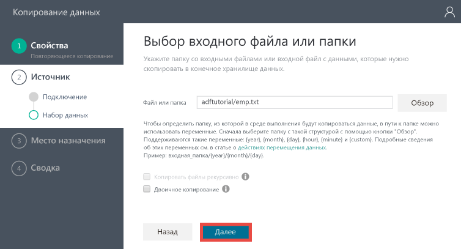
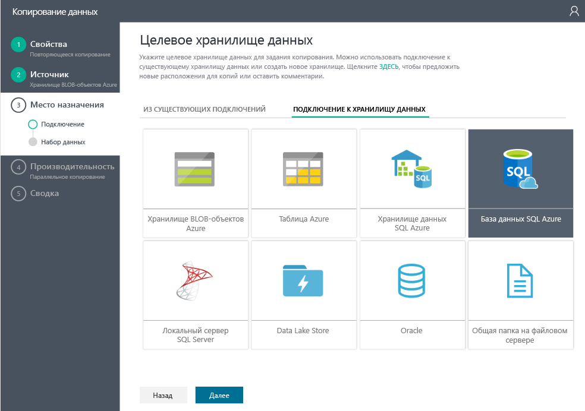
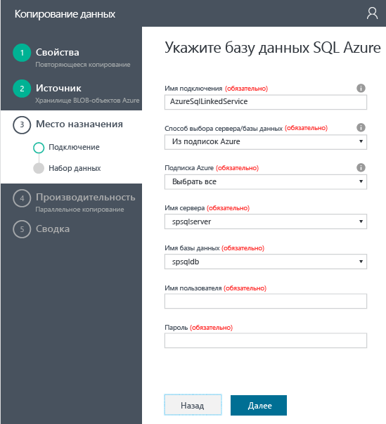
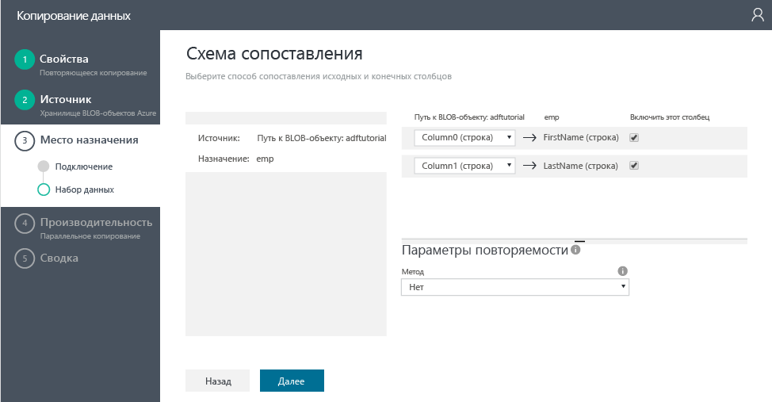
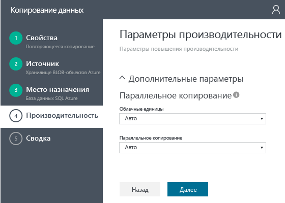
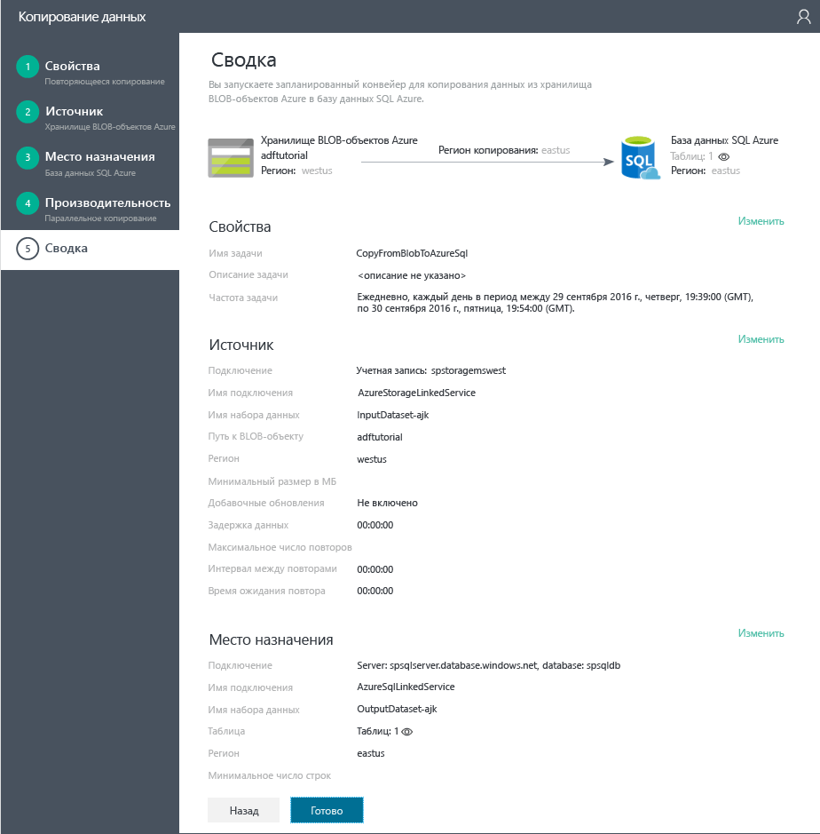

# Руководство. Создание конвейера с действием копирования с помощью мастера копирования фабрики данных
> [!div class="op_single_selector"]
> * [Обзор и предварительные требования](data-factory-copy-data-from-azure-blob-storage-to-sql-database.md)
> * [Мастер копирования](data-factory-copy-data-wizard-tutorial.md)
> * [Портал Azure](data-factory-copy-activity-tutorial-using-azure-portal.md)
> * [Visual Studio](data-factory-copy-activity-tutorial-using-visual-studio.md)
> * [PowerShell](data-factory-copy-activity-tutorial-using-powershell.md)
> * [Шаблон Azure Resource Manager](data-factory-copy-activity-tutorial-using-azure-resource-manager-template.md)
> * [ИНТЕРФЕЙС REST API](data-factory-copy-activity-tutorial-using-rest-api.md)
> * [API .NET](data-factory-copy-activity-tutorial-using-dotnet-api.md)
> 
> 

**Мастер копирования** фабрики данных Azure позволяет легко и быстро создать конвейер, реализующий сценарий приема и перемещения данных. Поэтому рекомендуется использовать мастер в качестве первого шага при создании примера конвейера для сценария перемещения данных. В этом руководстве показано, как создать фабрику данных Azure, запустить мастер копирования и выполнить шаги, чтобы предоставить сведения о сценарии приема и перемещения данных. После завершения работы в мастере он автоматически создаст конвейер с действием копирования, позволяющим перенести данные из хранилища BLOB-объектов Azure в базу данных SQL Azure. Дополнительные сведения о действии копирования см. в статье [Перемещение данных с помощью действия копирования](data-factory-data-movement-activities.md). 

> [!IMPORTANT]
> Прежде чем начать работу с этим руководством, изучите статью на вкладке [Обзор и предварительные требования](data-factory-copy-data-from-azure-blob-storage-to-sql-database.md) и выполните все **необходимые действия**.
> 
> 

## Создание фабрики данных
На этом шаге с помощью портала Azure создается фабрика данных с именем **ADFTutorialDataFactory**.

1. Войдите на [портал Azure](https://portal.azure.com), нажмите кнопку **+ Создать** в верхнем левом углу, откройте раздел **аналитики** и щелкните **Фабрика данных**. 
   
   
2. В колонке **Создать фабрику данных** выполните следующие действия.
   
   1. Введите **ADFTutorialDataFactory** в поле **Имя**.
       Имя фабрики данных Azure должно быть глобально уникальным. При возникновении ошибки **Имя фабрики данных ADFTutorialDataFactory недоступно**измените имя этой фабрики данных (например, на вашеимяADFTutorialDataFactory) и попробуйте создать ее снова. Ознакомьтесь с разделом [Фабрика данных — правила именования](data-factory-naming-rules.md) , чтобы узнать о правилах именования артефактов фабрики данных.  
      
       
      
      > [!NOTE]
      > В будущем имя фабрики данных может быть зарегистрировано в качестве DNS-имени и, следовательно, стать отображаемым.
      > 2) Выберите свою **подписку Azure**.
      > 
      > 
3. Для группы ресурсов выполните одно из следующих действий: а) выберите **Использовать существующую** и укажите имеющуюся группу ресурсов;
   2) выберите **Создать** и введите имя для группы ресурсов.
   
            Some of the steps in this tutorial assume that you use the name: **ADFTutorialResourceGroup** for the resource group. To learn about resource groups, see [Using resource groups to manage your Azure resources](../azure-resource-manager/resource-group-overview.md).
   1. Укажите **расположение** фабрики данных.
   2. Установите флажок **Закрепить на панели мониторинга** в нижней части колонки.  
   3. Щелкните **Создать**.
      
                 
4. После создания вы увидите колонку **Фабрика данных**, как показано на рисунке ниже.
   
   

## Запуск и использование мастера копирования
1. Чтобы запустить **мастер копирования**, на домашней странице фабрики данных щелкните **Копирование данных**. 
   
   > [!NOTE]
   > Если веб-браузер завис на действии "Авторизация...", отключите параметр или снимите флажок **Block third party cookies and site data** (Блокировать сторонние файлы cookie и данные сайта). Либо оставьте флажок и создайте исключение для адреса **login.microsoftonline.com**, а затем попробуйте запустить мастер еще раз.
   > 
   > 
2. Вот что нужно сделать на странице **Свойства** :
   
   1. В качестве **имени задачи** введите **CopyFromBlobToAzureSql**.
   2. Введите **описание** (необязательно).
   3. Измените **дату и время начала** и **дату и время завершения** таким образом, чтобы датой завершения был сегодняшний день, а дата начала была на пять дней раньше текущей даты.  
   4. Нажмите кнопку **Далее**.  
      
       
3. На странице **Source data store** (Хранилище данных источников) щелкните плитку **Хранилище BLOB-объектов Azure**. На этой странице можно указать хранилище данных источников для задачи копирования. Вы можете использовать существующую связанную службу хранилища данных или указать новое хранилище данных. Чтобы использовать существующую связанную службу, щелкните элемент **FROM EXISTING LINKED SERVICES** (Из существующих связанных служб) и выберите нужную службу. 
   
    
4. Вот что нужно сделать на странице **Specify the Azure Blob storage account** (Указание учетной записи хранилища BLOB-объектов Azure).
   
   1. В качестве **имени связанной службы** введите **AzureStorageLinkedService**.
   2. Убедитесь, что в качестве **метода выбора учетной записи** выбран вариант **From Azure subscriptions** (Из подписок Azure).
   3. Выберите свою **подписку Azure**.  
   4. Выберите **учетную запись хранения Azure** из списка учетных записей хранения Azure, доступных в выбранной вами подписке. Кроме того, вы можете вручную настроить параметры учетной записи хранения. Для этого в качестве **метода выбора учетной записи** выберите вариант **Ввести вручную** и нажмите кнопку **Далее**. 
      
      
5. Вот что нужно сделать на странице **Choose the input file or folder** (Выбор входного файла или папки).
   
   1. Перейдите к папке **adftutorial** .
   2. Выберите **emp.txt** и нажмите кнопку **Выбрать**.
   3. Нажмите кнопку **Далее**. 
      
      
6. На странице **Choose the input file or folder** (Выбор входного файла или папки) нажмите кнопку **Далее**. Не устанавливайте флажок **Binary copy**(Двоичное копирование). 
   
     
7. На странице **File format settings** (Параметры формата файла) отображаются разделители и схема, которые мастер определяет автоматически при анализе файла. Можно также ввести разделители вручную, чтобы остановить автоопределение с помощью мастера копирования или переопределить. Проверив разделители и просмотрев предварительные данные, нажмите кнопку **Далее**. 
   
      
8. На странице целевого хранилища данных выберите **База данных SQL Azure** и нажмите кнопку **Далее**.
   
    
9. Вот что нужно сделать на странице **Specify the Azure SQL database** (Указание базы данных SQL Azure).
   
   1. В поле **Имя подключения** введите **AzureSqlLinkedService**.
   2. В качестве **метода выбора базы данных или сервера** должен быть выбран вариант **From Azure subscriptions** (Из подписок Azure).
   3. Выберите свою **подписку Azure**.  
   4. Выберите **имя сервера** и **базу данных**.
   5. Введите **имя пользователя** и **пароль**.
   6. Нажмите кнопку **Далее**.  
      
      
10. На странице **Сопоставление таблицы** выберите **emp** в поле **Назначение** раскрывающегося списка, щелкните **стрелку вниз** (необязательно), чтобы отобразить схему и просмотреть данные.
    
      
11. На странице **Сопоставление схемы** нажмите кнопку **Далее**.
    
    
12. На странице **Performance settings** (Параметры производительности) нажмите кнопку **Далее**. 
    
    
13. Просмотрите сведения на странице **Сводка** и нажмите кнопку **Готово**. Мастер создаст две связанные службы, два набора данных (входной и выходной) и один конвейер в фабрике данных (из которой вы запустили мастер копирования). 
    
    

## Запуск приложения для отслеживания и управления
1. На странице **развертывания** щелкните ссылку: `Click here to monitor copy pipeline`.
   
     
2. Чтобы получить сведения о способах отслеживания созданного вами конвейера, изучите инструкции в статье [Мониторинг конвейеров фабрики данных Azure и управление ими с помощью нового приложения по мониторингу и управлению](data-factory-monitor-manage-app.md) . Щелкните значок **обновления** в списке **Окна действий**, чтобы просмотреть срез. 
   
    
   
   > [!NOTE]
   > Щелкните кнопку **Обновить** внизу списка **Окна действий**, чтобы увидеть последнее состояние. Этот список не обновляется автоматически. 
   > 
   > 

## См. также
| Раздел | Описание |
|:--- |:--- |
| [Действия перемещения данных](data-factory-data-movement-activities.md) |В этой статье содержится информация о действии копирования, которое использовалось в этом руководстве. |
| [Планирование и исполнение с использованием фабрики данных](data-factory-scheduling-and-execution.md) |Здесь объясняются аспекты планирования и исполнения в модели приложений фабрики данных. |
| [Конвейеры](data-factory-create-pipelines.md) |Эта статья поможет вам понять сущность конвейеров и действий в фабрике данных Azure, а также научиться с их помощью создавать комплексные рабочие процессы, управляемые данными, для конкретных бизнес-сценариев. |
| [Наборы данных](data-factory-create-datasets.md) |Эта статья поможет вам понять, что такое наборы данных в фабрике данных Azure. |
| [Мониторинг конвейеров фабрики данных Azure и управление ими с помощью нового приложения по мониторингу и управлению](data-factory-monitor-manage-app.md) |В этой статье описывается мониторинг и отладка конвейеров, а также управление ими с помощью приложения мониторинга и управления. |

<!--HONumber=Oct16_HO2-->

