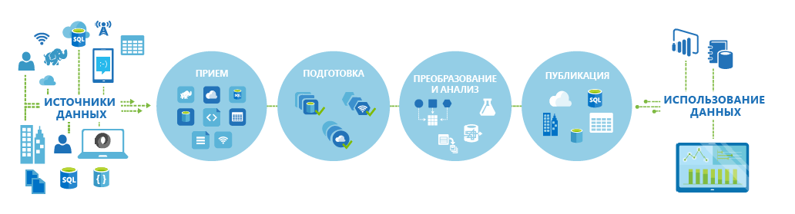
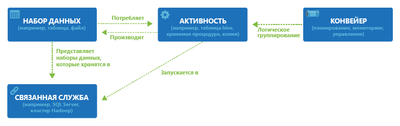

<properties 
	pageTitle="Введение в фабрику данных Azure" 
	description="Узнайте, как использовать службу фабрики данных Azure для формирования обработки данных, хранилища данных и служб перемещения данных, чтобы создавать конвейеры, производящие надежные данные." 
	services="data-factory" 
	documentationCenter="" 
	authors="spelluru" 
	manager="jhubbard" 
	editor="monicar"/>

<tags 
	ms.service="data-factory" 
	ms.workload="data-services" 
	ms.tgt_pltfrm="na" 
	ms.devlang="na" 
	ms.topic="get-started-article" 
	ms.date="08/05/2015" 
	ms.author="spelluru"/>

# Введение в службу фабрики данных Azure

## Обзор
Фабрика данных представляет собой облачную службу интеграции информации, которая организует и автоматизирует перемещение и преобразование данных. Как на производственной фабрике сырье преобразуется в готовую продукцию с помощью оборудования, так и в фабриках данных необработанные данные собираются и преобразуются в готовые к использованию сведения с помощью специальных служб.

Для приема, подготовки, преобразования, анализа и публикации данных фабрики данных используют как локальные, так и облачные источники. Используя такие службы, как [Azure HDInsight (Hadoop)](http://azure.microsoft.com/documentation/services/hdinsight/) и [пакетная служба Azure](http://azure.microsoft.com/documentation/services/batch/), вы можете использовать фабрику данных для создания управляемых конвейеров обработки и преобразования больших данных в соответствии с вашими потребностями, а [машинное обучение Azure](http://azure.microsoft.com/documentation/services/machine-learning/) позволит претворить ваши аналитические решения в жизнь. Больше не нужно ограничиваться мониторингом табличных данных: фабрики данных предоставляют широкие возможности визуализации для быстрого анализа тенденций и зависимостей между конвейерами данных. Вы можете использовать унифицированное представление всех конвейеров данных для оперативного выявления проблем и настройки оповещений.

**Рис.1.** Сбор, подготовка, упорядочение и анализ данных из различных локальных источников, их преобразование и публикация обработанных данных.

Вы можете использовать фабрику для любых сценариев, когда требуется периодически собирать большие объемы самых разных данных, преобразовывать и публиковать их для извлечения ценных сведений. Фабрика данных используется для создания конвейеров потоков данных, обладающих высокой доступностью и адаптируемых под различные задачи различных отраслей в соответствии с потребностями в аналитической обработке. Интернет-магазины используют фабрику для создания индивидуальных [рекомендаций по товарам](data-factory-product-reco-usecase.md) на основе поведения клиента. Игровые студии применяют ее для понимания[эффективности своих маркетинговых кампаний](data-factory-customer-profiling-usecase.md). Узнайте от самих клиентов, как и почему они используют фабрику данных, в разделе [Примеры реальных клиентов](data-factory-customer-case-studies.md).

## Основные понятия

В фабрике данных Azure используется несколько ключевых сущностей, которые вместе определяют данные на входе и на выходе, события обработки, расписания и ресурсы, используемые потоком данных.

**Рис. 2.** Связи между набором данных, действием, конвейером и связанной службой

### Действия
Действия определяют то, что нужно выполнить с вашими данными. Каждое действие принимает ноль или несколько [наборов данных](data-factory-create-datasets.md) на входе и создает один или несколько наборов данных на выходе. Действие — это единица управления в фабрике данных Azure. [Действие копирования](data-factory-data-movement-activities.md), например, может использоваться для управления копированием данных из одного набора данных в другой. Аналогичным образом можно использовать [действие Hive](data-factory-data-transformation-activities.md), которое выполнит запрос Hive к кластеру Azure HDInsight для преобразования или анализа данных. Фабрика данных Azure предоставляет широкий выбор действий для перемещения, анализа и преобразования данных.

### Конвейеры
[Конвейеры](data-factory-create-pipelines.md) — это логические группы действий. Они используются для объединения действий в блоки для выполнения определенных задач. Например, для очистки данных в файле журнала может потребоваться последовательность из нескольких действий преобразования. У нее может быть сложное расписание и схема зависимостей, которые нужно автоматизировать и которыми нужно управлять. Все эти действия можно сгруппировать в один конвейер с именем CleanLogFiles. Конвейер CleanLogFiles затем можно развернуть, запланировать или удалить как единое целое, что избавляет от необходимости управлять каждым действием отдельно.

### Наборы данных
[Наборы данных](data-factory-create-datasets.md) — это именованные ссылки (указатели) на данные, которые вы намерены использовать в качестве входных данных или направления выхода конкретного действия. Наборы данных определяют структуру данных в разных хранилищах, например в таблицах, файлах, папках и документах.

### Связанная служба
Связанные службы определяют сведения, необходимые фабрике данных для подключения к внешним ресурсам. Связанные службы используются в фабрике данных для двух целей:

- Для представления хранилища данных, включая, помимо прочего, локальный SQL Server, Oracle DB, файловое хранилище или учетную запись хранилища BLOB-объектов Azure. Как уже говорилось, наборы данных представляют структуру данных в хранилищах, подключенных к фабрике данных посредством связанной службы.
- Для представления вычислительного ресурса, на котором можно выполнить действие. Например «Действие HDInsightHive» выполняется в кластере HDInsight (Hadoop).

Уяснив смысл четырех простых понятий (набор данных, действие, конвейер и связанная служба), можно приступать к работе с фабрикой данных. Вы можете [создать первый конвейер](data-factory-build-your-first-pipeline.md) с нуля или развернуть готовый пример, следуя указаниям в нашей статье [Примеры фабрики данных](data-factory-samples.md).

<!---HONumber=August15_HO7-->